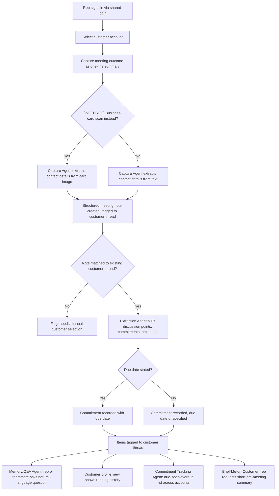

# PRD — Conversational CRM

## 1. Overview

- **Epic/Product name:** Conversational CRM / Relationship Memory Assistant
- **Document reference:** `PRD-conversational-crm-v1.0`
- **Owner:** Product Owner (role, not named individual — not identified in discovery)
- **Approver:** Human gate reviewer, Requirements stage (Gate 2)
- **Status:** Draft — pending validation and human gate
- **Version:** 1.0
- **Source document:** Discovery Brief — `DISCOVERY-BRIEF-conversational-crm-v1.1.md`

## 2. Purpose and Problem

Sales reps do not log meetings in a traditional CRM today because doing so means
stopping to fill in forms — a disconnected step reps skip or delay, so data quality
suffers and adoption stays low. Commitments made in conversation live only in memory or
inboxes, with no system tracking follow-through, and reconstructing "where things
stand" with a customer means manually piecing together notes and emails.

This system must let a sales rep capture a meeting outcome as effortlessly as sending a
text, must track commitments automatically and surface them before they are due, and
must make relationship history instantly queryable instead of requiring manual
reconstruction from notes and emails — so relationship knowledge lives in a shared
system rather than in individual reps' heads.

`[INFERRED — needs confirmation]` This framing is based on general knowledge of how CRM
adoption typically fails, not on validated research into what this specific group of
reps uses today — the Discovery interview could not identify a concrete status-quo tool
or workflow (see Section 11, Open Question 1).

## 3. Users

| Persona | Role / Context | What they need |
|---|---|---|
| Sales Rep | Single persona — primary and only audience, using the system on a laptop/desktop after a meeting, against seeded demo data via a single shared login | Effortless capture of what happened in a meeting; automatic tracking of commitments and due dates; instant natural-language answers about a customer's history; a quick pre-meeting brief; a way to see a customer's running history at a glance |

The Discovery interview identified exactly one user type and confirmed, on follow-up,
that no second persona with different needs exists ("same role sharing the same
capabilities"). No second persona is added here — see Section 9's disposition below on
why a second **team member** using the same shared login is not the same thing as a
second persona.

## 4. Scope

### In scope

| Feature ID | Name | Priority | Description |
|---|---|---|---|
| F-1 | Conversational Meeting Capture | Must | Rep captures a meeting outcome as a typed one-line summary; Capture Agent extracts contact details into a structured, thread-tagged meeting note |
| F-2 | Automatic Extraction & Thread Tagging | Must | Extraction Agent pulls discussion points, commitments, follow-ups and next steps (with due dates where stated) from a captured note and tags them to the correct customer thread |
| F-3 | Natural-Language Memory & Q&A | Must | Rep asks a natural-language question about a customer thread and gets an answer drawn from captured history |
| F-4 | Proactive Commitment Tracking | Must | System surfaces a due-soon/overdue list of open commitments across all accounts, with no calendar or notification integration |
| F-5 | Brief-Me-on-Customer Summary | Should | Rep requests a short pre-meeting summary of a customer's recent history, open items and stakeholders |
| F-6 | Customer Profile / Conversational History View | Must | Per-customer view listing captured notes and extracted items in chronological order |
| F-7 | Shared Customer Thread Access | Must | Every user of the single shared login sees and can add to the same customer thread as any other user of that login |

### Out of scope

- **Real external system integrations** — adapters simulate external connections instead of connecting to real systems (Discovery Brief Section 4).
- **Multi-team support** (Discovery Brief Section 4).
- **Multi-tenant support** (Discovery Brief Section 4).
- **Individual per-rep authentication / commitment-note attribution** — a single shared login is used instead; commitments and notes are not attributed to a specific individual in this version (Discovery Brief Sections 2, 5, 7).
- **Voice-note capture** — the original idea statement itself frames this as droppable if speech-to-text "eats into build time," with typed one-liners as "an acceptable substitute." Deferred for this version; F-1's typed capture is the confirmed baseline. **Disposition: explicitly deferred.**
- **Enterprise-grade access control and governance** — the original idea statement itself frames this as a stretch goal, consistent with (not contradicting) the confirmed single-shared-login simplification (Sections 2, 5, 7). Not required for this version's stated success metric. **Disposition: explicitly deferred.**

## 5. User Journey

### Narrative

A sales rep signs in via the system's single shared login and works against seeded
demo customer accounts. After a meeting, the rep captures what happened as a one-line
summary; the system extracts structured detail and commitments from it automatically
and tags them to the right customer. From then on, the rep — or a second team member
using the same shared login — can ask the system natural-language questions about that
customer, see a running profile of the relationship, get a proactive list of
commitments coming due or overdue across every account, and request a short brief
before the next meeting.

### Step list

1. Rep signs in via the single shared login and selects a customer account from the seeded data.
2. After a meeting, the rep captures the outcome as a typed one-line summary. `[INFERRED — needs confirmation]` The rep may alternatively capture it by scanning a business card.
3. Capture Agent extracts contact details into a structured meeting note and associates it with the correct customer thread.
4. Extraction Agent processes the note, extracting discussion points, commitments and next steps (with a due date where one was stated), and tags them to the same thread.
5. The rep, or a second team member signed in via the same shared login, asks the Memory/Q&A Agent a natural-language question about the thread (e.g., "what did we discuss last time?", "what did I commit to?", "who attended from their side?").
6. The rep opens the customer profile view to see the running conversational history at a glance.
7. Independently of any single customer view, the Commitment Tracking Agent surfaces a due-soon/overdue list of open commitments across all accounts.
8. Before the next meeting, the rep requests a brief (e.g., "brief me on Acme") and the Brief-Me-on-Customer Agent returns a short summary of recent history, open items and stakeholders.

### Flowchart

### Alternate flows

- **Validation failure — unmatched customer:** captured text does not unambiguously
  match a seeded customer account → system flags the note "unmatched — needs customer
  selection" and asks the rep to pick the correct account (F-1 AC4).
- **Empty state — no history yet:** a query or profile view is opened for a customer
  with no captured notes → system states that no history exists yet, rather than
  returning nothing with no explanation (F-3 AC1, F-6 AC1).
- **Empty state — no commitments due:** the due-soon/overdue list is opened when no
  commitment qualifies → system states there are none, rather than showing an empty
  list with no explanation (F-4 AC3).

## 6. Features

### F-1 — Conversational Meeting Capture

**Priority:** Must
**Source:** Discovery Brief Section 1 (Problem Statement: "capture becomes as
effortless as sending a text") + Section 3 Goal 1 ("Make capture effortless enough that
it happens every time") + Section 9 item "Capture Agent." Typed one-line capture ties
directly to a confirmed goal. `[INFERRED — needs confirmation]` Business-card scanning
as an alternative input is adopted as in-scope because it serves the same confirmed
capture-effortless goal, but its specific mechanism (scanning/OCR, optical character
recognition, approach) was never discussed in the interview.

**Description:** The system must let the rep capture a meeting outcome as a single
typed free-text entry describing what happened, and the Capture Agent must extract
structured contact detail from that entry into a meeting note tied to the correct
customer thread. `[INFERRED — needs confirmation]` The system must also accept a
scanned business-card image as an alternative capture input.

**Acceptance criteria:**
1. System must create a structured meeting note and associate it with the correct
   customer thread when the entry text unambiguously matches exactly one customer
   account already present in the seeded data, and must flag the note as "unmatched —
   needs customer selection" — rather than attaching it to a default or incorrect
   account — when no seeded customer account can be unambiguously identified from the
   entry.
2. `[INFERRED — needs confirmation]` System must extract the contact's name, company and
   role from a scanned business-card image into the structured meeting note when the
   image is legible and contains recognizable contact fields, and must inform the rep
   that manual entry is required — without fabricating contact details — when the image
   cannot be read or no contact fields are recognized.
3. System must save the entry as a new meeting note when it contains at least one
   non-whitespace character, and must reject the submission with an explicit "cannot
   save an empty note" message — without creating any note record — when the rep
   submits an empty or whitespace-only entry.
4. System must attach a previously flagged "unmatched" note to the customer thread the
   rep selects when the rep manually resolves the flag, and must leave the note in the
   unmatched/needs-selection state — rather than guessing an account — when the rep has
   not yet resolved it.

### F-2 — Automatic Extraction & Thread Tagging

**Priority:** Must
**Source:** Section 3 Goal 2 ("Track commitments automatically and surface them before
they are due") + Goal 3 ("Make relationship history instantly queryable") + Section 9
item "Extraction Agent." Direct tie to confirmed goals; no inference needed on the core
capability.

**Description:** Given a captured meeting note, the Extraction Agent must identify
discussion points, commitments, follow-ups and next steps, must capture a due date for
a commitment when one is mentioned in the text, and must tag every extracted item to the
correct customer thread the note belongs to.

**Acceptance criteria:**
1. System must extract each distinct commitment, follow-up or next step mentioned in a
   captured note's text as a separate tracked item when the note contains one or more of
   them, and must record no commitment items when the note describes discussion only
   with no forward-looking commitment.
2. System must record a due date on an extracted commitment when the captured text
   states or clearly implies one (e.g., "by Friday"), and must mark the commitment's due
   date as unspecified — rather than guessing a date — when the text gives no date
   information.
3. System must tag every extracted discussion point and commitment to the same customer
   thread as its source meeting note, and must flag an extracted item for manual thread
   assignment when the source note itself is unmatched to a customer thread (per F-1 AC4),
   rather than tagging it to an incorrect thread.
4. System must record a best-effort due date only when the captured text names a
   concrete date or an unambiguous relative date term resolvable against the meeting's
   timestamp (e.g., "by Friday"), and must leave the due date unspecified — rather than
   guessing an exact date — when the text uses a vague temporal reference (e.g., "soon,"
   "sometime") that cannot be resolved to a specific date.

### F-3 — Natural-Language Memory & Q&A

**Priority:** Must
**Source:** Section 1 / Section 3 Goal 3 ("relationship history instantly queryable")
+ Section 9 item "Memory/Q&A Agent" and its three example queries. `[INFERRED — needs
confirmation]` The three example queries are adopted as illustrative of the required
capability, not confirmed as the exhaustive supported query set.

**Description:** The system must let a rep ask a natural-language question about a
specific customer thread and must return an answer drawn from that thread's captured
notes, extracted discussion points and commitments, covering at minimum the three
example query types named in the original idea statement: "what did we discuss last
time?", "what did I commit to?", "who attended from their side?"

**Acceptance criteria:**
1. System must answer a natural-language question about a customer's most recent
   discussion by returning content drawn from that customer's most recent meeting
   note(s) when the thread has at least one captured note, and must respond that no
   history exists yet for that customer when the thread is empty.
2. System must answer a natural-language question about the rep's own open commitments
   for a customer by listing the commitments extracted and tagged to that thread when
   any exist, and must state that there are no open commitments for that customer when
   none exist.
3. System must answer a natural-language question about meeting attendees by returning
   the contact names extracted from that thread's meeting notes when attendee names
   were captured, and must state that no attendee information was captured when none was
   extracted.
4. System must resolve and answer against the correct customer thread when a query
   names exactly one customer that matches a seeded account, and must respond that it
   could not identify the customer — rather than guessing or returning another
   customer's data — when the query names no customer or an unrecognized one.

### F-4 — Proactive Commitment Tracking

**Priority:** Must
**Source:** Section 3 Goal 2 ("Track commitments automatically and surface them before
they are due") + Section 9 items "Commitment Tracking Agent" and "due-soon/overdue
commitment list." Direct, strong tie to a confirmed goal — no inference needed on the
core capability.

**Description:** The system must surface a list of open commitments that are due soon
or already overdue, across all customer accounts, computed from the due dates captured
by the Extraction Agent, without any calendar or notification integration.

**Acceptance criteria:**
1. System must list every open commitment whose due date has passed as "overdue" when
   the current date is past that due date, and must exclude a commitment from this list
   once it is marked complete.
2. `[INFERRED — needs confirmation]` System must list every open commitment whose due
   date falls within a defined look-ahead window as "due soon" when that window is
   confirmed (the exact window, e.g. "the next 7 days," was not stated in discovery and
   is carried to Open Questions, Section 11), and must reclassify it as "overdue"
   instead (per AC1) — rather than continuing to show it as due-soon — once its due
   date has passed.
3. System must list every qualifying commitment individually when at least one exists,
   and must state explicitly that there are no due-soon or overdue commitments — rather
   than showing an empty list with no explanation — when none exist.
4. System must include a commitment with a stated due date in the due-soon/overdue list
   per AC1/AC2, and must list a commitment with an unspecified due date (per F-2 AC2/AC4)
   separately from that list — rather than omitting it entirely or treating it as
   overdue — when no due date was captured.

### F-5 — Brief-Me-on-Customer Summary

**Priority:** Should
**Source:** Section 9 item "Brief-Me-on-Customer Agent." `[INFERRED — needs
confirmation]` This capability was not independently confirmed in the interview;
adopted as in-scope as a composition of the confirmed "instantly queryable" goal
(Section 1/3) and the Commitment Tracking capability (F-4), since a pre-meeting brief is
a synthesis of exactly the history and open-items data those two confirmed capabilities
already produce.

**Description:** Given a single request naming a customer (e.g., "brief me on Acme"),
the system must generate a short summary combining that customer's recent history, open
commitments and known stakeholders. The summary must remain a short generated summary
rather than a long or formatted report, per the original idea statement's own framing.

**Acceptance criteria:**
1. System must generate a summary containing recent discussion history, open
   commitments and stakeholder/contact names for a named customer when that customer
   has at least one captured note, and must state that no history exists yet for that
   customer when the thread is empty, rather than generating a summary with fabricated
   content.
2. `[INFERRED — needs confirmation]` System must return a bounded, short-form summary
   (a few sentences or bullets, not a multi-page document) under normal conditions — no
   explicit length limit was stated in discovery, carried to Open Questions (Section
   11) — and must still return whatever partial content is available when data for one
   of the three summary components (history, commitments, stakeholders) is missing,
   rather than failing the whole request.
3. System must generate the summary for a named customer when the request unambiguously
   identifies exactly one seeded customer account, and must respond that it could not
   identify the requested customer — rather than guessing — when the request names an
   unrecognized or ambiguous customer.

### F-6 — Customer Profile / Conversational History View

**Priority:** Must
**Source:** Section 9 item "a customer profile view ... showing the running
conversational history," tied directly to confirmed Goal 3 (instantly queryable
history) and Goal 4 (shared system, Section 3). `[INFERRED — needs confirmation]` Exact
layout/fields of the view were not discussed in the interview.

**Description:** The system must provide a per-customer profile view listing that
customer's captured notes and extracted discussion points and commitments in
chronological order, giving the rep a single place to see the running history without
querying the Memory/Q&A Agent.

**Acceptance criteria:**
1. System must display a customer's captured notes and extracted items in chronological
   order on that customer's profile view when at least one note exists, and must display
   an explicit "no history yet" state when none exists.
2. System must display a newly captured note and its extracted items (per F-1, F-2) on
   the correct customer's profile view automatically, without requiring the rep to take
   further action, when the note is tagged to that customer's thread, and must not
   display that note or its items on any other customer's profile view when it is not
   tagged to that customer.

### F-7 — Shared Customer Thread Access

**Priority:** Must
**Source:** Discovery Brief Sections 2, 5 and 7 (single shared login, confirmed via
interview follow-up) reconciled against Section 9 item "a simple shared view so a
second team member ... can see and add to the same customer thread." `[INFERRED — needs
confirmation]` Adopted as already satisfied by the confirmed single-shared-login access
model rather than as a feature requiring a distinct second persona: Section 2
explicitly found no second persona in this discovery pass, so any user of the single
shared login — including a second team member such as an account manager — already sees
and can add to the same customer thread as any other user of that login. No additional
persona or access-control feature is introduced by this item.

**Description:** Every user signed in via the single shared login must see the same
customer threads and must be able to add captures/notes to any customer thread any
other user of that login can access — "shared" here is a property of the single-login
access model already confirmed, not a separate collaboration feature layered on top of
it.

**Acceptance criteria:**
1. System must show the same customer thread content to every session authenticated
   via the shared login when two sessions view the same customer, and must not
   partition data by which physical person is at the keyboard, since no per-rep
   identity exists in this version.
2. `[INFERRED — needs confirmation]` System must persist a note added from one session
   so that it is immediately visible to another concurrent session viewing the same
   customer thread, and must not silently lose one session's addition when another
   session adds to the same thread at nearly the same time — the exact conflict-handling
   mechanism was not discussed in the interview and is carried to Open Questions
   (Section 11).

## 7. Non-Functional Requirements

| Category | Requirement | Override reason |
|---|---|---|
| Security / Privacy | System must operate only on seeded demo data and must not process real customer PII (personally identifiable information) in this version. | Discovery Brief Section 6 — seeded data only removes real customer-PII exposure as a concern for this phase. |
| Access Control | System must authenticate all use via a single shared login and must not implement per-individual authentication in this version. | Explicit demo simplification, confirmed via interview follow-up (Discovery Brief Sections 2, 5). |
| Integration | System must simulate every external system touchpoint (sources feeding seed data, e.g. MOM/email/SharePoint-derived content) via adapters and must not call a real external system in this version. | Discovery Brief Section 4/5 — no real system integrations of any kind. |
| Concurrency | `[INFERRED — needs confirmation]` System must handle at least two concurrent shared-login sessions accessing the same customer thread without silently losing data. | Follows from the confirmed shared-login model (F-7) and Section 9's "second team member" item; the specific mechanism was not discussed in discovery. |

## 8. Success Metrics

| Metric | Target | How measured |
|---|---|---|
| Demo agents functioning end-to-end on seeded data (Discovery Brief Section 3, stated success metric) | Every feature F-1 through F-7's defined acceptance criteria executes successfully against the seeded demo dataset (customer accounts, contacts, and MOM/email/SharePoint-derived interaction history) | Manual walkthrough of the full capture → extraction → query → commitment-tracking → brief → shared-thread-access flow against seeded accounts, checked against this PRD's acceptance criteria. `[INFERRED — needs confirmation]` The exact list of seed scenarios that constitutes complete "end-to-end" coverage is not yet enumerated — carried forward from Discovery Open Item 2 to Open Questions (Section 11). |
| `[INFERRED — needs confirmation]` Commitment due-date classification accuracy | 100% of commitments with a stated due date in captured notes are correctly classified as due-soon or overdue per F-4 | Manual check of seeded commitments with known due dates against the due-soon/overdue list on a known reference date |

## 9. Dependencies

| Dependency | Impact level | Status |
|---|---|---|
| Seeded demo dataset (customer accounts, contacts, prior interaction history including MOM, email and SharePoint content) | TIGHT | Required before any feature can be exercised — no feature functions without it (Discovery Brief Section 5) |
| Adapters simulating external systems in place of real integrations | MODERATE | Needed to represent MOM/email/SharePoint-sourced content realistically without real connections (Discovery Brief Sections 4, 5) |
| `[INFERRED — needs confirmation]` Natural-language understanding/extraction capability underlying the Capture, Extraction, Memory/Q&A and Brief-Me-on-Customer agents | TIGHT | Not explicitly named as a dependency in the interview, but functionally required by every Section 9 capability adopted above; status open |

## 10. Constraints and Assumptions

### Hard constraints (stated directly in the Discovery Brief)

- Runs entirely against seeded data; not live/real customer data (Section 4/5).
- No real external system integrations; adapters simulate connections instead (Section 4/5).
- Single shared login; no individual per-rep authentication (Section 2/5).
- Single team, single tenant (Section 4).

### Assumptions

| # | Assumption | Validation plan | Owner | Status |
|---|---|---|---|---|
| 1 | `[INFERRED — needs confirmation]` The problem statement is based on general CRM-adoption knowledge, not validated research on this specific rep population. | Confirm with real reps before treating the problem statement as more than a working assumption. | Business analyst / product owner | Open |
| 2 | `[INFERRED — needs confirmation]` Single shared login means commitments/notes are not attributed to an individual rep in this version. | Explicit human decision if a future phase needs per-rep attribution. | Product owner | Open |
| 3 | `[INFERRED — needs confirmation]` "End-to-end on seeded data" requires the seed dataset to exercise every feature in this PRD (F-1–F-7). | Enumerate the specific seed scenarios before development/test planning starts. | Requirements / QA | Open |
| 4 | `[INFERRED — needs confirmation]` A future phase moving to real customer data would require revisiting compliance/PII handling. | Defer to that future phase's own discovery pass. | Product owner | Deferred — not applicable to this version |
| 5 | `[INFERRED — needs confirmation]` Business-card scanning is included as an in-scope, additional capture input alongside typed one-liner capture; exact OCR/parsing approach is unconfirmed. | Confirm with a human whether OCR-based scanning is worth building for the demo or typed-only suffices. | Product owner / architect | Open |
| 6 | `[INFERRED — needs confirmation]` Brief-Me-on-Customer is treated as a composition of the confirmed Memory/Q&A and Commitment Tracking capabilities rather than an independently confirmed capability. | Confirm with a human that this composition satisfies the original idea's intent. | Product owner | Open |
| 7 | `[INFERRED — needs confirmation]` The confirmed single-shared-login model is assumed sufficient to satisfy Section 9's "second team member shared view" item, without introducing a second persona. | Confirm with a human that no distinct account-manager-facing feature is expected beyond shared-login access. | Product owner | Open |
| 8 | `[INFERRED — needs confirmation]` The three example Memory/Q&A queries are illustrative of the required natural-language query capability, not an exhaustive supported list. | Confirm with a human whether additional query types must be explicitly supported. | Product owner | Open |

## 11. Open Questions

1. Current-state pain points and the tools reps actually use today were not identified
   in discovery ("not sure what people use these days") — validate this with real reps
   before treating the problem statement as more than a working assumption. *(Carried
   from Discovery Brief Open Item 1.)*
2. The exact set of seed scenarios — and any numeric thresholds (e.g., response-time
   targets) — that constitute "agents functioning end-to-end" are not yet defined; this
   needs enumeration before development/test planning. *(Carried from Discovery Brief
   Open Item 2, refined for Requirements.)*
3. Whether commitments/notes will ever need per-rep attribution beyond this demo (given
   the shared-login decision) is unresolved — worth a deliberate call before any future
   phase, rather than defaulting into it. *(Carried from Discovery Brief Open Item 3.)*
4. The compliance/data-handling path for a future phase using real customer data
   (rather than seeded data) has not been discussed and is unresolved. *(Carried from
   Discovery Brief Open Item 4.)*
5. Is business-card OCR scanning worth implementing for this demo, or is typed-only
   capture acceptable? (Relates to F-1 AC2.)
6. Is the "due soon" look-ahead window for commitment tracking a specific number of
   days, and if so, what is it? (Relates to F-4 AC2.)
7. Is there a maximum length or format expected for the Brief-Me-on-Customer summary
   beyond "short"? (Relates to F-5 AC2.)
8. Are the three example Memory/Q&A queries exhaustive, or must additional query types
   be explicitly supported? (Relates to F-3.)
9. Should concurrent-session editing conflicts on a shared customer thread (F-7 AC2) be
   handled a specific way, or is last-write-wins acceptable for this demo?

## 12. Related Pages / Source Documents

- Discovery Brief: `docs/discovery/DISCOVERY-BRIEF-conversational-crm-v1.1.md` (published: https://experionglobal.atlassian.net/wiki/spaces/~712020cfea88f08c6844969dae6275717756c1/pages/5882773547/Conversational+CRM+Discovery+Brief+v1.1)
