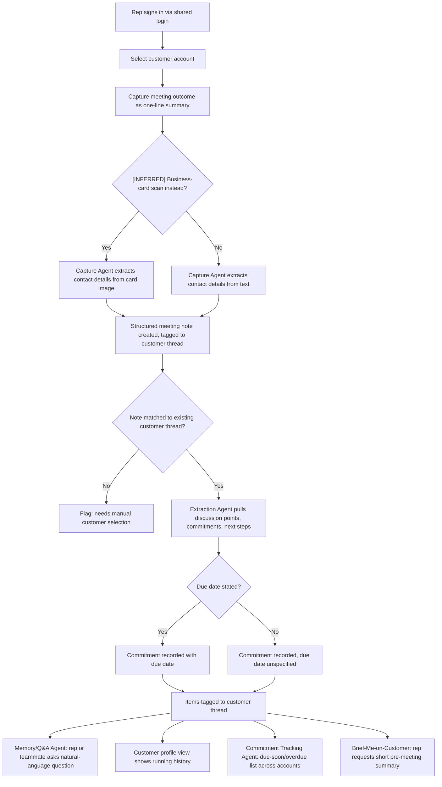

# PRD — Conversational CRM

## 1. Overview

- **Epic/Product name:** Conversational CRM / Relationship Memory Assistant
- **Document reference:** `PRD-conversational-crm-v1.3`
- **Owner:** Product Owner (role, not named individual — not identified in discovery)
- **Approver:** Human gate reviewer, Requirements stage (Gate 2)
- **Status:** Draft — pending validation and human gate
- **Version:** 1.3
- **Source document:** Discovery Brief — `DISCOVERY-BRIEF-conversational-crm-v1.1.md`
- **Revision note:** **Exceptional revision** — this reopens Gate 2 on an
  already-approved-and-published document (v1.2), because a human-requested
  cross-verification against the full canonical idea document (Idea 5) found a real,
  traceable content gap: `project.idea_input` had been recorded, since this run
  started, as an incomplete paraphrase of Idea 5 that silently dropped the
  Brief-Me-on-Customer feature's fourth synthesized component — "where the opportunity
  stands" — and that omission propagated undetected through v1.0, v1.1 and v1.2 until a
  human directly re-checked this document against the corrected canonical source
  (`project.idea_input`, corrected 2026-09-17). This is the only substantive content
  change in v1.3:
  - **Section 6, F-5** now synthesizes a fourth component — opportunity/deal status —
    alongside history, open commitments and stakeholders. Its Description, Source note,
    AC1 (extended to name the fourth component) and AC2 (now "one of the **four**
    summary components," not three) are edited in place, and a new AC4 is added to
    state the success/failure behavior for synthesizing that fourth component.
  - **Section 4** (the Scope table's F-5 row) and **Section 5** (the User Journey step
    list's step 8) each gain the same three words — "and where the opportunity/deal
    stands" — appended to their existing one-line descriptions of F-5, so neither
    summary silently disagrees with Section 6's fuller description once it changes. No
    other cell in either section's table/list changes.
  - **Section 13.1** (Data Architecture — structured store) gains a stated, reasoned
    design decision this addition required: no new structured entity or field (e.g., an
    "Opportunity" entity or a discrete `deal_stage` field) is added. The opportunity/deal
    status component is synthesized narratively from existing Meetings/Commitments
    content together with the vector store's semantic retrieval (Section 13.2) instead
    — because no feature in this PRD gives a rep or agent any mechanism to capture or
    set a discrete deal-stage value, and adding a structured field now would introduce a
    capture requirement never discussed in the interview or named in the idea
    statement's own Scope description. Section 13.2's F-5 bullet is also edited, to
    name the opportunity/deal-status component alongside the "recent history" one
    already there — Section 13.2's overall vector-store description and its other
    bullets (F-3, traceability, security) are unchanged.
  - **Section 13.3**'s cross-reference list gains one new bullet stating explicitly that
    Sections 7 and 9 needed **no** new NFR/dependency row for this addition — their
    existing Data Architecture / Vector-store rows already generically cover it, since
    it uses the same store and mechanism those rows already describe. Sections 7 and 9
    are otherwise unchanged from v1.2.
  - **Section 10** gains one new assumption (row 13) and **Section 11** one new open
    question (item 14), both naming the unconfirmed structured-vs-narrative mechanism
    choice: the **capability** (Brief-Me must also state deal/opportunity status) is now
    a canonical-source-confirmed fact, not an inference — but the specific **mechanism**
    for representing that status was never discussed in the interview and remains
    `[INFERRED — needs confirmation]`, the same discipline already applied throughout
    this PRD to every other Section-9-sourced-but-interview-unconfirmed item.
  - **Section 12** (Related Pages / Source Documents) gains a new line naming v1.2 as
    superseded by this document, and the existing v1.1 line's wording changes from
    "(superseded by this document)" to "(superseded)," now that a later version
    supersedes it instead.
  - No other section changed: Sections 2–3 are fully unchanged; Section 4's table and
    Section 5's step list are unchanged except for the one F-5 line/step each named
    above; Section 6's F-1 through F-4, F-6 and F-7 are fully unchanged; Sections 7, 8,
    9 and 14 are fully unchanged from v1.2 (and therefore from v1.1/v1.0 wherever those
    were already unchanged).

## 2. Purpose and Problem

Sales reps do not log meetings in a traditional CRM today because doing so means
stopping to fill in forms — a disconnected step reps skip or delay, so data quality
suffers and adoption stays low. Commitments made in conversation live only in memory or
inboxes, with no system tracking follow-through, and reconstructing "where things
stand" with a customer means manually piecing together notes and emails.

This system must let a sales rep capture a meeting outcome as effortlessly as sending a
text, must track commitments automatically and surface them before they are due, and
must make relationship history instantly queryable instead of requiring manual
reconstruction from notes and emails — so relationship knowledge lives in a shared
system rather than in individual reps' heads.

`[INFERRED — needs confirmation]` This framing is based on general knowledge of how CRM
adoption typically fails, not on validated research into what this specific group of
reps uses today — the Discovery interview could not identify a concrete status-quo tool
or workflow (see Section 11, Open Question 1).

## 3. Users

| Persona | Role / Context | What they need |
|---|---|---|
| Sales Rep | Single persona — primary and only audience, using the system on a laptop/desktop after a meeting, against seeded demo data via a single shared login | Effortless capture of what happened in a meeting; automatic tracking of commitments and due dates; instant natural-language answers about a customer's history; a quick pre-meeting brief; a way to see a customer's running history at a glance |

The Discovery interview identified exactly one user type and confirmed, on follow-up,
that no second persona with different needs exists ("same role sharing the same
capabilities"). No second persona is added here — see Section 9's disposition below on
why a second **team member** using the same shared login is not the same thing as a
second persona.

## 4. Scope

### In scope

| Feature ID | Name | Priority | Description |
|---|---|---|---|
| F-1 | Conversational Meeting Capture | Must | Rep captures a meeting outcome as a typed one-line summary; Capture Agent extracts contact details into a structured, thread-tagged meeting note |
| F-2 | Automatic Extraction & Thread Tagging | Must | Extraction Agent pulls discussion points, commitments, follow-ups and next steps (with due dates where stated) from a captured note and tags them to the correct customer thread |
| F-3 | Natural-Language Memory & Q&A | Must | Rep asks a natural-language question about a customer thread and gets an answer drawn from captured history |
| F-4 | Proactive Commitment Tracking | Must | System surfaces a due-soon/overdue list of open commitments across all accounts, with no calendar or notification integration |
| F-5 | Brief-Me-on-Customer Summary | Should | Rep requests a short pre-meeting summary of a customer's recent history, open items, stakeholders and where the opportunity/deal stands |
| F-6 | Customer Profile / Conversational History View | Must | Per-customer view listing captured notes and extracted items in chronological order |
| F-7 | Shared Customer Thread Access | Must | Every user of the single shared login sees and can add to the same customer thread as any other user of that login |

### Out of scope

- **Real external system integrations** — adapters simulate external connections instead of connecting to real systems (Discovery Brief Section 4).
- **Multi-team support** (Discovery Brief Section 4).
- **Multi-tenant support** (Discovery Brief Section 4).
- **Individual per-rep authentication / commitment-note attribution** — a single shared login is used instead; commitments and notes are not attributed to a specific individual in this version (Discovery Brief Sections 2, 5, 7).
- **Voice-note capture** — the original idea statement itself frames this as droppable if speech-to-text "eats into build time," with typed one-liners as "an acceptable substitute." Deferred for this version; F-1's typed capture is the confirmed baseline. **Disposition: explicitly deferred.**
- **Enterprise-grade access control and governance** — the original idea statement itself frames this as a stretch goal, consistent with (not contradicting) the confirmed single-shared-login simplification (Sections 2, 5, 7). Not required for this version's stated success metric. **Disposition: explicitly deferred.**

## 5. User Journey

### Narrative

A sales rep signs in via the system's single shared login and works against seeded
demo customer accounts. After a meeting, the rep captures what happened as a one-line
summary; the system extracts structured detail and commitments from it automatically
and tags them to the right customer. From then on, the rep — or a second team member
using the same shared login — can ask the system natural-language questions about that
customer, see a running profile of the relationship, get a proactive list of
commitments coming due or overdue across every account, and request a short brief
before the next meeting.

### Step list

1. Rep signs in via the single shared login and selects a customer account from the seeded data.
2. After a meeting, the rep captures the outcome as a typed one-line summary. `[INFERRED — needs confirmation]` The rep may alternatively capture it by scanning a business card.
3. Capture Agent extracts contact details into a structured meeting note and associates it with the correct customer thread.
4. Extraction Agent processes the note, extracting discussion points, commitments and next steps (with a due date where one was stated), and tags them to the same thread.
5. The rep, or a second team member signed in via the same shared login, asks the Memory/Q&A Agent a natural-language question about the thread (e.g., "what did we discuss last time?", "what did I commit to?", "who attended from their side?").
6. The rep opens the customer profile view to see the running conversational history at a glance.
7. Independently of any single customer view, the Commitment Tracking Agent surfaces a due-soon/overdue list of open commitments across all accounts.
8. Before the next meeting, the rep requests a brief (e.g., "brief me on Acme") and the Brief-Me-on-Customer Agent returns a short summary of recent history, open items, stakeholders and where the opportunity/deal stands.

### Flowchart

### Alternate flows

- **Validation failure — unmatched customer:** captured text does not unambiguously
  match a seeded customer account → system flags the note "unmatched — needs customer
  selection" and asks the rep to pick the correct account (F-1 AC4).
- **Empty state — no history yet:** a query or profile view is opened for a customer
  with no captured notes → system states that no history exists yet, rather than
  returning nothing with no explanation (F-3 AC1, F-6 AC1).
- **Empty state — no commitments due:** the due-soon/overdue list is opened when no
  commitment qualifies → system states there are none, rather than showing an empty
  list with no explanation (F-4 AC3).

## 6. Features

### F-1 — Conversational Meeting Capture

**Priority:** Must
**Source:** Discovery Brief Section 1 (Problem Statement: "capture becomes as
effortless as sending a text") + Section 3 Goal 1 ("Make capture effortless enough that
it happens every time") + Section 9 item "Capture Agent." Typed one-line capture ties
directly to a confirmed goal. `[INFERRED — needs confirmation]` Business-card scanning
as an alternative input is adopted as in-scope because it serves the same confirmed
capture-effortless goal, but its specific mechanism (scanning/OCR, optical character
recognition, approach) was never discussed in the interview.

**Description:** The system must let the rep capture a meeting outcome as a single
typed free-text entry describing what happened, and the Capture Agent must extract
structured contact detail from that entry into a meeting note tied to the correct
customer thread. `[INFERRED — needs confirmation]` The system must also accept a
scanned business-card image as an alternative capture input.

**Acceptance criteria:**
1. System must create a structured meeting note and associate it with the correct
   customer thread when the entry text unambiguously matches exactly one customer
   account already present in the seeded data, and must flag the note as "unmatched —
   needs customer selection" — rather than attaching it to a default or incorrect
   account — when no seeded customer account can be unambiguously identified from the
   entry.
2. `[INFERRED — needs confirmation]` System must extract the contact's name, company and
   role from a scanned business-card image into the structured meeting note when the
   image is legible and contains recognizable contact fields, and must inform the rep
   that manual entry is required — without fabricating contact details — when the image
   cannot be read or no contact fields are recognized.
3. System must save the entry as a new meeting note when it contains at least one
   non-whitespace character, and must reject the submission with an explicit "cannot
   save an empty note" message — without creating any note record — when the rep
   submits an empty or whitespace-only entry.
4. System must attach a previously flagged "unmatched" note to the customer thread the
   rep selects when the rep manually resolves the flag, and must leave the note in the
   unmatched/needs-selection state — rather than guessing an account — when the rep has
   not yet resolved it.

### F-2 — Automatic Extraction & Thread Tagging

**Priority:** Must
**Source:** Section 3 Goal 2 ("Track commitments automatically and surface them before
they are due") + Goal 3 ("Make relationship history instantly queryable") + Section 9
item "Extraction Agent." Direct tie to confirmed goals; no inference needed on the core
capability.

**Description:** Given a captured meeting note, the Extraction Agent must identify
discussion points, commitments, follow-ups and next steps, must capture a due date for
a commitment when one is mentioned in the text, and must tag every extracted item to the
correct customer thread the note belongs to.

**Acceptance criteria:**
1. System must extract each distinct commitment, follow-up or next step mentioned in a
   captured note's text as a separate tracked item when the note contains one or more of
   them, and must record no commitment items when the note describes discussion only
   with no forward-looking commitment.
2. System must record a due date on an extracted commitment when the captured text
   states or clearly implies one (e.g., "by Friday"), and must mark the commitment's due
   date as unspecified — rather than guessing a date — when the text gives no date
   information.
3. System must tag every extracted discussion point and commitment to the same customer
   thread as its source meeting note, and must flag an extracted item for manual thread
   assignment when the source note itself is unmatched to a customer thread (per F-1 AC4),
   rather than tagging it to an incorrect thread.
4. System must record a best-effort due date only when the captured text names a
   concrete date or an unambiguous relative date term resolvable against the meeting's
   timestamp (e.g., "by Friday"), and must leave the due date unspecified — rather than
   guessing an exact date — when the text uses a vague temporal reference (e.g., "soon,"
   "sometime") that cannot be resolved to a specific date.

### F-3 — Natural-Language Memory & Q&A

**Priority:** Must
**Source:** Section 1 / Section 3 Goal 3 ("relationship history instantly queryable")
+ Section 9 item "Memory/Q&A Agent" and its three example queries. `[INFERRED — needs
confirmation]` The three example queries are adopted as illustrative of the required
capability, not confirmed as the exhaustive supported query set.

**Description:** The system must let a rep ask a natural-language question about a
specific customer thread and must return an answer drawn from that thread's captured
notes, extracted discussion points and commitments, covering at minimum the three
example query types named in the original idea statement: "what did we discuss last
time?", "what did I commit to?", "who attended from their side?"

**Acceptance criteria:**
1. System must answer a natural-language question about a customer's most recent
   discussion by returning content drawn from that customer's most recent meeting
   note(s) when the thread has at least one captured note, and must respond that no
   history exists yet for that customer when the thread is empty.
2. System must answer a natural-language question about the rep's own open commitments
   for a customer by listing the commitments extracted and tagged to that thread when
   any exist, and must state that there are no open commitments for that customer when
   none exist.
3. System must answer a natural-language question about meeting attendees by returning
   the contact names extracted from that thread's meeting notes when attendee names
   were captured, and must state that no attendee information was captured when none was
   extracted.
4. System must resolve and answer against the correct customer thread when a query
   names exactly one customer that matches a seeded account, and must respond that it
   could not identify the customer — rather than guessing or returning another
   customer's data — when the query names no customer or an unrecognized one.

### F-4 — Proactive Commitment Tracking

**Priority:** Must
**Source:** Section 3 Goal 2 ("Track commitments automatically and surface them before
they are due") + Section 9 items "Commitment Tracking Agent" and "due-soon/overdue
commitment list." Direct, strong tie to a confirmed goal — no inference needed on the
core capability.

**Description:** The system must surface a list of open commitments that are due soon
or already overdue, across all customer accounts, computed from the due dates captured
by the Extraction Agent, without any calendar or notification integration.

**Acceptance criteria:**
1. System must list every open commitment whose due date has passed as "overdue" when
   the current date is past that due date, and must exclude a commitment from this list
   once it is marked complete.
2. `[INFERRED — needs confirmation]` System must list every open commitment whose due
   date falls within a defined look-ahead window as "due soon" when that window is
   confirmed (the exact window, e.g. "the next 7 days," was not stated in discovery and
   is carried to Open Questions, Section 11), and must reclassify it as "overdue"
   instead (per AC1) — rather than continuing to show it as due-soon — once its due
   date has passed.
3. System must list every qualifying commitment individually when at least one exists,
   and must state explicitly that there are no due-soon or overdue commitments — rather
   than showing an empty list with no explanation — when none exist.
4. System must include a commitment with a stated due date in the due-soon/overdue list
   per AC1/AC2, and must list a commitment with an unspecified due date (per F-2 AC2/AC4)
   separately from that list — rather than omitting it entirely or treating it as
   overdue — when no due date was captured.

### F-5 — Brief-Me-on-Customer Summary

**Priority:** Should
**Source:** Section 9 item "Brief-Me-on-Customer Agent." `[INFERRED — needs
confirmation]` This capability was not independently confirmed in the interview;
adopted as in-scope as a composition of the confirmed "instantly queryable" goal
(Section 1/3) and the Commitment Tracking capability (F-4), since a pre-meeting brief is
a synthesis of exactly the history and open-items data those two confirmed capabilities
already produce. `[Confirmed — canonical idea document, Idea 5 — added v1.3]` Idea 5's
own pitch text states the Brief-Me synthesis draws on "history, open commitments, key
stakeholders, and where the opportunity stands" — a fourth component this PRD's v1.0
through v1.2 omitted, because `project.idea_input` had been recorded, since this run
started, as an incomplete paraphrase that dropped it; the omission is corrected in this
revision. This directly confirms the **capability** that Brief-Me must also state
opportunity/deal status — it is no longer merely inferred from composition — but the
specific **mechanism** for representing that status (see AC4 below, and Section 13.1)
was never discussed in the interview and remains `[INFERRED — needs confirmation]`.

**Description:** Given a single request naming a customer (e.g., "brief me on Acme"),
the system must generate a short summary combining that customer's recent history, open
commitments, known stakeholders, and where the opportunity/deal stands. `[INFERRED —
needs confirmation]` The opportunity/deal-status component is synthesized narratively
from the customer's existing meeting-note and commitment content (Section 13.1/13.2)
rather than read from a distinct structured deal-stage field, per the design decision
and reasoning recorded in Section 13.1 — no feature in this PRD gives a rep or agent a
way to capture or set a discrete deal stage. The summary must remain a short generated
summary rather than a long or formatted report, per the original idea statement's own
framing.

**Acceptance criteria:**
1. System must generate a summary containing recent discussion history, open
   commitments, stakeholder/contact names, and where the opportunity/deal stands for a
   named customer when that customer has at least one captured note, and must state
   that no history exists yet for that customer when the thread is empty, rather than
   generating a summary with fabricated content.
2. `[INFERRED — needs confirmation]` System must return a bounded, short-form summary
   (a few sentences or bullets, not a multi-page document) under normal conditions — no
   explicit length limit was stated in discovery, carried to Open Questions (Section
   11) — and must still return whatever partial content is available when data for one
   of the four summary components (history, commitments, stakeholders, opportunity/deal
   status) is missing, rather than failing the whole request.
3. System must generate the summary for a named customer when the request unambiguously
   identifies exactly one seeded customer account, and must respond that it could not
   identify the requested customer — rather than guessing — when the request names an
   unrecognized or ambiguous customer.
4. `[INFERRED — needs confirmation]` System must synthesize the opportunity/deal-status
   component narratively from that customer's recorded meeting notes and commitments —
   since no discrete deal-stage field exists in the structured store (Section 13.1) —
   when the thread contains content indicating where the deal/opportunity stands, and
   must state that no opportunity/deal-status information has been captured yet for that
   customer — rather than fabricating a stage or outcome — when the thread contains no
   such content.

### F-6 — Customer Profile / Conversational History View

**Priority:** Must
**Source:** Section 9 item "a customer profile view ... showing the running
conversational history," tied directly to confirmed Goal 3 (instantly queryable
history) and Goal 4 (shared system, Section 3). `[INFERRED — needs confirmation]` Exact
layout/fields of the view were not discussed in the interview.

**Description:** The system must provide a per-customer profile view listing that
customer's captured notes and extracted discussion points and commitments in
chronological order, giving the rep a single place to see the running history without
querying the Memory/Q&A Agent.

**Acceptance criteria:**
1. System must display a customer's captured notes and extracted items in chronological
   order on that customer's profile view when at least one note exists, and must display
   an explicit "no history yet" state when none exists.
2. System must display a newly captured note and its extracted items (per F-1, F-2) on
   the correct customer's profile view automatically, without requiring the rep to take
   further action, when the note is tagged to that customer's thread, and must not
   display that note or its items on any other customer's profile view when it is not
   tagged to that customer.

### F-7 — Shared Customer Thread Access

**Priority:** Must
**Source:** Discovery Brief Sections 2, 5 and 7 (single shared login, confirmed via
interview follow-up) reconciled against Section 9 item "a simple shared view so a
second team member ... can see and add to the same customer thread." `[INFERRED — needs
confirmation]` Adopted as already satisfied by the confirmed single-shared-login access
model rather than as a feature requiring a distinct second persona: Section 2
explicitly found no second persona in this discovery pass, so any user of the single
shared login — including a second team member such as an account manager — already sees
and can add to the same customer thread as any other user of that login. No additional
persona or access-control feature is introduced by this item.

**Description:** Every user signed in via the single shared login must see the same
customer threads and must be able to add captures/notes to any customer thread any
other user of that login can access — "shared" here is a property of the single-login
access model already confirmed, not a separate collaboration feature layered on top of
it.

**Acceptance criteria:**
1. System must show the same customer thread content to every session authenticated
   via the shared login when two sessions view the same customer, and must not
   partition data by which physical person is at the keyboard, since no per-rep
   identity exists in this version.
2. `[INFERRED — needs confirmation]` System must persist a note added from one session
   so that it is immediately visible to another concurrent session viewing the same
   customer thread, and must not silently lose one session's addition when another
   session adds to the same thread at nearly the same time — the exact conflict-handling
   mechanism was not discussed in the interview and is carried to Open Questions
   (Section 11).

## 7. Non-Functional Requirements

| Category | Requirement | Override reason |
|---|---|---|
| Security / Privacy | System must operate only on seeded demo data and must not process real customer PII (personally identifiable information) in this version — this constraint applies equally to the structured store and to the vector store of embeddings (Section 13): an embedding of real PII would be exactly as non-compliant as a structured record of it. | Discovery Brief Section 6 — seeded data only removes real customer-PII exposure as a concern for this phase. Extended in v1.1 to state explicitly that it covers both data stores added in Section 13. |
| Access Control | System must authenticate all use via a single shared login and must not implement per-individual authentication in this version. | Explicit demo simplification, confirmed via interview follow-up (Discovery Brief Sections 2, 5). |
| Integration | System must simulate every external system touchpoint (sources feeding seed data, e.g. MOM/email/SharePoint-derived content) via adapters — including the CRM, calendar, SharePoint and email adapters detailed in Section 14 — and must not call a real external system in this version. | Discovery Brief Section 4/5 — no real system integrations of any kind. Extended in v1.1 to reference the concrete adapter-only approach in Section 14. |
| Concurrency | `[INFERRED — needs confirmation]` System must handle at least two concurrent shared-login sessions accessing the same customer thread without silently losing data. | Follows from the confirmed shared-login model (F-7) and Section 9's "second team member" item; the specific mechanism was not discussed in discovery. |
| Data Architecture | System must persist core CRM entities (accounts, contacts, meetings, commitments) in a structured, queryable store, and must additionally hold embeddings of extracted unstructured content (MoM, free text, email, SharePoint-derived material) in a vector store, so that F-3 and F-5 can retrieve context semantically rather than by exact keyword/exact-match search alone. | Added in v1.1 per Gate 2's first revise feedback (2026-09-17). The specific store technologies (SQLite, Chroma) and the vector store's chunking strategy (semantic chunking) were confirmed directly by the human at Gate 2's second revise reply (2026-09-17). Elaborated in full in Section 13. |

## 8. Success Metrics

| Metric | Target | How measured |
|---|---|---|
| Demo agents functioning end-to-end on seeded data (Discovery Brief Section 3, stated success metric) | Every feature F-1 through F-7's defined acceptance criteria executes successfully against the seeded demo dataset (customer accounts, contacts, and MOM/email/SharePoint-derived interaction history) | Manual walkthrough of the full capture → extraction → query → commitment-tracking → brief → shared-thread-access flow against seeded accounts, checked against this PRD's acceptance criteria. `[INFERRED — needs confirmation]` The exact list of seed scenarios that constitutes complete "end-to-end" coverage is not yet enumerated — carried forward from Discovery Open Item 2 to Open Questions (Section 11). |
| `[INFERRED — needs confirmation]` Commitment due-date classification accuracy | 100% of commitments with a stated due date in captured notes are correctly classified as due-soon or overdue per F-4 | Manual check of seeded commitments with known due dates against the due-soon/overdue list on a known reference date |

## 9. Dependencies

| Dependency | Impact level | Status |
|---|---|---|
| Seeded demo dataset (customer accounts, contacts, prior interaction history including MOM, email and SharePoint content) | TIGHT | Required before any feature can be exercised — no feature functions without it (Discovery Brief Section 5) |
| Adapters simulating external systems in place of real integrations — specifically a CRM adapter, a calendar adapter, a SharePoint adapter, and (added in v1.1 per Gate 2 feedback) an email adapter, each backed by stub/seeded data behind a defined interface contract | MODERATE | Needed to represent CRM/calendar/SharePoint/email-sourced content without real connections; concrete interface-contract detail elaborated in Section 14, including a proposed contract per adapter in new Section 14.1a — a decision Gate 2's second reply explicitly delegated to requirements-agent (added in v1.2) |
| `[INFERRED — needs confirmation]` Natural-language understanding/extraction capability underlying the Capture, Extraction, Memory/Q&A and Brief-Me-on-Customer agents | TIGHT | Not explicitly named as a dependency in the interview, but functionally required by every Section 9 capability adopted above; status open |
| Structured/historical data store for core CRM entities (accounts, contacts, meetings, commitments) | TIGHT | Added in v1.1 per Gate 2's first revise feedback; F-1, F-2, F-4, F-6 and F-7 all read from or write to this store — elaborated in Section 13.1. Technology confirmed as SQLite at Gate 2's second revise reply (2026-09-17). |
| Vector database holding embeddings of extracted unstructured content (MoM, free text, email, SharePoint docs) | TIGHT | Added in v1.1 per Gate 2's first revise feedback; F-3 and F-5's semantic-retrieval requirement depends on this store existing — elaborated in Section 13.2. Technology confirmed as Chroma, and chunking strategy confirmed as semantic chunking, at Gate 2's second revise reply (2026-09-17). |

## 10. Constraints and Assumptions

### Hard constraints (stated directly in the Discovery Brief)

- Runs entirely against seeded data; not live/real customer data (Section 4/5).
- No real external system integrations; adapters simulate connections instead (Section 4/5).
- Single shared login; no individual per-rep authentication (Section 2/5).
- Single team, single tenant (Section 4).

### Assumptions

| # | Assumption | Validation plan | Owner | Status |
|---|---|---|---|---|
| 1 | `[INFERRED — needs confirmation]` The problem statement is based on general CRM-adoption knowledge, not validated research on this specific rep population. | Confirm with real reps before treating the problem statement as more than a working assumption. | Business analyst / product owner | Open |
| 2 | `[INFERRED — needs confirmation]` Single shared login means commitments/notes are not attributed to an individual rep in this version. | Explicit human decision if a future phase needs per-rep attribution. | Product owner | Open |
| 3 | `[INFERRED — needs confirmation]` "End-to-end on seeded data" requires the seed dataset to exercise every feature in this PRD (F-1–F-7). | Enumerate the specific seed scenarios before development/test planning starts. | Requirements / QA | Open |
| 4 | `[INFERRED — needs confirmation]` A future phase moving to real customer data would require revisiting compliance/PII handling. | Defer to that future phase's own discovery pass. | Product owner | Deferred — not applicable to this version |
| 5 | `[INFERRED — needs confirmation]` Business-card scanning is included as an in-scope, additional capture input alongside typed one-liner capture; exact OCR/parsing approach is unconfirmed. | Confirm with a human whether OCR-based scanning is worth building for the demo or typed-only suffices. | Product owner / architect | Open |
| 6 | `[INFERRED — needs confirmation]` Brief-Me-on-Customer is treated as a composition of the confirmed Memory/Q&A and Commitment Tracking capabilities rather than an independently confirmed capability. | Confirm with a human that this composition satisfies the original idea's intent. | Product owner | Open |
| 7 | `[INFERRED — needs confirmation]` The confirmed single-shared-login model is assumed sufficient to satisfy Section 9's "second team member shared view" item, without introducing a second persona. | Confirm with a human that no distinct account-manager-facing feature is expected beyond shared-login access. | Product owner | Open |
| 8 | `[INFERRED — needs confirmation]` The three example Memory/Q&A queries are illustrative of the required natural-language query capability, not an exhaustive supported list. | Confirm with a human whether additional query types must be explicitly supported. | Product owner | Open |
| 9 | `[RESOLVED — Gate 2 decision, 2026-09-17]` The structured-store and vector-store technologies (Section 13) were unconfirmed as of v1.1. The human decided them directly rather than leaving them to the Architecture stage: structured store = SQLite, vector store = Chroma. | None needed — decided directly by a human at the gate. | Product owner (decided) | Resolved — see Section 13.1/13.2 |
| 10 | `[INFERRED — needs confirmation, partially resolved]` Gate 2's second reply confirmed the vector store's chunking strategy directly: semantic chunking (Section 13.2). The specific embedding model, and the re-embedding trigger strategy for when a source note or document changes, remain unconfirmed and are still left to the Architecture stage. | Architecture stage documents the embedding model choice and the re-embedding trigger mechanism. | Architect | Partially resolved — chunking strategy confirmed; embedding model and re-embedding trigger still open |
| 11 | `[DELEGATED DECISION — human authorized requirements-agent to choose at Gate 2]` The full interface contract per adapter (CRM, calendar, SharePoint, email), beyond the two illustrative method names given at the first Gate 2 reply, was delegated by the human to requirements-agent's own judgment ("you can choose the best method as needed") rather than confirmed directly. A proposed contract is recorded in Section 14.1a. This is an authorized design choice, not a human-confirmed exhaustive contract — Architecture/Development may still refine it. | Architecture stage reviews and finalizes (or explicitly ratifies) the proposed contract before Development builds against it. | Architect | Delegated decision recorded — see Section 14.1a; not yet ratified by Architecture |
| 12 | `[DELEGATED DECISION — human authorized requirements-agent to choose at Gate 2]` The email adapter's required operations were likewise delegated to requirements-agent's judgment. Section 14.1a proposes read-only message retrieval only, with no simulated send capability, since no feature in this PRD requires composing or sending email. | Architecture stage confirms retrieval-only is sufficient before Development builds it. | Architect | Delegated decision recorded — see Section 14.1a |
| 13 | `[INFERRED — needs confirmation]` The Brief-Me-on-Customer opportunity/deal-status component (F-5, added in v1.3 per the corrected canonical idea document) is synthesized narratively from existing Meetings/Commitments content (Section 13.1) rather than read from a new structured deal-stage field, since no feature in this PRD provides a mechanism to capture or set a discrete deal stage. | Confirm with a human whether a structured, selectable deal-stage field (analogous to a traditional CRM pipeline stage) is actually required, or whether narrative synthesis is sufficient. | Product owner / architect | Open |

## 11. Open Questions

1. Current-state pain points and the tools reps actually use today were not identified
   in discovery ("not sure what people use these days") — validate this with real reps
   before treating the problem statement as more than a working assumption. *(Carried
   from Discovery Brief Open Item 1.)*
2. The exact set of seed scenarios — and any numeric thresholds (e.g., response-time
   targets) — that constitute "agents functioning end-to-end" are not yet defined; this
   needs enumeration before development/test planning. *(Carried from Discovery Brief
   Open Item 2, refined for Requirements.)*
3. Whether commitments/notes will ever need per-rep attribution beyond this demo (given
   the shared-login decision) is unresolved — worth a deliberate call before any future
   phase, rather than defaulting into it. *(Carried from Discovery Brief Open Item 3.)*
4. The compliance/data-handling path for a future phase using real customer data
   (rather than seeded data) has not been discussed and is unresolved. *(Carried from
   Discovery Brief Open Item 4.)*
5. Is business-card OCR scanning worth implementing for this demo, or is typed-only
   capture acceptable? (Relates to F-1 AC2.)
6. Is the "due soon" look-ahead window for commitment tracking a specific number of
   days, and if so, what is it? (Relates to F-4 AC2.)
7. Is there a maximum length or format expected for the Brief-Me-on-Customer summary
   beyond "short"? (Relates to F-5 AC2.)
8. Are the three example Memory/Q&A queries exhaustive, or must additional query types
   be explicitly supported? (Relates to F-3.)
9. Should concurrent-session editing conflicts on a shared customer thread (F-7 AC2) be
   handled a specific way, or is last-write-wins acceptable for this demo?
10. **RESOLVED — Gate 2 decision (2026-09-17):** Structured store = SQLite; vector
    store = Chroma, decided directly by the human reviewer rather than left to the
    Architecture stage. Hosting/cost constraints were not raised as part of this
    decision and are not a currently known open item. (Relates to Section 13; see
    Assumption 9.)
11. **PARTIALLY RESOLVED — Gate 2 decision (2026-09-17):** the chunking strategy is
    confirmed as semantic chunking (Section 13.2). Still open: which specific embedding
    model to use, and how re-embedding should be triggered when a source note or
    document changes. (Relates to Section 13.2; see Assumption 10.)
12. **RESOLVED BY DELEGATION — Gate 2 (2026-09-17):** the human explicitly delegated
    this decision to requirements-agent ("you can choose the best method as needed")
    rather than answering it directly. A proposed interface contract for all four
    adapters is recorded in Section 14.1a, tagged `[DELEGATED DECISION]` since it is an
    authorized design choice, not a human-confirmed exhaustive contract. (Relates to
    Section 14.1a; see Assumption 11.)
13. **PARTIALLY RESOLVED BY DELEGATION — Gate 2 (2026-09-17):** the human delegated
    adapter-related decisions to requirements-agent; Section 14.1a proposes read-only
    message retrieval for the email adapter (no simulated send), tagged `[DELEGATED
    DECISION]`. Still open: whether a specific vendor/stakeholder communication
    artifact is required beyond this PRD's Section 14.2 disclosure statement — the
    Gate 2 decision did not address this half of the question. (Relates to Section
    14.2; see Assumption 12.)
14. **`[Added v1.3]`** Is the Brief-Me-on-Customer summary's opportunity/deal-status
    component (F-5 AC4) expected to be a structured, selectable pipeline-style field
    (e.g., Prospecting/Demo/Negotiation/Closed, analogous to a traditional CRM pipeline
    stage), or a free-text narrative synthesized from existing meeting-note/commitment
    content with no distinct stored field? This was never discussed in the interview;
    v1.3 adopts narrative synthesis as its working design (Section 13.1), pending human
    confirmation. (Relates to Section 13.1; see Assumption 13.)

## 12. Related Pages / Source Documents

- Discovery Brief: `docs/discovery/DISCOVERY-BRIEF-conversational-crm-v1.1.md` (published: https://experionglobal.atlassian.net/wiki/spaces/~712020cfea88f08c6844969dae6275717756c1/pages/5882773547/Conversational+CRM+Discovery+Brief+v1.1)
- PRD v1.0 (superseded): `docs/requirements/PRD-conversational-crm-v1.0.md`
- PRD v1.1 (superseded): `docs/requirements/PRD-conversational-crm-v1.1.md`
- PRD v1.2 (superseded by this document): `docs/requirements/PRD-conversational-crm-v1.2.md`

## 13. Data Architecture

Two independent data stores support the features above. Added in v1.1 per Gate 2's
first revise feedback (2026-09-17); the specific technology and chunking-strategy
decisions below were confirmed directly by the human at Gate 2's second revise reply
(2026-09-17: "DB : SQLite, VectorDB: Chroma, embedding/chunking strategy: semantic
chunking..."). Neither store is a new feature in its own right — each is what F-1
through F-7 already require underneath, made explicit so the Architecture stage does
not have to infer it.

### 13.1 Structured / historical store

`[RESOLVED — Gate 2 decision, 2026-09-17]` **The structured/historical store technology
is SQLite** — a self-contained, serverless, file-based SQL database engine. A human
decided this directly at Gate 2's second revise reply, replacing the `[INFERRED —
needs confirmation]` placeholder this PRD carried in v1.1 (see Assumption 9); it is no
longer left to the Architecture stage to select.

The system must persist core CRM entities in this structured, queryable store:
accounts, contacts, meetings (meeting notes captured per F-1), and commitments
(extracted per F-2, tracked per F-4). This store is authoritative for exact-match,
chronological, and status-based lookups — anything answerable by "which rows meet this
condition" rather than "what does this passage of text mean."

- **Accounts / contacts** — the seeded customer accounts and their contacts (see the
  seeded-dataset dependency, Section 9); F-1's customer-thread matching (AC1, AC4) and
  F-6's per-customer profile view read against this data.
- **Meetings** — each structured meeting note created by F-1's Capture Agent, tagged to
  a customer thread; F-6's chronological profile view and F-7's shared-thread
  visibility both read directly from this table, so every session sees identical
  content per F-7 AC1.
- **Commitments** — each commitment/follow-up/next-step extracted by F-2, with its due
  date (or unspecified marker, per F-2 AC2/AC4); F-4's due-soon/overdue list is
  computed directly from this table's due-date field and completion status.

`[INFERRED — needs confirmation]` **Added in v1.3 — this structured store gains no new
entity or field for the Brief-Me-on-Customer opportunity/deal-status addition (F-5,
Section 6).** F-5's opportunity/deal-status component is synthesized narratively from
this store's existing Meetings and Commitments content, read together with the vector
store's semantically-retrieved MoM/free-text passages (Section 13.2) — not from a new
"Opportunity" entity or a discrete `deal_stage` field. Reasoning: no feature in this
PRD (F-1 through F-7) gives a rep or any agent a mechanism to capture, select, or
update a discrete deal-stage value (e.g., a CRM-style Prospecting/Demo/Negotiation/
Closed pipeline field) — F-1 captures free text, F-2 extracts discussion points,
commitments and next steps, and neither names a deal-stage field as something to
extract or store. Adding a structured field now would introduce a new capture
requirement never discussed in the interview or named in the idea statement's own
Scope description (which lists capture, extraction, Q&A, commitment-tracking and
briefing agents, not a deal-stage field). This is this agent's own design inference,
not a human-confirmed decision — whether a structured, selectable deal-stage field is
actually wanted instead is carried to Open Questions (Section 11, Open Question 14)
and Assumptions (Section 10, row 13).

### 13.2 Vector store (embeddings)

The system must additionally maintain a vector database holding embeddings of
extracted unstructured content: minutes of meeting (MoM) text, free-text capture
entries, email content, and SharePoint document content. This store exists
specifically so F-3 (Natural-Language Memory & Q&A) and F-5 (Brief-Me-on-Customer
Summary) can retrieve context **semantically** — matching a query's meaning rather than
requiring the query's exact wording to appear in the source text — rather than through
keyword/exact-match search over the structured store alone.

`[RESOLVED — Gate 2 decision, 2026-09-17]` **The vector store technology is Chroma** —
an open-source embedding/vector database. A human decided this directly at Gate 2's
second revise reply, replacing the `[INFERRED — needs confirmation]` placeholder this
PRD carried in v1.1 (see Assumption 9).

`[RESOLVED — Gate 2 decision, 2026-09-17]` **The chunking strategy is semantic
chunking** — splitting source text at semantic/topic boundaries (where the subject or
discussion point actually shifts) rather than at a fixed character/token count or a
naive line/paragraph split. Concretely, for this system's actual content types:

- **Minutes of meeting (MoM) / structured meeting notes** — chunked per distinct
  discussion point, commitment, or topic shift within a note, rather than by a fixed
  word count, so a chunk stays about one topic (e.g., one agenda item or one
  commitment) instead of splitting mid-thought or merging two unrelated topics into one
  chunk.
- **Free-text capture entries** (F-1's typed one-line summaries) — typically short
  enough to remain a single chunk; split further only if a single entry genuinely
  covers more than one distinct topic.
- **Emails** — chunked by message, and, for a long message, by topic shift within it
  (e.g., a reply thread that changes subject partway through), rather than by a fixed
  character count that risks splitting a sentence or a commitment across two chunks.
- **SharePoint documents** — chunked by section/heading boundary where the document has
  visible structure, falling back to a detected topic-shift boundary where it does not,
  rather than a fixed-size sliding window that risks splitting a single idea or
  commitment across chunks.

The shared reasoning: F-3 and F-5 retrieve by matching a query's *meaning*, so a chunk
boundary that cuts a topic in half would return a passage missing exactly the part that
made it relevant. Semantic chunking is the given decision that keeps a retrieved chunk
self-contained enough to answer from.

- **F-3** — a query such as "what did we discuss last time?" must be able to retrieve
  semantically-relevant passages from that customer's embedded unstructured content
  (not only the fields already broken out into the structured store), so an answer can
  draw on nuance in the original text that structured extraction did not capture as a
  discrete field. This does not change F-3's stated acceptance criteria; it states how
  the "content drawn from that customer's most recent meeting note(s)" (F-3 AC1) is
  actually retrieved.
- **F-5** — the Brief-Me-on-Customer summary's "recent history" and "opportunity/deal
  status" components (per F-5's description) must be able to draw on
  semantically-relevant embedded content across a customer's MoM/email/SharePoint-
  derived material, not only the single most recent structured meeting note.
- Every embedded item must remain traceable back to the customer thread and source
  meeting/document it was extracted from, so F-3 AC4 and F-5 AC3's existing
  requirement — resolve to the correct customer, and refuse to guess or return another
  customer's data — holds for vector-retrieved content exactly as it already holds for
  structured-store content.
- Consistent with the Security/Privacy NFR (Section 7): this store, like the structured
  store, must hold only seeded/synthetic content — no real customer PII is embedded,
  since none is ever ingested in this version.

`[INFERRED — needs confirmation]` What remains unconfirmed, and is **not** resolved by
the Gate 2 decision above: the specific embedding model used to encode a chunk into a
vector (Gate 2's reply names a chunking strategy, not an embedding model), and the
re-embedding trigger strategy — how and when a chunk is re-embedded after its source
note or document changes. Both are still left to the Architecture stage (Section 10,
Assumption 10).

### 13.3 Cross-references

- **Section 7 (NFRs):** the Security/Privacy row is extended to state explicitly that
  its seeded-data-only constraint applies to both stores, and a new "Data Architecture"
  row states the two-store requirement at NFR level; its override reason now also cites
  the Gate 2 second-reply decision.
- **Section 9 (Dependencies):** two new TIGHT rows added — the structured store and the
  vector store — since F-1/F-2/F-4/F-6/F-7 (structured) and F-3/F-5 (vector-retrieval)
  cannot function without their respective store; both rows now name the confirmed
  technology (SQLite, Chroma).
- **Section 10 (Assumptions):** row 9 is now marked Resolved (Gate 2 decided both
  technologies directly); row 10 is marked partially resolved (Gate 2 confirmed the
  chunking strategy, but the embedding model and re-embedding trigger remain open).
- **Section 11 (Open Questions):** questions 10 and 11 are marked resolved/partially
  resolved, referencing this Gate 2 decision (2026-09-17), rather than deleted.
- **Added in v1.3 — Sections 7 and 9 needed no new row for F-5's opportunity/deal-status
  addition.** The Data Architecture NFR row (Section 7) and the Vector-store dependency
  row (Section 9) already state their reach generically enough ("F-3 and F-5" /
  "extracted unstructured content") to cover F-5's new fourth component without change,
  since it uses the same vector store and semantic-retrieval mechanism those rows
  already describe, rather than a new store or a new structured entity — see Section
  13.1's reasoning above for why no new entity was added instead.

## 14. Integration Approach — Adapter-Only

Every external connection this system would need in a real deployment — a CRM
(customer relationship management system), a calendar, SharePoint, and email — is
scoped as an **adapter**: a component defining a clear interface contract, backed by
stub/seeded data, not a real connection. Added in v1.1 per Gate 2's first revise
feedback (2026-09-17); email is a new explicit addition to this list — Discovery and
PRD v1.0 referred to "MOM/email/SharePoint-derived content" only as data sources
feeding the seeded dataset (Section 9), not as a fourth named adapter target.

### 14.1 What "adapter-only" means

For each of the four external systems above, the system must define an interface
contract (a fixed set of method signatures other components call against) and must
implement that contract against stub/seeded data only — not:

- real authentication to the external system,
- real data synchronization with the external system, or
- real error handling for that external system's actual failure modes (rate limits,
  outages, malformed responses, and similar).

`[INFERRED — needs confirmation]` Illustrative interface method names — e.g.
`getUpcomingEvents()` for the calendar adapter, `fetchDocument()` for the SharePoint
adapter — were given as examples at the first Gate 2 reply, not confirmed as the exact
required method set for any adapter. At Gate 2's second reply (2026-09-17), the human
explicitly **delegated** the remaining adapter-interface detail to requirements-agent's
own judgment ("you can choose the best method as needed") rather than leaving it open
or answering it directly. Section 14.1a below records that delegated decision — a
concrete proposed interface contract for each of the four adapters — tagged
`[DELEGATED DECISION — human authorized requirements-agent to choose at Gate 2]` to
distinguish it from both a human-confirmed fact and an ordinary unconfirmed inference.
Architecture/Development may still refine the exact signatures; it is not a
human-ratified exhaustive contract.

`[DELEGATED DECISION — human authorized requirements-agent to choose at Gate 2]` The
email adapter's required operations were likewise delegated rather than specified
directly. Section 14.1a proposes read-only message retrieval, with no simulated send
capability (see Assumption 12; Open Question 13's email-operations half).

### 14.1a Adapter interface contracts (delegated decision)

`[DELEGATED DECISION — human authorized requirements-agent to choose at Gate 2]` The
following is a concrete, reasonable interface contract for each of the four adapters,
covering at minimum what F-1 through F-7 actually need from each. It is an authorized
design choice this agent was explicitly asked to make ("you can choose the best method
as needed"), not a fact a human separately confirmed — Architecture and Development may
refine the exact signatures as design proceeds, so long as the same operations remain
covered. This PRD otherwise defines the *what*, not the *how*; this subsection is the
deliberate, gate-authorized exception, scoped only to adapter method shape.

**CRM adapter** — provides the seeded account/contact directory the structured store
(Section 13.1) is populated from:
- `fetchAccounts()` — returns every seeded customer account (account ID, name).
  Supports F-1 AC1 (matching a captured entry to exactly one seeded account) and
  F-6/F-7's per-account views.
- `fetchContacts(accountId)` — returns the contacts (name, company, role) seeded
  against one account. Supports F-1 AC2's business-card contact fields and F-3 AC3's
  attendee-name answers.

**Calendar adapter** — provides seeded scheduling context; illustrative method name
unchanged from the first Gate 2 reply:
- `getUpcomingEvents(accountId)` — returns any seeded upcoming meeting(s) for an
  account (event ID, time, attendees), or an empty list when none are seeded. Supports
  F-5's pre-meeting brief with a next-scheduled-meeting detail when available, and must
  not fail the whole brief (F-5 AC2) when no upcoming event is seeded for that account.

**SharePoint adapter** — provides seeded document content for the vector store
(Section 13.2) to embed; illustrative method name unchanged from the first Gate 2
reply:
- `listDocuments(accountId)` — returns the seeded SharePoint document identifiers
  associated with an account.
- `fetchDocument(documentId)` — returns one seeded document's content (text), chunked
  per Section 13.2's semantic-chunking strategy before embedding. Supports F-3/F-5's
  semantic retrieval over SharePoint-derived content.

**Email adapter** — read-only retrieval only, no simulated send capability:
- `fetchMessages(accountId)` — returns the seeded email messages (subject, body text,
  timestamp, participants) associated with an account, for embedding per Section 13.2.
  This resolves Open Question 13's email-operations half: no feature in F-1 through F-7
  requires composing or sending email, so a send operation is out of scope for this
  adapter — retrieval only is what F-3/F-5's semantic retrieval over email content
  actually needs.

All four adapters return only stub/seeded data, consistent with Section 14.1's
adapter-only constraint — none perform real authentication, real synchronization, or
real external-system error handling.

### 14.2 Why: a deliberate scope decision

This is a deliberate scope decision, not a shortcut taken silently: adapters prove the
system's extensibility — "swap the stub for a real connector later" — without spending
this build's budget on commodity integration work (real OAuth flows, real sync/polling
logic, real external-system error handling) that would not differentiate this
product's core capability (conversational capture, extraction, memory/Q&A, commitment
tracking, briefing).

**This limitation must be communicated explicitly to the vendor and to stakeholders.**
None of the four adapters connect to a real CRM, calendar, SharePoint, or email system
in this version — every one of them returns stub/seeded data. This must be stated
plainly before any demo, so the demo is never mistaken for having live integrations it
does not have. `[INFERRED — needs confirmation]` The specific form that communication
takes (a line in a demo script, a disclaimer slide, a written note to the vendor) is not
specified by either Gate 2 reply and is carried to Open Questions (Section 11, Open
Question 13) — what is not open for interpretation is that the disclosure itself must
happen.

### 14.3 Cross-references

- **Section 9 (Dependencies):** the existing "Adapters simulating external systems in
  place of real integrations" row is updated to name all four adapter targets
  explicitly, including email, and to reference this section — including new Section
  14.1a — for the interface-contract detail. This elaborates that existing entry; it
  does not introduce a separate or contradictory scope decision.
- **Section 7 (NFRs):** the existing Integration NFR row ("System must simulate every
  external system touchpoint via adapters...") already states the adapter-only
  constraint at NFR level; this section is the concrete elaboration of that NFR, now
  also referencing email, not a new or conflicting constraint.
- **Section 10 (Assumptions):** rows 11 and 12 record that the adapter interface-contract
  detail and the email adapter's operations were delegated to requirements-agent at
  Gate 2, not confirmed directly by a human.
- **Section 11 (Open Questions):** questions 12 and 13 are marked resolved/partially
  resolved by delegation, referencing Section 14.1a.
