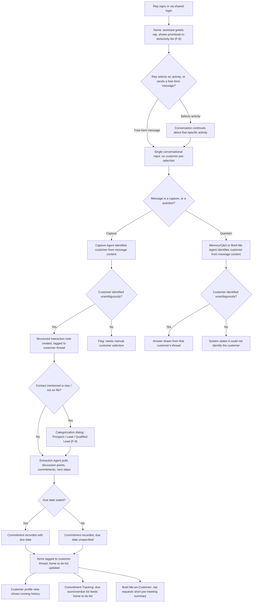

# PRD — Conversational CRM

## 1. Overview

- **Epic/Product name:** Conversational CRM / Relationship Memory Assistant
- **Document reference:** `PRD-conversational-crm-v1.6`
- **Owner:** Product Owner (role, not named individual — not identified in discovery)
- **Approver:** Human gate reviewer, Requirements stage (Gate 2)
- **Status:** Draft — pending validation and human gate
- **Version:** 1.6
- **Source document:** Discovery Brief — `DISCOVERY-BRIEF-conversational-crm-v1.1.md`
- **Revision note:** This is an **exceptional, human-directed reopening of an
  already-locked workflow sign-off** (2026-09-17), not an ordinary revise reply and not
  a validator finding. The human reviewed an exploratory, ungated canvas concept built
  in Workflow 3 (a separate, later workflow in this framework) and decided the product's
  actual shape must change; `workflow.json`'s `audit_trail` "reopened" entry records the
  reasoning, and the concept itself is recorded at
  workflow-3-design-to-development's `roles/ui_ux.json`, `exploratory_concepts[0]` (id
  `EXPLORE-UNIFIED-HOME`) — an exploratory, human-reviewed canvas concept that was
  deliberately never run through Workflow 3's own draft/validate/gate cycle, not an
  approved Workflow 3 design artifact. This revision adds two genuinely new features
  (F-8, F-9) and changes real acceptance-criteria-level behavior in F-1 and F-3 — it is
  not a wording pass. Verified against an actual `diff -u` between v1.5 and this
  document; every section named below as changed or unchanged reflects that diff, not
  recollection.

  **In-place correction to this v1.6 draft (2026-09-17, pre-gate):** This draft has never
  been published and never passed a gate, so per this framework's versioning rule it is
  corrected in place at v1.6 rather than re-versioned. The Validator's independent review
  of this draft raised two findings, both now fixed: **V-P10 (high, traceability)** — at
  the time of that review, this revision's citation of "a human-reviewed exploratory UI
  concept built in Workflow 3" could not be corroborated against Workflow 3's own tracked
  state, because the concept had not yet been recorded there. That gap is now closed: the
  citation above, and every other place in this document that made the same claim (F-1's
  Source, F-3's Source, F-8's Source, F-9's Source, the voice-note out-of-scope bullet in
  Section 4, and the Architecture/Agent Composition NFR row in Section 7), now points to
  the concrete record at `exploratory_concepts[0]` (id `EXPLORE-UNIFIED-HOME`) in
  Workflow 3's `roles/ui_ux.json`, rather than an unverifiable verbal claim. This
  correction changes citation text only — it does not claim the concept was itself
  validated or gated (it explicitly was not). **V-P11 (medium, structural)** — F-1 AC6,
  F-3 AC5, and F-9 AC3 each restated a single positive constraint instead of stating a
  success/primary behavior and a distinct failure/alternate branch, breaking this
  document's own established acceptance-criterion convention. All three ACs have been
  rewritten below to state both branches. No other acceptance criterion, feature, or
  section was touched by this correction pass — it is not a new content revision and does
  not require a fresh version number.

  **1 — Unified home / conversational entry surface (new, F-8).** The reviewed UI
  concept showed one home screen — not a screen per feature — where the assistant
  greets the rep and shows a prioritized to-do/activity list, and selecting an item
  continues the conversation about it. F-8 states this behavior; it reuses F-4's
  due-soon/overdue computation as its list content rather than duplicating that logic.

  **2 — No customer pre-selection, ever (F-1 AC6, F-3 AC5, new).** F-1 and F-3 are not
  replaced — the underlying capture and Q&A capabilities are unchanged — but this PRD's
  User Journey (Section 5) previously described the rep selecting a customer account as
  a precondition step before capturing or asking anything. That precondition is removed:
  F-1 AC6 and F-3 AC5 now state explicitly that the system identifies the relevant
  customer from the message's own content, every time, with no pre-selection step. F-1's
  existing AC1 (and F-3's existing AC4) already performed this content-based matching;
  these new ACs state the absence of a precondition explicitly, since the old Journey
  contradicted it. No existing AC in F-1 (AC1–AC5) or F-3 (AC1–AC4) was reworded.

  **3 — Contact/Lead Categorization (new, F-9).** When a rep names a contact not
  already on file, the assistant must ask enough follow-up questions to categorize the
  contact as Prospect, Lead, or Qualified Lead, and must add a follow-up to-do item. This
  is new business scope with no precedent in any prior version of this PRD — stated
  plainly, not as a rewording. The three category definitions are proposed by this
  agent and tagged `[INFERRED — needs confirmation]` throughout (Description, Assumption
  15, Open Question 17), the same honesty convention this PRD already uses for the
  business-card OCR mechanism (Assumption 5) and the attendee-extraction mechanism
  (Assumption 14) — none of the three is presented as a human-confirmed fact.

  **4 — Voice-note capture named as an in-scope modality (F-1 AC7, new).** Not invented
  fresh: the canonical `project.idea_input` text already states "treat voice-note
  capture as optional — a typed one-liner is an acceptable substitute for 'quick
  capture' if speech-to-text eats into build time," which v1.0–v1.5's Out-of-scope
  section had recorded as flatly deferred. This revision corrects that: the capability
  is now named in scope for design purposes (F-1 AC7), while whether it is actually
  built for this demo remains open (Open Question 16) — exactly the same class of open
  build-decision this PRD already carries for business-card OCR (Assumption 5, Open
  Question 5).

  **5 — Multiple backend agents behind one interface (architecture/NFR-level note
  only).** Section 7 gains one new NFR row, "Architecture / Agent Composition," noting
  that Categorization (F-9) needs the same kind of specialized handling as the
  Discovery Brief's existing illustrative agent list (Capture, Extraction, Memory/Q&A,
  Commitment Tracking, Brief-Me-on-Customer). This is a note about the shape of the
  solution, not a specification — the actual multi-agent architecture remains
  Workflow 2's job, consistent with how this PRD has always deferred architecture
  decisions it is not positioned to make.

  Sections touched, confirmed by the diff: **1** (Document reference, Version, this
  revision note, entirely rewritten); **3** (one new paragraph clarifying Prospect/
  Lead/Qualified Lead are external contacts, not a new persona); **4** (F-1 and F-3's
  in-scope description cells extended; two new in-scope rows, F-8 and F-9; the
  voice-note out-of-scope bullet revised from "deferred" to "build decision open"; one
  new out-of-scope bullet, re-categorization); **5** (Narrative, Step list, Mermaid
  flowchart, and Alternate flows all rewritten to remove the account-pre-selection step
  and add categorization/voice-note/F-8; one new alternate flow, "categorization
  abandoned"); **6** (F-1's Source and Description extended, two new ACs — AC6, AC7 —
  appended after unchanged AC1–AC5; F-3's Source and Description extended, one new AC —
  AC5 — appended after unchanged AC1–AC4; F-4's Description gains one cross-reference
  sentence to F-8, its ACs unchanged; two wholly new features, F-8 and F-9, inserted
  after F-7); **7** (Security/Privacy row extended to cover voice-note audio/
  transcripts; one wholly new NFR row, Architecture / Agent Composition; the Access
  Control, Integration and Concurrency rows are untouched); **8** (the first metric's
  target and how-measured text extended from F-1–F-7 to F-1–F-9, and to name the
  home/categorization steps); **9** (two new dependency rows: categorization/lead-
  scoring logic, and conditional speech-to-text for voice-note); **10** (Assumption 3's
  feature range extended to F-1–F-9; three new assumption rows, 15–17; Assumptions
  1–2 and 4–14 untouched); **11** (four new open questions, 16–19; Open Questions 1–15
  untouched); **12** (supersession chain: the v1.4 line's wording changed from
  "superseded by this document" to "superseded," and a new v1.5-superseded line added);
  **13** (the preamble's feature range extended to F-1–F-9; 13.1's Accounts/contacts
  bullet gains a new optional contact-category field; the Interactions bullet's source-
  type list gains voice-note; the Commitments bullet gains one sentence noting an F-9
  follow-up is an ordinary row; the discussion-points-have-no-entity paragraph gains a
  parenthetical naming contact category as another thing that does get a structured
  row; the deal-stage paragraph gains one sentence distinguishing F-9's category field
  from the still-open deal-stage question; 13.3 gains one new cross-reference bullet
  summarizing all of the above).

  Confirmed **unchanged** by the diff having zero hunks in their line ranges: Section
  **2** in full; within Section 6, **F-2, F-5, F-6, F-7** in full, and F-1's existing
  AC1–AC5 and F-3's existing AC1–AC4 (neither reworded — only new ACs appended); within
  Section 7, the **Access Control, Integration and Concurrency** rows; within Section
  10, **Assumptions 1, 2, 4–14**; within Section 11, **Open Questions 1–15**; within
  Section 13, **13.2** in full; **Section 14** in full. No existing feature's priority
  changed, and no existing acceptance criterion's wording changed anywhere in this
  cycle — every AC touched this cycle (F-1 AC6/AC7, F-3 AC5) is a new addition, not an
  edit to a prior AC.

## 2. Purpose and Problem

Sales reps do not log interactions in a traditional CRM today because doing so means
stopping to fill in forms — a disconnected step reps skip or delay, so data quality
suffers and adoption stays low. Commitments made in conversation live only in memory or
inboxes, with no system tracking follow-through, and reconstructing "where things
stand" with a customer means manually piecing together notes and emails.

This system must let a sales rep capture an interaction outcome as effortlessly as sending a
text, must track commitments automatically and surface them before they are due, and
must make relationship history instantly queryable instead of requiring manual
reconstruction from notes and emails — so relationship knowledge lives in a shared
system rather than in individual reps' heads.

`[INFERRED — needs confirmation]` This framing is based on general knowledge of how CRM
adoption typically fails, not on validated research into what this specific group of
reps uses today — the Discovery interview could not identify a concrete status-quo tool
or workflow (see Section 11, Open Question 1).

## 3. Users

| Persona | Role / Context | What they need |
|---|---|---|
| Sales Rep | Single persona — primary and only audience, using the system on a laptop/desktop after an interaction, against seeded demo data via a single shared login | Effortless capture of what happened in an interaction; automatic tracking of commitments and due dates; instant natural-language answers about a customer's history; a quick pre-meeting brief; a way to see a customer's running history at a glance |

The Discovery interview identified exactly one user type and confirmed, on follow-up,
that no second persona with different needs exists ("same role sharing the same
capabilities"). No second persona is added here — see Section 9's disposition below on
why a second **team member** using the same shared login is not the same thing as a
second persona.

`[Added v1.6]` The Prospect / Lead / Qualified Lead categories introduced by F-9 below
describe **external contacts** the rep talks about — not a new type of system user — so
they do not add a persona here; Section 3 remains a one-row table by design.

## 4. Scope

### In scope

| Feature ID | Name | Priority | Description |
|---|---|---|---|
| F-1 | Conversational Interaction Capture | Must | Rep captures an interaction outcome as a typed one-line summary, a business-card photo, or `[Added v1.6]` a voice-note, through the single home conversational input (F-8) with no customer pre-selection needed; Capture Agent extracts contact details into a structured, thread-tagged interaction note |
| F-2 | Automatic Extraction & Thread Tagging | Must | Extraction Agent pulls discussion points, commitments, follow-ups and next steps (with due dates where stated) from a captured note and tags them to the correct customer thread |
| F-3 | Natural-Language Memory & Q&A | Must | Rep asks a natural-language question about a customer thread, through the same single conversational input with no customer pre-selection needed, and gets an answer drawn from captured history |
| F-4 | Proactive Commitment Tracking | Must | System surfaces a due-soon/overdue list of open commitments across all accounts, with no calendar or notification integration |
| F-5 | Brief-Me-on-Customer Summary | Should | Rep requests a short pre-meeting summary of a customer's recent history, open items, stakeholders and where the opportunity/deal stands |
| F-6 | Customer Profile / Conversational History View | Must | Per-customer view listing captured notes and extracted items in chronological order |
| F-7 | Shared Customer Thread Access | Must | Every user of the single shared login sees and can add to the same customer thread as any other user of that login |
| F-8 | `[Added v1.6]` Unified Home / Conversational Entry Surface | Must | Single home page that greets the rep, shows a prioritized to-do/activity list (reusing F-4's due-soon/overdue computation), and lets the rep continue a conversation about a selected activity or start a free-form capture/query in the same conversational input |
| F-9 | `[Added v1.6]` Contact/Lead Categorization | Must | When a rep's captured entry or conversation names a contact not already on file, the assistant asks follow-up questions to categorize the contact as Prospect, Lead, or Qualified Lead, and creates a follow-up to-do item |

### Out of scope

- **Real external system integrations** — adapters simulate external connections instead of connecting to real systems (Discovery Brief Section 4).
- **Multi-team support** (Discovery Brief Section 4).
- **Multi-tenant support** (Discovery Brief Section 4).
- **Individual per-rep authentication / commitment-note attribution** — a single shared login is used instead; commitments and notes are not attributed to a specific individual in this version (Discovery Brief Sections 2, 5, 7).
- **Voice-note capture as a still-open build decision** `[Revised v1.6]` — v1.0–v1.5 listed voice-note capture here as flatly deferred. This revision corrects that: the original idea statement (`project.idea_input`) itself frames voice-note capture as droppable only "if speech-to-text eats into build time," with a typed one-liner as "an acceptable substitute" — never as out of scope outright. Following review of the exploratory, ungated Workflow 3 canvas concept that triggered this reopening (2026-09-17; see workflow-3-design-to-development's `roles/ui_ux.json`, `exploratory_concepts[0]`, id `EXPLORE-UNIFIED-HOME`), which named voice-note as an active capture modality alongside typed text and business-card photo, this revision moves the **capability** in scope for design purposes as F-1 AC7. What remains open — and is the only thing still deferred — is whether voice-note capture is actually **built** for this demo, exactly the same class of open build-question as business-card OCR (F-1 AC2, Open Question 5). See Open Question 16.
- **Enterprise-grade access control and governance** — the original idea statement itself frames this as a stretch goal, consistent with (not contradicting) the confirmed single-shared-login simplification (Sections 2, 5, 7). Not required for this version's stated success metric. **Disposition: explicitly deferred.**
- **Re-categorizing an already-known contact** `[Added v1.6]` — F-9's categorization dialog triggers only the first time a contact is named who is not already on file. Changing an existing contact's category later (e.g., Prospect → Qualified Lead as the relationship progresses) is out of scope for this revision and unaddressed. See Open Question 19.

## 5. User Journey

### Narrative

A sales rep signs in via the system's single shared login and lands on a single home
surface, `[Added v1.6]` where the assistant greets the rep conversationally and shows a
prioritized to-do/activity list of commitments due soon or overdue (reusing Commitment
Tracking, F-4). The rep either selects an item from that list to continue the
conversation about it, or types a free-form message into the same conversational input
to capture what happened in an interaction or ask a question — `[Added v1.6]` the
system identifies the relevant customer from the message content itself, every time,
without the rep pre-selecting an account. `[Added v1.6]` If the message names a contact
not already on file, the assistant asks enough follow-up questions to categorize that
contact (Prospect, Lead, or Qualified Lead) before completing the capture. From there,
the system extracts structured detail and commitments automatically and tags them to
the right customer; the rep — or a second team member using the same shared login — can
ask further natural-language questions about that customer, see a running profile of
the relationship, get a proactive list of commitments coming due or overdue across every
account, and request a short brief before the next meeting.

### Step list

1. Rep signs in via the single shared login and lands on the home surface. `[Added
   v1.6]` The assistant greets the rep conversationally and shows the prioritized
   to-do/activity list (top N, with a way to see more), reusing Commitment Tracking's
   due-soon/overdue computation (F-4/F-8).
2. `[Added v1.6]` The rep either selects an item from the to-do/activity list to
   continue the conversation about that specific commitment/activity, or types a
   free-form message into the single conversational input — the same input handles both
   capturing an interaction outcome and asking a question, with no separate screen and
   no mode switch.
3. `[Added v1.6]` The system identifies the relevant customer thread from the message
   content itself, every time — the rep is never required to select or confirm a
   customer before capturing or asking (F-1 AC6, F-3 AC5). `[INFERRED — needs
   confirmation]` The rep may alternatively capture by scanning a business card, or
   `[Added v1.6]` by a voice-note recording.
4. Capture Agent extracts contact details into a structured interaction note. `[Added
   v1.6]` If the message names a contact not already on file for the identified
   customer, the assistant asks enough follow-up questions to categorize the contact as
   Prospect, Lead, or Qualified Lead (F-9) before completing the capture.
5. Extraction Agent processes the note, extracting discussion points, commitments and
   next steps (with a due date where one was stated), and tags them to the same thread.
   `[Added v1.6]` A newly categorized contact's follow-up is added to the to-do/activity
   list (F-9 AC4).
6. `[Added v1.6]` For a question, the Memory/Q&A Agent — or the Brief-Me-on-Customer
   Agent for a full pre-meeting brief — answers from that customer's thread, identifying
   the customer the same implicit way.
7. The rep opens the customer profile view to see the running conversational history at
   a glance.
8. Independently of any single customer conversation, the Commitment Tracking Agent
   keeps the home to-do/activity list current with due-soon/overdue commitments across
   all accounts.

### Flowchart

### Alternate flows

- **Validation failure — unmatched customer:** captured text does not unambiguously
  match a seeded customer account → system flags the note "unmatched — needs customer
  selection" and asks the rep to pick the correct account (F-1 AC1, AC4).
- **Empty state — no history yet:** a query or profile view is opened for a customer
  with no captured notes → system states that no history exists yet, rather than
  returning nothing with no explanation (F-3 AC1, F-6 AC1).
- **Empty state — no commitments due:** the due-soon/overdue list (surfaced directly, or
  via the home to-do/activity list, F-8 AC1) is opened when no commitment qualifies →
  system states there are none, rather than showing an empty list with no explanation
  (F-4 AC3, F-8 AC1).
- **`[Added v1.6]` Categorization abandoned:** the rep does not answer the F-9
  follow-up questions for a newly named contact → system leaves the contact recorded as
  uncategorized and still completes the capture with the information already given,
  rather than blocking the interaction entirely (F-9 AC2).

## 6. Features

### F-1 — Conversational Interaction Capture

**Priority:** Must
**Source:** Discovery Brief Section 1 (Problem Statement: "capture becomes as
effortless as sending a text") + Section 3 Goal 1 ("Make capture effortless enough that
it happens every time") + Section 9 item "Capture Agent." Typed one-line capture ties
directly to a confirmed goal. `[INFERRED — needs confirmation]` Business-card scanning
as an alternative input is adopted as in-scope because it serves the same confirmed
capture-effortless goal, but its specific mechanism (scanning/OCR, optical character
recognition, approach) was never discussed in the interview. `[Added v1.5]` AC5
(attendee-name extraction from typed text) was added via a human-agent design
discussion — not the interview and not a validator finding — analyzing the canonical
capture example ("met Priya and Arjun from Acme...") against F-3 AC3's existing promise
to answer "who attended from their side?" from captured attendee names; see F-3 AC3's
own wording, unchanged by this revision. `[Added v1.6]` AC6 and AC7 were added following
a human-directed reopening of this workflow's sign-off (2026-09-17), triggered by the
human's review of an exploratory, ungated canvas concept built in Workflow 3 (a
separate, later workflow in this framework; see workflow-3-design-to-development's
`roles/ui_ux.json`, `exploratory_concepts[0]`, id `EXPLORE-UNIFIED-HOME`) — not the
Discovery interview and not a validator finding. That concept demonstrated a single
home conversational input handling capture with no customer pre-selection, and named
voice-note as an active capture modality alongside typed text and business-card photo.
Voice-note is not invented fresh here: the canonical
`project.idea_input` text already named it as an optional, droppable capture modality
(quoted in AC7); this revision only makes its capability explicit as a named,
in-scope-for-design modality — the same class of open build-decision as business-card
OCR (AC2).

**Description:** The system must let the rep capture an interaction outcome as a single
typed free-text entry describing what happened, and the Capture Agent must extract
structured contact detail from that entry into an interaction note tied to the correct
customer thread. `[Added v1.5]` The Capture Agent must also extract every attendee name
mentioned in that typed entry as a separate structured item — an interaction may name no
attendees, one, or several (e.g., "met Priya and Arjun from Acme..." names two) — since
F-3 AC3 already promises answering "who attended from their side?" from captured
attendee names, and that promise had nothing to draw on when capture happened by typed
text rather than by the optional business-card scan. `[INFERRED — needs confirmation]`
The system must also accept a scanned business-card image as an alternative capture
input. `[Added v1.6]` Every capture entry — typed, business-card, or voice-note (AC7) —
is submitted through the single home conversational input (F-8); the rep is never
required to select, open, or confirm a customer account before capturing (AC6), and the
system identifies the relevant customer from the entry's own content, every time.
`[Added v1.6]` `[INFERRED — needs confirmation]` The system must also accept a
voice-note recording as a third capture input alongside typed text and business-card
scanning (AC7); per the original idea statement, its build-worthiness for this demo
remains open (see Assumption 16, Open Question 16).

**Acceptance criteria:**
1. System must create a structured interaction note and associate it with the correct
   customer thread when the entry text unambiguously matches exactly one customer
   account already present in the seeded data, and must flag the note as "unmatched —
   needs customer selection" — rather than attaching it to a default or incorrect
   account — when no seeded customer account can be unambiguously identified from the
   entry.
2. `[INFERRED — needs confirmation]` System must extract the contact's name, company and
   role from a scanned business-card image into the structured interaction note when the
   image is legible and contains recognizable contact fields, and must inform the rep
   that manual entry is required — without fabricating contact details — when the image
   cannot be read or no contact fields are recognized.
3. System must save the entry as a new interaction note when it contains at least one
   non-whitespace character, and must reject the submission with an explicit "cannot
   save an empty note" message — without creating any note record — when the rep
   submits an empty or whitespace-only entry.
4. System must attach a previously flagged "unmatched" note to the customer thread the
   rep selects when the rep manually resolves the flag, and must leave the note in the
   unmatched/needs-selection state — rather than guessing an account — when the rep has
   not yet resolved it.
5. `[Added v1.5]` `[Confirmed — capability, per design discussion analyzing F-3 AC3's
   existing dependency]` System must extract every distinct
   attendee name mentioned in a typed free-text interaction entry as a separate
   structured attendee item — recording one item per distinct person named (e.g., "met
   Priya and Arjun from Acme..." must yield two attendee items, not one merged string)
   — when the entry text names at least one identifiable person, and must record zero
   attendee items for that interaction — rather than fabricating a name — when the
   entry text names no one. `[INFERRED — needs confirmation]` The specific
   name-recognition/disambiguation mechanism (how
   the system determines that "Priya and Arjun" names two people rather than one
   compound string, and how confidently a token must be recognized as a person's name
   before it is recorded) was never discussed in the interview and remains `[INFERRED
   — needs confirmation]`, carried to Assumption 14 and Open Question 15; only the
   underlying **capability** — that attendee names must be extracted from typed text,
   not solely from the optional business-card path (AC2) — is confirmed by this
   revision, since F-3 AC3 already depends on it existing.
6. `[Added v1.6]` System must accept and process a capture entry submitted through the
   single conversational input (F-8) with no prior customer-selection step — identifying
   the customer from the entry's own content alone, per AC1 — when the entry's content
   unambiguously identifies exactly one customer, and must ask the rep, conversationally,
   to name the customer — rather than blocking the submission or guessing an account —
   when the entry's content does not unambiguously identify one. This failure branch is
   the same behavior AC1 and AC4 already define for an entry that cannot be matched
   (flagged "unmatched — needs customer selection" per AC1, until the rep resolves it per
   AC4), restated here as the always-implicit entry model's own failure path, not a
   second, separate mechanism. This generalizes AC1's matching behavior into an explicit
   statement that no precondition customer-selection step exists, replacing the
   account-selection step this PRD's User Journey previously described (Section 5).
7. `[Added v1.6]` `[INFERRED — needs confirmation]` System must accept a voice-note
   recording as an alternative capture input alongside typed text (AC1) and a scanned
   business-card image (AC2), transcribing its spoken content and processing it through
   the same structured-note pipeline (customer matching per AC1, attendee extraction per
   AC5) when the recording is audible and its content can be transcribed, and must
   inform the rep that manual entry is required — without fabricating content from an
   unclear recording — when it cannot be transcribed. Named as an in-scope capture
   modality for design purposes per the original idea statement's own framing
   (`project.idea_input`: "treat voice-note capture as optional — a typed one-liner is
   an acceptable substitute for 'quick capture' if speech-to-text eats into build
   time"); whether it is actually built for this demo remains open (Open Question 16),
   mirroring how business-card OCR's own build-worthiness is already open (AC2, Open
   Question 5).

### F-2 — Automatic Extraction & Thread Tagging

**Priority:** Must
**Source:** Section 3 Goal 2 ("Track commitments automatically and surface them before
they are due") + Goal 3 ("Make relationship history instantly queryable") + Section 9
item "Extraction Agent." Direct tie to confirmed goals; no inference needed on the core
capability.

**Description:** Given a captured interaction note, the Extraction Agent must identify
discussion points, commitments, follow-ups and next steps, must capture a due date for
a commitment when one is mentioned in the text, and must tag every extracted item to the
correct customer thread the note belongs to.

**Acceptance criteria:**
1. System must extract each distinct commitment, follow-up or next step mentioned in a
   captured note's text as a separate tracked item when the note contains one or more of
   them, and must record no commitment items when the note describes discussion only
   with no forward-looking commitment.
2. System must record a due date on an extracted commitment when the captured text
   states or clearly implies one (e.g., "by Friday"), and must mark the commitment's due
   date as unspecified — rather than guessing a date — when the text gives no date
   information.
3. System must tag every extracted discussion point and commitment to the same customer
   thread as its source interaction note, and must flag an extracted item for manual thread
   assignment when the source note itself is unmatched to a customer thread (per F-1 AC4),
   rather than tagging it to an incorrect thread.
4. System must record a best-effort due date only when the captured text names a
   concrete date or an unambiguous relative date term resolvable against the interaction's
   timestamp (e.g., "by Friday"), and must leave the due date unspecified — rather than
   guessing an exact date — when the text uses a vague temporal reference (e.g., "soon,"
   "sometime") that cannot be resolved to a specific date.

### F-3 — Natural-Language Memory & Q&A

**Priority:** Must
**Source:** Section 1 / Section 3 Goal 3 ("relationship history instantly queryable")
+ Section 9 item "Memory/Q&A Agent" and its three example queries. `[INFERRED — needs
confirmation]` The three example queries are adopted as illustrative of the required
capability, not confirmed as the exhaustive supported query set. `[Added v1.6]` AC5 was
added for the same reason as F-1 AC6 — the human-directed reopening following review of
the exploratory, ungated Workflow 3 canvas concept (see workflow-3-design-to-development's
`roles/ui_ux.json`, `exploratory_concepts[0]`, id `EXPLORE-UNIFIED-HOME`), which
demonstrated a single conversational input handling both capture and query with no
customer pre-selection step. This generalizes
AC4's existing per-query customer resolution into an explicit no-precondition statement;
AC4 itself is unchanged.

**Description:** The system must let a rep ask a natural-language question about a
specific customer thread and must return an answer drawn from that thread's captured
notes, extracted discussion points and commitments, covering at minimum the three
example query types named in the original idea statement: "what did we discuss last
time?", "what did I commit to?", "who attended from their side?" `[Added v1.6]` Every
question is submitted through the single home conversational input (F-8); the rep is
never required to select, open, or confirm a customer account before asking, and the
system identifies the relevant customer from the question's own content, every time.

**Acceptance criteria:**
1. System must answer a natural-language question about a customer's most recent
   discussion by returning content drawn from that customer's most recent interaction
   note(s) when the thread has at least one captured note, and must respond that no
   history exists yet for that customer when the thread is empty.
2. System must answer a natural-language question about the rep's own open commitments
   for a customer by listing the commitments extracted and tagged to that thread when
   any exist, and must state that there are no open commitments for that customer when
   none exist.
3. System must answer a natural-language question about interaction attendees by returning
   the contact names extracted from that thread's interaction notes when attendee names
   were captured, and must state that no attendee information was captured when none was
   extracted.
4. System must resolve and answer against the correct customer thread when a query
   names exactly one customer that matches a seeded account, and must respond that it
   could not identify the customer — rather than guessing or returning another
   customer's data — when the query names no customer or an unrecognized one.
5. `[Added v1.6]` System must accept and answer a natural-language question submitted
   through the single conversational input (F-8) with no prior customer-selection step —
   resolving the target customer from the query's own text alone, per AC4 — when the
   query's content unambiguously identifies exactly one seeded customer, and must
   respond that it could not identify the customer — rather than guessing or returning
   another customer's data — when the query's content does not unambiguously identify
   one. This failure branch is the same behavior AC4 already defines for a query naming
   no customer or an unrecognized one, restated here as the always-implicit entry
   model's own failure path, not a second, separate mechanism. This generalizes AC4 to
   state explicitly that no precondition customer-context step exists, consistent with
   F-1 AC6's parallel statement for capture, and replaces the account-selection step
   this PRD's User Journey previously described (Section 5).

### F-4 — Proactive Commitment Tracking

**Priority:** Must
**Source:** Section 3 Goal 2 ("Track commitments automatically and surface them before
they are due") + Section 9 items "Commitment Tracking Agent" and "due-soon/overdue
commitment list." Direct, strong tie to a confirmed goal — no inference needed on the
core capability.

**Description:** The system must surface a list of open commitments that are due soon
or already overdue, across all customer accounts, computed from the due dates captured
by the Extraction Agent, without any calendar or notification integration. `[Added
v1.6]` This is the same list content the unified home surface (F-8) displays as its
prioritized to-do/activity list — F-8 reuses this feature's computation as its list
content and does not duplicate this logic; F-4's own acceptance criteria below are
unchanged by that reuse.

**Acceptance criteria:**
1. System must list every open commitment whose due date has passed as "overdue" when
   the current date is past that due date, and must exclude a commitment from this list
   once it is marked complete.
2. `[INFERRED — needs confirmation]` System must list every open commitment whose due
   date falls within a defined look-ahead window as "due soon" when that window is
   confirmed (the exact window, e.g. "the next 7 days," was not stated in discovery and
   is carried to Open Questions, Section 11), and must reclassify it as "overdue"
   instead (per AC1) — rather than continuing to show it as due-soon — once its due
   date has passed.
3. System must list every qualifying commitment individually when at least one exists,
   and must state explicitly that there are no due-soon or overdue commitments — rather
   than showing an empty list with no explanation — when none exist.
4. System must include a commitment with a stated due date in the due-soon/overdue list
   per AC1/AC2, and must list a commitment with an unspecified due date (per F-2 AC2/AC4)
   separately from that list — rather than omitting it entirely or treating it as
   overdue — when no due date was captured.

### F-5 — Brief-Me-on-Customer Summary

**Priority:** Should
**Source:** Section 9 item "Brief-Me-on-Customer Agent." `[INFERRED — needs
confirmation]` This capability was not independently confirmed in the interview;
adopted as in-scope as a composition of the confirmed "instantly queryable" goal
(Section 1/3) and the Commitment Tracking capability (F-4), since a pre-meeting brief is
a synthesis of exactly the history and open-items data those two confirmed capabilities
already produce. `[Confirmed — canonical idea document, Idea 5 — added v1.3]` Idea 5's
own pitch text states the Brief-Me synthesis draws on "history, open commitments, key
stakeholders, and where the opportunity stands" — a fourth component this PRD's v1.0
through v1.2 omitted, because `project.idea_input` had been recorded, since this run
started, as an incomplete paraphrase that dropped it; the omission is corrected in this
revision. This directly confirms the **capability** that Brief-Me must also state
opportunity/deal status — it is no longer merely inferred from composition — but the
specific **mechanism** for representing that status (see AC4 below, and Section 13.1)
was never discussed in the interview and remains `[INFERRED — needs confirmation]`.

**Description:** Given a single request naming a customer (e.g., "brief me on Acme"),
the system must generate a short summary combining that customer's recent history, open
commitments, known stakeholders, and where the opportunity/deal stands. `[INFERRED —
needs confirmation]` The opportunity/deal-status component is synthesized narratively
from the customer's existing interaction-note and commitment content (Section 13.1/13.2)
rather than read from a distinct structured deal-stage field, per the design decision
and reasoning recorded in Section 13.1 — no feature in this PRD gives a rep or agent a
way to capture or set a discrete deal stage. The summary must remain a short generated
summary rather than a long or formatted report, per the original idea statement's own
framing.

**Acceptance criteria:**
1. System must generate a summary containing recent discussion history, open
   commitments, stakeholder/contact names, and where the opportunity/deal stands for a
   named customer when that customer has at least one captured note, and must state
   that no history exists yet for that customer when the thread is empty, rather than
   generating a summary with fabricated content.
2. `[INFERRED — needs confirmation]` System must return a bounded, short-form summary
   (a few sentences or bullets, not a multi-page document) under normal conditions — no
   explicit length limit was stated in discovery, carried to Open Questions (Section
   11) — and must still return whatever partial content is available when data for one
   of the four summary components (history, commitments, stakeholders, opportunity/deal
   status) is missing, rather than failing the whole request.
3. System must generate the summary for a named customer when the request unambiguously
   identifies exactly one seeded customer account, and must respond that it could not
   identify the requested customer — rather than guessing — when the request names an
   unrecognized or ambiguous customer.
4. `[INFERRED — needs confirmation]` System must synthesize the opportunity/deal-status
   component narratively from that customer's recorded interaction notes and commitments —
   since no discrete deal-stage field exists in the structured store (Section 13.1) —
   when the thread contains content indicating where the deal/opportunity stands, and
   must state that no opportunity/deal-status information has been captured yet for that
   customer — rather than fabricating a stage or outcome — when the thread contains no
   such content.

### F-6 — Customer Profile / Conversational History View

**Priority:** Must
**Source:** Section 9 item "a customer profile view ... showing the running
conversational history," tied directly to confirmed Goal 3 (instantly queryable
history) and Goal 4 (shared system, Section 3). `[INFERRED — needs confirmation]` Exact
layout/fields of the view were not discussed in the interview.

**Description:** The system must provide a per-customer profile view listing that
customer's captured notes and extracted discussion points and commitments in
chronological order, giving the rep a single place to see the running history without
querying the Memory/Q&A Agent.

**Acceptance criteria:**
1. System must display a customer's captured notes and extracted items in chronological
   order on that customer's profile view when at least one note exists, and must display
   an explicit "no history yet" state when none exists.
2. System must display a newly captured note and its extracted items (per F-1, F-2) on
   the correct customer's profile view automatically, without requiring the rep to take
   further action, when the note is tagged to that customer's thread, and must not
   display that note or its items on any other customer's profile view when it is not
   tagged to that customer.

### F-7 — Shared Customer Thread Access

**Priority:** Must
**Source:** Discovery Brief Sections 2, 5 and 7 (single shared login, confirmed via
interview follow-up) reconciled against Section 9 item "a simple shared view so a
second team member ... can see and add to the same customer thread." `[INFERRED — needs
confirmation]` Adopted as already satisfied by the confirmed single-shared-login access
model rather than as a feature requiring a distinct second persona: Section 2
explicitly found no second persona in this discovery pass, so any user of the single
shared login — including a second team member such as an account manager — already sees
and can add to the same customer thread as any other user of that login. No additional
persona or access-control feature is introduced by this item.

**Description:** Every user signed in via the single shared login must see the same
customer threads and must be able to add captures/notes to any customer thread any
other user of that login can access — "shared" here is a property of the single-login
access model already confirmed, not a separate collaboration feature layered on top of
it.

**Acceptance criteria:**
1. System must show the same customer thread content to every session authenticated
   via the shared login when two sessions view the same customer, and must not
   partition data by which physical person is at the keyboard, since no per-rep
   identity exists in this version.
2. `[INFERRED — needs confirmation]` System must persist a note added from one session
   so that it is immediately visible to another concurrent session viewing the same
   customer thread, and must not silently lose one session's addition when another
   session adds to the same thread at nearly the same time — the exact conflict-handling
   mechanism was not discussed in the interview and is carried to Open Questions
   (Section 11).

### F-8 — Unified Home / Conversational Entry Surface `[Added v1.6]`

**Priority:** Must
**Source:** `[Added v1.6]` Derived from an exploratory, ungated canvas concept built in
Workflow 3 (a separate, later workflow in this framework) — recorded at
workflow-3-design-to-development's `roles/ui_ux.json`, `exploratory_concepts[0]` (id
`EXPLORE-UNIFIED-HOME`) — which the human confirmed as the intended product shape when
reopening this workflow's sign-off on 2026-09-17 (see `workflow.json` `audit_trail`, the
"reopened" entry) — not sourced from the Discovery interview transcript. This concept
was human-reviewed and iterated across several rounds, including one driven by a
human-supplied user-journey flowchart image, but was deliberately never run through
Workflow 3's own draft/validate/gate cycle (no locked requirement existed yet to trace
it to) — it is an exploratory design input to this PRD, not an approved Workflow 3
design artifact. Reconciles with confirmed Discovery goals 1 ("make capture
effortless enough that it happens every time") and 3 ("relationship history instantly
queryable") (Discovery Brief Section 3) by giving both a single point of entry, and
reuses Commitment Tracking's existing due-soon/overdue computation (F-4) as its
to-do/activity list content rather than defining new tracking logic.

**Description:** The system must present the rep with a single home surface on login —
not a separate screen per feature — where the assistant greets the rep conversationally
and shows a prioritized to-do/activity list drawn from the open commitments Commitment
Tracking (F-4) already computes. Selecting an item from that list must continue the
conversation about that specific commitment/activity in the same conversational
surface, rather than navigating to a separate screen. The same conversational input
that shows this list also accepts free-form capture and query messages (F-1, F-3) —
this feature states the home surface's own behavior (greeting, list, selection-
continues-conversation); it does not restate F-1/F-3's capture/query behavior, which
those features still own. `[INFERRED — needs confirmation]` The specific screen layout,
visual design, and exact conversational wording are Workflow 3's (UI/UX) concern, not
specified here.

**Acceptance criteria:**
1. System must greet the rep conversationally and display the prioritized
   to-do/activity list, drawn from Commitment Tracking's due-soon/overdue computation
   (F-4 AC1/AC2), when the rep logs in and at least one qualifying commitment exists,
   and must state explicitly that there is nothing due or overdue right now —
   consistent with F-4 AC3 — rather than showing an empty list with no explanation, when
   none exist.
2. `[INFERRED — needs confirmation]` System must display only the top N highest-priority
   items on the to-do/activity list when more than N qualifying items exist (the exact
   value of N was not stated by the reviewed UI concept, carried to Open Question 18),
   and must give the rep an explicit way to see the remaining items ("see more") rather
   than truncating the list with no indication that more items exist.
3. System must continue the conversation about the specific commitment/activity the rep
   selects from the list — surfacing that item's associated customer thread in the same
   conversational input — when the rep selects an item, and must state clearly that the
   underlying item could no longer be located, rather than opening an unrelated thread,
   in the edge case where the item's source data (an F-4-tracked commitment) has since
   been removed.
4. System must display an explicit "nothing to show yet" state on first login, when the
   seeded data yields no commitments and no prior interaction history at all, rather
   than presenting a blank home surface with no explanation.

### F-9 — Contact/Lead Categorization `[Added v1.6]`

**Priority:** Must
**Source:** `[Added v1.6]` New capability, not present in any version of this PRD
before v1.6 and not sourced from the Discovery interview transcript. Derived from the
same exploratory, ungated Workflow 3 canvas concept that prompted this reopening
(2026-09-17) — recorded at workflow-3-design-to-development's `roles/ui_ux.json`,
`exploratory_concepts[0]` (id `EXPLORE-UNIFIED-HOME`) — that concept demonstrated the
assistant asking follow-up questions to categorize a newly mentioned contact as a
Prospect, Lead, or Qualified Lead before, or while, logging them. That concept was
human-reviewed but, like F-8's, was deliberately never run through Workflow 3's own
draft/validate/gate cycle — it is an exploratory design input to this PRD, not an
approved Workflow 3 design artifact. This is genuinely new business scope, stated
plainly per this reopening's own instruction — not a rewording of an existing feature.

**Description:** When a rep's captured entry (F-1) or ongoing conversation names a
contact the system does not already have on file for the identified customer, the
assistant must ask the rep enough follow-up questions to assign that contact one of
three categories — Prospect, Lead, or Qualified Lead — before, or as part of, completing
the capture. `[INFERRED — needs confirmation]` This PRD proposes working definitions for
the three categories below, since none was confirmed in any interview or design
discussion; they must be confirmed by a human before Architecture or Development build
against them (Assumption 15, Open Question 17):

- **Prospect** `[INFERRED — needs confirmation]` — a contact whose details are known but
  who has shown no confirmed interest, need, or engagement with the product/service
  beyond being named in an interaction.
- **Lead** `[INFERRED — needs confirmation]` — a contact who has shown some expressed
  interest or engagement (e.g., asked a question, requested information) but for whom
  need, budget, authority, or timeline has not yet been established.
- **Qualified Lead** `[INFERRED — needs confirmation]` — a contact for whom the rep has
  confirmed genuine buying intent and at least one qualifying factor (a stated need,
  budget, authority to decide, or timeline), ready for active pursuit.

Once categorized, the system must add a follow-up to-do item for that contact —
consistent with the reviewed UI concept's demonstrated behavior — surfaced on the
unified home activity list (F-8) and in due-soon/overdue tracking (F-4), rather than the
categorization being a one-time dialog with no lasting record.

**Acceptance criteria:**
1. System must ask the rep follow-up questions sufficient to assign one of the three
   categories above to a contact when that contact is named in a captured entry or
   conversation and does not already exist on file for the identified customer, and
   must not trigger this categorization dialog for a contact who already exists on
   file, regardless of that contact's existing category — re-categorizing an
   already-known contact is out of scope for this revision (see Section 4, Out of
   scope).
2. System must record the category the rep confirms through the follow-up dialog
   against the new contact, and must leave the contact recorded as uncategorized —
   rather than guessing a category — when the rep does not provide enough information
   to determine one, still completing the capture (F-1) with the information already
   given rather than blocking it.
3. `[INFERRED — needs confirmation]` System must apply the working category definitions
   given above to decide which follow-up questions to ask, assigning the category whose
   definition the rep's answers actually satisfy when the rep's answers clearly satisfy
   exactly one of the three definitions, and must fall back to AC2's uncategorized
   outcome — rather than guessing or defaulting to a specific category — when the rep's
   answers do not clearly satisfy any one definition, until a human confirms the
   definitions directly (Open Question 17); the specific follow-up question wording is
   Workflow 3's (UI/UX) concern, not specified here.
4. System must create a follow-up to-do item for a newly categorized contact, surfaced
   on the home activity list (F-8 AC1) and in due-soon/overdue tracking (F-4), when a
   category is successfully recorded (AC2), and must not create a follow-up item when
   the categorization dialog is abandoned before a category is confirmed (AC2's
   uncategorized case).

## 7. Non-Functional Requirements

| Category | Requirement | Override reason |
|---|---|---|
| Security / Privacy | System must operate only on seeded demo data and must not process real customer PII (personally identifiable information) in this version — this constraint applies equally to the structured store and to the vector store of embeddings (Section 13), `[Added v1.6]` and to any captured voice-note audio/transcript (F-1 AC7): an audio recording of a real person would be exactly as non-compliant as a structured record of them. | Discovery Brief Section 6 — seeded data only removes real customer-PII exposure as a concern for this phase. Extended in v1.1 to state explicitly that it covers both data stores added in Section 13; extended in v1.6 to cover voice-note audio/transcripts. |
| Access Control | System must authenticate all use via a single shared login and must not implement per-individual authentication in this version. | Explicit demo simplification, confirmed via interview follow-up (Discovery Brief Sections 2, 5). |
| Integration | System must simulate every external system touchpoint (sources feeding seed data, e.g. MOM/email/SharePoint-derived content) via adapters — including the CRM, calendar, SharePoint and email adapters detailed in Section 14 — and must not call a real external system in this version. | Discovery Brief Section 4/5 — no real system integrations of any kind. Extended in v1.1 to reference the concrete adapter-only approach in Section 14. |
| Concurrency | `[INFERRED — needs confirmation]` System must handle at least two concurrent shared-login sessions accessing the same customer thread without silently losing data. | Follows from the confirmed shared-login model (F-7) and Section 9's "second team member" item; the specific mechanism was not discussed in discovery. |
| Data Architecture | System must persist core CRM entities (accounts, contacts, interactions, commitments) in a structured, queryable store, and must additionally hold embeddings of extracted unstructured content (MoM, free text, email, SharePoint-derived material) in a vector store, so that F-3 and F-5 can retrieve context semantically rather than by exact keyword/exact-match search alone. | Added in v1.1 per Gate 2's first revise feedback (2026-09-17). The specific store technologies (SQLite, Chroma) and the vector store's chunking strategy (semantic chunking) were confirmed directly by the human at Gate 2's second revise reply (2026-09-17). Elaborated in full in Section 13. |
| `[Added v1.6]` Architecture / Agent Composition | `[INFERRED — needs confirmation]` System must be implemented as multiple cooperating backend agents behind the single conversational interface (F-8) — the Discovery Brief's Section 9 already names an illustrative set (Capture, Extraction, Memory/Q&A, Commitment Tracking, Brief-Me-on-Customer agents); this revision notes that Contact/Lead Categorization (F-9) needs the same kind of specialized handling as those. This is a note about the shape of the solution, not a specification of it. | New note, prompted by the same exploratory, ungated Workflow 3 canvas concept that triggered this reopening (2026-09-17; see workflow-3-design-to-development's `roles/ui_ux.json`, `exploratory_concepts[0]`, id `EXPLORE-UNIFIED-HOME`). Illustrative only — the actual multi-agent architecture is Workflow 2's job, not this PRD's. |

## 8. Success Metrics

| Metric | Target | How measured |
|---|---|---|
| Demo agents functioning end-to-end on seeded data (Discovery Brief Section 3, stated success metric) | Every feature F-1 through F-9's defined acceptance criteria executes successfully against the seeded demo dataset (customer accounts, contacts, and MOM/email/SharePoint-derived interaction history) | Manual walkthrough of the full home/to-do → capture → categorization → extraction → query → commitment-tracking → brief → shared-thread-access flow against seeded accounts, checked against this PRD's acceptance criteria. `[INFERRED — needs confirmation]` The exact list of seed scenarios that constitutes complete "end-to-end" coverage is not yet enumerated — carried forward from Discovery Open Item 2 to Open Questions (Section 11). |
| `[INFERRED — needs confirmation]` Commitment due-date classification accuracy | 100% of commitments with a stated due date in captured notes are correctly classified as due-soon or overdue per F-4 | Manual check of seeded commitments with known due dates against the due-soon/overdue list on a known reference date |

## 9. Dependencies

| Dependency | Impact level | Status |
|---|---|---|
| Seeded demo dataset (customer accounts, contacts, prior interaction history including MOM, email and SharePoint content) | TIGHT | Required before any feature can be exercised — no feature functions without it (Discovery Brief Section 5) |
| Adapters simulating external systems in place of real integrations — specifically a CRM adapter, a calendar adapter, a SharePoint adapter, and (added in v1.1 per Gate 2 feedback) an email adapter, each backed by stub/seeded data behind a defined interface contract | MODERATE | Needed to represent CRM/calendar/SharePoint/email-sourced content without real connections; concrete interface-contract detail elaborated in Section 14, including a proposed contract per adapter in new Section 14.1a — a decision Gate 2's second reply explicitly delegated to requirements-agent (added in v1.2) |
| `[INFERRED — needs confirmation]` Natural-language understanding/extraction capability underlying the Capture, Extraction, Memory/Q&A and Brief-Me-on-Customer agents | TIGHT | Not explicitly named as a dependency in the interview, but functionally required by every Section 9 capability adopted above; status open |
| Structured/historical data store for core CRM entities (accounts, contacts, interactions, commitments) | TIGHT | Added in v1.1 per Gate 2's first revise feedback; F-1, F-2, F-4, F-6 and F-7 all read from or write to this store — elaborated in Section 13.1. Technology confirmed as SQLite at Gate 2's second revise reply (2026-09-17). |
| Vector database holding embeddings of extracted unstructured content (MoM, free text, email, SharePoint docs) | TIGHT | Added in v1.1 per Gate 2's first revise feedback; F-3 and F-5's semantic-retrieval requirement depends on this store existing — elaborated in Section 13.2. Technology confirmed as Chroma, and chunking strategy confirmed as semantic chunking, at Gate 2's second revise reply (2026-09-17). |
| `[Added v1.6]` `[INFERRED — needs confirmation]` Categorization/lead-scoring logic underlying F-9, and the working Prospect/Lead/Qualified-Lead definitions it depends on | TIGHT | Definitions proposed in F-9, not yet human-confirmed (Assumption 15, Open Question 17); functionally required for F-9 to operate at all |
| `[Added v1.6]` `[INFERRED — needs confirmation]` Speech-to-text transcription capability underlying voice-note capture (F-1 AC7), if implemented for this demo | MODERATE | Only required if voice-note capture is actually built (Open Question 16); not required if typed/business-card capture alone is judged sufficient |

## 10. Constraints and Assumptions

### Hard constraints (stated directly in the Discovery Brief)

- Runs entirely against seeded data; not live/real customer data (Section 4/5).
- No real external system integrations; adapters simulate connections instead (Section 4/5).
- Single shared login; no individual per-rep authentication (Section 2/5).
- Single team, single tenant (Section 4).

### Assumptions

| # | Assumption | Validation plan | Owner | Status |
|---|---|---|---|---|
| 1 | `[INFERRED — needs confirmation]` The problem statement is based on general CRM-adoption knowledge, not validated research on this specific rep population. | Confirm with real reps before treating the problem statement as more than a working assumption. | Business analyst / product owner | Open |
| 2 | `[INFERRED — needs confirmation]` Single shared login means commitments/notes are not attributed to an individual rep in this version. | Explicit human decision if a future phase needs per-rep attribution. | Product owner | Open |
| 3 | `[INFERRED — needs confirmation]` "End-to-end on seeded data" requires the seed dataset to exercise every feature in this PRD (F-1–F-9). | Enumerate the specific seed scenarios before development/test planning starts. | Requirements / QA | Open |
| 4 | `[INFERRED — needs confirmation]` A future phase moving to real customer data would require revisiting compliance/PII handling. | Defer to that future phase's own discovery pass. | Product owner | Deferred — not applicable to this version |
| 5 | `[INFERRED — needs confirmation]` Business-card scanning is included as an in-scope, additional capture input alongside typed one-liner capture; exact OCR/parsing approach is unconfirmed. | Confirm with a human whether OCR-based scanning is worth building for the demo or typed-only suffices. | Product owner / architect | Open |
| 6 | `[INFERRED — needs confirmation]` Brief-Me-on-Customer is treated as a composition of the confirmed Memory/Q&A and Commitment Tracking capabilities rather than an independently confirmed capability. | Confirm with a human that this composition satisfies the original idea's intent. | Product owner | Open |
| 7 | `[INFERRED — needs confirmation]` The confirmed single-shared-login model is assumed sufficient to satisfy Section 9's "second team member shared view" item, without introducing a second persona. | Confirm with a human that no distinct account-manager-facing feature is expected beyond shared-login access. | Product owner | Open |
| 8 | `[INFERRED — needs confirmation]` The three example Memory/Q&A queries are illustrative of the required natural-language query capability, not an exhaustive supported list. | Confirm with a human whether additional query types must be explicitly supported. | Product owner | Open |
| 9 | `[RESOLVED — Gate 2 decision, 2026-09-17]` The structured-store and vector-store technologies (Section 13) were unconfirmed as of v1.1. The human decided them directly rather than leaving them to the Architecture stage: structured store = SQLite, vector store = Chroma. | None needed — decided directly by a human at the gate. | Product owner (decided) | Resolved — see Section 13.1/13.2 |
| 10 | `[INFERRED — needs confirmation, partially resolved]` Gate 2's second reply confirmed the vector store's chunking strategy directly: semantic chunking (Section 13.2). The specific embedding model, and the re-embedding trigger strategy for when a source note or document changes, remain unconfirmed and are still left to the Architecture stage. | Architecture stage documents the embedding model choice and the re-embedding trigger mechanism. | Architect | Partially resolved — chunking strategy confirmed; embedding model and re-embedding trigger still open |
| 11 | `[DELEGATED DECISION — human authorized requirements-agent to choose at Gate 2]` The full interface contract per adapter (CRM, calendar, SharePoint, email), beyond the two illustrative method names given at the first Gate 2 reply, was delegated by the human to requirements-agent's own judgment ("you can choose the best method as needed") rather than confirmed directly. A proposed contract is recorded in Section 14.1a. This is an authorized design choice, not a human-confirmed exhaustive contract — Architecture/Development may still refine it. | Architecture stage reviews and finalizes (or explicitly ratifies) the proposed contract before Development builds against it. | Architect | Delegated decision recorded — see Section 14.1a; not yet ratified by Architecture |
| 12 | `[DELEGATED DECISION — human authorized requirements-agent to choose at Gate 2]` The email adapter's required operations were likewise delegated to requirements-agent's judgment. Section 14.1a proposes read-only message retrieval only, with no simulated send capability, since no feature in this PRD requires composing or sending email. | Architecture stage confirms retrieval-only is sufficient before Development builds it. | Architect | Delegated decision recorded — see Section 14.1a |
| 13 | `[INFERRED — needs confirmation]` The Brief-Me-on-Customer opportunity/deal-status component (F-5, added in v1.3 per the corrected canonical idea document) is synthesized narratively from existing Interactions/Commitments content (Section 13.1) rather than read from a new structured deal-stage field, since no feature in this PRD provides a mechanism to capture or set a discrete deal stage. | Confirm with a human whether a structured, selectable deal-stage field (analogous to a traditional CRM pipeline stage) is actually required, or whether narrative synthesis is sufficient. | Product owner / architect | Open |
| 14 | `[Added v1.5]` `[INFERRED — needs confirmation]` The mechanism for recognizing and disambiguating distinct attendee names within a typed free-text interaction entry (e.g., determining that "Priya and Arjun" names two people rather than one compound string, and how confidently a token must be recognized as a person's name before it is recorded) was never discussed in the interview. Only the underlying capability — that attendee names must be extracted from typed text, not solely from the optional business-card path (F-1 AC2) — is confirmed by this revision (F-1 AC5); the mechanism itself remains open. | Architecture stage selects and documents the specific name-extraction/disambiguation approach (e.g., named-entity recognition, an LLM-based extraction step, a simpler heuristic) before Development builds against it. | Architect | Open |
| 15 | `[Added v1.6]` `[INFERRED — needs confirmation]` The working definitions for Prospect, Lead, and Qualified Lead (F-9) are proposed by requirements-agent, not confirmed by a human or by any interview/design discussion. | Confirm the definitions with a product owner or sales-process stakeholder before Architecture or Development build against them. | Product owner | Open |
| 16 | `[Added v1.6]` `[INFERRED — needs confirmation]` Voice-note capture (F-1 AC7) is named as an in-scope capture modality for design purposes; whether it is actually built for this demo, given build-time constraints, remains open — mirroring Assumption 5's treatment of business-card OCR. | Confirm with a human whether speech-to-text-based voice-note capture is worth building for the demo or typed/business-card capture alone suffices. | Product owner / architect | Open |
| 17 | `[Added v1.6]` `[INFERRED — needs confirmation]` The home activity list's "top N" bound and its "see more" mechanism (F-8 AC2) are not yet a specific number or defined interaction — the reviewed UI concept demonstrated the behavior but did not state a value. | Confirm the exact value of N, and how "see more" behaves, with a human before Architecture/Development build against it. | Product owner / designer | Open |

## 11. Open Questions

1. Current-state pain points and the tools reps actually use today were not identified
   in discovery ("not sure what people use these days") — validate this with real reps
   before treating the problem statement as more than a working assumption. *(Carried
   from Discovery Brief Open Item 1.)*
2. The exact set of seed scenarios — and any numeric thresholds (e.g., response-time
   targets) — that constitute "agents functioning end-to-end" are not yet defined; this
   needs enumeration before development/test planning. *(Carried from Discovery Brief
   Open Item 2, refined for Requirements.)*
3. Whether commitments/notes will ever need per-rep attribution beyond this demo (given
   the shared-login decision) is unresolved — worth a deliberate call before any future
   phase, rather than defaulting into it. *(Carried from Discovery Brief Open Item 3.)*
4. The compliance/data-handling path for a future phase using real customer data
   (rather than seeded data) has not been discussed and is unresolved. *(Carried from
   Discovery Brief Open Item 4.)*
5. Is business-card OCR scanning worth implementing for this demo, or is typed-only
   capture acceptable? (Relates to F-1 AC2.)
6. Is the "due soon" look-ahead window for commitment tracking a specific number of
   days, and if so, what is it? (Relates to F-4 AC2.)
7. Is there a maximum length or format expected for the Brief-Me-on-Customer summary
   beyond "short"? (Relates to F-5 AC2.)
8. Are the three example Memory/Q&A queries exhaustive, or must additional query types
   be explicitly supported? (Relates to F-3.)
9. Should concurrent-session editing conflicts on a shared customer thread (F-7 AC2) be
   handled a specific way, or is last-write-wins acceptable for this demo?
10. **RESOLVED — Gate 2 decision (2026-09-17):** Structured store = SQLite; vector
    store = Chroma, decided directly by the human reviewer rather than left to the
    Architecture stage. Hosting/cost constraints were not raised as part of this
    decision and are not a currently known open item. (Relates to Section 13; see
    Assumption 9.)
11. **PARTIALLY RESOLVED — Gate 2 decision (2026-09-17):** the chunking strategy is
    confirmed as semantic chunking (Section 13.2). Still open: which specific embedding
    model to use, and how re-embedding should be triggered when a source note or
    document changes. (Relates to Section 13.2; see Assumption 10.)
12. **RESOLVED BY DELEGATION — Gate 2 (2026-09-17):** the human explicitly delegated
    this decision to requirements-agent ("you can choose the best method as needed")
    rather than answering it directly. A proposed interface contract for all four
    adapters is recorded in Section 14.1a, tagged `[DELEGATED DECISION]` since it is an
    authorized design choice, not a human-confirmed exhaustive contract. (Relates to
    Section 14.1a; see Assumption 11.)
13. **PARTIALLY RESOLVED BY DELEGATION — Gate 2 (2026-09-17):** the human delegated
    adapter-related decisions to requirements-agent; Section 14.1a proposes read-only
    message retrieval for the email adapter (no simulated send), tagged `[DELEGATED
    DECISION]`. Still open: whether a specific vendor/stakeholder communication
    artifact is required beyond this PRD's Section 14.2 disclosure statement — the
    Gate 2 decision did not address this half of the question. (Relates to Section
    14.2; see Assumption 12.)
14. **`[Added v1.3]`** Is the Brief-Me-on-Customer summary's opportunity/deal-status
    component (F-5 AC4) expected to be a structured, selectable pipeline-style field
    (e.g., Prospecting/Demo/Negotiation/Closed, analogous to a traditional CRM pipeline
    stage), or a free-text narrative synthesized from existing interaction-note/commitment
    content with no distinct stored field? This was never discussed in the interview;
    v1.3 adopts narrative synthesis as its working design (Section 13.1), pending human
    confirmation. (Relates to Section 13.1; see Assumption 13.)
15. **`[Added v1.5]`** What specific mechanism should the Capture Agent use to recognize
    and disambiguate distinct attendee names within a typed free-text entry (e.g.,
    named-entity recognition, an LLM-based extraction step, or a simpler heuristic),
    and how confidently must a token be recognized as a person's name before it is
    recorded as an attendee? This was never discussed in the interview — F-1 AC5
    confirms the capability (attendee names must be extracted from typed text, not only
    from a business-card scan) but not the mechanism. (Relates to F-1 AC5, Section
    13.1; see Assumption 14.)
16. **`[Added v1.6]`** Is voice-note capture (F-1 AC7) worth implementing for this demo,
    given build-time constraints, or is typed/business-card capture sufficient? This
    mirrors Open Question 5 for business-card OCR; the original idea statement frames
    both as droppable if build time is short. (Relates to F-1 AC7; see Assumption 16.)
17. **`[Added v1.6]`** What are the confirmed definitions distinguishing Prospect, Lead,
    and Qualified Lead (F-9)? This PRD proposes working definitions
    `[INFERRED — needs confirmation]`; they need human/sales-stakeholder confirmation
    before Architecture or Development build against them. (Relates to F-9; see
    Assumption 15.)
18. **`[Added v1.6]`** What is the exact "top N" bound for the home activity/to-do list,
    and how should its "see more" mechanism behave (F-8 AC2)? The reviewed UI concept
    demonstrated the behavior but did not state a number. (Relates to F-8 AC2; see
    Assumption 17.)
19. **`[Added v1.6]`** Should a previously-categorized contact ever be re-categorized
    (e.g., Prospect → Qualified Lead) as the relationship progresses? This revision's
    F-9 covers only the first-time categorization of a newly mentioned contact;
    re-categorization is out of scope for this revision (Section 4) and unaddressed.
    (Relates to F-9 AC1.)

## 12. Related Pages / Source Documents

- Discovery Brief: `docs/discovery/DISCOVERY-BRIEF-conversational-crm-v1.1.md` (published: https://experionglobal.atlassian.net/wiki/spaces/~712020cfea88f08c6844969dae6275717756c1/pages/5882773547/Conversational+CRM+Discovery+Brief+v1.1)
- PRD v1.0 (superseded): `docs/requirements/PRD-conversational-crm-v1.0.md`
- PRD v1.1 (superseded): `docs/requirements/PRD-conversational-crm-v1.1.md`
- PRD v1.2 (superseded): `docs/requirements/PRD-conversational-crm-v1.2.md`
- PRD v1.3 (superseded): `docs/requirements/PRD-conversational-crm-v1.3.md`
- PRD v1.4 (superseded): `docs/requirements/PRD-conversational-crm-v1.4.md`
- PRD v1.5 (superseded by this document): `docs/requirements/PRD-conversational-crm-v1.5.md`

## 13. Data Architecture

Two independent data stores support the features above. Added in v1.1 per Gate 2's
first revise feedback (2026-09-17); the specific technology and chunking-strategy
decisions below were confirmed directly by the human at Gate 2's second revise reply
(2026-09-17: "DB : SQLite, VectorDB: Chroma, embedding/chunking strategy: semantic
chunking..."). Neither store is a new feature in its own right — each is what F-1
through F-9 already require underneath, made explicit so the Architecture stage does
not have to infer it.

### 13.1 Structured / historical store

`[RESOLVED — Gate 2 decision, 2026-09-17]` **The structured/historical store technology
is SQLite** — a self-contained, serverless, file-based SQL database engine. A human
decided this directly at Gate 2's second revise reply, replacing the `[INFERRED —
needs confirmation]` placeholder this PRD carried in v1.1 (see Assumption 9); it is no
longer left to the Architecture stage to select.

The system must persist core CRM entities in this structured, queryable store:
accounts, contacts, interactions (interaction notes captured per F-1), interaction
attendees (`[Added v1.5]`, per F-1 AC5), and commitments (extracted per F-2, tracked
per F-4). This store is authoritative for exact-match, chronological, and status-based
lookups — anything answerable by "which rows meet this condition" rather than "what
does this passage of text mean."

- **Accounts / contacts** — the seeded customer accounts and their contacts (see the
  seeded-dataset dependency, Section 9); F-1's customer-thread matching (AC1, AC4) and
  F-6's per-customer profile view read against this data. `[Added v1.6]` A contact
  record gains an optional category field — Prospect, Lead, Qualified Lead, or
  unset/uncategorized — populated by F-9's categorization dialog when a new contact is
  first named, and left unset otherwise (F-9 AC2); this is the only structural change
  this revision makes to the Accounts/contacts area.
- **Interactions** `[Restated with fields, v1.5]` — one row per capture (per F-1). Each
  row holds: an id; a reference to the customer/account thread it is tagged to (or a
  distinguished not-yet-assigned value while the note sits in the unmatched/needs-
  selection state, per F-1 AC4); a capture timestamp; the raw captured text, verbatim —
  retained in full even when downstream extraction (attendee names, commitments,
  discussion-point retrieval) is incomplete or only partially succeeds; a source type
  (typed free-text entry, business-card scan, or `[Added v1.6]` voice-note, per F-1's
  capture paths); and a match status (matched to a customer thread, or unmatched — needs
  customer selection, per F-1 AC1/AC4). F-6's chronological profile view and F-7's
  shared-thread visibility both read directly from this table, so every session sees
  identical content per F-7 AC1.
- **Interaction attendees** `[New entity, v1.5]` — a **child list, zero-to-many rows per
  interaction, not a fixed number of attendee slots**: an interaction may name no
  attendees, one, or several (e.g., "met Priya and Arjun from Acme..." yields two
  attendee rows, both referencing the same interaction). Each row holds an attendee
  name (required — a row does not exist without one) and, optionally/nullable, company
  and role — populated when the business-card path (F-1 AC2) or the entry's own text
  supplies them, and left null otherwise rather than guessed. This is the entity F-1's
  new AC5 populates, and what F-3 AC3's "who attended from their side?" answer reads
  from — F-3 AC3 already promised that answer before this entity existed to back it
  (see F-1's Source note above); this revision closes that gap.
- **Commitments** `[Restated with fields, v1.5]` — likewise a child list, zero-to-many
  rows per interaction: an interaction may yield no commitments, one, or several (per
  F-2 AC1). Each row holds the extracted commitment/follow-up/next-step text and a due
  date field that is **nullable** — populated when the source text states or clearly
  implies one, and left null (marked unspecified, per F-2 AC2/AC4) rather than guessed
  when it does not. This shape was already true of how F-2 and F-4 behave in v1.0
  onward; this revision states it explicitly here rather than leaving it implicit, and
  changes no existing behavior. F-4's due-soon/overdue list is computed directly from
  this table's due-date field and completion status. `[Added v1.6]` A commitment
  created by F-9 AC4 (a categorized contact's follow-up) is an ordinary row in this same
  table — F-9 introduces no separate commitment/follow-up entity.

`[Added v1.5]` **Generic discussion points do not get their own structured entity or
table.** A discussion point extracted per F-2 is not itself a thing any feature needs
to filter, list, or count the way an attendee name (F-3 AC3's "who attended") or a
commitment's due date (F-4's due-soon/overdue list) must be — no feature in F-1 through
F-9 asks the system to list, filter, or count discussion points on their own. They
remain part of the interaction's raw captured text — retained verbatim in the
Interactions row above — and are retrieved through the vector store's semantic search
(Section 13.2) when F-3 answers a "what did we discuss" style query (F-3 AC1), which is
already how that retrieval is designed to work. The line this store follows: a thing
that must be filtered, listed, or counted (attendee names, commitments with due dates,
`[Added v1.6]` a contact's category) gets a real structured row; a thing that is only
ever retrieved and read back in its own words (general discussion content) does not,
and is served by semantic retrieval instead.

`[Added v1.5]` This zero-to-many, nullable-field shape — child rows that reference a
parent interaction, with some fields required and others optional — is exactly what a
relational schema is suited for: an `interaction_attendees` table and a `commitments`
table, each carrying a foreign key back to `interactions`, rather than a fixed set of
attendee/commitment columns on the interaction row itself. This is confirmatory detail
about how the already-decided store (SQLite, Assumption 9) accommodates this shape
natively via child tables and foreign keys — it does not reopen or qualify that
decision.

`[INFERRED — needs confirmation]` **Added in v1.3 — this structured store gains no new
entity or field for the Brief-Me-on-Customer opportunity/deal-status addition (F-5,
Section 6).** F-5's opportunity/deal-status component is synthesized narratively from
this store's existing Interactions and Commitments content, read together with the vector
store's semantically-retrieved MoM/free-text passages (Section 13.2) — not from a new
"Opportunity" entity or a discrete `deal_stage` field. Reasoning: no feature in this
PRD (F-1 through F-7) gives a rep or any agent a mechanism to capture, select, or
update a discrete deal-stage value (e.g., a CRM-style Prospecting/Demo/Negotiation/
Closed pipeline field) — F-1 captures free text, F-2 extracts discussion points,
commitments and next steps, and neither names a deal-stage field as something to
extract or store. Adding a structured field now would introduce a new capture
requirement never discussed in the interview or named in the idea statement's own
Scope description (which lists capture, extraction, Q&A, commitment-tracking and
briefing agents, not a deal-stage field). This is this agent's own design inference,
not a human-confirmed decision — whether a structured, selectable deal-stage field is
actually wanted instead is carried to Open Questions (Section 11, Open Question 14)
and Assumptions (Section 10, row 13). `[Added v1.6]` F-9's contact category field
(above) is a distinct addition from this deal-stage question — a category describes the
*contact*, not the *opportunity/deal* — and does not resolve or narrow Open Question 14.

### 13.2 Vector store (embeddings)

The system must additionally maintain a vector database holding embeddings of
extracted unstructured content: minutes of meeting (MoM) text, free-text capture
entries, email content, and SharePoint document content. This store exists
specifically so F-3 (Natural-Language Memory & Q&A) and F-5 (Brief-Me-on-Customer
Summary) can retrieve context **semantically** — matching a query's meaning rather than
requiring the query's exact wording to appear in the source text — rather than through
keyword/exact-match search over the structured store alone.

`[RESOLVED — Gate 2 decision, 2026-09-17]` **The vector store technology is Chroma** —
an open-source embedding/vector database. A human decided this directly at Gate 2's
second revise reply, replacing the `[INFERRED — needs confirmation]` placeholder this
PRD carried in v1.1 (see Assumption 9).

`[RESOLVED — Gate 2 decision, 2026-09-17]` **The chunking strategy is semantic
chunking** — splitting source text at semantic/topic boundaries (where the subject or
discussion point actually shifts) rather than at a fixed character/token count or a
naive line/paragraph split. Concretely, for this system's actual content types:

- **Minutes of meeting (MoM) / structured interaction notes** — chunked per distinct
  discussion point, commitment, or topic shift within a note, rather than by a fixed
  word count, so a chunk stays about one topic (e.g., one agenda item or one
  commitment) instead of splitting mid-thought or merging two unrelated topics into one
  chunk.
- **Free-text capture entries** (F-1's typed one-line summaries) — typically short
  enough to remain a single chunk; split further only if a single entry genuinely
  covers more than one distinct topic.
- **Emails** — chunked by message, and, for a long message, by topic shift within it
  (e.g., a reply thread that changes subject partway through), rather than by a fixed
  character count that risks splitting a sentence or a commitment across two chunks.
- **SharePoint documents** — chunked by section/heading boundary where the document has
  visible structure, falling back to a detected topic-shift boundary where it does not,
  rather than a fixed-size sliding window that risks splitting a single idea or
  commitment across chunks.

The shared reasoning: F-3 and F-5 retrieve by matching a query's *meaning*, so a chunk
boundary that cuts a topic in half would return a passage missing exactly the part that
made it relevant. Semantic chunking is the given decision that keeps a retrieved chunk
self-contained enough to answer from.

- **F-3** — a query such as "what did we discuss last time?" must be able to retrieve
  semantically-relevant passages from that customer's embedded unstructured content
  (not only the fields already broken out into the structured store), so an answer can
  draw on nuance in the original text that structured extraction did not capture as a
  discrete field. This does not change F-3's stated acceptance criteria; it states how
  the "content drawn from that customer's most recent interaction note(s)" (F-3 AC1) is
  actually retrieved.
- **F-5** — the Brief-Me-on-Customer summary's "recent history" and "opportunity/deal
  status" components (per F-5's description) must be able to draw on
  semantically-relevant embedded content across a customer's MoM/email/SharePoint-
  derived material, not only the single most recent structured interaction note.
- Every embedded item must remain traceable back to the customer thread and source
  interaction/document it was extracted from, so F-3 AC4 and F-5 AC3's existing
  requirement — resolve to the correct customer, and refuse to guess or return another
  customer's data — holds for vector-retrieved content exactly as it already holds for
  structured-store content.
- Consistent with the Security/Privacy NFR (Section 7): this store, like the structured
  store, must hold only seeded/synthetic content — no real customer PII is embedded,
  since none is ever ingested in this version.

`[INFERRED — needs confirmation]` What remains unconfirmed, and is **not** resolved by
the Gate 2 decision above: the specific embedding model used to encode a chunk into a
vector (Gate 2's reply names a chunking strategy, not an embedding model), and the
re-embedding trigger strategy — how and when a chunk is re-embedded after its source
note or document changes. Both are still left to the Architecture stage (Section 10,
Assumption 10).

### 13.3 Cross-references

- **Section 7 (NFRs):** the Security/Privacy row is extended to state explicitly that
  its seeded-data-only constraint applies to both stores, and a new "Data Architecture"
  row states the two-store requirement at NFR level; its override reason now also cites
  the Gate 2 second-reply decision.
- **Section 9 (Dependencies):** two new TIGHT rows added — the structured store and the
  vector store — since F-1/F-2/F-4/F-6/F-7 (structured) and F-3/F-5 (vector-retrieval)
  cannot function without their respective store; both rows now name the confirmed
  technology (SQLite, Chroma).
- **Section 10 (Assumptions):** row 9 is now marked Resolved (Gate 2 decided both
  technologies directly); row 10 is marked partially resolved (Gate 2 confirmed the
  chunking strategy, but the embedding model and re-embedding trigger remain open); row
  14 (`[Added v1.5]`) records the still-open attendee-name-extraction mechanism.
- **Section 11 (Open Questions):** questions 10 and 11 are marked resolved/partially
  resolved, referencing this Gate 2 decision (2026-09-17), rather than deleted; question
  15 (`[Added v1.5]`) carries the attendee-extraction mechanism forward.
- **Added in v1.3 — Sections 7 and 9 needed no new row for F-5's opportunity/deal-status
  addition.** The Data Architecture NFR row (Section 7) and the Vector-store dependency
  row (Section 9) already state their reach generically enough ("F-3 and F-5" /
  "extracted unstructured content") to cover F-5's new fourth component without change,
  since it uses the same vector store and semantic-retrieval mechanism those rows
  already describe, rather than a new store or a new structured entity — see Section
  13.1's reasoning above for why no new entity was added instead.
- **Added in v1.5 — Sections 7 and 9 likewise needed no new row for the new Interaction
  attendees entity.** It is a child table of the existing structured store (Section 7's
  Data Architecture NFR row and Section 9's structured-store dependency row already
  cover "core CRM entities" and "accounts, contacts, interactions, commitments"
  generically); F-1 AC5 and F-3 AC3 are the acceptance criteria that actually govern its
  behavior, not a new NFR or dependency row.
- **`[Added v1.6]`** Section 7 gains one new NFR row (Architecture / Agent Composition)
  and the Security/Privacy row is extended for voice-note audio/transcripts; Section 9
  gains two new dependency rows (categorization/lead-scoring logic; conditional
  speech-to-text for voice-note); Section 10 gains Assumptions 15–17; Section 11 gains
  Open Questions 16–19. The Accounts/contacts bullet above gains one new optional field
  (contact category, F-9); no other structural change is made to this store.

## 14. Integration Approach — Adapter-Only

Every external connection this system would need in a real deployment — a CRM
(customer relationship management system), a calendar, SharePoint, and email — is
scoped as an **adapter**: a component defining a clear interface contract, backed by
stub/seeded data, not a real connection. Added in v1.1 per Gate 2's first revise
feedback (2026-09-17); email is a new explicit addition to this list — Discovery and
PRD v1.0 referred to "MOM/email/SharePoint-derived content" only as data sources
feeding the seeded dataset (Section 9), not as a fourth named adapter target.

### 14.1 What "adapter-only" means

For each of the four external systems above, the system must define an interface
contract (a fixed set of method signatures other components call against) and must
implement that contract against stub/seeded data only — not:

- real authentication to the external system,
- real data synchronization with the external system, or
- real error handling for that external system's actual failure modes (rate limits,
  outages, malformed responses, and similar).

`[INFERRED — needs confirmation]` Illustrative interface method names — e.g.
`getUpcomingEvents()` for the calendar adapter, `fetchDocument()` for the SharePoint
adapter — were given as examples at the first Gate 2 reply, not confirmed as the exact
required method set for any adapter. At Gate 2's second reply (2026-09-17), the human
explicitly **delegated** the remaining adapter-interface detail to requirements-agent's
own judgment ("you can choose the best method as needed") rather than leaving it open
or answering it directly. Section 14.1a below records that delegated decision — a
concrete proposed interface contract for each of the four adapters — tagged
`[DELEGATED DECISION — human authorized requirements-agent to choose at Gate 2]` to
distinguish it from both a human-confirmed fact and an ordinary unconfirmed inference.
Architecture/Development may still refine the exact signatures; it is not a
human-ratified exhaustive contract.

`[DELEGATED DECISION — human authorized requirements-agent to choose at Gate 2]` The
email adapter's required operations were likewise delegated rather than specified
directly. Section 14.1a proposes read-only message retrieval, with no simulated send
capability (see Assumption 12; Open Question 13's email-operations half).

### 14.1a Adapter interface contracts (delegated decision)

`[DELEGATED DECISION — human authorized requirements-agent to choose at Gate 2]` The
following is a concrete, reasonable interface contract for each of the four adapters,
covering at minimum what F-1 through F-7 actually need from each. It is an authorized
design choice this agent was explicitly asked to make ("you can choose the best method
as needed"), not a fact a human separately confirmed — Architecture and Development may
refine the exact signatures as design proceeds, so long as the same operations remain
covered. This PRD otherwise defines the *what*, not the *how*; this subsection is the
deliberate, gate-authorized exception, scoped only to adapter method shape.

**CRM adapter** — provides the seeded account/contact directory the structured store
(Section 13.1) is populated from:
- `fetchAccounts()` — returns every seeded customer account (account ID, name).
  Supports F-1 AC1 (matching a captured entry to exactly one seeded account) and
  F-6/F-7's per-account views.
- `fetchContacts(accountId)` — returns the contacts (name, company, role) seeded
  against one account. Supports F-1 AC2's business-card contact fields and F-3 AC3's
  attendee-name answers.

**Calendar adapter** — provides seeded scheduling context; illustrative method name
unchanged from the first Gate 2 reply:
- `getUpcomingEvents(accountId)` — returns any seeded upcoming meeting(s) for an
  account (event ID, time, attendees), or an empty list when none are seeded. Supports
  F-5's pre-meeting brief with a next-scheduled-meeting detail when available, and must
  not fail the whole brief (F-5 AC2) when no upcoming event is seeded for that account.

**SharePoint adapter** — provides seeded document content for the vector store
(Section 13.2) to embed; illustrative method name unchanged from the first Gate 2
reply:
- `listDocuments(accountId)` — returns the seeded SharePoint document identifiers
  associated with an account.
- `fetchDocument(documentId)` — returns one seeded document's content (text), chunked
  per Section 13.2's semantic-chunking strategy before embedding. Supports F-3/F-5's
  semantic retrieval over SharePoint-derived content.

**Email adapter** — read-only retrieval only, no simulated send capability:
- `fetchMessages(accountId)` — returns the seeded email messages (subject, body text,
  timestamp, participants) associated with an account, for embedding per Section 13.2.
  This resolves Open Question 13's email-operations half: no feature in F-1 through F-7
  requires composing or sending email, so a send operation is out of scope for this
  adapter — retrieval only is what F-3/F-5's semantic retrieval over email content
  actually needs.

All four adapters return only stub/seeded data, consistent with Section 14.1's
adapter-only constraint — none perform real authentication, real synchronization, or
real external-system error handling.

### 14.2 Why: a deliberate scope decision

This is a deliberate scope decision, not a shortcut taken silently: adapters prove the
system's extensibility — "swap the stub for a real connector later" — without spending
this build's budget on commodity integration work (real OAuth flows, real sync/polling
logic, real external-system error handling) that would not differentiate this
product's core capability (conversational capture, extraction, memory/Q&A, commitment
tracking, briefing).

**This limitation must be communicated explicitly to the vendor and to stakeholders.**
None of the four adapters connect to a real CRM, calendar, SharePoint, or email system
in this version — every one of them returns stub/seeded data. This must be stated
plainly before any demo, so the demo is never mistaken for having live integrations it
does not have. `[INFERRED — needs confirmation]` The specific form that communication
takes (a line in a demo script, a disclaimer slide, a written note to the vendor) is not
specified by either Gate 2 reply and is carried to Open Questions (Section 11, Open
Question 13) — what is not open for interpretation is that the disclosure itself must
happen.

### 14.3 Cross-references

- **Section 9 (Dependencies):** the existing "Adapters simulating external systems in
  place of real integrations" row is updated to name all four adapter targets
  explicitly, including email, and to reference this section — including new Section
  14.1a — for the interface-contract detail. This elaborates that existing entry; it
  does not introduce a separate or contradictory scope decision.
- **Section 7 (NFRs):** the existing Integration NFR row ("System must simulate every
  external system touchpoint via adapters...") already states the adapter-only
  constraint at NFR level; this section is the concrete elaboration of that NFR, now
  also referencing email, not a new or conflicting constraint.
- **Section 10 (Assumptions):** rows 11 and 12 record that the adapter interface-contract
  detail and the email adapter's operations were delegated to requirements-agent at
  Gate 2, not confirmed directly by a human.
- **Section 11 (Open Questions):** questions 12 and 13 are marked resolved/partially
  resolved by delegation, referencing Section 14.1a.
