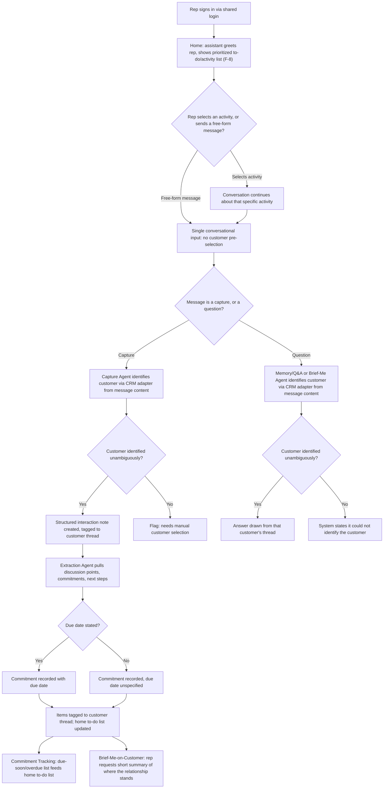

# PRD — Conversational CRM

## 1. Overview

- **Epic/Product name:** Conversational CRM / Relationship Memory Assistant
- **Document reference:** `PRD-conversational-crm-v1.8`
- **Owner:** Product Owner (role, not named individual — not identified in discovery)
- **Approver:** Human gate reviewer, Requirements stage (Gate 2)
- **Status:** ✅ Approved — Gate `requirements_review` passed by DAI Team3 (sparc.team5@experionglobal.com) on 2026-09-17T19:26:45Z (validator: issues_found across the v1.5→v1.8 revision cycle — 1 high (V-P10, traceability) and 1 medium (V-P11, structural) fully corrected and re-confirmed fixed; 1 medium (V-P17) and 1 low (V-P18) from the final v1.7→v1.8 data-ownership revision fixed directly and verified by the orchestrator; no security or unresolved traceability defects).
- **Version:** 1.8
- **Source document:** Discovery Brief — `DISCOVERY-BRIEF-conversational-crm-v1.1.md`
- **Revision note:** This is a **human-directed, two-phase validate-then-revise
  cycle** (2026-09-17) — a read-only Phase 1 validation pass against this document's
  actual defects, followed by this Phase 2 substantive revision — not an ordinary
  single-pass revise reply and not an independently-surfaced validator finding acted on
  in isolation. The trigger was a scope clarification from the human: **"We are
  actually building a conversational CRM, but it won't own any data — it will get data
  from other third-party CRMs."** This resolves an apparent contradiction from an
  earlier message ("we are NOT building a CRM... pluggable... sits on top of an
  existing CRM"): **"Conversational CRM" remains this product's own name and
  category** — unchanged, and explicitly re-confirmed by the human in this same
  revision request; what changes is that the product must never own the underlying
  account/contact data model. It reads accounts and contacts live through the CRM
  adapter and owns only its own relationship-memory layer (interactions, interaction
  attendees, and commitments) on top of that.

  Bumped to **v1.8** rather than corrected in place at v1.7 — even though v1.7 has
  never been published or gated, so the in-place-correction carve-out would technically
  still apply — because this revision is substantial (a reversed data-ownership model,
  two features cut, one acceptance criterion cut, vocabulary changes across multiple
  sections, and a renumbering of two Assumptions/Open Questions rows) and a fresh
  version number is the more honest signal of that. This also follows the precedent
  this same document already set at v1.6→v1.7: `record-validation.cjs` refuses a
  second independent review of an unchanged version number once real content has
  changed, so a real content change under a version-correction carve-out still needs a
  real version bump once independent re-review is expected. Verified against an actual
  `diff -u` between v1.7 and this document; every section named below as changed or
  unchanged reflects that diff, not recollection.

  **1 — Data-ownership model reversed (Section 13.1, most important fix).** v1.0
  through v1.7 stated that this system's own structured store persists "core CRM
  entities: accounts, contacts, interactions... and commitments" — i.e., that accounts
  and contacts are this product's own rows. That was backwards given the corrected
  scope: **accounts and contacts are never stored locally.** They are read live through
  the CRM adapter's existing `fetchAccounts()` / `fetchContacts(accountId)` methods
  (Section 14.1a — reused exactly as already defined; no new adapter method is
  introduced by this revision) and referenced everywhere else in this document by
  adapter-provided IDs. This system's own structured store now holds only its
  relationship-memory layer: Interactions, Interaction attendees, and Commitments —
  the actual value this product adds, consistent with its own name ("Relationship
  Memory Assistant") and with F-2/F-3/F-4's existing behavior, none of which ever
  actually required owning account/contact records, only referencing them. A new
  explicit boundary statement is added to Section 13.1 and to a new Section 7 NFR row
  ("Data Ownership"): this system never creates, edits, or deletes an account or
  contact record in the underlying CRM; it only reads accounts/contacts via the
  adapter, and writes only its own relationship-memory data, keyed by the
  adapter-provided IDs. This also resolves, explicitly, a possible "missing adapter
  write path" question the Phase 1 validation pass raised about the demo's step 7
  ("CRM/adapter and relationship memory are updated"): this is a **false gap once the
  data model is stated correctly** — relationship memory (interactions, commitments) is
  this product's own local store, never written back into the external CRM; only
  account/contact *reads* go through the adapter. Stated plainly in Section 13.1 so
  this does not reopen as a question later.

  **2 — F-9 Contact/Lead Categorization cut (was: new in v1.6).** Not in the new scope
  statement or the demo flow, and its own AC1 trigger (any unrecognized contact)
  actively contradicted the demo's step 4–5 (a brand-new contact goes straight to
  extraction, not into a categorization dialog). Removed as an in-scope feature — not
  silently deleted: Section 4's out-of-scope list now carries an explicit "considered
  and deferred" note stating what it was, why it was cut, and that the underlying
  capability can be regenerated in a future revision if a later phase needs contact
  qualification/scoring. Every other reference (Section 3's persona-clarification
  paragraph, Section 5's narrative/step-list/flowchart/alternate-flows, Section 6's F-9
  entry, Section 7's Architecture/Agent-Composition NFR row, Section 8's success-metric
  feature range and walkthrough text, Section 9's categorization/lead-scoring
  dependency row, Section 10's Assumption 15, Section 11's Open Questions 17 and 19,
  and Section 13's contact-category field/cross-references) is removed or converted to
  the deferred note.

  **3 — F-1 AC7 (voice-note capture) cut.** Also absent from the new scope/demo flow
  (the demo's step 4 is explicitly typed text). Removed as an acceptance criterion;
  Section 4's out-of-scope list now treats voice-note capture as "considered and
  deferred" rather than an open build decision, tracing back to the same
  `project.idea_input` framing ("a typed one-liner is an acceptable substitute... if
  speech-to-text eats into build time") this PRD has cited since v1.6. Every other
  reference (F-1's Description/Source, Section 7's Security/Privacy NFR row, Section
  9's speech-to-text dependency row, Section 10's Assumption 16, Section 11's Open
  Question 16, and Section 13.1's Interactions source-type list) is removed or
  converted to the deferred note.

  **4 — F-6 and F-7 cut as standalone features.** Neither the Customer Profile /
  Conversational History View (F-6) nor Shared Customer Thread Access (F-7) appears in
  the demo flow or the new scope statement. F-8 (home activity list) plus F-3/F-5 (Q&A,
  Brief-Me) already cover "see relationship history," conversationally rather than via
  a dedicated screen. The underlying single-shared-login assumption (Section 7's Access
  Control NFR, tracing to `project.idea_input`'s "a single shared team view is enough
  for the demo") is **unchanged** and stays — only the standalone F-7 feature/stories
  requirement is cut, not the NFR itself. Both given the same "considered and deferred,
  reversible" treatment in Section 4 as F-9/AC7 above; a dedicated profile screen or
  true multi-user support can be regenerated later if a phase actually needs one. Every
  reference to F-6/F-7 as standalone features (Section 6's F-6/F-7 entries, Section 8's
  success-metric feature range and walkthrough text, Section 9's structured-store
  dependency row's feature list, Section 13.1's Interactions bullet) is removed or
  reworded; the single-shared-login NFR and Assumption 2 are untouched.

  **5 — CRM-pipeline vocabulary softened in F-5 and Section 13.1.** F-5 itself stays
  fully in scope — the demo's step 10 ("brief me on Acme") directly requires it. Only
  the vocabulary changes: "opportunity/deal stands," "deal-stage," and pipeline-field
  language are reframed as relationship-memory framing (e.g., "a narrative summary of
  where this relationship currently stands, synthesized from captured interactions and
  commitments"). The underlying capability and every acceptance criterion's actual
  behavior (recent history + open commitments + stakeholders + narrative status
  synthesis) are unchanged — this is a wording pass over F-5's Description/Source/
  AC1/AC2/AC4, Section 13.1/13.2's status-synthesis text, Section 10's Assumption 13,
  and Section 11's Open Question 14, not a capability change.

  **6 — Epic/product name and document title unchanged.** "Conversational CRM /
  Relationship Memory Assistant" and "PRD — Conversational CRM" stay exactly as they
  are — the human explicitly re-confirmed this name in this exact revision request. A
  Phase 1 validation flag suggesting the name should change is superseded by the
  human's own clarification and is not acted on.

  **Renumbering note (Assumptions/Open Questions):** removing Assumption rows 15 (F-9
  category definitions) and 16 (voice-note build decision) leaves former row 17 (F-8's
  "top N" bound) renumbered to **15**; removing Open Questions 16 (voice-note), 17 (F-9
  category definitions) and 19 (F-9 re-categorization) leaves former question 18 (F-8's
  "top N"/"see more" mechanism) renumbered to **16**. Every cross-reference to these
  rows elsewhere in the document is updated to the new numbers; no other row in
  Sections 10–11 is renumbered.

  **One incidental fix (Section 12):** the v1.6 and v1.7 supersession lines, never
  added in either of those versions, are added now so the Related Pages chain is
  complete through this document's own immediate predecessor. This is a small,
  mechanical completeness fix noticed while updating this section for v1.8, not a new
  content decision.

  Sections touched, confirmed by the diff: **1** (Document reference, Version, this
  revision note, entirely rewritten); **3** (the F-9 persona-clarification paragraph
  removed); **4** (F-1's in-scope description cell loses its voice-note clause; F-5's
  description cell reworded to relationship-memory vocabulary; the F-6, F-7 and F-9
  in-scope rows removed; the voice-note out-of-scope bullet reworded from "open build
  decision" to "considered and deferred"; the re-categorization out-of-scope bullet
  removed; three new out-of-scope bullets added for F-9, F-6, and F-7); **5**
  (Narrative, Step list, Mermaid flowchart, and Alternate flows all rewritten to remove
  the categorization dialog, the voice-note capture mention, and the dedicated
  profile-view step, replacing the latter with a conversational-access statement); **6**
  (F-1's Source/Description edited to remove voice-note references and AC7 removed
  after AC6, with AC1–AC6 left byte-identical; F-5's Source/Description/AC1/AC2/AC4
  reworded to relationship-status vocabulary, AC3 unchanged; F-6 and F-9 sections
  removed entirely; F-7 section removed entirely; F-2, F-3, F-4 and F-8 left
  byte-identical); **7** (Security/Privacy row's voice-note clause removed; a new
  "Data Ownership" NFR row added; the Data Architecture row rewritten for the reversed
  ownership model; the Architecture/Agent Composition row's F-9 clause removed, the row
  otherwise kept; Access Control, Integration and Concurrency rows untouched); **8**
  (the first metric's feature range and walkthrough text corrected to F-1–F-5/F-8, and
  its data-source parenthetical updated for the adapter-read model); **9** (the
  categorization/lead-scoring and speech-to-text dependency rows removed; the
  seeded-dataset and adapters rows' status text updated for the adapter-read model; the
  structured-store row's feature list and entity list updated); **10** (Assumption 3's
  feature range corrected; Assumption 13 reworded to relationship-status vocabulary;
  Assumptions 15 and 16 removed; former Assumption 17 renumbered to 15); **11** (Open
  Question 9's dangling "(F-7 AC2)" pointer removed since F-7 is cut; Open Question 14
  reworded to relationship-status vocabulary; Open Questions 16, 17 and 19 removed;
  former Open Question 18 renumbered to 16, its own internal cross-reference updated);
  **12** (v1.6 and v1.7 supersession lines added); **13** (13.1 substantially
  rewritten: the Accounts/contacts bullet removed and replaced with an explicit
  read-via-adapter boundary statement and paragraph resolving the adapter-write-path
  question; the Interactions bullet's source-type list loses voice-note and its
  thread-reference wording is corrected to an adapter-provided ID; the Interaction
  attendees bullet's stale "F-1's new AC5" is corrected to "F-1's AC5" and "this
  revision closes that gap" to "v1.5 closed that gap," since AC5 was added in v1.5, not
  this cycle; the Commitments bullet drops its F-9 follow-up sentence and its own
  self-reference is tightened from "this revision states it explicitly here... and
  changes no existing behavior" to "this revision changes no existing behavior here";
  the discussion-points paragraph's "F-1 through F-9" becomes "this PRD" and drops the
  "[Added v1.6] a contact's category" parenthetical; the deal-stage paragraph reworded
  to relationship-status vocabulary; 13.2's F-5 bullet reworded to relationship-status
  vocabulary, otherwise unchanged; 13.3 rewritten to reflect every change above).
  **14** (the CRM adapter bullet in 14.1a reworded to state it is this
  system's sole source of account/contact data, with no local copy, and its
  now-inapplicable F-6/F-7 cross-reference removed; the Email adapter bullet's
  feature-range reference updated from "F-1 through F-7" to "F-1 through F-5"
  -- corrected below to "F-1 through F-5 and F-8" per V-P17 -- alongside the
  same edit already made to 14.1a's opening paragraph; 14.1, 14.2, 14.3, and the
  Calendar/SharePoint adapter bullets untouched).

  Confirmed **unchanged** by the diff having zero hunks in their line ranges: Section
  **2** in full; within Section 6, **F-2, F-3 (Source/Description/AC1–AC5), F-4, F-8**
  in full, and F-1's existing AC1–AC6 (none reworded — only AC7 removed); within
  Section 7, the **Access Control, Integration and Concurrency** rows; within Section
  10, **Assumptions 1, 2, 4–12, 14**; within Section 11, **Open Questions 1–8, 10–13,
  15** (Question 9 lost its dangling "(F-7 AC2)" pointer, per above);
  within Section 13, **13.2** except its one F-5 vocabulary edit noted above; within
  Section 14, **14.1, 14.2, 14.3**, and the Calendar/SharePoint adapter bullets in
  14.1a (the Email adapter bullet's feature-range reference WAS touched -- see item
  14 above; this was omitted from the original diff summary and is corrected here,
  per V-P17). No existing feature's priority changed, and no existing acceptance criterion's
  wording changed anywhere in this cycle except F-5's AC1/AC2/AC4 (vocabulary only, per
  item 5 above) — every other AC touched this cycle (F-1 AC7, and the whole of F-6/F-7/
  F-9) was removed outright, not reworded.

## 2. Purpose and Problem

Sales reps do not log interactions in a traditional CRM today because doing so means
stopping to fill in forms — a disconnected step reps skip or delay, so data quality
suffers and adoption stays low. Commitments made in conversation live only in memory or
inboxes, with no system tracking follow-through, and reconstructing "where things
stand" with a customer means manually piecing together notes and emails.

This system must let a sales rep capture an interaction outcome as effortlessly as sending a
text, must track commitments automatically and surface them before they are due, and
must make relationship history instantly queryable instead of requiring manual
reconstruction from notes and emails — so relationship knowledge lives in a shared
system rather than in individual reps' heads.

`[INFERRED — needs confirmation]` This framing is based on general knowledge of how CRM
adoption typically fails, not on validated research into what this specific group of
reps uses today — the Discovery interview could not identify a concrete status-quo tool
or workflow (see Section 11, Open Question 1).

## 3. Users

| Persona | Role / Context | What they need |
|---|---|---|
| Sales Rep | Single persona — primary and only audience, using the system on a laptop/desktop after an interaction, against seeded demo data via a single shared login | Effortless capture of what happened in an interaction; automatic tracking of commitments and due dates; instant natural-language answers about a customer's history; a quick pre-meeting brief; a way to see a customer's running history at a glance |

The Discovery interview identified exactly one user type and confirmed, on follow-up,
that no second persona with different needs exists ("same role sharing the same
capabilities"). No second persona is added here — see Section 9's disposition below on
why a second **team member** using the same shared login is not the same thing as a
second persona.

## 4. Scope

### In scope

| Feature ID | Name | Priority | Description |
|---|---|---|---|
| F-1 | Conversational Interaction Capture | Must | Rep captures an interaction outcome as a typed one-line summary or a business-card photo, through the single home conversational input (F-8) with no customer pre-selection needed; Capture Agent extracts contact details into a structured, thread-tagged interaction note |
| F-2 | Automatic Extraction & Thread Tagging | Must | Extraction Agent pulls discussion points, commitments, follow-ups and next steps (with due dates where stated) from a captured note and tags them to the correct customer thread |
| F-3 | Natural-Language Memory & Q&A | Must | Rep asks a natural-language question about a customer thread, through the same single conversational input with no customer pre-selection needed, and gets an answer drawn from captured history |
| F-4 | Proactive Commitment Tracking | Must | System surfaces a due-soon/overdue list of open commitments across all accounts, with no calendar or notification integration |
| F-5 | Brief-Me-on-Customer Summary | Should | Rep requests a short pre-meeting summary of a customer's recent history, open items, stakeholders and where the relationship currently stands |
| F-8 | `[Added v1.6]` Unified Home / Conversational Entry Surface | Must | Single home page that greets the rep, shows a prioritized to-do/activity list (reusing F-4's due-soon/overdue computation), and lets the rep continue a conversation about a selected activity or start a free-form capture/query in the same conversational input |

### Out of scope

- **Real external system integrations** — adapters simulate external connections
  instead of connecting to real systems (Discovery Brief Section 4). `[Revised v1.8]`
  This includes the CRM: this system reads accounts and contacts live from the CRM
  adapter rather than connecting to (or storing a local copy from) a real CRM, and
  never writes account/contact data back to any CRM, real or simulated (Section 13.1;
  Section 7's new Data Ownership NFR).
- **Multi-team support** (Discovery Brief Section 4).
- **Multi-tenant support** (Discovery Brief Section 4).
- **Individual per-rep authentication / commitment-note attribution** — a single shared login is used instead; commitments and notes are not attributed to a specific individual in this version (Discovery Brief Sections 2, 5, 7).
- **Voice-note capture — considered and deferred** `[Revised v1.8]` — v1.6–v1.7 carried
  voice-note capture as a still-open build decision (F-1 AC7). This revision removes
  it: it is absent from the confirmed demo flow (the demo's capture step is explicitly
  typed text) and from the new scope statement driving this revision. This is a
  deliberate, reversible scope decision, not an oversight — the original idea statement
  (`project.idea_input`) itself frames voice-note capture as droppable ("a typed
  one-liner is an acceptable substitute... if speech-to-text eats into build time"),
  and the capability can be regenerated in a future revision if a later phase needs it.
- **Enterprise-grade access control and governance** — the original idea statement itself frames this as a stretch goal, consistent with (not contradicting) the confirmed single-shared-login simplification (Sections 2, 5, 7). Not required for this version's stated success metric. **Disposition: explicitly deferred.**
- **Contact/Lead Categorization (F-9) — considered and deferred** `[Cut v1.8]` — F-9,
  added in v1.6, asked the rep follow-up questions to categorize an unrecognized
  contact as Prospect, Lead, or Qualified Lead. This revision cuts it: it is not in the
  new scope statement or the confirmed demo flow, and its own AC1 trigger (any
  unrecognized contact) actively contradicted the demo's step 4–5, where a brand-new
  contact goes straight to extraction with no categorization dialog. This is a
  deliberate, reversible scope decision, not an oversight — the underlying capability
  (contact qualification/scoring) can be regenerated in a future revision if a later
  phase needs it.
- **Customer Profile / Conversational History View (F-6) — considered and deferred**
  `[Cut v1.8]` — F-6 provided a dedicated per-customer screen listing captured notes and
  extracted items chronologically. This revision cuts it as a standalone feature: it
  does not appear in the new scope statement or the confirmed demo flow, and F-8 (home
  activity list) together with F-3 (Q&A) and F-5 (Brief-Me) already let a rep see a
  customer's relationship history conversationally. A dedicated profile screen can be
  regenerated in a future revision if a phase actually needs one.
- **Shared Customer Thread Access as a standalone feature (F-7) — considered and
  deferred** `[Cut v1.8]` — F-7 restated, as a separate feature, that every session on
  the single shared login sees the same customer-thread content. This revision cuts the
  standalone feature/stories requirement: the underlying single-shared-login access
  model is unchanged and remains a confirmed NFR (Section 7, Access Control) — only the
  separate feature entry, with its own acceptance criteria for concurrent-session
  visibility, is removed. True multi-user/concurrent-editing behavior can be
  regenerated in a future revision if a phase actually needs it as more than an
  implication of the shared-login NFR.

## 5. User Journey

### Narrative

A sales rep signs in via the system's single shared login and lands on a single home
surface, where the assistant greets the rep conversationally and shows a prioritized
to-do/activity list of commitments due soon or overdue (reusing Commitment Tracking,
F-4). The rep either selects an item from that list to continue the conversation about
it, or types a free-form message into the same conversational input to capture what
happened in an interaction or ask a question — the system identifies the relevant
customer from the message content itself, every time, without the rep pre-selecting an
account. From there, the system extracts structured detail and commitments
automatically and tags them to the right customer; the rep — or a second team member
using the same shared login — can ask further natural-language questions about that
customer's captured history, get a proactive list of commitments coming due or overdue
across every account, and request a short brief on where that relationship currently
stands before the next meeting.

### Step list

1. Rep signs in via the single shared login and lands on the home surface. The
   assistant greets the rep conversationally and shows the prioritized to-do/activity
   list (top N, with a way to see more), reusing Commitment Tracking's due-soon/overdue
   computation (F-4/F-8).
2. The rep either selects an item from the to-do/activity list to continue the
   conversation about that specific commitment/activity, or types a free-form message
   into the single conversational input — the same input handles both capturing an
   interaction outcome and asking a question, with no separate screen and no mode
   switch.
3. The system identifies the relevant customer thread from the message content itself,
   every time — the rep is never required to select or confirm a customer before
   capturing or asking (F-1 AC6, F-3 AC5). `[INFERRED — needs confirmation]` The rep may
   alternatively capture by scanning a business card.
4. Capture Agent extracts contact details into a structured interaction note, matching
   it to the correct customer account, read live via the CRM adapter (Section 13.1,
   Section 14.1a).
5. Extraction Agent processes the note, extracting discussion points, commitments and
   next steps (with a due date where one was stated), and tags them to the same thread.
6. For a question, the Memory/Q&A Agent — or the Brief-Me-on-Customer Agent for a full
   pre-meeting brief — answers from that customer's thread, identifying the customer
   the same implicit way.
7. The rep asks the assistant a natural-language question to review that customer's
   running interaction history conversationally (F-3), rather than opening a dedicated
   screen.
8. Independently of any single customer conversation, the Commitment Tracking Agent
   keeps the home to-do/activity list current with due-soon/overdue commitments across
   all accounts.

### Flowchart

### Alternate flows

- **Validation failure — unmatched customer:** captured text does not unambiguously
  match a customer account read live via the CRM adapter → system flags the note
  "unmatched — needs customer selection" and asks the rep to pick the correct account
  (F-1 AC1, AC4).
- **Empty state — no history yet:** a query is asked about a customer with no captured
  notes → system states that no history exists yet, rather than returning nothing with
  no explanation (F-3 AC1).
- **Empty state — no commitments due:** the due-soon/overdue list (surfaced directly, or
  via the home to-do/activity list, F-8 AC1) is opened when no commitment qualifies →
  system states there are none, rather than showing an empty list with no explanation
  (F-4 AC3, F-8 AC1).

## 6. Features

### F-1 — Conversational Interaction Capture

**Priority:** Must
**Source:** Discovery Brief Section 1 (Problem Statement: "capture becomes as
effortless as sending a text") + Section 3 Goal 1 ("Make capture effortless enough that
it happens every time") + Section 9 item "Capture Agent." Typed one-line capture ties
directly to a confirmed goal. `[INFERRED — needs confirmation]` Business-card scanning
as an alternative input is adopted as in-scope because it serves the same confirmed
capture-effortless goal, but its specific mechanism (scanning/OCR, optical character
recognition, approach) was never discussed in the interview. `[Added v1.5]` AC5
(attendee-name extraction from typed text) was added via a human-agent design
discussion — not the interview and not a validator finding — analyzing the canonical
capture example ("met Priya and Arjun from Acme...") against F-3 AC3's existing promise
to answer "who attended from their side?" from captured attendee names; see F-3 AC3's
own wording, unchanged by this revision. `[Added v1.6]` AC6 was added following a
human-directed reopening of this workflow's sign-off (2026-09-17), triggered by the
human's review of an exploratory, ungated canvas concept built in Workflow 3 (a
separate, later workflow in this framework; see workflow-3-design-to-development's
`roles/ui_ux.json`, `exploratory_concepts[0]`, id `EXPLORE-UNIFIED-HOME`) — not the
Discovery interview and not a validator finding. That concept demonstrated a single
home conversational input handling capture with no customer pre-selection. `[Removed
v1.8]` AC7 (voice-note capture, added v1.6) is removed in this revision, consistent
with the confirmed demo flow's explicitly typed-text capture step and the human's scope
clarification driving this revision; see Section 4's "considered and deferred" note.

**Description:** The system must let the rep capture an interaction outcome as a single
typed free-text entry describing what happened, and the Capture Agent must extract
structured contact detail from that entry into an interaction note tied to the correct
customer thread. `[Added v1.5]` The Capture Agent must also extract every attendee name
mentioned in that typed entry as a separate structured item — an interaction may name no
attendees, one, or several (e.g., "met Priya and Arjun from Acme..." names two) — since
F-3 AC3 already promises answering "who attended from their side?" from captured
attendee names, and that promise had nothing to draw on when capture happened by typed
text rather than by the optional business-card scan. `[INFERRED — needs confirmation]`
The system must also accept a scanned business-card image as an alternative capture
input. `[Added v1.6]` Every capture entry — typed or business-card — is submitted
through the single home conversational input (F-8); the rep is never required to
select, open, or confirm a customer account before capturing (AC6), and the system
identifies the relevant customer from the entry's own content, every time.

**Acceptance criteria:**
1. System must create a structured interaction note and associate it with the correct
   customer thread when the entry text unambiguously matches exactly one customer
   account already present in the seeded data, and must flag the note as "unmatched —
   needs customer selection" — rather than attaching it to a default or incorrect
   account — when no seeded customer account can be unambiguously identified from the
   entry.
2. `[INFERRED — needs confirmation]` System must extract the contact's name, company and
   role from a scanned business-card image into the structured interaction note when the
   image is legible and contains recognizable contact fields, and must inform the rep
   that manual entry is required — without fabricating contact details — when the image
   cannot be read or no contact fields are recognized.
3. System must save the entry as a new interaction note when it contains at least one
   non-whitespace character, and must reject the submission with an explicit "cannot
   save an empty note" message — without creating any note record — when the rep
   submits an empty or whitespace-only entry.
4. System must attach a previously flagged "unmatched" note to the customer thread the
   rep selects when the rep manually resolves the flag, and must leave the note in the
   unmatched/needs-selection state — rather than guessing an account — when the rep has
   not yet resolved it.
5. `[Added v1.5]` `[Confirmed — capability, per design discussion analyzing F-3 AC3's
   existing dependency]` System must extract every distinct
   attendee name mentioned in a typed free-text interaction entry as a separate
   structured attendee item — recording one item per distinct person named (e.g., "met
   Priya and Arjun from Acme..." must yield two attendee items, not one merged string)
   — when the entry text names at least one identifiable person, and must record zero
   attendee items for that interaction — rather than fabricating a name — when the
   entry text names no one. `[INFERRED — needs confirmation]` The specific
   name-recognition/disambiguation mechanism (how
   the system determines that "Priya and Arjun" names two people rather than one
   compound string, and how confidently a token must be recognized as a person's name
   before it is recorded) was never discussed in the interview and remains `[INFERRED
   — needs confirmation]`, carried to Assumption 14 and Open Question 15; only the
   underlying **capability** — that attendee names must be extracted from typed text,
   not solely from the optional business-card path (AC2) — is confirmed by this
   revision, since F-3 AC3 already depends on it existing.
6. `[Added v1.6]` System must accept and process a capture entry submitted through the
   single conversational input (F-8) with no prior customer-selection step — identifying
   the customer from the entry's own content alone, per AC1 — when the entry's content
   unambiguously identifies exactly one customer, and must ask the rep, conversationally,
   to name the customer — rather than blocking the submission or guessing an account —
   when the entry's content does not unambiguously identify one. This failure branch
   surfaces the same underlying outcome AC1 and AC4 already define for an entry that
   cannot be matched (flagged "unmatched — needs customer selection" per AC1, until the
   rep resolves it per AC4) — but through the conversation itself, as an active prompt in
   the same turn, rather than AC1/AC4's original mechanism of a passive flag resolved via
   a later, separate step. This generalizes AC1's matching behavior into an explicit
   statement that no precondition customer-selection step exists, replacing the
   account-selection step this PRD's User Journey previously described (Section 5).

### F-2 — Automatic Extraction & Thread Tagging

**Priority:** Must
**Source:** Section 3 Goal 2 ("Track commitments automatically and surface them before
they are due") + Goal 3 ("Make relationship history instantly queryable") + Section 9
item "Extraction Agent." Direct tie to confirmed goals; no inference needed on the core
capability.

**Description:** Given a captured interaction note, the Extraction Agent must identify
discussion points, commitments, follow-ups and next steps, must capture a due date for
a commitment when one is mentioned in the text, and must tag every extracted item to the
correct customer thread the note belongs to.

**Acceptance criteria:**
1. System must extract each distinct commitment, follow-up or next step mentioned in a
   captured note's text as a separate tracked item when the note contains one or more of
   them, and must record no commitment items when the note describes discussion only
   with no forward-looking commitment.
2. System must record a due date on an extracted commitment when the captured text
   states or clearly implies one (e.g., "by Friday"), and must mark the commitment's due
   date as unspecified — rather than guessing a date — when the text gives no date
   information.
3. System must tag every extracted discussion point and commitment to the same customer
   thread as its source interaction note, and must flag an extracted item for manual thread
   assignment when the source note itself is unmatched to a customer thread (per F-1 AC4),
   rather than tagging it to an incorrect thread.
4. System must record a best-effort due date only when the captured text names a
   concrete date or an unambiguous relative date term resolvable against the interaction's
   timestamp (e.g., "by Friday"), and must leave the due date unspecified — rather than
   guessing an exact date — when the text uses a vague temporal reference (e.g., "soon,"
   "sometime") that cannot be resolved to a specific date.

### F-3 — Natural-Language Memory & Q&A

**Priority:** Must
**Source:** Section 1 / Section 3 Goal 3 ("relationship history instantly queryable")
+ Section 9 item "Memory/Q&A Agent" and its three example queries. `[INFERRED — needs
confirmation]` The three example queries are adopted as illustrative of the required
capability, not confirmed as the exhaustive supported query set. `[Added v1.6]` AC5 was
added for the same reason as F-1 AC6 — the human-directed reopening following review of
the exploratory, ungated Workflow 3 canvas concept (see workflow-3-design-to-development's
`roles/ui_ux.json`, `exploratory_concepts[0]`, id `EXPLORE-UNIFIED-HOME`), which
demonstrated a single conversational input handling both capture and query with no
customer pre-selection step. This generalizes
AC4's existing per-query customer resolution into an explicit no-precondition statement;
AC4 itself is unchanged.

**Description:** The system must let a rep ask a natural-language question about a
specific customer thread and must return an answer drawn from that thread's captured
notes, extracted discussion points and commitments, covering at minimum the three
example query types named in the original idea statement: "what did we discuss last
time?", "what did I commit to?", "who attended from their side?" `[Added v1.6]` Every
question is submitted through the single home conversational input (F-8); the rep is
never required to select, open, or confirm a customer account before asking, and the
system identifies the relevant customer from the question's own content, every time.

**Acceptance criteria:**
1. System must answer a natural-language question about a customer's most recent
   discussion by returning content drawn from that customer's most recent interaction
   note(s) when the thread has at least one captured note, and must respond that no
   history exists yet for that customer when the thread is empty.
2. System must answer a natural-language question about the rep's own open commitments
   for a customer by listing the commitments extracted and tagged to that thread when
   any exist, and must state that there are no open commitments for that customer when
   none exist.
3. System must answer a natural-language question about interaction attendees by returning
   the contact names extracted from that thread's interaction notes when attendee names
   were captured, and must state that no attendee information was captured when none was
   extracted.
4. System must resolve and answer against the correct customer thread when a query
   names exactly one customer that matches a seeded account, and must respond that it
   could not identify the customer — rather than guessing or returning another
   customer's data — when the query names no customer or an unrecognized one.
5. `[Added v1.6]` System must accept and answer a natural-language question submitted
   through the single conversational input (F-8) with no prior customer-selection step —
   resolving the target customer from the query's own text alone, per AC4 — when the
   query's content unambiguously identifies exactly one seeded customer, and must
   respond that it could not identify the customer — rather than guessing or returning
   another customer's data — when the query's content does not unambiguously identify
   one. This failure branch is the same behavior AC4 already defines for a query naming
   no customer or an unrecognized one, restated here as the always-implicit entry
   model's own failure path, not a second, separate mechanism. This generalizes AC4 to
   state explicitly that no precondition customer-context step exists, consistent with
   F-1 AC6's parallel statement for capture, and replaces the account-selection step
   this PRD's User Journey previously described (Section 5).

### F-4 — Proactive Commitment Tracking

**Priority:** Must
**Source:** Section 3 Goal 2 ("Track commitments automatically and surface them before
they are due") + Section 9 items "Commitment Tracking Agent" and "due-soon/overdue
commitment list." Direct, strong tie to a confirmed goal — no inference needed on the
core capability.

**Description:** The system must surface a list of open commitments that are due soon
or already overdue, across all customer accounts, computed from the due dates captured
by the Extraction Agent, without any calendar or notification integration. `[Added
v1.6]` This is the same list content the unified home surface (F-8) displays as its
prioritized to-do/activity list — F-8 reuses this feature's computation as its list
content and does not duplicate this logic; F-4's own acceptance criteria below are
unchanged by that reuse.

**Acceptance criteria:**
1. System must list every open commitment whose due date has passed as "overdue" when
   the current date is past that due date, and must exclude a commitment from this list
   once it is marked complete.
2. `[INFERRED — needs confirmation]` System must list every open commitment whose due
   date falls within a defined look-ahead window as "due soon" when that window is
   confirmed (the exact window, e.g. "the next 7 days," was not stated in discovery and
   is carried to Open Questions, Section 11), and must reclassify it as "overdue"
   instead (per AC1) — rather than continuing to show it as due-soon — once its due
   date has passed.
3. System must list every qualifying commitment individually when at least one exists,
   and must state explicitly that there are no due-soon or overdue commitments — rather
   than showing an empty list with no explanation — when none exist.
4. System must include a commitment with a stated due date in the due-soon/overdue list
   per AC1/AC2, and must list a commitment with an unspecified due date (per F-2 AC2/AC4)
   separately from that list — rather than omitting it entirely or treating it as
   overdue — when no due date was captured.

### F-5 — Brief-Me-on-Customer Summary

**Priority:** Should
**Source:** Section 9 item "Brief-Me-on-Customer Agent." `[INFERRED — needs
confirmation]` This capability was not independently confirmed in the interview;
adopted as in-scope as a composition of the confirmed "instantly queryable" goal
(Section 1/3) and the Commitment Tracking capability (F-4), since a pre-meeting brief is
a synthesis of exactly the history and open-items data those two confirmed capabilities
already produce. `[Confirmed — canonical idea document, Idea 5 — added v1.3]` Idea 5's
own pitch text states the Brief-Me synthesis draws on "history, open commitments, key
stakeholders, and where the opportunity stands" — a fourth component this PRD's v1.0
through v1.2 omitted, because `project.idea_input` had been recorded, since this run
started, as an incomplete paraphrase that dropped it; the omission is corrected in this
revision. This directly confirms the **capability** that Brief-Me must also state where
the relationship currently stands — it is no longer merely inferred from composition —
but the specific **mechanism** for representing that status (see AC4 below, and Section
13.1) was never discussed in the interview and remains `[INFERRED — needs
confirmation]`. `[Revised v1.8]` This fourth component's vocabulary is reframed below as
relationship-status/narrative-standing language rather than CRM-pipeline/deal-stage
language, per this revision's scope clarification that this product owns no CRM
pipeline data of its own — the underlying capability and every acceptance criterion's
actual behavior are unchanged, only the wording.

**Description:** Given a single request naming a customer (e.g., "brief me on Acme"),
the system must generate a short summary combining that customer's recent history, open
commitments, known stakeholders, and a narrative synthesis of where that relationship
currently stands. `[INFERRED — needs confirmation]` This relationship-status component
is synthesized narratively from the customer's existing interaction-note and commitment
content (Section 13.1/13.2) rather than read from a distinct structured pipeline-style
field, per the design decision and reasoning recorded in Section 13.1 — no feature in
this PRD gives a rep or agent a way to capture or set a discrete pipeline stage. The
summary must remain a short generated summary rather than a long or formatted report,
per the original idea statement's own framing.

**Acceptance criteria:**
1. System must generate a summary containing recent discussion history, open
   commitments, stakeholder/contact names, and a narrative synthesis of where the
   relationship currently stands for a named customer when that customer has at least
   one captured note, and must state that no history exists yet for that customer when
   the thread is empty, rather than generating a summary with fabricated content.
2. `[INFERRED — needs confirmation]` System must return a bounded, short-form summary
   (a few sentences or bullets, not a multi-page document) under normal conditions — no
   explicit length limit was stated in discovery, carried to Open Questions (Section
   11) — and must still return whatever partial content is available when data for one
   of the four summary components (history, commitments, stakeholders, relationship
   status) is missing, rather than failing the whole request.
3. System must generate the summary for a named customer when the request unambiguously
   identifies exactly one seeded customer account, and must respond that it could not
   identify the requested customer — rather than guessing — when the request names an
   unrecognized or ambiguous customer.
4. `[INFERRED — needs confirmation]` System must synthesize the relationship-status
   component narratively from that customer's recorded interaction notes and
   commitments — since no discrete pipeline-stage field exists in the structured store
   (Section 13.1) — when the thread contains content indicating where the relationship
   stands, and must state that no relationship-status information has been captured yet
   for that customer — rather than fabricating a stage or outcome — when the thread
   contains no such content.

### F-8 — Unified Home / Conversational Entry Surface `[Added v1.6]`

**Priority:** Must
**Source:** `[Added v1.6]` Derived from an exploratory, ungated canvas concept built in
Workflow 3 (a separate, later workflow in this framework) — recorded at
workflow-3-design-to-development's `roles/ui_ux.json`, `exploratory_concepts[0]` (id
`EXPLORE-UNIFIED-HOME`) — which the human confirmed as the intended product shape when
reopening this workflow's sign-off on 2026-09-17 (see `workflow.json` `audit_trail`, the
"reopened" entry) — not sourced from the Discovery interview transcript. This concept
was human-reviewed and iterated across several rounds, including one driven by a
human-supplied user-journey flowchart image, but was deliberately never run through
Workflow 3's own draft/validate/gate cycle (no locked requirement existed yet to trace
it to) — it is an exploratory design input to this PRD, not an approved Workflow 3
design artifact. Reconciles with confirmed Discovery goals 1 ("make capture
effortless enough that it happens every time") and 3 ("relationship history instantly
queryable") (Discovery Brief Section 3) by giving both a single point of entry, and
reuses Commitment Tracking's existing due-soon/overdue computation (F-4) as its
to-do/activity list content rather than defining new tracking logic.

**Description:** The system must present the rep with a single home surface on login —
not a separate screen per feature — where the assistant greets the rep conversationally
and shows a prioritized to-do/activity list drawn from the open commitments Commitment
Tracking (F-4) already computes. Selecting an item from that list must continue the
conversation about that specific commitment/activity in the same conversational
surface, rather than navigating to a separate screen. The same conversational input
that shows this list also accepts free-form capture and query messages (F-1, F-3) —
this feature states the home surface's own behavior (greeting, list, selection-
continues-conversation); it does not restate F-1/F-3's capture/query behavior, which
those features still own. `[INFERRED — needs confirmation]` The specific screen layout,
visual design, and exact conversational wording are Workflow 3's (UI/UX) concern, not
specified here.

**Acceptance criteria:**
1. System must greet the rep conversationally and display the prioritized
   to-do/activity list, drawn from Commitment Tracking's due-soon/overdue computation
   (F-4 AC1/AC2), when the rep logs in and at least one qualifying commitment exists,
   and must state explicitly that there is nothing due or overdue right now —
   consistent with F-4 AC3 — rather than showing an empty list with no explanation, when
   none exist.
2. `[INFERRED — needs confirmation]` System must display only the top N highest-priority
   items on the to-do/activity list when more than N qualifying items exist (the exact
   value of N was not stated by the exploratory Workflow 3 canvas concept (`ui_ux.json`'s `exploratory_concepts[0]`, id `EXPLORE-UNIFIED-HOME`), carried to Open Question 16),
   and must give the rep an explicit way to see the remaining items ("see more") rather
   than truncating the list with no indication that more items exist.
3. System must continue the conversation about the specific commitment/activity the rep
   selects from the list — surfacing that item's associated customer thread in the same
   conversational input — when the rep selects an item, and must state clearly that the
   underlying item could no longer be located, rather than opening an unrelated thread,
   in the edge case where the item's source data (an F-4-tracked commitment) has since
   been removed.
4. System must display an explicit "nothing to show yet" state on first login, when the
   seeded data yields no commitments and no prior interaction history at all, rather
   than presenting a blank home surface with no explanation.

## 7. Non-Functional Requirements

| Category | Requirement | Override reason |
|---|---|---|
| Security / Privacy | System must operate only on seeded demo data and must not process real customer PII (personally identifiable information) in this version — this constraint applies equally to the structured store and to the vector store of embeddings (Section 13). | Discovery Brief Section 6 — seeded data only removes real customer-PII exposure as a concern for this phase. Extended in v1.1 to state explicitly that it covers both data stores added in Section 13. `[Trimmed v1.8]` The v1.6 extension covering voice-note audio/transcripts is removed along with F-1 AC7 (Section 4). |
| Access Control | System must authenticate all use via a single shared login and must not implement per-individual authentication in this version. | Explicit demo simplification, confirmed via interview follow-up (Discovery Brief Sections 2, 5). |
| Integration | System must simulate every external system touchpoint (sources feeding seed data, e.g. MOM/email/SharePoint-derived content) via adapters — including the CRM, calendar, SharePoint and email adapters detailed in Section 14 — and must not call a real external system in this version. | Discovery Brief Section 4/5 — no real system integrations of any kind. Extended in v1.1 to reference the concrete adapter-only approach in Section 14. |
| `[Added v1.8]` Data Ownership | This system never creates, edits, or deletes an account or contact record in the underlying CRM. It only **reads** accounts and contacts live through the CRM adapter (`fetchAccounts()`/`fetchContacts(accountId)`, Section 14.1a) and **writes** only its own relationship-memory data — interactions, interaction attendees, and commitments — keyed by the adapter-provided account/contact IDs (Section 13.1). | Human scope clarification (2026-09-17): "we are actually building a conversational CRM, but it won't own any data — it will get data from other third-party CRMs." Elaborated fully in Section 13.1. |
| Concurrency | `[INFERRED — needs confirmation]` System must handle at least two concurrent shared-login sessions accessing the same customer thread without silently losing data. | Follows from the confirmed shared-login model and the original idea's "second team member" item; the specific mechanism was not discussed in discovery. |
| Data Architecture | System must persist only this system's own relationship-memory entities — interactions, interaction attendees, and commitments — in a structured, queryable store, keyed by adapter-provided account/contact IDs rather than a locally stored copy of accounts/contacts (Section 13.1), and must additionally hold embeddings of extracted unstructured content (MoM, free text, email, SharePoint-derived material) in a vector store, so that F-3 and F-5 can retrieve context semantically rather than by exact keyword/exact-match search alone. | Added in v1.1 per Gate 2's first revise feedback (2026-09-17). The specific store technologies (SQLite, Chroma) and the vector store's chunking strategy (semantic chunking) were confirmed directly by the human at Gate 2's second revise reply (2026-09-17). `[Revised v1.8]` Reversed from persisting accounts/contacts locally to reading them live via the CRM adapter, per the human's scope clarification driving this revision. Elaborated in full in Section 13. |
| `[Added v1.6]` Architecture / Agent Composition | `[INFERRED — needs confirmation]` System must be implemented as multiple cooperating backend agents behind the single conversational interface (F-8) — the Discovery Brief's Section 9 already names an illustrative set (Capture, Extraction, Memory/Q&A, Commitment Tracking, Brief-Me-on-Customer agents). This is a note about the shape of the solution, not a specification of it. | New note, prompted by the same exploratory, ungated Workflow 3 canvas concept that triggered the v1.6 reopening (2026-09-17; see workflow-3-design-to-development's `roles/ui_ux.json`, `exploratory_concepts[0]`, id `EXPLORE-UNIFIED-HOME`). Illustrative only — the actual multi-agent architecture is Workflow 2's job, not this PRD's. `[Trimmed v1.8]` The clause noting Contact/Lead Categorization (F-9) needs the same kind of specialized handling is removed along with F-9 (Section 4); the row's general note is otherwise unchanged. |

## 8. Success Metrics

| Metric | Target | How measured |
|---|---|---|
| Demo agents functioning end-to-end on seeded data (Discovery Brief Section 3, stated success metric) | Every feature F-1 through F-5, and F-8's, defined acceptance criteria executes successfully against the seeded demo dataset (customer accounts and contacts read live via the CRM adapter, and MOM/email/SharePoint-derived interaction history) | Manual walkthrough of the full home/to-do → capture → extraction → query → commitment-tracking → brief flow against seeded accounts, checked against this PRD's acceptance criteria. `[INFERRED — needs confirmation]` The exact list of seed scenarios that constitutes complete "end-to-end" coverage is not yet enumerated — carried forward from Discovery Open Item 2 to Open Questions (Section 11). |
| `[INFERRED — needs confirmation]` Commitment due-date classification accuracy | 100% of commitments with a stated due date in captured notes are correctly classified as due-soon or overdue per F-4 | Manual check of seeded commitments with known due dates against the due-soon/overdue list on a known reference date |

## 9. Dependencies

| Dependency | Impact level | Status |
|---|---|---|
| Seeded demo dataset (customer accounts, contacts, prior interaction history including MOM, email and SharePoint content) | TIGHT | Required before any feature can be exercised — no feature functions without it (Discovery Brief Section 5). `[Added v1.8]` Accounts and contacts are seeded behind the CRM adapter and read live (Section 13.1, 14.1a) — this system stores no local copy of either. |
| Adapters simulating external systems in place of real integrations — specifically a CRM adapter, a calendar adapter, a SharePoint adapter, and (added in v1.1 per Gate 2 feedback) an email adapter, each backed by stub/seeded data behind a defined interface contract | MODERATE | Needed to represent CRM/calendar/SharePoint/email-sourced content without real connections; concrete interface-contract detail elaborated in Section 14, including a proposed contract per adapter in Section 14.1a. `[Revised v1.8]` The CRM adapter (`fetchAccounts()`/`fetchContacts(accountId)`) is this system's only source of account/contact data — see Section 13.1; this system stores no local copy of accounts or contacts. |
| `[INFERRED — needs confirmation]` Natural-language understanding/extraction capability underlying the Capture, Extraction, Memory/Q&A and Brief-Me-on-Customer agents | TIGHT | Not explicitly named as a dependency in the interview, but functionally required by every Section 9 capability adopted above; status open |
| Structured/historical data store for this system's own relationship-memory entities (interactions, interaction attendees, commitments) | TIGHT | Added in v1.1 per Gate 2's first revise feedback. `[Revised v1.8]` No longer holds accounts/contacts — see the adapters row above and Section 13.1; F-1, F-2 and F-4 read from or write to this store, F-3 reads its Commitments content for open-commitment answers (AC2), and F-5 reads it for relationship-status synthesis (per Section 13.1) — keyed by adapter-provided account/contact IDs — elaborated in Section 13.1. `[Fixed V-P18]` F-3 and F-5 were both omitted from this row's reader list despite Section 13.1/F-3 AC2 already establishing they read this store; this was a pre-existing gap from v1.7, not a v1.8 regression, but this row was directly edited this cycle and should have caught it then. Technology confirmed as SQLite at Gate 2's second revise reply (2026-09-17). |
| Vector database holding embeddings of extracted unstructured content (MoM, free text, email, SharePoint docs) | TIGHT | Added in v1.1 per Gate 2's first revise feedback; F-3 and F-5's semantic-retrieval requirement depends on this store existing — elaborated in Section 13.2. Technology confirmed as Chroma, and chunking strategy confirmed as semantic chunking, at Gate 2's second revise reply (2026-09-17). |

## 10. Constraints and Assumptions

### Hard constraints (stated directly in the Discovery Brief)

- Runs entirely against seeded data; not live/real customer data (Section 4/5).
- No real external system integrations; adapters simulate connections instead (Section 4/5).
- Single shared login; no individual per-rep authentication (Section 2/5).
- Single team, single tenant (Section 4).

### Assumptions

| # | Assumption | Validation plan | Owner | Status |
|---|---|---|---|---|
| 1 | `[INFERRED — needs confirmation]` The problem statement is based on general CRM-adoption knowledge, not validated research on this specific rep population. | Confirm with real reps before treating the problem statement as more than a working assumption. | Business analyst / product owner | Open |
| 2 | `[INFERRED — needs confirmation]` Single shared login means commitments/notes are not attributed to an individual rep in this version. | Explicit human decision if a future phase needs per-rep attribution. | Product owner | Open |
| 3 | `[INFERRED — needs confirmation]` "End-to-end on seeded data" requires the seed dataset to exercise every feature in this PRD (F-1–F-5, F-8). | Enumerate the specific seed scenarios before development/test planning starts. | Requirements / QA | Open |
| 4 | `[INFERRED — needs confirmation]` A future phase moving to real customer data would require revisiting compliance/PII handling. | Defer to that future phase's own discovery pass. | Product owner | Deferred — not applicable to this version |
| 5 | `[INFERRED — needs confirmation]` Business-card scanning is included as an in-scope, additional capture input alongside typed one-liner capture; exact OCR/parsing approach is unconfirmed. | Confirm with a human whether OCR-based scanning is worth building for the demo or typed-only suffices. | Product owner / architect | Open |
| 6 | `[INFERRED — needs confirmation]` Brief-Me-on-Customer is treated as a composition of the confirmed Memory/Q&A and Commitment Tracking capabilities rather than an independently confirmed capability. | Confirm with a human that this composition satisfies the original idea's intent. | Product owner | Open |
| 7 | `[INFERRED — needs confirmation]` The confirmed single-shared-login model is assumed sufficient to satisfy Section 9's "second team member shared view" item, without introducing a second persona. | Confirm with a human that no distinct account-manager-facing feature is expected beyond shared-login access. | Product owner | Open |
| 8 | `[INFERRED — needs confirmation]` The three example Memory/Q&A queries are illustrative of the required natural-language query capability, not an exhaustive supported list. | Confirm with a human whether additional query types must be explicitly supported. | Product owner | Open |
| 9 | `[RESOLVED — Gate 2 decision, 2026-09-17]` The structured-store and vector-store technologies (Section 13) were unconfirmed as of v1.1. The human decided them directly rather than leaving them to the Architecture stage: structured store = SQLite, vector store = Chroma. | None needed — decided directly by a human at the gate. | Product owner (decided) | Resolved — see Section 13.1/13.2 |
| 10 | `[INFERRED — needs confirmation, partially resolved]` Gate 2's second reply confirmed the vector store's chunking strategy directly: semantic chunking (Section 13.2). The specific embedding model, and the re-embedding trigger strategy for when a source note or document changes, remain unconfirmed and are still left to the Architecture stage. | Architecture stage documents the embedding model choice and the re-embedding trigger mechanism. | Architect | Partially resolved — chunking strategy confirmed; embedding model and re-embedding trigger still open |
| 11 | `[DELEGATED DECISION — human authorized requirements-agent to choose at Gate 2]` The full interface contract per adapter (CRM, calendar, SharePoint, email), beyond the two illustrative method names given at the first Gate 2 reply, was delegated by the human to requirements-agent's own judgment ("you can choose the best method as needed") rather than confirmed directly. A proposed contract is recorded in Section 14.1a. This is an authorized design choice, not a human-confirmed exhaustive contract — Architecture/Development may still refine it. | Architecture stage reviews and finalizes (or explicitly ratifies) the proposed contract before Development builds against it. | Architect | Delegated decision recorded — see Section 14.1a; not yet ratified by Architecture |
| 12 | `[DELEGATED DECISION — human authorized requirements-agent to choose at Gate 2]` The email adapter's required operations were likewise delegated to requirements-agent's judgment. Section 14.1a proposes read-only message retrieval only, with no simulated send capability, since no feature in this PRD requires composing or sending email. | Architecture stage confirms retrieval-only is sufficient before Development builds it. | Architect | Delegated decision recorded — see Section 14.1a |
| 13 | `[INFERRED — needs confirmation]` The Brief-Me-on-Customer relationship-status component (F-5, added in v1.3 per the corrected canonical idea document; reframed from "opportunity/deal-status" to relationship-status vocabulary in v1.8, Section 6/F-5) is synthesized narratively from existing Interactions/Commitments content (Section 13.1) rather than read from a new structured pipeline-stage field, since no feature in this PRD provides a mechanism to capture or set a discrete pipeline stage. | Confirm with a human whether a structured, selectable pipeline-style field (analogous to a traditional CRM pipeline stage) is actually required, or whether narrative synthesis is sufficient. | Product owner / architect | Open |
| 14 | `[Added v1.5]` `[INFERRED — needs confirmation]` The mechanism for recognizing and disambiguating distinct attendee names within a typed free-text interaction entry (e.g., determining that "Priya and Arjun" names two people rather than one compound string, and how confidently a token must be recognized as a person's name before it is recorded) was never discussed in the interview. Only the underlying capability — that attendee names must be extracted from typed text, not solely from the optional business-card path (F-1 AC2) — is confirmed by this revision (F-1 AC5); the mechanism itself remains open. | Architecture stage selects and documents the specific name-extraction/disambiguation approach (e.g., named-entity recognition, an LLM-based extraction step, a simpler heuristic) before Development builds against it. | Architect | Open |
| 15 | `[Added v1.6, renumbered from 17 in v1.8]` `[INFERRED — needs confirmation]` The home activity list's "top N" bound and its "see more" mechanism (F-8 AC2) are not yet a specific number or defined interaction — the exploratory Workflow 3 canvas concept (`ui_ux.json`'s `exploratory_concepts[0]`, id `EXPLORE-UNIFIED-HOME`) demonstrated the behavior but did not state a value. | Confirm the exact value of N, and how "see more" behaves, with a human before Architecture/Development build against it. | Product owner / designer | Open |

## 11. Open Questions

1. Current-state pain points and the tools reps actually use today were not identified
   in discovery ("not sure what people use these days") — validate this with real reps
   before treating the problem statement as more than a working assumption. *(Carried
   from Discovery Brief Open Item 1.)*
2. The exact set of seed scenarios — and any numeric thresholds (e.g., response-time
   targets) — that constitute "agents functioning end-to-end" are not yet defined; this
   needs enumeration before development/test planning. *(Carried from Discovery Brief
   Open Item 2, refined for Requirements.)*
3. Whether commitments/notes will ever need per-rep attribution beyond this demo (given
   the shared-login decision) is unresolved — worth a deliberate call before any future
   phase, rather than defaulting into it. *(Carried from Discovery Brief Open Item 3.)*
4. The compliance/data-handling path for a future phase using real customer data
   (rather than seeded data) has not been discussed and is unresolved. *(Carried from
   Discovery Brief Open Item 4.)*
5. Is business-card OCR scanning worth implementing for this demo, or is typed-only
   capture acceptable? (Relates to F-1 AC2.)
6. Is the "due soon" look-ahead window for commitment tracking a specific number of
   days, and if so, what is it? (Relates to F-4 AC2.)
7. Is there a maximum length or format expected for the Brief-Me-on-Customer summary
   beyond "short"? (Relates to F-5 AC2.)
8. Are the three example Memory/Q&A queries exhaustive, or must additional query types
   be explicitly supported? (Relates to F-3.)
9. Should concurrent-session editing conflicts on a shared customer thread be
   handled a specific way, or is last-write-wins acceptable for this demo?
10. **RESOLVED — Gate 2 decision (2026-09-17):** Structured store = SQLite; vector
    store = Chroma, decided directly by the human reviewer rather than left to the
    Architecture stage. Hosting/cost constraints were not raised as part of this
    decision and are not a currently known open item. (Relates to Section 13; see
    Assumption 9.)
11. **PARTIALLY RESOLVED — Gate 2 decision (2026-09-17):** the chunking strategy is
    confirmed as semantic chunking (Section 13.2). Still open: which specific embedding
    model to use, and how re-embedding should be triggered when a source note or
    document changes. (Relates to Section 13.2; see Assumption 10.)
12. **RESOLVED BY DELEGATION — Gate 2 (2026-09-17):** the human explicitly delegated
    this decision to requirements-agent ("you can choose the best method as needed")
    rather than answering it directly. A proposed interface contract for all four
    adapters is recorded in Section 14.1a, tagged `[DELEGATED DECISION]` since it is an
    authorized design choice, not a human-confirmed exhaustive contract. (Relates to
    Section 14.1a; see Assumption 11.)
13. **PARTIALLY RESOLVED BY DELEGATION — Gate 2 (2026-09-17):** the human delegated
    adapter-related decisions to requirements-agent; Section 14.1a proposes read-only
    message retrieval for the email adapter (no simulated send), tagged `[DELEGATED
    DECISION]`. Still open: whether a specific vendor/stakeholder communication
    artifact is required beyond this PRD's Section 14.2 disclosure statement — the
    Gate 2 decision did not address this half of the question. (Relates to Section
    14.2; see Assumption 12.)
14. **`[Added v1.3, reworded v1.8]`** Is the Brief-Me-on-Customer summary's
    relationship-status component (F-5 AC4) expected to be a structured, selectable
    pipeline-style field (e.g., Prospecting/Demo/Negotiation/Closed, analogous to a
    traditional CRM pipeline stage), or a free-text narrative synthesized from existing
    interaction-note/commitment content with no distinct stored field? This was never
    discussed in the interview; v1.3 adopted narrative synthesis as its working design
    (Section 13.1), pending human confirmation; v1.8 only reworded the vocabulary
    (Section 6/F-5), not the underlying question. (Relates to Section 13.1; see
    Assumption 13.)
15. **`[Added v1.5]`** What specific mechanism should the Capture Agent use to recognize
    and disambiguate distinct attendee names within a typed free-text entry (e.g.,
    named-entity recognition, an LLM-based extraction step, or a simpler heuristic),
    and how confidently must a token be recognized as a person's name before it is
    recorded as an attendee? This was never discussed in the interview — F-1 AC5
    confirms the capability (attendee names must be extracted from typed text, not only
    from a business-card scan) but not the mechanism. (Relates to F-1 AC5, Section
    13.1; see Assumption 14.)
16. **`[Added v1.6, renumbered from 18 in v1.8]`** What is the exact "top N" bound for
    the home activity/to-do list, and how should its "see more" mechanism behave (F-8
    AC2)? The exploratory Workflow 3 canvas concept (`ui_ux.json`'s
    `exploratory_concepts[0]`, id `EXPLORE-UNIFIED-HOME`) demonstrated the behavior but
    did not state a number. (Relates to F-8 AC2; see Assumption 15.)

## 12. Related Pages / Source Documents

- Discovery Brief: `docs/discovery/DISCOVERY-BRIEF-conversational-crm-v1.1.md` (published: https://experionglobal.atlassian.net/wiki/spaces/~712020cfea88f08c6844969dae6275717756c1/pages/5882773547/Conversational+CRM+Discovery+Brief+v1.1)
- PRD v1.0 (superseded): `docs/requirements/PRD-conversational-crm-v1.0.md`
- PRD v1.1 (superseded): `docs/requirements/PRD-conversational-crm-v1.1.md`
- PRD v1.2 (superseded): `docs/requirements/PRD-conversational-crm-v1.2.md`
- PRD v1.3 (superseded): `docs/requirements/PRD-conversational-crm-v1.3.md`
- PRD v1.4 (superseded): `docs/requirements/PRD-conversational-crm-v1.4.md`
- PRD v1.5 (superseded): `docs/requirements/PRD-conversational-crm-v1.5.md`
- PRD v1.6 (superseded): `docs/requirements/PRD-conversational-crm-v1.6.md`
- PRD v1.7 (superseded by this document): `docs/requirements/PRD-conversational-crm-v1.7.md`

## 13. Data Architecture

Two independent data stores support the features above. Added in v1.1 per Gate 2's
first revise feedback (2026-09-17); the specific technology and chunking-strategy
decisions below were confirmed directly by the human at Gate 2's second revise reply
(2026-09-17: "DB : SQLite, VectorDB: Chroma, embedding/chunking strategy: semantic
chunking..."). Neither store is a new feature in its own right — each is what F-1
through F-5 and F-8 already require underneath, made explicit so the Architecture stage
does not have to infer it.

### 13.1 Structured / historical store

`[RESOLVED — Gate 2 decision, 2026-09-17]` **The structured/historical store technology
is SQLite** — a self-contained, serverless, file-based SQL database engine. A human
decided this directly at Gate 2's second revise reply, replacing the `[INFERRED —
needs confirmation]` placeholder this PRD carried in v1.1 (see Assumption 9); it is no
longer left to the Architecture stage to select.

`[Reversed v1.8 — most important fix this revision makes]` **Accounts and contacts are
never stored locally.** v1.0 through v1.7 stated that this store persists "core CRM
entities: accounts, contacts, interactions... and commitments," treating accounts and
contacts as this product's own rows. That was backwards given this revision's scope
clarification (Section 1): this product is a conversational layer over an existing
third-party CRM, not a system of record for CRM entities. Accounts and contacts are
read live through the CRM adapter's `fetchAccounts()` / `fetchContacts(accountId)`
methods (Section 14.1a — reused exactly as already defined; no new adapter method is
introduced by this revision) every time they are needed, and are referenced everywhere
else in this document — including this store's own Interactions/Commitments rows below
— by the adapter-provided account/contact ID, never by a local foreign key into a
locally stored accounts/contacts table, because no such table exists.

**This system's own structured store now holds only its relationship-memory layer:**
Interactions (interaction notes captured per F-1), interaction attendees (`[Added
v1.5]`, per F-1 AC5), and commitments (extracted per F-2, tracked per F-4) — the actual
value this product adds on top of the CRM it reads from, consistent with its own name
("Relationship Memory Assistant") and with F-2/F-3/F-4's existing behavior, none of
which ever actually required owning account/contact records, only referencing them.
This store is authoritative for exact-match, chronological, and status-based lookups
over that relationship-memory layer — anything answerable by "which rows meet this
condition" rather than "what does this passage of text mean."

`[Added v1.8]` **Explicit boundary statement:** this system never creates, edits, or
deletes an account or contact record in the underlying CRM. It only **reads**
accounts/contacts via the adapter, and **writes** only its own relationship-memory data
(interactions, interaction attendees, commitments), keyed by the adapter-provided
account/contact IDs. This also resolves, explicitly, a question a Phase 1 validation
pass raised about a possible "missing adapter write path" for the demo's step 7 ("CRM/
adapter and relationship memory are updated"): that is a **false gap once the data
model above is stated correctly** — relationship memory (interactions, commitments) is
this product's own local store, not written back into the external CRM at all; only
account/contact *reads* go through the adapter. Stated here plainly so a future reader
does not reopen this question.

- **Interactions** `[Restated with fields, v1.5]` — one row per capture (per F-1). Each
  row holds: an id; the adapter-provided account ID of the customer/account thread it is
  tagged to (`[Revised v1.8]` a reference to the CRM adapter's account identifier, not a
  local foreign key, since no local accounts table exists — or a distinguished
  not-yet-assigned value while the note sits in the unmatched/needs-selection state, per
  F-1 AC4); a capture timestamp; the raw captured text, verbatim — retained in full even
  when downstream extraction (attendee names, commitments, discussion-point retrieval)
  is incomplete or only partially succeeds; a source type (typed free-text entry or
  business-card scan, per F-1's capture paths); and a match status (matched to a
  customer thread, or unmatched — needs customer selection, per F-1 AC1/AC4). Every
  session on the single shared login reads this same table, per the Access Control NFR
  (Section 7).
- **Interaction attendees** `[New entity, v1.5]` — a **child list, zero-to-many rows per
  interaction, not a fixed number of attendee slots**: an interaction may name no
  attendees, one, or several (e.g., "met Priya and Arjun from Acme..." yields two
  attendee rows, both referencing the same interaction). Each row holds an attendee
  name (required — a row does not exist without one) and, optionally/nullable, company
  and role — populated when the business-card path (F-1 AC2) or the entry's own text
  supplies them, and left null otherwise rather than guessed. This is the entity F-1's
  AC5 populates, and what F-3 AC3's "who attended from their side?" answer reads
  from — F-3 AC3 already promised that answer before this entity existed to back it
  (see F-1's Source note above); v1.5 closed that gap.
- **Commitments** `[Restated with fields, v1.5]` — likewise a child list, zero-to-many
  rows per interaction: an interaction may yield no commitments, one, or several (per
  F-2 AC1). Each row holds the extracted commitment/follow-up/next-step text and a due
  date field that is **nullable** — populated when the source text states or clearly
  implies one, and left null (marked unspecified, per F-2 AC2/AC4) rather than guessed
  when it does not. This shape was already true of how F-2 and F-4 behave in v1.0
  onward; this revision changes no existing behavior here. F-4's due-soon/overdue list
  is computed directly from this table's due-date field and completion status.

`[Added v1.5]` **Generic discussion points do not get their own structured entity or
table.** A discussion point extracted per F-2 is not itself a thing any feature needs
to filter, list, or count the way an attendee name (F-3 AC3's "who attended") or a
commitment's due date (F-4's due-soon/overdue list) must be — no feature in this PRD
asks the system to list, filter, or count discussion points on their own. They remain
part of the interaction's raw captured text — retained verbatim in the Interactions row
above — and are retrieved through the vector store's semantic search (Section 13.2)
when F-3 answers a "what did we discuss" style query (F-3 AC1), which is already how
that retrieval is designed to work. The line this store follows: a thing that must be
filtered, listed, or counted (attendee names, commitments with due dates) gets a real
structured row; a thing that is only ever retrieved and read back in its own words
(general discussion content) does not, and is served by semantic retrieval instead.

`[Added v1.5]` This zero-to-many, nullable-field shape — child rows that reference a
parent interaction, with some fields required and others optional — is exactly what a
relational schema is suited for: an `interaction_attendees` table and a `commitments`
table, each carrying a foreign key back to `interactions`, rather than a fixed set of
attendee/commitment columns on the interaction row itself. This is confirmatory detail
about how the already-decided store (SQLite, Assumption 9) accommodates this shape
natively via child tables and foreign keys — it does not reopen or qualify that
decision.

`[INFERRED — needs confirmation]` **Added in v1.3 — this structured store gains no new
entity or field for the Brief-Me-on-Customer relationship-status addition (F-5, Section
6).** F-5's relationship-status component is synthesized narratively from this store's
existing Interactions and Commitments content, read together with the vector store's
semantically-retrieved MoM/free-text passages (Section 13.2) — not from a new
"Opportunity" entity or a discrete `pipeline_stage` field. Reasoning: no feature in this
PRD gives a rep or any agent a mechanism to capture, select, or update a discrete
pipeline-stage value (e.g., a CRM-style Prospecting/Demo/Negotiation/Closed pipeline
field) — F-1 captures free text, F-2 extracts discussion points, commitments and next
steps, and neither names a pipeline-stage field as something to extract or store.
Adding a structured field now would introduce a new capture requirement never discussed
in the interview or named in the idea statement's own Scope description (which lists
capture, extraction, Q&A, commitment-tracking and briefing agents, not a pipeline-stage
field) — and would sit oddly against this revision's own scope clarification that this
product owns no CRM-pipeline data of its own. This is this agent's own design
inference, not a human-confirmed decision — whether a structured, selectable
pipeline-stage field is actually wanted instead is carried to Open Questions (Section
11, Open Question 14) and Assumptions (Section 10, row 13).

### 13.2 Vector store (embeddings)

The system must additionally maintain a vector database holding embeddings of
extracted unstructured content: minutes of meeting (MoM) text, free-text capture
entries, email content, and SharePoint document content. This store exists
specifically so F-3 (Natural-Language Memory & Q&A) and F-5 (Brief-Me-on-Customer
Summary) can retrieve context **semantically** — matching a query's meaning rather than
requiring the query's exact wording to appear in the source text — rather than through
keyword/exact-match search over the structured store alone.

`[RESOLVED — Gate 2 decision, 2026-09-17]` **The vector store technology is Chroma** —
an open-source embedding/vector database. A human decided this directly at Gate 2's
second revise reply, replacing the `[INFERRED — needs confirmation]` placeholder this
PRD carried in v1.1 (see Assumption 9).

`[RESOLVED — Gate 2 decision, 2026-09-17]` **The chunking strategy is semantic
chunking** — splitting source text at semantic/topic boundaries (where the subject or
discussion point actually shifts) rather than at a fixed character/token count or a
naive line/paragraph split. Concretely, for this system's actual content types:

- **Minutes of meeting (MoM) / structured interaction notes** — chunked per distinct
  discussion point, commitment, or topic shift within a note, rather than by a fixed
  word count, so a chunk stays about one topic (e.g., one agenda item or one
  commitment) instead of splitting mid-thought or merging two unrelated topics into one
  chunk.
- **Free-text capture entries** (F-1's typed one-line summaries) — typically short
  enough to remain a single chunk; split further only if a single entry genuinely
  covers more than one distinct topic.
- **Emails** — chunked by message, and, for a long message, by topic shift within it
  (e.g., a reply thread that changes subject partway through), rather than by a fixed
  character count that risks splitting a sentence or a commitment across two chunks.
- **SharePoint documents** — chunked by section/heading boundary where the document has
  visible structure, falling back to a detected topic-shift boundary where it does not,
  rather than a fixed-size sliding window that risks splitting a single idea or
  commitment across chunks.

The shared reasoning: F-3 and F-5 retrieve by matching a query's *meaning*, so a chunk
boundary that cuts a topic in half would return a passage missing exactly the part that
made it relevant. Semantic chunking is the given decision that keeps a retrieved chunk
self-contained enough to answer from.

- **F-3** — a query such as "what did we discuss last time?" must be able to retrieve
  semantically-relevant passages from that customer's embedded unstructured content
  (not only the fields already broken out into the structured store), so an answer can
  draw on nuance in the original text that structured extraction did not capture as a
  discrete field. This does not change F-3's stated acceptance criteria; it states how
  the "content drawn from that customer's most recent interaction note(s)" (F-3 AC1) is
  actually retrieved.
- **F-5** — the Brief-Me-on-Customer summary's "recent history" and "relationship
  status" components (per F-5's description) must be able to draw on
  semantically-relevant embedded content across a customer's MoM/email/SharePoint-
  derived material, not only the single most recent structured interaction note.
- Every embedded item must remain traceable back to the customer thread and source
  interaction/document it was extracted from, so F-3 AC4 and F-5 AC3's existing
  requirement — resolve to the correct customer, and refuse to guess or return another
  customer's data — holds for vector-retrieved content exactly as it already holds for
  structured-store content.
- Consistent with the Security/Privacy NFR (Section 7): this store, like the structured
  store, must hold only seeded/synthetic content — no real customer PII is embedded,
  since none is ever ingested in this version.

`[INFERRED — needs confirmation]` What remains unconfirmed, and is **not** resolved by
the Gate 2 decision above: the specific embedding model used to encode a chunk into a
vector (Gate 2's reply names a chunking strategy, not an embedding model), and the
re-embedding trigger strategy — how and when a chunk is re-embedded after its source
note or document changes. Both are still left to the Architecture stage (Section 10,
Assumption 10).

### 13.3 Cross-references

- **Section 7 (NFRs):** the Security/Privacy row's v1.6 voice-note extension is removed
  along with F-1 AC7 (Section 4); a new "Data Ownership" row states the
  read-via-adapter/write-only-relationship-memory boundary explicitly; the Data
  Architecture row is rewritten to describe only this system's own relationship-memory
  entities, no longer "core CRM entities"; the Architecture/Agent Composition row's
  reference to F-9 needing specialized handling is removed along with F-9 itself, its
  general multi-agent note otherwise unchanged.
- **Section 9 (Dependencies):** the seeded-dataset and adapters rows are updated to note
  that the CRM adapter is now this system's only source of account/contact data, with no
  local copy; the structured-store row is updated to name only interactions/attendees/
  commitments, keyed by adapter-provided IDs, and no longer lists F-6/F-7 among the
  features that read from or write to it; the categorization/lead-scoring row (F-9) and
  the conditional speech-to-text row (F-1 AC7) are removed along with those items.
- **Section 10 (Assumptions):** Assumption 3's feature range is corrected to F-1–F-5
  and F-8; Assumption 13's relationship-status vocabulary is softened to match Section
  6/F-5; Assumption 15 (F-9 category definitions) and 16 (voice-note build decision) are
  removed along with F-9 and F-1 AC7; former Assumption 17 (F-8's "top N" bound) is
  renumbered to **15**.
- **Section 11 (Open Questions):** Open Question 14's relationship-status wording is
  softened to match; Open Questions 16 (voice-note), 17 (F-9 category definitions) and
  19 (F-9 re-categorization) are removed along with those items; former Open Question 18
  (F-8's "top N"/"see more" mechanism) is renumbered to **16**, with its own
  "see Assumption 17" cross-reference updated to "see Assumption 15."
- **Section 12 (Related Pages):** the v1.6 and v1.7 supersession lines, never added in
  either of those versions, are added now so the chain is complete through this
  document's own immediate predecessor.
- Added in v1.3 — Sections 7 and 9 needed no new row for F-5's relationship-status
  addition. The Data Architecture NFR row (Section 7) and the vector-store dependency
  row (Section 9) already state their reach generically enough ("F-3 and F-5" /
  "extracted unstructured content") to cover F-5's fourth component without change,
  since it uses the same vector store and semantic-retrieval mechanism those rows
  already describe, rather than a new store or a new structured entity — see Section
  13.1's reasoning above for why no new entity was added instead.
- Added in v1.5 — Sections 7 and 9 likewise needed no new row for the Interaction
  attendees entity. It is a child table of the existing structured store; F-1 AC5 and
  F-3 AC3 are the acceptance criteria that actually govern its behavior, not a new NFR
  or dependency row.
- `[Added v1.8]` The former v1.6 optional contact-category field, and the Accounts/
  contacts bullet it lived on, are both removed: accounts/contacts are no longer stored
  locally at all (see above), and F-9 — the feature that would have populated the
  category field — is cut (Section 4).

## 14. Integration Approach — Adapter-Only

Every external connection this system would need in a real deployment — a CRM
(customer relationship management system), a calendar, SharePoint, and email — is
scoped as an **adapter**: a component defining a clear interface contract, backed by
stub/seeded data, not a real connection. Added in v1.1 per Gate 2's first revise
feedback (2026-09-17); email is a new explicit addition to this list — Discovery and
PRD v1.0 referred to "MOM/email/SharePoint-derived content" only as data sources
feeding the seeded dataset (Section 9), not as a fourth named adapter target.

### 14.1 What "adapter-only" means

For each of the four external systems above, the system must define an interface
contract (a fixed set of method signatures other components call against) and must
implement that contract against stub/seeded data only — not:

- real authentication to the external system,
- real data synchronization with the external system, or
- real error handling for that external system's actual failure modes (rate limits,
  outages, malformed responses, and similar).

`[INFERRED — needs confirmation]` Illustrative interface method names — e.g.
`getUpcomingEvents()` for the calendar adapter, `fetchDocument()` for the SharePoint
adapter — were given as examples at the first Gate 2 reply, not confirmed as the exact
required method set for any adapter. At Gate 2's second reply (2026-09-17), the human
explicitly **delegated** the remaining adapter-interface detail to requirements-agent's
own judgment ("you can choose the best method as needed") rather than leaving it open
or answering it directly. Section 14.1a below records that delegated decision — a
concrete proposed interface contract for each of the four adapters — tagged
`[DELEGATED DECISION — human authorized requirements-agent to choose at Gate 2]` to
distinguish it from both a human-confirmed fact and an ordinary unconfirmed inference.
Architecture/Development may still refine the exact signatures; it is not a
human-ratified exhaustive contract.

`[DELEGATED DECISION — human authorized requirements-agent to choose at Gate 2]` The
email adapter's required operations were likewise delegated rather than specified
directly. Section 14.1a proposes read-only message retrieval, with no simulated send
capability (see Assumption 12; Open Question 13's email-operations half).

### 14.1a Adapter interface contracts (delegated decision)

`[DELEGATED DECISION — human authorized requirements-agent to choose at Gate 2]` The
following is a concrete, reasonable interface contract for each of the four adapters,
covering at minimum what F-1 through F-5 and F-8 actually need from each. It is an
authorized design choice this agent was explicitly asked to make ("you can choose the
best method as needed"), not a fact a human separately confirmed — Architecture and
Development may refine the exact signatures as design proceeds, so long as the same
operations remain covered. This PRD otherwise defines the *what*, not the *how*; this
subsection is the deliberate, gate-authorized exception, scoped only to adapter method
shape.

**CRM adapter** — `[Revised v1.8]` this system's *only* source of account/contact data;
neither is copied into or persisted by the structured store (Section 13.1) — every
account/contact lookup calls this adapter live:
- `fetchAccounts()` — returns every seeded customer account (account ID, name).
  Supports F-1 AC1 (matching a captured entry to exactly one seeded account).
- `fetchContacts(accountId)` — returns the contacts (name, company, role) seeded
  against one account. Supports F-1 AC2's business-card contact fields and F-3 AC3's
  attendee-name answers.

**Calendar adapter** — provides seeded scheduling context; illustrative method name
unchanged from the first Gate 2 reply:
- `getUpcomingEvents(accountId)` — returns any seeded upcoming meeting(s) for an
  account (event ID, time, attendees), or an empty list when none are seeded. Supports
  F-5's pre-meeting brief with a next-scheduled-meeting detail when available, and must
  not fail the whole brief (F-5 AC2) when no upcoming event is seeded for that account.

**SharePoint adapter** — provides seeded document content for the vector store
(Section 13.2) to embed; illustrative method name unchanged from the first Gate 2
reply:
- `listDocuments(accountId)` — returns the seeded SharePoint document identifiers
  associated with an account.
- `fetchDocument(documentId)` — returns one seeded document's content (text), chunked
  per Section 13.2's semantic-chunking strategy before embedding. Supports F-3/F-5's
  semantic retrieval over SharePoint-derived content.

**Email adapter** — read-only retrieval only, no simulated send capability:
- `fetchMessages(accountId)` — returns the seeded email messages (subject, body text,
  timestamp, participants) associated with an account, for embedding per Section 13.2.
  This resolves Open Question 13's email-operations half: no feature in F-1 through F-5
  or F-8 requires composing or sending email, so a send operation is out of scope for this
  adapter — retrieval only is what F-3/F-5's semantic retrieval over email content
  actually needs.

All four adapters return only stub/seeded data, consistent with Section 14.1's
adapter-only constraint — none perform real authentication, real synchronization, or
real external-system error handling.

### 14.2 Why: a deliberate scope decision

This is a deliberate scope decision, not a shortcut taken silently: adapters prove the
system's extensibility — "swap the stub for a real connector later" — without spending
this build's budget on commodity integration work (real OAuth flows, real sync/polling
logic, real external-system error handling) that would not differentiate this
product's core capability (conversational capture, extraction, memory/Q&A, commitment
tracking, briefing).

**This limitation must be communicated explicitly to the vendor and to stakeholders.**
None of the four adapters connect to a real CRM, calendar, SharePoint, or email system
in this version — every one of them returns stub/seeded data. This must be stated
plainly before any demo, so the demo is never mistaken for having live integrations it
does not have. `[INFERRED — needs confirmation]` The specific form that communication
takes (a line in a demo script, a disclaimer slide, a written note to the vendor) is not
specified by either Gate 2 reply and is carried to Open Questions (Section 11, Open
Question 13) — what is not open for interpretation is that the disclosure itself must
happen.

### 14.3 Cross-references

- **Section 9 (Dependencies):** the existing "Adapters simulating external systems in
  place of real integrations" row is updated to name all four adapter targets
  explicitly, including email, and to reference this section — including new Section
  14.1a — for the interface-contract detail. This elaborates that existing entry; it
  does not introduce a separate or contradictory scope decision.
- **Section 7 (NFRs):** the existing Integration NFR row ("System must simulate every
  external system touchpoint via adapters...") already states the adapter-only
  constraint at NFR level; this section is the concrete elaboration of that NFR, now
  also referencing email, not a new or conflicting constraint.
- **Section 10 (Assumptions):** rows 11 and 12 record that the adapter interface-contract
  detail and the email adapter's operations were delegated to requirements-agent at
  Gate 2, not confirmed directly by a human.
- **Section 11 (Open Questions):** questions 12 and 13 are marked resolved/partially
  resolved by delegation, referencing Section 14.1a.
