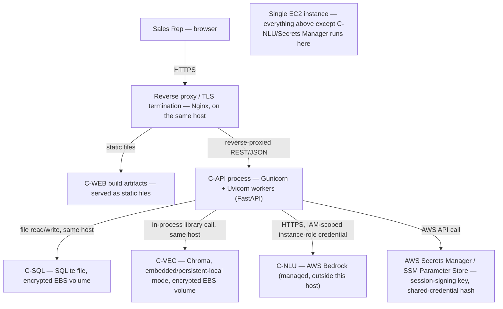

# Platform Design — Conversational CRM

- **Product name:** Conversational CRM / Relationship Memory Assistant
- **Document reference:** `PLATFORM-DESIGN-conversational-crm-T-1-v1.0`
- **Discipline:** `platform` (Workflow 2 — Solution Architecture)
- **Task:** T-1, scope `full-product-v1` — all 7 PRD features (F-1..F-7), all 21 stories (US-1..US-21), the same scope every other discipline in this workflow carries.
- **Owner:** Architect (role, not named individual)
- **Status:** Draft — pending independent validation and human gate (`platform_review`)
- **Version:** 1.0
- **Budget:** `constraints.budget_usd` is `null` — "no budget ceiling applies -- internal demo/hackathon project on seeded data, not a cost-constrained production deployment." A missing ceiling is not an authorization to over-build; every sizing decision below is still evidence-based and deliberately modest, not enterprise-scale (see Section 4).

## 0. Scope boundary (what this document does and does not cover)

This is the `platform` discipline's artifact — the last of Workflow 2's four disciplines to run. It owns **where this runs and how it gets there**: topology, sizing and the evidence behind it, environments and promotion, release gates, rollback, and the operational signal that tells anyone something went wrong.

It deliberately does **not** specify or re-decide:

- application structure, component responsibilities, or technology-compatibility rationale (owned by `solution`, already approved);
- database tables, fields, the API contract, or endpoint shapes (owned by `data_integration`, already approved);
- threats, controls, or measurable security/performance targets (owned by `security_nfr`, already approved) — this document **carries out** `security_nfr`'s controls that name `platform` as their implementation owner (principally SEC-9, SEC-6, and the infrastructure placement of SEC-11), it does not re-derive or re-justify them;
- anything that runs as code. Nothing in this document is an applyable script, Terraform module, Dockerfile, or CI config — Workflow 4 builds those from this design, and a human applies them. See Section 7 for the explicit line between what this document designs and what Workflow 4 implements.

Where this document needs something another discipline owns and it is missing or wrong, it says so as an open item (Section 9) rather than filling the gap. It does not re-raise `security_nfr`'s already-recorded cross-discipline finding against `data_integration` (`security_nfr.json` `returned_findings[0]`, id `RF-1`/`V-SEC2`: the API contract is missing login/logout operations and 429 responses) — that finding already has an owner and a recorded path back to workflow sign-off; duplicating it here would only make it harder to tell how many distinct problems exist.

## 1. Source references

| Role | Artifact | Path (relative to this workflow's own artifact root) | Version | SHA-256 (computed directly by this discipline) |
|---|---|---|---|---|
| `product_state` | Workflow 1 `workflow.json` (lock confirmation) | `../state/workflow-1-discovery-to-stories/workflow.json` | locked | `fb25e9c8829f6e0d0d9ccf9cddf5db8ae9b0cb7eba5873baff9e7e8bffc21b27` |
| `prd` | PRD | `../workflow-1-discovery-to-stories/docs/requirements/PRD-conversational-crm-v1.5.md` | 1.5 | `3960abdacf6ba3a27217d913aca01fa932bfb65373e572cdc4eeb6ac77dccc64` |
| `user_stories` | User Stories | `../workflow-1-discovery-to-stories/docs/stories/USER-STORIES-conversational-crm-v1.0.md` | 1.0 | `43fc3c0690db8cc6a0d85a837286912072fbcfdbfa55d3d37cb74c6abe8de73b` |
| `solution` | Solution Architecture | `docs/architecture/SOLUTION-ARCHITECTURE-conversational-crm-T-1-v1.0.md` | 1.0 | `99038391a4a33ae850e1ddc50e4709cfebb2b66525b10614f848c44b8368cc04` |
| `data_integration` | Data and Integration report | `docs/architecture/DATA-AND-INTEGRATION-conversational-crm-T-1-v1.0.md` | 1.0 | `98933f68639a8cf1640bc1d74c3007a17283bb6e35fd4970f4becb87318c4001` |
| `data_integration` | API Contract | `docs/architecture/API-CONTRACT-conversational-crm-T-1-v1.0.json` | 1.0 | `b048e263f2b43c43ee99e4844df48b12856a1cef977d3af2e65041db8d2ec745` |
| `data_integration` | Data Model | `docs/architecture/DATA-MODEL-conversational-crm-T-1-v1.0.md` | 1.0 | `66b0f4fb0b3462e8706eb48969efd704f7106777b33bc0fe1e895390e5da8dab` |
| `security_nfr` | Security and NFR | `docs/architecture/SECURITY-AND-NFR-conversational-crm-T-1-v1.0.md` | 1.0 | `e22ca533051b734fab63af5f151e61b1659c0a7a1f2a6d2cba1a670c070c88b6` |

All eight hashes above were computed directly by this discipline (`sha256sum` against the current file bytes on disk) before drafting, then cross-checked against `solution.json`, `data_integration.json`, and `security_nfr.json`'s own recorded values for the same files. **All eight match exactly — no drift found.** In particular, the PRD hash matches the same CRLF-normalized value `solution` originally flagged as Open Item OI-1 (a line-ending representation drift, content verified byte-identical, already resolved and not re-litigated here) and every Workflow 2 artifact hash matches the value fixed at that discipline's own gate approval.

Before drafting, this discipline confirmed: Workflow 1 is `locked` (`workflow.status: "locked"`, `gates.workflow_signoff.status: "approved"`, read directly from the `product_state` row above); `solution.gate.status`, `data_integration.gate.status`, and `security_nfr.gate.status` are all `"approved"` with `readiness: "ready"` (read directly in each role file); and every component in `stack.components[]` (`workflow.json`) declares a `technology`, so no `needs_input` stop applies.

## 2. Topology — what runs where, on what, with what attached

**Every component this document places is one of `solution`'s five already-named components — this document introduces no new logical component, only where each one physically runs.** Component IDs match `solution` Section 2 exactly: C-WEB, C-API, C-SQL, C-VEC, C-NLU.

**Concretely, one single compute host** (a single EC2 instance, or an equivalently single, non-clustered container/task — the specific compute primitive is Workflow 4's to provision; what platform fixes here is that there is exactly **one** running instance of it, per Section 3's sizing evidence and `security_nfr`'s NFR-9) runs:

- **Nginx** as the sole internet-facing process: TLS termination, serves the built C-WEB static bundle directly, and reverse-proxies every `/api/*`-style request to C-API. This is also where the reverse-proxy-layer rate-limiting placement in decision PLA-9 lives.
- **C-API** (Gunicorn managing a small pool of Uvicorn worker processes running the FastAPI app) — the sole process that ever touches C-SQL, C-VEC, or C-NLU, unchanged from `solution`'s SOL-7 boundary.
- **C-SQL** — the SQLite file itself, on a dedicated, encrypted data volume attached to the same host (not the ephemeral root/container filesystem), so it survives an application restart or redeploy.
- **C-VEC** — Chroma running in **embedded/persistent-local mode**, in-process inside C-API, with its own persistent directory on the same encrypted data volume as C-SQL. This is a platform decision (PLA-2, Section 8) resolving `security_nfr`'s Open Item OI-11, which `solution`'s SOL-9 explicitly left open.

**Off-host:** only **C-NLU (AWS Bedrock)**, a managed AWS service outside this host entirely — unchanged from `solution`'s TB-5 boundary — and **AWS Secrets Manager / SSM Parameter Store**, holding the shared-login credential's hash and the session-signing key (never the host's own disk), consistent with SEC-3.

No message broker, task queue, or worker fleet exists anywhere in this topology, consistent with `solution`'s SOL-3 (every crossing is synchronous, in-request) — platform introduces no asynchronous infrastructure a synchronous architecture does not need.

## 3. Sizing, with evidence

| Resource | Sizing | Evidence |
|---|---|---|
| Compute | One instance sized at roughly 2 vCPU / 2 GiB RAM (e.g. an AWS `t3.small`-class burstable instance, or the nearest equivalent single-task container allocation) | (a) `security_nfr`'s NFR-9 caps expectations at "best-effort, single-instance availability; no formal SLA or HA target," explicitly ruling out a fleet; (b) the compute-heavy NLU/embedding inference happens inside Bedrock (SOL-3, TB-5), not on this host — this host's CPU load is I/O-bound request orchestration (FastAPI request handling, SQLite reads/writes, a Chroma similarity search over a small seeded corpus), not model inference; (c) `security_nfr`'s NFR-3 concurrency target is "at least two concurrent shared-login sessions," not a production user population; (d) no story or NFR requests a specific throughput figure. **`[INFERRED — needs confirmation]`** — no target repository exists to profile against (`inputs.target_repository: null`), so this is a reasoned starting point, not a measured one. See Open Item OI-14. |
| Storage (data volume) | A small (e.g. 10–20 GiB) encrypted block volume attached to the host, separate from the OS/application root volume, holding only `/var/lib/crm/db` (the SQLite file) and `/var/lib/crm/chroma` (Chroma's persistent directory) | Sized for a seeded demo dataset (a handful of accounts, contacts, and a short interaction history per PRD scope), not a production data volume — grows slowly since every write is a short structured row or a small embedded-chunk vector, not media storage (business-card images are explicitly never persisted, per `data_integration`'s DAT-8). Kept on a **separate** volume from the OS disk specifically so a host replacement (Section 6) does not require re-attaching or re-imaging application data alongside the OS. |
| Network | No load balancer, no CDN, no multi-AZ networking | No NFR calls for geographic distribution, and NFR-9 explicitly rejects HA/multi-instance topology (`security_nfr` Section 4.2, "Horizontal scaling / high-availability architecture for C-API" — rejected). A single public endpoint behind Nginx/TLS is sufficient for a single-team demo audience. |
| Secrets store | AWS Secrets Manager or SSM Parameter Store (SecureString) — negligible sizing, priced per-secret/per-call, not a capacity decision | Directly carries out SEC-3/SEC-6's storage requirement; no sizing evidence needed beyond "a managed secret store exists," since the credential set is small and low-traffic (looked up at process start, not per-request). |

No sizing figure above claims to be a load-tested number — none exists yet, since nothing in Workflow 2 has been built. Every figure is this discipline's own conservative, evidence-based starting point, explicitly re-opened as Open Item OI-14 for confirmation once Workflow 3/4 produce something real to measure.

## 4. What the absent budget ceiling buys, and what it does not

`constraints.budget_usd` is `null` — there is no dollar ceiling to size against. That absence is deliberately **not** read as license to build an enterprise-scale platform; the instruction accompanying this discipline's task is explicit that sizing should be "evidence-based but modest/right-sized for a small demo, not enterprise-scale," and every NFR `security_nfr` recorded reinforces the same scope (NFR-9's explicit single-instance/no-HA target above all).

**What the absent ceiling genuinely buys, evidenced against this design:**

- Enabling disk-level encryption (SEC-9) and a managed secrets store (SEC-3/SEC-6) without needing to trade them off against a dollar figure — both are enabled outright in Section 2/8 rather than flagged as "if budget allows."
- Running CI on every commit (Section 6) rather than economizing by testing only before a demo.
- Using a dedicated, non-default OS user and a separate encrypted data volume (Section 8, PLA-4) rather than the cheapest possible single-disk, single-user layout.

**What the absent ceiling does *not* buy — and this design deliberately does not spend on, because no NFR asks for it:**

- Multi-AZ or multi-instance high availability, or any auto-scaling fleet — NFR-9 explicitly rejects this target (`security_nfr` Section 4.2).
- A managed/networked Chroma cluster, a message broker, or any worker fleet — none is named in `stack.components[]`, and SOL-3 already establishes there is no asynchronous processing to scale.
- A CDN, WAF, or managed bot-detection layer in front of C-WEB/C-API — `security_nfr` Section 4.2 explicitly rejects a WAF for this scope ("no stated requirement or budget signal justifies it for an internal demo with a small, known user population").
- Cross-region disaster recovery or a formal RPO/RTO target — no story or NFR states one; Section 6's backup-before-deploy procedure is a rollback safety net for this project's own deploys, not a DR posture.
- A dedicated observability/APM platform (e.g. distributed tracing) — SOL-1's single-instance modular monolith has no inter-service hops to trace; Section 6's CloudWatch-based signal is sized to match.

If a future target from `security_nfr` cannot be met inside this modest footprint, that is a finding to raise here, not something to quietly round up. No such shortfall was found in this pass: NFR-6/NFR-7's latency targets and NFR-3's concurrency target are all achievable evidence-based within the sizing above (Section 3); the one genuine open question is whether the *specific instance size chosen* holds up once real code exists to measure (Open Item OI-14), not whether the class of infrastructure is adequate.

## 5. Environments and promotion

| Environment | Purpose | What differs from `demo` |
|---|---|---|
| `dev` | An individual engineer's local machine or personal sandbox instance, used while building against this design in Workflow 3/4 | May stub/mock C-NLU (Bedrock) and use a disposable local SQLite file + a disposable local Chroma persistent directory, specifically to avoid incurring real Bedrock cost/latency on every iteration. Never holds the shared-login credential used in `demo`. |
| `ci` | An ephemeral environment spun up per commit/pull request, torn down immediately after | Runs the automated test suite (Section 6) against a fresh, throwaway SQLite file and a mocked/stubbed C-NLU and C-VEC — no real AWS spend, no real credential, no persistent volume. Exists purely to gate a merge, never serves a real user. |
| `demo` | The one long-lived deployed environment — this project's practical equivalent of "production," since the whole point of this task is a live, demoable system | The only environment holding the real shared-login credential (SEC-1/SEC-3), the real least-privilege Bedrock IAM role (SEC-6), the real persistent SQLite/Chroma data volume (Section 2/3), and the only one a rep or a demo audience actually uses. |

**Promotion flow:** a commit merged to the main branch triggers `ci` automatically (build + automated test suite, Section 6). A passing `ci` run makes a build artifact *available* to deploy — it does **not** automatically deploy it. Promoting that artifact to `demo` is always a separate, explicit, human-triggered step (Section 6), never an automatic consequence of `ci` passing, because `demo` is the one environment holding the team's live, in-use data.

This three-environment shape is deliberately smaller than a typical enterprise dev/staging/production progression — there is no separate "staging" tier, because there is only one real deployed target for this scope (see Section 4: no HA, no multi-region, one small demo audience). Adding a fourth tier would be spending operational complexity a single-persona demo has no stated need for.

## 6. Release gates, rollback, and operational signal

### 6.1 Release gate (what must be true before a build reaches `demo`)

1. `ci` passes: the automated test suite (unit tests over extraction/classification logic, an API-contract schema validation pass against `data_integration`'s OpenAPI document, and security-control tests for every currently-implementable control — authentication required on every non-public operation, the 5 MB/`image/jpeg`|`image/png` upload ceiling rejecting before any Bedrock call per SEC-7/NFR-8, and prompt-template delimiting present per SEC-8) all pass.
2. A human explicitly triggers the `demo` deploy step. This is never automatic — root `CLAUDE.md`'s standing rule ("never run a destructive operation... without an explicit human confirmation step first") applies directly here, because `demo` holds the team's live, in-use SQLite/Chroma data, and a bad deploy can affect data a real demo depends on.
3. Immediately before the deploy proceeds, the deploy step takes a timestamped backup of the current `demo` SQLite file and Chroma persistent directory to a separate location (e.g. a versioned, encrypted S3 bucket) — the concrete rollback mechanism in 6.2 depends on this existing.

### 6.2 Rollback

| Change type | Rollback mechanism |
|---|---|
| Application code only (no schema/data-shape change) | Redeploy the immediately-prior tagged build artifact. Since C-SQL/C-VEC's on-disk shape is unchanged, no data action is needed — this is the common case and the cheapest to reverse. |
| A change that also alters C-SQL's schema or C-VEC's collection shape | Redeploy the prior build artifact **and** restore the matching pre-deploy backup taken in 6.1, rather than running an old build against a new-shape data volume (or vice versa) — mixing the two is exactly the kind of silent-corruption risk a rollback exists to avoid. |
| A host-level failure (the single instance itself becomes unreachable or is terminated) | Provision a replacement host from the same build artifact and IAM/secrets configuration (Section 2/8), then re-attach or restore the separate, persistent data volume (Section 3) — the volume is deliberately kept independent of the host's own lifecycle so this recovery does not depend on the failed host still being reachable. |

**Open dependency, disclosed rather than assumed away:** `data_integration` has not yet defined a schema-migration/versioning mechanism for C-SQL (e.g. a tool like Alembic). Until one exists, the backup-and-restore step above is the *only* safety net for a schema-affecting deploy — it does not by itself support running two schema versions side by side during a gradual rollout. Recorded as Open Item OI-15, not fixed here (that mechanism is `data_integration`'s or Workflow 3/4's to introduce, not something platform can invent into another discipline's already-approved artifact).

### 6.3 Operational signal — what tells anyone it went wrong

- **Process-level:** the host's process supervisor (e.g. `systemd`, or the container runtime's own restart policy) restarts C-API automatically on crash and records the restart in the system journal — the first, cheapest signal that something failed.
- **Metrics and logs:** a CloudWatch agent (or equivalent) ships (a) host metrics — CPU, memory, and disk-space specifically for the data volume in Section 3, since that volume filling up is a real failure mode for an ever-growing SQLite/Chroma store; (b) application logs that are SEC-10-compliant by construction (IDs and `error_code`s only, never raw payloads, images, or the session token — the same discipline the application itself is required to hold, carried through to what platform ships off-host).
- **Alarms** on: repeated process restarts within a short window; a sustained 5xx error rate; the data volume crossing a disk-space threshold; and the Bedrock invocation error rate (a rising error rate there is exactly the kind of "TB-5 credential or connectivity problem" `security_nfr`'s SEC-6 analysis flags as worth noticing quickly, not after a demo fails live).
- **Security-relevant events** (once SEC-1/SEC-5/SEC-11's login/lockout/rate-limit operations exist in the API contract — currently tracked as `security_nfr`'s Open Item OI-13/`RF-1`, not duplicated here) are treated as the same class of alarm-worthy signal the moment they exist: a spike in login lockouts or rate-limit rejections is an early-warning sign of misuse, not just a UX inconvenience.

No dedicated distributed-tracing/APM platform is introduced (Section 4) — SOL-1's single-instance, no-inter-service-hop topology has nothing for a trace to span that host-level logs and metrics do not already show.

## 7. The boundary with Workflow 4 — what this document designs vs. what Workflow 4 implements

| Designed here (platform, Workflow 2) | Implemented by Workflow 4 |
|---|---|
| The topology shape: one host, which components run on it, which run off it (Section 2) | The actual Infrastructure-as-Code (e.g. Terraform/CloudFormation/CDK) that provisions that host, its network, and its attached volume |
| Sizing class and the evidence behind it (Section 3) | The actual instance/task launch, and re-measuring real load to confirm or revise the sizing (Open Item OI-14) |
| Which controls run where — file-permission/encryption shape (PLA-4), secrets delivery mechanism (PLA-5), IAM least-privilege shape (carrying SEC-6) | The actual IAM policy JSON, the actual Secrets Manager/Parameter Store entries and their real values, the actual OS user/permission setup on the provisioned host |
| The environment list and what differs between them (Section 5) | The actual CI pipeline configuration (e.g. GitHub Actions/GitLab CI YAML), the actual `dev`/`ci` scaffolding (mocks/stubs for C-NLU/C-VEC) |
| The release-gate checklist, the rollback mechanism per change type, and the operational-signal design (Section 6) | The actual backup/restore scripts, the actual CloudWatch alarm definitions and their tuned thresholds, the actual deploy tooling that performs the human-triggered `demo` promotion |
| That platform accepts NFR-9's single-instance/no-HA scope outright, rather than quietly building HA anyway (Section 4) | Nothing — this is a design acceptance, not an implementation task |

Nothing in this document is itself runnable: no script, no config file, no IaC module is included or implied to be copy-pasted as-is. A human applies whatever Workflow 4 builds from this design, consistent with this discipline's own boundary (Section 0) and this framework's standing rule against producing anything intended to be run directly from Workflow 2.

## 8. Decisions

Decisions carry this discipline's own ID prefix (`PLA-N`), unique within this workflow's four-discipline ID space alongside `solution`'s `SOL-N`, `data_integration`'s `DAT-N`, and `security_nfr`'s `SEC-N`.

### PLA-1 — Deployment topology: single host, colocated data stores
- **Category:** Infrastructure topology
- **Choice:** One single compute host runs Nginx (TLS termination, static C-WEB hosting, reverse proxy), C-API, and both data stores' on-disk state (C-SQL's SQLite file, C-VEC's embedded Chroma persistent directory) colocated on the same encrypted data volume. C-NLU (Bedrock) remains the one component that is genuinely off-host, unchanged from `solution`'s TB-5 boundary.
- **Alternatives considered:** A multi-service container-orchestration platform (ECS/Kubernetes) with C-API, C-VEC, and static hosting as separate services — rejected: no scaling requirement exists to justify the added operational surface, and it would introduce new network hops at what are currently same-process/same-host boundaries (TB-3/TB-4) that `security_nfr` has already analysed as *not* crossing a network. Separate static hosting via S3+CloudFront for C-WEB — considered and rejected: no stated latency/geographic-distribution requirement justifies a second AWS service surface for a small, single-team demo audience.
- **Rationale:** `solution`'s SOL-1 already fixed a single modular-monolith backend; `security_nfr`'s NFR-9 explicitly scopes to single-instance, best-effort availability with no HA target. Colocating C-SQL/C-VEC's files with C-API keeps TB-3/TB-4 as the same-process trust zone `security_nfr` already analysed (Section 2.2 of `SECURITY-AND-NFR`) — introducing a network hop here would silently invalidate that analysis and reopen `security_nfr`'s own conditionally-rejected mTLS control (Section 4.2, "Revisit only if `platform` chooses a networked... Chroma deployment mode").
- **Source:** `solution` SOL-1, SOL-7; `security_nfr` NFR-9, Section 2.2 (TB-3/TB-4), Section 4.2 (HA rejection).
- **Owner:** platform-architect. **Status:** proposed.

### PLA-2 — Vector-store deployment mode: embedded, not networked (resolves `security_nfr`'s Open Item OI-11)
- **Category:** Data-store deployment mode
- **Choice:** Chroma (C-VEC) runs in embedded/persistent-local mode — an in-process library instance inside C-API, writing to a persistent directory on the same host — not as a separate, networked Chroma server process.
- **Alternatives considered:** A standalone, networked Chroma server (separate process/service C-API talks to over the network) — rejected: no story or NFR requires multiple independent consumers of the vector store or independent scaling of retrieval versus the rest of C-API; introducing one would create a new TB-4 network hop that does not exist today.
- **Rationale:** `solution`'s SOL-9 explicitly left this deployment-mode choice to `platform` ("the specific deployment mode (embedded vs. server) is `platform`'s to finalize, not this document's"), and `security_nfr`'s Open Item OI-11 names exactly this decision as changing TB-4's threat profile depending on which way it goes. Choosing embedded means TB-4 **remains** the same-process/same-host boundary `security_nfr` already analysed — no revisit of that analysis, and no revisit of the conditionally-rejected mTLS control, is triggered by this decision. This is also the only choice consistent with PLA-1's single-host topology and NFR-9's single-instance scope.
- **Source:** `solution` SOL-9; `security_nfr` Open Item OI-11, Section 2.2 (TB-4), Section 4.2 (mTLS rejection).
- **Owner:** platform-architect. **Status:** proposed.

### PLA-3 — Compute sizing: one modestly-sized instance
- **Category:** Sizing, with evidence
- **Choice:** One instance in the ~2 vCPU / 2 GiB RAM class (e.g. AWS `t3.small` or the nearest equivalent).
- **Alternatives considered:** A larger instance class — rejected as unevidenced over-provisioning: no story, NFR, or profiling data justifies more headroom than a small seeded dataset and I/O-bound orchestration need. A smaller/burstable-minimum class (e.g. `t3.micro`) — rejected: real risk of memory pressure once Gunicorn/Uvicorn workers, FastAPI, and Chroma's in-process index are all resident together, even for a small corpus.
- **Rationale:** See Section 3's evidence table in full. In short: NFR-9 caps ambition at single-instance/best-effort; the compute-heavy work (model inference, embedding generation) happens inside Bedrock, off this host, per SOL-3/TB-5; NFR-3's concurrency target is two sessions, not a production population.
- **Source:** `security_nfr` NFR-3, NFR-6, NFR-7, NFR-9; `solution` SOL-3.
- **Owner:** platform-architect. **Status:** proposed. Carried as `[INFERRED — needs confirmation]` — see Open Item OI-14.

### PLA-4 — Data-at-rest control implementation (carries out `security_nfr`'s SEC-9)
- **Category:** Data-at-rest / file-permission boundary
- **Choice:** C-SQL's file and C-VEC's persistent directory live on a dedicated, encrypted data volume; both are owned by a dedicated, non-root OS user the C-API process runs as (not `root`, not a shared/default account); the containing directories are permissioned so no other OS principal on the host has read access.
- **Alternatives considered:** Default root-owned or world-readable application directories — rejected: this is exactly the risk SEC-9 names ("a separate host-level compromise not involving C-API itself" should not trivially recover the raw files). An unencrypted volume — rejected: SEC-9 asks for disk-level encryption "wherever the hosting environment supports it," and an EC2/EBS-class environment supports it at no meaningful cost, so there is no reason tied to the (absent) budget ceiling to skip it.
- **Rationale:** `security_nfr`'s SEC-9 is explicitly recorded as "a requirement on `platform`, not implemented by this discipline" (`security_nfr.json` decision `SEC-9`) — this decision is `platform`'s own carrying-out of that requirement, not a re-derivation of why it is needed.
- **Source:** `security_nfr` SEC-9; Section 2.2 (TB-3/TB-4 analysis).
- **Owner:** platform-architect (design here); Workflow 4 (implementation). **Status:** proposed.

### PLA-5 — Secrets and credential delivery
- **Category:** Secrets management
- **Choice:** The Bedrock-invocation IAM credential (SEC-6) is delivered via the host's own IAM instance profile/role — never a long-lived access key stored on disk. The shared-login credential's hashed secret and the session-signing key (SEC-1/SEC-3) are stored in AWS Secrets Manager or SSM Parameter Store (`SecureString`) and injected as environment variables at process start.
- **Alternatives considered:** Credentials in a checked-in `.env`/config file — rejected outright: violates root `CLAUDE.md`'s standing rule against credentials in artifacts and directly contradicts SEC-3. A long-lived IAM user access key stored on the host — rejected: an instance-profile role is both more tightly scopable and has no long-lived key that can leak independently of the host itself.
- **Rationale:** Directly carries out SEC-3 (credential storage) and SEC-6 (least-privilege Bedrock egress) with a concrete, named AWS mechanism, rather than leaving "how" open.
- **Source:** `security_nfr` SEC-3, SEC-6.
- **Owner:** platform-architect. **Status:** proposed.

### PLA-6 — Environments and promotion shape
- **Category:** Environment topology
- **Choice:** Three environments — `dev` (local/individual, may stub Bedrock), `ci` (ephemeral, per-commit, mocked externals, no real spend), `demo` (the one long-lived deployed environment, real credentials, real Bedrock calls) — see Section 5 in full.
- **Alternatives considered:** A full enterprise-style dev/staging/production progression — rejected as disproportionate: there is exactly one real deployed target for this scope, and a fourth tier would add promotion ceremony with no second real environment to justify it. A single environment with no automated `ci` gate — rejected: it would remove the only automated backstop before a change reaches the one environment the team actually uses live.
- **Rationale:** Matches the "small demo, not enterprise scale" framing while still giving every change an automated gate before it can reach `demo`.
- **Source:** `constraints.budget_usd`/`constraints.source` (demo scope framing); `security_nfr` NFR-9.
- **Owner:** platform-architect. **Status:** proposed.

### PLA-7 — Release gate, human-triggered deploy, and backup-before-deploy
- **Category:** Release process
- **Choice:** `ci` must pass before a build is deployable; promoting a build to `demo` is always an explicit, human-triggered step, never automatic; that step always takes a timestamped backup of `demo`'s SQLite file and Chroma persistent directory immediately before proceeding. See Section 6.1/6.2 in full.
- **Alternatives considered:** Fully automatic deploy-on-green — rejected: root `CLAUDE.md`'s standing rule requires an explicit human confirmation step before any operation that could affect a running system, and `demo` holds the team's live, in-use data. Skipping the pre-deploy backup — rejected: it would make rollback of any schema-affecting deploy actively unsafe, risking silent data loss.
- **Rationale:** Ties the release process directly to this framework's own standing rule on destructive/risky operations, and gives Section 6.2's rollback mechanism something real to restore from.
- **Source:** Root `CLAUDE.md` ("never run a destructive operation... without an explicit human confirmation step first"); `security_nfr` NFR-3/`data_integration` DAT-3 (the concurrency mechanism a rollback must not silently corrupt).
- **Owner:** platform-architect. **Status:** proposed.

### PLA-8 — Operational signal: process supervision + host-level metrics/logs, no APM platform
- **Category:** Observability
- **Choice:** Process-level auto-restart, plus CloudWatch-class host metrics and SEC-10-compliant application-log shipping, alarmed on restart count, 5xx rate, disk-space threshold, and Bedrock error rate. See Section 6.3 in full. No distributed-tracing/APM platform is introduced.
- **Alternatives considered:** No centralized log/metric shipping (manual log inspection only) — rejected: gives nobody a signal until a rep notices something is broken live. A full APM/tracing stack — rejected as disproportionate: SOL-1/SOL-3's single-instance, no-inter-service-hop topology has no distributed call graph for a trace to usefully show beyond what host-level logs already capture.
- **Rationale:** The cheapest AWS-native option that still gives a genuine "did it go wrong" signal, matching Section 4's modest-not-enterprise framing.
- **Source:** `security_nfr` NFR-9, SEC-10.
- **Owner:** platform-architect. **Status:** proposed.

### PLA-9 — Reverse-proxy-layer placement for rate limiting (interim infrastructure control, not a fix to `data_integration`'s contract gap)
- **Category:** Defense-in-depth placement
- **Choice:** The reverse proxy (Nginx) in front of C-API can enforce a request-rate ceiling (e.g. `limit_req`, keyed by session cookie or client IP) as an infrastructure-layer placement for SEC-11's per-session rate limit, usable as soon as Workflow 3/4 build the application — independent of whether `data_integration`'s API contract has yet added the formal `429` response schema `security_nfr` already flagged as missing (`security_nfr` Open Item OI-13 / `returned_findings[0]` `RF-1`).
- **Alternatives considered:** Waiting until the app-level `429` response exists before adding any rate limiting at all — rejected: it would leave TB-2's "Deny" cost/DoS exposure (`security_nfr` Section 2.2) completely uncontrolled for however long OI-13 takes to resolve. Building the actual application-level throttling/response logic here — explicitly **not** this discipline's to do; that is `data_integration`'s API-contract territory (already the subject of `RF-1`) and Workflow 3/4's application-code territory, not a platform infrastructure decision.
- **Rationale:** Gives a real, deployable control today without overstepping into the contract change that is legitimately `data_integration`'s to make. This decision does not resolve, duplicate, or supersede OI-13/`RF-1` — it only names where platform's own layer can help in the meantime, and Workflow 3 should still return a proper, contract-defined `429` once that gap is closed.
- **Source:** `security_nfr` SEC-11, Open Item OI-13, `returned_findings[0]` (`RF-1`, acknowledged, not resolved by this discipline).
- **Owner:** platform-architect. **Status:** proposed.

## 9. Traceability

Every row's `acceptance_criteria` is copied verbatim from Workflow 1's `roles/stories.json` (the same source `solution`, `data_integration`, and `security_nfr` all used), not paraphrased. `component_ids` match the same component set every other discipline's traceability table uses for the same story. `operation_ids`/`entity_names` are recorded as `[]` with a `not_applicable` note in the structured state file for every row — this is the same disclosed `check-artifacts` narrowed-tool-scope workaround `solution` and `security_nfr` already used (a narrowed single-discipline check cannot load `data_integration`'s API contract to validate against unless the checked discipline *is* `data_integration`), not an unknown or incorrect mapping. The real operation/entity mapping for every story is already established in `data_integration`'s own approved traceability table; this document's `verification_scenarios` are platform's own — deployment, persistence, sizing, and rollback-safety concerns — not a restatement of the functional or security scenarios the other three disciplines already recorded.

### F-1 — Conversational Interaction Capture

**US-1**
- acceptance_criteria: ["The system must create a structured interaction note and associate it with the correct customer thread when the rep's typed entry unambiguously matches exactly one seeded customer account.", "The system must save the entry as a new interaction note when the entry contains at least one non-whitespace character."]
- component_ids: C-WEB, C-API, C-SQL, C-NLU
- verification_scenarios: Confirm a captured interaction row survives an application restart/redeploy on the `demo` host (the SQLite file lives on the persistent, encrypted data volume per PLA-4, not ephemeral/container-local storage). Confirm the deployed instance's IAM role permits exactly the Bedrock invocation this capture triggers, scoped per SEC-6/PLA-5, and no broader AWS permission.

**US-2**
- acceptance_criteria: ["The system must reject the submission with an explicit 'cannot save an empty note' message, and must not create any note record, when the rep submits an empty or whitespace-only entry.", "The system must flag the note as 'unmatched — needs customer selection' — rather than attaching it to a default or incorrect account — when no seeded customer account can be unambiguously identified from the entry text."]
- component_ids: C-WEB, C-API, C-NLU, C-SQL
- verification_scenarios: Confirm the rejection path leaves the persistent SQLite file unchanged (verifiable via a pre/post backup diff, PLA-7), and that no `raw_text`-containing log line reaches the shipped CloudWatch-class log stream (SEC-10/PLA-8).

**US-3**
- acceptance_criteria: ["The system must attach a previously flagged 'unmatched' note to the customer thread the rep selects when the rep manually resolves the flag.", "The system must leave the note in the unmatched/needs-selection state — rather than guessing an account — when the rep has not yet resolved it."]
- component_ids: C-WEB, C-API, C-SQL
- verification_scenarios: Confirm resolving an unmatched note persists across a redeploy the same way as US-1 — the row already exists, so no separate migration step is triggered by this flow.

**US-4**
- acceptance_criteria: ["[INFERRED — needs confirmation] The system must extract the contact's name, company and role from a scanned business-card image into the structured interaction note when the image is legible and contains recognizable contact fields. The OCR mechanism was never discussed in discovery (PRD Assumption 5, Open Question 5); whether this is worth building for the demo at all is still open.", "[INFERRED — needs confirmation] The system must inform the rep that manual entry is required — without fabricating contact details — when the image cannot be read or no contact fields are recognized."]
- component_ids: C-WEB, C-API, C-NLU, C-SQL
- verification_scenarios: Confirm the business-card image itself never lands in the deployed instance's persistent storage or logs (`data_integration`'s DAT-8, reaffirmed by SEC-10), and confirm the 5 MB upload ceiling (SEC-7/NFR-8) is additionally enforced at the reverse-proxy layer (e.g. Nginx `client_max_body_size`) as a first line of defense before the request reaches C-API.

**US-5**
- acceptance_criteria: ["The system must extract every distinct attendee name mentioned in a typed free-text interaction entry as a separate structured attendee item — recording one item per distinct person named (e.g., 'met Priya and Arjun from Acme...' must yield two attendee items, not one merged string) — when the entry text names at least one identifiable person.", "The system must record zero attendee items for that interaction — rather than fabricating a name — when the entry text names no one.", "[INFERRED — needs confirmation] The exact name-recognition/disambiguation mechanism was never discussed in discovery (PRD Assumption 14, Open Question 15); only the underlying capability (AC1/AC2) is treated as confirmed."]
- component_ids: C-API, C-NLU, C-SQL
- verification_scenarios: Same persistence and IAM-scoping confirmation as US-1 — attendee extraction shares the same `captureInteraction` call and the same deployed Bedrock invocation path.

### F-2 — Automatic Extraction & Thread Tagging

**US-6**
- acceptance_criteria: ["The system must extract each distinct commitment, follow-up or next step mentioned in a captured note's text as a separate tracked item when the note contains one or more of them.", "The system must record no commitment items when the note describes discussion only, with no forward-looking commitment."]
- component_ids: C-API, C-NLU, C-SQL
- verification_scenarios: Confirm commitment rows persist across restart/redeploy the same way as US-1 — same SQLite file, same backup/restore procedure (PLA-4/PLA-7).

**US-7**
- acceptance_criteria: ["The system must record a due date on an extracted commitment when the captured text states a concrete date or an unambiguous relative date term resolvable against the interaction's timestamp (e.g., 'by Friday').", "The system must mark the commitment's due date as unspecified — rather than guessing a date — when the text uses a vague temporal reference (e.g., 'soon,' 'sometime') or gives no date information at all."]
- component_ids: C-API, C-NLU, C-SQL
- verification_scenarios: Same persistence confirmation as US-6 — no additional platform-specific behavior beyond the shared SQLite file.

**US-8**
- acceptance_criteria: ["The system must tag every extracted discussion point and commitment to the same customer thread as its source interaction note when that note is matched to a thread.", "The system must flag an extracted item for manual thread assignment — rather than tagging it to an incorrect thread — when the source note itself is unmatched to a customer thread (per F-1)."]
- component_ids: C-API, C-SQL
- verification_scenarios: Confirm the account-tagging write lands in the same request/transaction as the rest of `captureInteraction`, so a mid-deploy restart cannot leave a commitment tagged inconsistently with its parent interaction — this depends on the deployed instance actually running SQLite in the WAL/busy-timeout configuration `data_integration`'s DAT-3 specifies, which PLA-1's colocated topology makes possible but does not by itself configure (a Workflow 4 implementation detail, Section 7).

### F-3 — Natural-Language Memory & Q&A

**US-9**
- acceptance_criteria: ["The system must answer a natural-language question about a customer's most recent discussion by returning content drawn from that customer's most recent interaction note(s) when the thread has at least one captured note.", "The system must respond that no history exists yet for that customer when the thread is empty."]
- component_ids: C-WEB, C-API, C-SQL, C-VEC, C-NLU
- verification_scenarios: Confirm the deployed instance meets NFR-7's p95 ≤ 8s target for a full Q&A round trip (embedded-Chroma retrieval colocated on the same host per PLA-2, plus a Bedrock synthesis call) under the sizing assumed in PLA-3; re-measure and adjust sizing (Open Item OI-14) if the target is missed once real code exists to test.

**US-10**
- acceptance_criteria: ["The system must answer a natural-language question about the rep's own open commitments for a customer by listing the commitments extracted and tagged to that thread when any exist.", "The system must state that there are no open commitments for that customer when none exist."]
- component_ids: C-WEB, C-API, C-SQL, C-NLU
- verification_scenarios: Same NFR-7 latency/sizing confirmation as US-9.

**US-11**
- acceptance_criteria: ["The system must answer a natural-language question about interaction attendees by returning the contact names extracted from that thread's interaction notes when attendee names were captured.", "The system must state that no attendee information was captured when none was extracted."]
- component_ids: C-WEB, C-API, C-SQL, C-NLU
- verification_scenarios: Same NFR-7 latency/sizing confirmation as US-9.

**US-12**
- acceptance_criteria: ["The system must resolve and answer against the correct customer thread when a query names exactly one customer that matches a seeded account.", "The system must respond that it could not identify the customer — rather than guessing or returning another customer's data — when the query names no customer or an unrecognized one."]
- component_ids: C-WEB, C-API, C-NLU, C-SQL
- verification_scenarios: Confirm the unrecognized-customer rejection path still completes within the same NFR-7 latency budget as the success path — it is a full response, not a fast-path bypass, on the deployed instance.

### F-4 — Proactive Commitment Tracking

**US-13**
- acceptance_criteria: ["The system must list every open commitment whose due date has passed as 'overdue' when the current date is past that due date, and must exclude a commitment from this list once it is marked complete.", "[INFERRED — needs confirmation] The system must list every open commitment whose due date falls within the next 7 days as 'due soon,' and must reclassify it as 'overdue' instead once its due date has passed. The 7-day window is a carried-over illustrative placeholder from the PRD, not a confirmed value (PRD Open Question 6).", "The system must list a commitment with an unspecified due date (per F-2) separately from the due-soon/overdue list — rather than omitting it entirely or treating it as overdue — when no due date was captured."]
- component_ids: C-WEB, C-API, C-SQL
- verification_scenarios: Confirm this filter-only read never triggers a Bedrock invocation on the deployed instance (verifiable via a CloudWatch-class metric filter counting Bedrock calls per operation, PLA-8) and completes well inside NFR-6's budget, since it involves no model call.

**US-14**
- acceptance_criteria: ["The system must state explicitly that there are no due-soon or overdue commitments — rather than showing an empty list with no explanation — when none exist."]
- component_ids: C-WEB, C-API, C-SQL
- verification_scenarios: Same no-Bedrock-call confirmation as US-13, for the empty-state path.

### F-5 — Brief-Me-on-Customer Summary

**US-15**
- acceptance_criteria: ["The system must generate a summary containing recent discussion history, open commitments and stakeholder/contact names for a named customer when that customer has at least one captured note, and must state that no history exists yet for that customer — rather than generating a summary with fabricated content — when the thread is empty.", "[INFERRED — needs confirmation] The system must return a bounded, short-form summary (a few sentences or bullets, not a multi-page document) under normal conditions, and must still return whatever partial content is available, rather than failing the whole request, when data for one of the summary components is missing (PRD Open Question 7)."]
- component_ids: C-WEB, C-API, C-SQL, C-VEC, C-NLU
- verification_scenarios: Same NFR-7 latency/sizing confirmation as US-9 — `generateBrief` follows the same retrieval-plus-synthesis shape.

**US-16**
- acceptance_criteria: ["[INFERRED — needs confirmation] The system must synthesize the opportunity/deal-status component narratively from that customer's recorded interaction notes and commitments — since no discrete deal-stage field exists in the structured store — when the thread contains content indicating where the deal/opportunity stands (PRD Assumption 13, Open Question 14).", "The system must state that no opportunity/deal-status information has been captured yet for that customer — rather than fabricating a stage or outcome — when the thread contains no such content."]
- component_ids: C-API, C-SQL, C-VEC, C-NLU
- verification_scenarios: Same NFR-7 latency/sizing confirmation as US-15.

**US-17**
- acceptance_criteria: ["The system must generate the summary for a named customer when the request unambiguously identifies exactly one seeded customer account.", "The system must respond that it could not identify the requested customer — rather than guessing — when the request names an unrecognized or ambiguous customer."]
- component_ids: C-WEB, C-API, C-NLU, C-SQL
- verification_scenarios: Same rejection-path latency confirmation as US-12, applied to `generateBrief`.

### F-6 — Customer Profile / Conversational History View

**US-18**
- acceptance_criteria: ["The system must display a customer's captured notes and extracted items in chronological order on that customer's profile view when at least one note exists.", "The system must display an explicit 'no history yet' state when none exists."]
- component_ids: C-WEB, C-API, C-SQL
- verification_scenarios: Confirm reading a customer's full interaction/attendee/commitment history from the deployed SQLite file does not regress against NFR-6's spirit as seeded data volume grows on the sizing chosen in PLA-3 — this path makes no model call, so it should stay well inside any latency budget already evidenced for the model-calling paths.

**US-19**
- acceptance_criteria: ["The system must display a newly captured note and its extracted items on the correct customer's profile view automatically, without requiring the rep to take further action, when the note is tagged to that customer's thread.", "The system must not display that note or its items on any other customer's profile view when it is not tagged to that customer."]
- component_ids: C-WEB, C-API, C-SQL
- verification_scenarios: Confirm a newly captured note is visible on the very next profile read with no deploy/restart in between — this is a same-process-consistency property of PLA-1's colocated topology, and platform's own deployment choices (e.g. ever pointing two instances at two different SQLite files) must never be allowed to silently break it.

### F-7 — Shared Customer Thread Access

**US-20**
- acceptance_criteria: ["The system must show the same customer thread content to every session authenticated via the shared login when two sessions view the same customer.", "The system must not partition data by which physical person is at the keyboard, since no per-rep identity exists in this version."]
- component_ids: C-WEB, C-API, C-SQL
- verification_scenarios: Confirm it is specifically PLA-1's topology (one host, one SQLite file) that guarantees two sessions see identical content — flag immediately if a future scaling change (e.g. a second instance) is ever introduced without also introducing shared/networked storage, since that would silently break this property without any application-code change at all.

**US-21**
- acceptance_criteria: ["[INFERRED — needs confirmation] The system must persist a note added from one session so that it is immediately visible to another concurrent session viewing the same customer thread. The conflict-handling mechanism was never discussed in discovery (PRD Open Question 9).", "[INFERRED — needs confirmation] The system must not silently lose one session's addition when another session adds to the same thread at nearly the same time."]
- component_ids: C-WEB, C-API, C-SQL
- verification_scenarios: Confirm the deployed instance's SQLite is actually running with the WAL/`busy_timeout`/retry configuration `data_integration`'s DAT-3 specifies — PLA-1's colocation makes this possible but does not by itself configure it (a Workflow 4 implementation task, Section 7). Confirm the pre-deploy backup (PLA-7) would let a human recover either session's write if a deploy ever raced with a live concurrent capture.

**Coverage check:** all 21 stories across all 7 features carry non-empty `component_ids` and a platform-specific `verification_scenario` above.

## 10. Open items

| ID | Item | Blocks development? | Owner | Resolution needed |
|---|---|---|---|---|
| OI-14 | Compute sizing (PLA-3, ~2 vCPU/2 GiB) is `[INFERRED — needs confirmation]` — no target repository or real profiling data exists to size against (`inputs.target_repository: null`). | No | platform / Workflow 3 | Run a smoke/load test against the actual built application before the first live demo and adjust instance size if NFR-6/NFR-7's latency targets are missed. |
| OI-15 | `data_integration` has not yet defined a schema-migration/versioning mechanism for C-SQL (e.g. Alembic or an equivalent). Platform's backup-before-deploy/restore-on-rollback procedure (PLA-7) is the only safety net for a schema-affecting deploy until one exists, and does not by itself support running two schema versions side by side during a gradual migration. | No — v1 has no schema migration to run yet; this is forward-looking. | `data_integration` / platform | Before a second schema change ships, adopt an explicit migration-versioning tool; until then, every schema-affecting deploy must go through PLA-7's backup step. |
| OI-16 | The actual AWS account/region, the specific approved Bedrock model ARN(s) (also needed by SEC-6), and the actual shared-login credential value are all unconfirmed — no human decision has named them yet. | No | Product owner / whoever provisions the real AWS account | Confirm the target AWS account, region, and approved Bedrock model ARN(s) before Workflow 4 provisions real infrastructure. |
| OI-17 | No application-level health-check endpoint exists in `data_integration`'s approved API contract. Platform's monitoring (PLA-8) currently relies on process/port-level liveness only, which cannot distinguish "the process is up" from "the process is up but stuck" (e.g. a held SQLite lock). Not a defect in this design — process/port checks are a real, if coarser, signal — but a named limitation. | No | `data_integration` / backend (Workflow 3), at their discretion | Consider a lightweight `/health` endpoint in a future API-contract revision; until then, platform's signal remains process/port-level only. |

None of the four items above are marked `blocks_development: true` — each is either genuinely forward-looking (OI-14, OI-15, OI-17) or assigned to a human decision this discipline cannot make on its own (OI-16), consistent with every prior discipline's own open-item pattern in this workflow.

## 11. Self-verification

- **Every sizing figure has a stated basis.** PASS — Section 3's table gives evidence for compute, storage, network, and the secrets store; none is a bare number.
- **The design fits the recorded budget ceiling, or the shortfall is an open item.** PASS (trivially, but not dismissively) — `constraints.budget_usd` is `null`, so there is no ceiling to fail against; Section 4 records explicitly what the absent ceiling does and does not license, so "no ceiling" is not read as "no discipline."
- **Every NFR target from `security_nfr` that the platform must carry is addressed or recorded as unmet.** PASS — NFR-1 (seeded-data-only, addressed by not introducing any real external connection at this layer), NFR-2 (single shared login, addressed by not introducing any per-user partitioning of storage or infrastructure), NFR-3 (concurrency, addressed by PLA-1/PLA-2's colocated single-writer topology plus the WAL-mode dependency named in US-8/US-21's traceability rows), NFR-4/NFR-5 (login lockout/session lifecycle — implemented in-application per SEC-2/SEC-5, not a platform infrastructure concern beyond secrets delivery, PLA-5), NFR-6/NFR-7 (latency, addressed with sizing evidence in Section 3/PLA-3, re-confirmed as Open Item OI-14), NFR-8 (upload ceiling, addressed with a defense-in-depth reverse-proxy check in the US-4 traceability row), NFR-9 (availability, addressed outright by accepting single-instance/no-HA in PLA-1 rather than quietly building HA), NFR-10 (rate limiting, addressed at the infrastructure-placement level by PLA-9, without duplicating or resolving the still-open contract gap OI-13/`RF-1`). None found unmet without a recorded reason.
- **Rollback is described for every stage that changes a running system.** PASS — Section 6.2 covers code-only changes, schema/data-shape changes, and host-level failure, each with its own mechanism.
- **Nothing here is an applyable script — this is a design, and Workflow 4 owns the code.** PASS — no script, Dockerfile, IaC module, or config file is included anywhere in this document; Section 7 states the design/implementation line explicitly.
- **`source_references` records every upstream artifact consumed, with hashes.** PASS — Section 1; all eight hashes computed directly by this discipline and cross-checked against every other role file's own recorded values, with no drift found.
- **Every inference is marked `[INFERRED — needs confirmation]` and carried as an open item.** PASS — PLA-3's sizing class is explicitly tagged and carried to OI-14; OI-16's unconfirmed account/region/credential values are tagged as unconfirmed rather than invented; no inference anywhere in this document is stated with the confidence of a fact.

**Result: PASS.**

## 12. Readiness

`ready` — every component `solution` named has a stated place to run, every sizing figure has evidence, every NFR `security_nfr` recorded that platform must carry is addressed or explicitly recorded as an open item, and no open item in this document blocks development. Readiness here means this discipline's own artifact is complete and internally consistent — it does not mean Workflow 2 as a whole is done; the four disciplines' outputs still need to be presented together at workflow sign-off, where `security_nfr`'s already-recorded `returned_findings` entry against `data_integration` (`RF-1`/`V-SEC2`) is the one item this document is aware of that needs a human decision at that cross-cutting stage, not at this gate.
