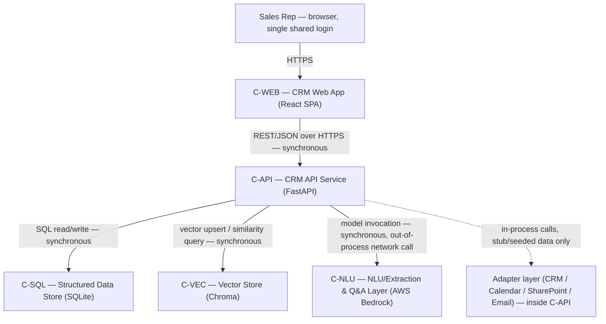
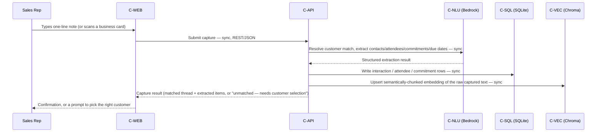

# Solution Architecture — Conversational CRM

- **Product name:** Conversational CRM / Relationship Memory Assistant
- **Document reference:** `SOLUTION-ARCHITECTURE-conversational-crm-T-1-v1.0`
- **Discipline:** `solution` (Workflow 2 — Solution Architecture)
- **Task:** T-1, scope `full-product-v1` — all 7 PRD features (F-1..F-7), all 21 stories (US-1..US-21). By explicit human decision, this is architected in one pass rather than a sub-slice, since this is a small single-persona demo product, not a large speculative platform.
- **Owner:** Architect (role, not named individual)
- **Status:** Draft — pending independent validation and human gate (`solution_review`)
- **Version:** 1.0
- **Stack source:** `stack.components[]` in `workflow.json`, `decision_source`: "Human decision 2026-09-17: backend = Python (FastAPI), frontend = React (web SPA), NLU/LLM layer = AWS Bedrock foundation models. The two data-store technologies (SQLite, Chroma) were already fixed upstream during Requirements (PRD v1.5 Section 13, Gate 2 decision) and are carried here unchanged, not re-decided."

## 0. Scope boundary (what this document does and does not cover)

This is the `solution` discipline's artifact. It names the parts of the system, their
responsibilities and non-responsibilities, the call/data flow between them, and the
technology-compatibility rationale behind the declared stack. It deliberately does
**not** specify:

- database tables, fields, or schema detail (owned by `data_integration`);
- API endpoints, method signatures, or request/response shapes (owned by
  `data_integration`; the PRD's own Section 14.1a adapter-method sketch is a
  `[DELEGATED DECISION]` from Requirements, not something this document restates or
  finalizes);
- threats, controls, or measurable security/performance targets (owned by
  `security_nfr`);
- cloud topology, CI/CD, or rollback procedure (owned by `platform`).

Where this document needs something one of those three disciplines will own and it
does not exist yet, it says so as an open item rather than filling the gap — expected,
since `solution` runs first in this workflow.

## 1. Source references

| Role | Artifact | Path (relative to this workflow's own artifact root) | Version | SHA-256 (bytes as read by this discipline) |
|---|---|---|---|---|
| `product_state` | Workflow 1 `workflow.json` (lock confirmation) | `../state/workflow-1-discovery-to-stories/workflow.json` | locked | `fb25e9c8829f6e0d0d9ccf9cddf5db8ae9b0cb7eba5873baff9e7e8bffc21b27` |
| `prd` | PRD | `../workflow-1-discovery-to-stories/docs/requirements/PRD-conversational-crm-v1.5.md` | 1.5 | `3960abdacf6ba3a27217d913aca01fa932bfb65373e572cdc4eeb6ac77dccc64` |
| `user_stories` | User Stories | `../workflow-1-discovery-to-stories/docs/stories/USER-STORIES-conversational-crm-v1.0.md` | 1.0 | `43fc3c0690db8cc6a0d85a837286912072fbcfdbfa55d3d37cb74c6abe8de73b` |

Paths above are written exactly as `roles/solution.json`'s `source_references[]` records
them — relative to this workflow's own artifact root (a sibling of Workflow 1's), so they
actually resolve when checked, rather than the workflow-1-rooted form this table
originally (incorrectly) showed. Before drafting, this discipline confirmed Workflow 1 was
genuinely `locked` (`workflow.status: "locked"`, all three stage gates approved) by reading
its `workflow.json` directly — the `product_state` row above is that confirmation's record,
not a fourth artifact consumed for content.

The PRD and User Stories hashes were computed directly against the file bytes on disk by
this discipline (`sha256sum`), not copied from another role's state.

**Finding recorded, not silently corrected:** the User Stories hash matches exactly
what `roles/stories.json`'s `gate.artifact_manifest` recorded at Workflow 1's lock. The
PRD hash does **not** match what `roles/requirements.json` and Workflow 1's
`workflow.json` sign-off manifest recorded (`e5da9f8da5765ecd96978b56fc6b610f77be9212f66f283ad9d73216fda0ecf5`).
Investigating: stripping `\r` from the current PRD file (which is currently CRLF —
`file` reports "with CRLF line terminators") and re-hashing reproduces the recorded
hash exactly. This means the PRD's **content is byte-identical modulo line-ending
representation** — nothing in the approved text has changed — but the file on disk has
had its line endings rewritten (LF → CRLF) since Workflow 1's lock recorded its hash,
almost certainly by a Windows-side read/write path, matching the exact failure mode
the root `CLAUDE.md` already documents under "Line endings on hashed artifacts are
pinned by `.gitattributes`." **Independently re-verified by the coordinator with real
hashing tooling**, at the Validator's request, rather than accepting this discipline's
own claim on trust: `sha256sum` on the raw file reproduces `3960abd...` exactly, and `sed
's/\r$//'` followed by `sha256sum` reproduces `e5da9f8d...` exactly — the byte-identical
claim is confirmed, not merely asserted. This is carried forward as Open Item OI-1 below
(non-blocking: content is verified unchanged) rather than silently using either hash
without disclosure.

## 2. Component inventory

Five components, all human-decided in `stack.components[]` with an explicit
`technology` on each (confirmed at Startup — no `needs_input` stop required). Short
IDs below are this document's own, used in the traceability table (Section 5).

**Important boundary clarification:** the PRD/Discovery language names five
domain "agents" (Capture Agent, Extraction Agent, Memory/Q&A Agent, Commitment
Tracking Agent, Brief-Me-on-Customer Agent). The human-decided stack does **not**
name five corresponding services — it names one backend component. This document
therefore treats each "agent" as a **logical capability module inside C-API**, not as
a separate deployable component. Introducing five separate backend services for a
single-persona, single-shared-login demo with a small, connected story set would add
inter-service network calls, deployment surface, and consistency risk with no stated
requirement driving it — see decision SOL-1.

### C-WEB — CRM Web App
**Technology:** React (web SPA)

**Responsibility:** Renders every rep-facing surface: capture entry (typed one-liner,
plus the optional business-card image path), natural-language Q&A prompt and answer
display, the due-soon/overdue commitment list, the per-customer profile/history view,
and the brief-me-on-customer summary view. Calls C-API for every action; every rep
using the single shared login sees the same views against the same data (F-7).

**Non-responsibility:** Does not call C-NLU, C-VEC, or C-SQL directly — every data
access goes through C-API. Does not perform extraction, customer matching, due-date
resolution, or answer synthesis. Does not implement its own authentication scheme
beyond carrying the single shared login through to C-API. Does not persist
application data locally; any client-side state is ephemeral UI state only.

### C-API — CRM API Service
**Technology:** Python (FastAPI)

**Responsibility:** Sole owner of business logic and the sole integration point C-WEB
talks to. Internally organized into the following logical capability modules (not
separate components):

- **Capture module** — realizes F-1: accepts a typed entry or business-card image,
  resolves it to a customer thread, and — via C-NLU — extracts contact detail and
  attendee names into structured form for C-SQL.
- **Extraction module** — realizes F-2: given a captured note, extracts discussion
  points, commitments/follow-ups, and due dates (via C-NLU), tags them to the correct
  thread in C-SQL.
- **Memory/Q&A module** — realizes F-3: resolves a natural-language question to a
  customer thread, retrieves relevant structured (C-SQL) and semantically-retrieved
  (C-VEC) content, and returns an answer synthesized via C-NLU.
- **Commitment Tracking module** — realizes F-4: computes the due-soon/overdue list
  directly from C-SQL's commitment due dates; this module's logic is a plain filter/
  classify operation and does **not** call C-NLU (see Section 5 — not every story
  touches every component).
- **Brief-Me module** — realizes F-5: composes the Memory/Q&A and Commitment Tracking
  modules' outputs plus stakeholder data into a short synthesized summary via C-NLU.
- **Adapter layer** — realizes PRD Section 14's four stub adapters (CRM, Calendar,
  SharePoint, Email), each returning stub/seeded data only, feeding C-SQL/C-VEC. This
  document names the adapter layer's existence and boundary only; the adapters'
  interface contract itself (already sketched as a `[DELEGATED DECISION]` in PRD
  Section 14.1a) is `data_integration`'s to ratify or refine, not this discipline's.

**Non-responsibility:** Does not render any UI. Does not define the wire-level API
contract, request/response shapes, or the data schema (`data_integration`). Does not
implement authentication/authorization controls beyond what is needed to honor the
single-shared-login NFR at a functional level — security controls, threat modeling
and measurable targets are `security_nfr`'s. Does not define hosting, CI, or rollback
(`platform`). Does not perform any real external-system integration — every adapter
is stub-only per PRD Section 14.1, by design, not as a gap.

### C-SQL — Structured Data Store
**Technology:** SQLite
**Note:** `[RESOLVED — Gate 2 decision, PRD v1.5 Section 13.1]` Fixed upstream by human
decision during Requirements; not re-decided here.

**Responsibility:** Authoritative store for exact-match, chronological, and
status-based CRM data — accounts, contacts, interactions, interaction attendees, and
commitments — as already described narratively in PRD Section 13.1. Backs F-1, F-2,
F-4, F-6, and F-7's structured reads/writes; every session reads the same rows,
which is what makes F-7's identical-content requirement (US-20) mechanically true
rather than something an application layer has to reconcile.

**Non-responsibility:** Does not perform semantic/similarity retrieval — that is
C-VEC's job. Runs no application logic of its own; it is read from and written to by
C-API only, never directly by C-WEB or C-NLU. This document does not specify its
tables, columns, or keys — that is `data_integration`'s artifact.

### C-VEC — Vector Store
**Technology:** Chroma
**Note:** `[RESOLVED — Gate 2 decision, PRD v1.5 Section 13.2]` Fixed upstream by
human decision during Requirements, including the chunking strategy (semantic
chunking); not re-decided here.

**Responsibility:** Holds embeddings of extracted unstructured content (minutes of
meeting, free-text capture entries, email content, SharePoint document content),
chunked per the already-decided semantic-chunking strategy, so F-3 and F-5 can
retrieve by meaning rather than exact keyword match.

**Non-responsibility:** Does not hold the authoritative structured record (C-SQL
does). Does not itself generate embeddings — embedding generation is C-NLU's
responsibility (decision SOL-6). Is accessed only by C-API, never directly by C-WEB.

### C-NLU — NLU/Extraction & Q&A Layer
**Technology:** AWS Bedrock (foundation models)

**Responsibility:** Supplies the foundation-model capability behind every logical
"agent" module inside C-API: contact/attendee extraction (Capture), commitment/
discussion-point/due-date extraction (Extraction), natural-language understanding and
answer synthesis (Memory/Q&A), and summary synthesis (Brief-Me). Also generates the
embeddings C-VEC stores (decision SOL-6). Invoked exclusively by C-API.

**Non-responsibility:** Persists nothing itself — from this architecture's
perspective it is stateless per call. Does not decide business rules such as the
due-soon look-ahead window or customer-match thresholds; those are C-API orchestration
logic (and in several cases still open PRD questions, not this document's to invent —
see Section 7). Does not connect to C-WEB or either data store directly.

## 3. System context



No component other than C-API ever calls C-SQL, C-VEC, or C-NLU. C-WEB's only
integration point is C-API. This single choke point is deliberate (decision SOL-7):
it keeps every cross-cutting concern — matching, extraction orchestration, retrieval
composition — in one place rather than duplicated across a UI layer and a data layer.

## 4. Call and data flow

**Every crossing in this architecture is synchronous request/response.** There is no
message broker, task queue, or background-worker component anywhere in the
human-decided stack, and no NFR in the PRD calls for asynchronous/background
processing (see decision SOL-3). This is a real, load-bearing property of this
architecture, not an omission: a rep's capture, question, or brief request completes
(or fails) within the same HTTP request that initiated it.

### 4.1 Capture and extraction flow (realizes F-1, F-2 — US-1 through US-8)



### 4.2 Memory/Q&A and Brief-Me flow (realizes F-3, F-5 — US-9 through US-12, US-15 through US-17)

```mermaid
sequenceDiagram
    participant Rep as Sales Rep
    participant WEB as C-WEB
    participant API as C-API
    participant SQL as C-SQL (SQLite)
    participant VEC as C-VEC (Chroma)
    participant NLU as C-NLU (Bedrock)

    Rep->>WEB: Asks a natural-language question, or requests a brief
    WEB->>API: Submit query — sync, REST/JSON
    API->>SQL: Resolve named customer; fetch structured commitments/attendees — sync
    API->>VEC: Semantic search for relevant embedded passages on that thread — sync
    VEC-->>API: Ranked relevant chunks
    API->>NLU: Synthesize answer / brief from structured + retrieved content — sync
    NLU-->>API: Generated answer or summary text
    API-->>WEB: Answer, brief, "no history exists yet," or "could not identify the customer"
    WEB-->>Rep: Displayed response
```

### 4.3 Commitment tracking, profile view, and shared access (realizes F-4, F-6, F-7 — US-13, US-14, US-18 through US-21)

These three flows deliberately involve **no C-NLU call** — each is a structured
filter/read against C-SQL, computed at request time:

- **F-4 (US-13/US-14):** C-WEB requests the due-soon/overdue list; C-API's Commitment
  Tracking module filters/classifies C-SQL's commitment rows by due date and
  completion status and returns the list (or an explicit empty-state message) — sync,
  C-SQL only.
- **F-6 (US-18/US-19):** C-WEB requests a customer's profile; C-API reads that
  customer's interactions/attendees/commitments from C-SQL in chronological order —
  sync, C-SQL only. A newly captured note (Section 4.1) appears on the next profile
  read because both paths read/write the same C-SQL rows — there is no separate
  push/notification mechanism, and none is required by any stated acceptance
  criterion.
- **F-7 (US-20/US-21):** every session's C-WEB instance reads through the same C-API,
  which reads the same C-SQL rows — identical content across sessions (US-20) is a
  direct consequence of there being exactly one authoritative store, not a feature
  requiring its own mechanism. Concurrent-write behavior (US-21) is a genuine open
  compatibility question — see Open Item OI-2.

## 5. Traceability

`operation_ids` and `entity_names` are `not_applicable` for **every** row below, for
the same reason each time: those belong to `data_integration`'s API contract and data
model, and `data_integration` has not run yet — `solution` is the first discipline in
this workflow. This is stated once here rather than repeated 21 times below.

Component IDs: `C-WEB` (CRM Web App), `C-API` (CRM API Service), `C-SQL` (Structured
Data Store), `C-VEC` (Vector Store), `C-NLU` (NLU/Extraction & Q&A Layer).

### F-1 — Conversational Interaction Capture

**US-1 — Capture a typed interaction note against a matched customer**
- Acceptance criteria (verbatim, from `USER-STORIES-conversational-crm-v1.0.md`):
  1. "The system must create a structured interaction note and associate it with the correct customer thread when the rep's typed entry unambiguously matches exactly one seeded customer account."
  2. "The system must save the entry as a new interaction note when the entry contains at least one non-whitespace character."
- component_ids: C-WEB, C-API, C-SQL, C-NLU
- verification_scenarios: Type a one-line note unambiguously naming exactly one seeded account; confirm a new interaction record is created and thread-tagged to that account (Section 4.1 flow).
- operation_ids / entity_names: not_applicable — see note above.

**US-2 — Reject invalid capture input and flag unmatched customers**
- Acceptance criteria: 1. "The system must reject the submission with an explicit \"cannot save an empty note\" message, and must not create any note record, when the rep submits an empty or whitespace-only entry." 2. "The system must flag the note as \"unmatched — needs customer selection\" — rather than attaching it to a default or incorrect account — when no seeded customer account can be unambiguously identified from the entry text."
- component_ids: C-WEB, C-API, C-NLU, C-SQL
- verification_scenarios: Submit a whitespace-only entry, confirm no record is created and an explicit rejection message is shown; submit an entry naming no/an ambiguous account, confirm the note is created with an "unmatched" flag rather than attached to any account.
- operation_ids / entity_names: not_applicable.

**US-3 — Resolve an unmatched note to the correct customer**
- Acceptance criteria: 1. "The system must attach a previously flagged \"unmatched\" note to the customer thread the rep selects when the rep manually resolves the flag." 2. "The system must leave the note in the unmatched/needs-selection state — rather than guessing an account — when the rep has not yet resolved it."
- component_ids: C-WEB, C-API, C-SQL
- verification_scenarios: From an unmatched note, select a customer and confirm the note re-tags to that thread; confirm an unresolved unmatched note is never auto-assigned on its own.
- operation_ids / entity_names: not_applicable.

**US-4 — Capture an interaction via a scanned business card**
- Acceptance criteria: 1. "[INFERRED — needs confirmation] The system must extract the contact's name, company and role from a scanned business-card image into the structured interaction note when the image is legible and contains recognizable contact fields. The scanning/OCR mechanism itself was never discussed in discovery (PRD Assumption 5, Open Question 5) — whether this capability is worth building for the demo at all, versus typed-only capture, is still open." 2. "[INFERRED — needs confirmation] The system must inform the rep that manual entry is required — without fabricating contact details — when the image cannot be read or no contact fields are recognized."
- component_ids: C-WEB, C-API, C-NLU, C-SQL
- verification_scenarios: Submit a legible business-card image, confirm structured contact fields populate; submit an unreadable image, confirm a manual-entry prompt with no fabricated fields.
- operation_ids / entity_names: not_applicable. See Open Item OI-3 — whether Bedrock's own vision-capable models suffice for this path, or whether a dedicated OCR technology becomes a new dependency, is unresolved and is architecturally relevant precisely because it could introduce a component beyond the declared five.

**US-5 — Extract attendee names from a typed interaction note**
- Acceptance criteria: 1. "The system must extract every distinct attendee name mentioned in a typed free-text interaction entry as a separate structured attendee item — recording one item per distinct person named (e.g., \"met Priya and Arjun from Acme...\" must yield two attendee items, not one merged string) — when the entry text names at least one identifiable person." 2. "The system must record zero attendee items for that interaction — rather than fabricating a name — when the entry text names no one." 3. "[INFERRED — needs confirmation] The exact name-recognition/disambiguation mechanism — how confidently a token must be recognized as a person's name, and how several names in one entry are told apart — was never discussed in discovery (PRD Assumption 14, Open Question 15) and is not assumed here; only the underlying capability (AC1/AC2) is treated as confirmed."
- component_ids: C-API, C-NLU, C-SQL
- verification_scenarios: Submit the canonical example ("met Priya and Arjun from Acme...") and confirm two distinct attendee rows; submit an entry naming no one and confirm zero attendee rows.
- operation_ids / entity_names: not_applicable. This story's AC3 mechanism gap is addressed at the technology-compatibility level in decision SOL-6/Section 7 (no new component required — extraction is prompt-driven against the already-declared C-NLU), not resolved as a product decision here.

### F-2 — Automatic Extraction & Thread Tagging

**US-6 — Extract commitments and next steps from a captured note**
- Acceptance criteria: 1. "The system must extract each distinct commitment, follow-up or next step mentioned in a captured note's text as a separate tracked item when the note contains one or more of them." 2. "The system must record no commitment items when the note describes discussion only, with no forward-looking commitment."
- component_ids: C-API, C-NLU, C-SQL
- verification_scenarios: Submit a note with two distinct commitments, confirm two tracked items; submit a discussion-only note, confirm zero commitment items.
- operation_ids / entity_names: not_applicable.

**US-7 — Resolve a due date for an extracted commitment**
- Acceptance criteria: 1. "The system must record a due date on an extracted commitment when the captured text states a concrete date or an unambiguous relative date term resolvable against the interaction's timestamp (e.g., \"by Friday\")." 2. "The system must mark the commitment's due date as unspecified — rather than guessing a date — when the text uses a vague temporal reference (e.g., \"soon,\" \"sometime\") or gives no date information at all."
- component_ids: C-API, C-NLU, C-SQL
- verification_scenarios: Submit a commitment with "by Friday," confirm a resolved due date; submit one with "soon," confirm the due date is recorded as unspecified, not guessed.
- operation_ids / entity_names: not_applicable.

**US-8 — Tag extracted items to the correct customer thread**
- Acceptance criteria: 1. "The system must tag every extracted discussion point and commitment to the same customer thread as its source interaction note when that note is matched to a thread." 2. "The system must flag an extracted item for manual thread assignment — rather than tagging it to an incorrect thread — when the source note itself is unmatched to a customer thread (per F-1)."
- component_ids: C-API, C-SQL
- verification_scenarios: Confirm extracted items on a matched note land on that same thread; confirm extracted items on an unmatched note are held for manual assignment rather than mis-tagged.
- operation_ids / entity_names: not_applicable.

### F-3 — Natural-Language Memory & Q&A

**US-9 — Ask what was discussed last time**
- Acceptance criteria: 1. "The system must answer a natural-language question about a customer's most recent discussion by returning content drawn from that customer's most recent interaction note(s) when the thread has at least one captured note." 2. "The system must respond that no history exists yet for that customer when the thread is empty."
- component_ids: C-WEB, C-API, C-SQL, C-VEC, C-NLU
- verification_scenarios: Ask the question against a thread with history, confirm an answer drawn from that thread; ask against an empty thread, confirm the explicit "no history yet" response (Section 4.2 flow).
- operation_ids / entity_names: not_applicable.

**US-10 — Ask what I committed to for a customer**
- Acceptance criteria: 1. "The system must answer a natural-language question about the rep's own open commitments for a customer by listing the commitments extracted and tagged to that thread when any exist." 2. "The system must state that there are no open commitments for that customer when none exist."
- component_ids: C-WEB, C-API, C-SQL, C-NLU
- verification_scenarios: Ask against a thread with open commitments, confirm the list matches C-SQL's tagged commitments; ask against a thread with none, confirm the explicit empty response.
- operation_ids / entity_names: not_applicable.

**US-11 — Ask who attended from the customer's side**
- Acceptance criteria: 1. "The system must answer a natural-language question about interaction attendees by returning the contact names extracted from that thread's interaction notes when attendee names were captured." 2. "The system must state that no attendee information was captured when none was extracted."
- component_ids: C-WEB, C-API, C-SQL, C-NLU
- verification_scenarios: Ask against a thread with captured attendees, confirm the names returned match the attendee rows F-1 AC5 produced; ask against a thread with none, confirm the explicit empty response.
- operation_ids / entity_names: not_applicable.

**US-12 — Reject a Q&A request naming no clear customer**
- Acceptance criteria: 1. "The system must resolve and answer against the correct customer thread when a query names exactly one customer that matches a seeded account." 2. "The system must respond that it could not identify the customer — rather than guessing or returning another customer's data — when the query names no customer or an unrecognized one."
- component_ids: C-WEB, C-API, C-NLU, C-SQL
- verification_scenarios: Ask a question naming exactly one seeded account, confirm the correct thread answers; ask one naming no/an unrecognized customer, confirm an explicit "could not identify" response with no other customer's data returned.
- operation_ids / entity_names: not_applicable.

### F-4 — Proactive Commitment Tracking

**US-13 — View overdue and due-soon commitments across accounts**
- Acceptance criteria: 1. "The system must list every open commitment whose due date has passed as \"overdue\" when the current date is past that due date, and must exclude a commitment from this list once it is marked complete." 2. "[INFERRED — needs confirmation] The system must list every open commitment whose due date falls within the next 7 days as \"due soon,\" and must reclassify it as \"overdue\" instead once its due date has passed. The 7-day window is not a confirmed value — discovery never stated a specific look-ahead window (PRD Open Question 6); 7 days is carried over only because the PRD itself uses it as an illustrative example, and needs explicit human confirmation before development." 3. "The system must list a commitment with an unspecified due date (one with no stated or resolvable date, per F-2) separately from the due-soon/overdue list — rather than omitting it entirely or treating it as overdue — when no due date was captured."
- component_ids: C-WEB, C-API, C-SQL
- verification_scenarios: Seed commitments past due, within 7 days, beyond 7 days, and with no due date; confirm each classifies correctly (overdue / due-soon / excluded / listed-separately-as-unspecified) on a known reference date. Note: this flow makes **no** C-NLU call — it is a structured filter over C-SQL only (Section 4.3).
- operation_ids / entity_names: not_applicable.

**US-14 — See an explicit empty state when nothing is due soon or overdue**
- Acceptance criteria: 1. "The system must state explicitly that there are no due-soon or overdue commitments — rather than showing an empty list with no explanation — when none exist."
- component_ids: C-WEB, C-API, C-SQL
- verification_scenarios: Query the list when no commitment qualifies; confirm an explicit "none" message rather than a silent empty list.
- operation_ids / entity_names: not_applicable.

### F-5 — Brief-Me-on-Customer Summary

**US-15 — Get a pre-meeting brief on a customer**
- Acceptance criteria: 1. "The system must generate a summary containing recent discussion history, open commitments and stakeholder/contact names for a named customer when that customer has at least one captured note, and must state that no history exists yet for that customer — rather than generating a summary with fabricated content — when the thread is empty." 2. "[INFERRED — needs confirmation] The system must return a bounded, short-form summary (a few sentences or bullets, not a multi-page document) under normal conditions — no explicit length limit was stated in discovery (PRD Open Question 7) — and must still return whatever partial content is available, rather than failing the whole request, when data for one of the summary components is missing."
- component_ids: C-WEB, C-API, C-SQL, C-VEC, C-NLU
- verification_scenarios: Request a brief for a customer with history; confirm the summary combines structured commitments/stakeholders with semantically-retrieved history and remains short-form. Request a brief for an empty thread; confirm the explicit no-history response, not fabricated content (Section 4.2 flow).
- operation_ids / entity_names: not_applicable.

**US-16 — Include opportunity/deal status in the customer brief**
- Acceptance criteria: 1. "[INFERRED — needs confirmation] The system must synthesize the opportunity/deal-status component narratively from that customer's recorded interaction notes and commitments — since no discrete deal-stage field exists in the structured store (PRD Section 13.1) — when the thread contains content indicating where the deal/opportunity stands. Whether a structured, selectable deal-stage field is wanted instead of narrative synthesis is still open (PRD Assumption 13, Open Question 14)." 2. "The system must state that no opportunity/deal-status information has been captured yet for that customer — rather than fabricating a stage or outcome — when the thread contains no such content."
- component_ids: C-API, C-SQL, C-VEC, C-NLU
- verification_scenarios: Request a brief for a customer whose notes discuss deal progress; confirm the narrative deal-status synthesis draws only from C-SQL/C-VEC content, never a fabricated stage. Request one with no such content; confirm the explicit "not captured" response.
- operation_ids / entity_names: not_applicable. This story's AC1 depends on `data_integration` confirming no new structured "deal stage" entity is introduced (PRD Section 13.1 already reasons this through, but it is `data_integration`'s artifact to ratify, not this one's).

**US-17 — Reject a brief request naming no clear customer**
- Acceptance criteria: 1. "The system must generate the summary for a named customer when the request unambiguously identifies exactly one seeded customer account." 2. "The system must respond that it could not identify the requested customer — rather than guessing — when the request names an unrecognized or ambiguous customer."
- component_ids: C-WEB, C-API, C-NLU, C-SQL
- verification_scenarios: Request a brief naming exactly one seeded account, confirm it generates; request one naming an ambiguous/unrecognized account, confirm the explicit rejection.
- operation_ids / entity_names: not_applicable.

### F-6 — Customer Profile / Conversational History View

**US-18 — View a customer's running history on their profile**
- Acceptance criteria: 1. "The system must display a customer's captured notes and extracted items in chronological order on that customer's profile view when at least one note exists." 2. "The system must display an explicit \"no history yet\" state when none exists."
- component_ids: C-WEB, C-API, C-SQL
- verification_scenarios: Open a profile with captured notes, confirm chronological ordering; open one with none, confirm the explicit empty state.
- operation_ids / entity_names: not_applicable.

**US-19 — See a new capture appear on the correct profile automatically**
- Acceptance criteria: 1. "The system must display a newly captured note and its extracted items on the correct customer's profile view automatically, without requiring the rep to take further action, when the note is tagged to that customer's thread." 2. "The system must not display that note or its items on any other customer's profile view when it is not tagged to that customer."
- component_ids: C-WEB, C-API, C-SQL
- verification_scenarios: Capture a note, then reload/reopen that customer's profile and confirm it appears without extra action; confirm it does not appear on a different customer's profile (Section 4.3 reasoning — same C-SQL rows, no separate push mechanism).
- operation_ids / entity_names: not_applicable.

### F-7 — Shared Customer Thread Access

**US-20 — See identical thread content across shared-login sessions**
- Acceptance criteria: 1. "The system must show the same customer thread content to every session authenticated via the shared login when two sessions view the same customer." 2. "The system must not partition data by which physical person is at the keyboard, since no per-rep identity exists in this version."
- component_ids: C-WEB, C-API, C-SQL
- verification_scenarios: Open the same customer in two sessions under the shared login; confirm identical content in both, with no per-session partitioning.
- operation_ids / entity_names: not_applicable.

**US-21 — Preserve concurrent additions to the same customer thread**
- Acceptance criteria: 1. "[INFERRED — needs confirmation] The system must persist a note added from one session so that it is immediately visible to another concurrent session viewing the same customer thread. The exact conflict-handling mechanism was never discussed in discovery (PRD Open Question 9) — whether last-write-wins is acceptable, or both additions must be preserved as distinct entries, is still open." 2. "[INFERRED — needs confirmation] The system must not silently lose one session's addition when another session adds to the same thread at nearly the same time."
- component_ids: C-WEB, C-API, C-SQL
- verification_scenarios: Add notes from two sessions to the same thread at nearly the same time; confirm both persist as distinct interaction records rather than one silently overwriting the other.
- operation_ids / entity_names: not_applicable. See Open Item OI-2 — C-SQL's (SQLite) concurrent-writer behavior is the compatibility constraint this story's mechanism ultimately depends on, and it is not yet confirmed how it will be handled.

**Coverage check:** all 21 stories across all 7 features map to at least one
component (confirmed above); every feature is represented.

## 6. Technology decisions

Decisions carry solution-discipline IDs (`SOL-N`), unique within this workflow's
four-discipline ID space, per the framework's convention (other disciplines use
`DI-N`, `SEC-N`, `PLAT-N`).

### SOL-1 — Backend deployment topology: one modular-monolith service, not per-agent microservices
- **Category:** Backend architecture pattern
- **Choice:** A single `C-API` (FastAPI) service containing the five logical
  capability modules (Capture, Extraction, Memory/Q&A, Commitment Tracking,
  Brief-Me) plus the adapter layer, as described in Section 2.
- **Alternatives considered:** (a) One microservice per PRD "agent" (five backend
  services); (b) a single monolith (chosen).
- **Rationale:** `stack.components[]` names exactly one backend component with
  `implemented_by: backend` — the human decision already fixed the deployment grain
  at "one backend." Splitting it into five services would add inter-service network
  calls, service discovery, and cross-service consistency risk (e.g., keeping
  Extraction's writes and Commitment Tracking's reads consistent against the same
  SQLite file across process boundaries) with no PRD/Stories requirement driving it —
  this is a single-persona, single-shared-login demo with a small, connected story
  set (21 stories, 7 features), not a platform needing independent scaling per
  capability. Alternative (a) loses on: added operational complexity and consistency
  risk with zero stated benefit.
- **Source:** `stack.components[]` (backend = 1 entry), PRD Section 4/5 (single-team,
  single-tenant demo scope).
- **Owner:** Architect. Status: proposed.

### SOL-2 — Web-to-API communication style: synchronous REST/JSON
- **Category:** Inter-component protocol
- **Choice:** Plain HTTP/JSON request/response between C-WEB and C-API.
- **Alternatives considered:** WebSocket/streaming (for perceived Q&A latency);
  GraphQL; REST/JSON (chosen).
- **Rationale:** Every PRD/Stories acceptance criterion describing a Q&A, brief, or
  capture interaction is expressed as a one-shot request/response ("must answer...",
  "must generate a summary...") with no NFR calling for streaming or partial/
  incremental responses. FastAPI's native OpenAPI generation from REST/JSON directly
  feeds `data_integration`'s API-contract artifact. Streaming loses on: no stated
  requirement justifies its added client/server complexity; GraphQL loses on: no
  stated need for flexible/partial querying across the small, fixed set of screens
  C-WEB renders.
- **Source:** PRD Sections 6, 8 (all ACs phrased as request/response); Stories
  document (same pattern throughout).
- **Owner:** Architect. Status: proposed.

### SOL-3 — NLU invocation pattern: synchronous in-request calls, no queue/worker component
- **Category:** Processing pattern
- **Choice:** Every C-API call to C-NLU happens synchronously within the same request
  that triggered it (capture, extraction, Q&A, brief). No message broker or background
  worker component exists in this architecture.
- **Alternatives considered:** Asynchronous background processing with a task
  queue/worker and a "processing..." status the rep polls; synchronous in-request
  (chosen).
- **Rationale:** `stack.components[]` declares no queue/broker/worker component, and
  F-6 AC2 requires a newly captured note to appear on the profile "automatically,
  without requiring the rep to take further action" — consistent with immediate,
  synchronous consistency rather than an intermediate pending state. No PRD NFR states
  a response-time budget that would force offloading the Bedrock call to a background
  process. Alternative loses on: it requires a new component category outside the
  fixed five-item stack, and no acceptance criterion anywhere describes a
  "processing..." intermediate UI state for capture or Q&A to justify it.
- **Source:** `stack.components[]` (no queue/worker entry); PRD F-6 AC2.
- **Owner:** Architect. Status: proposed.

### SOL-4 — Backend language/framework compatibility: Python + FastAPI
- **Category:** Technology compatibility rationale (component already declared;
  this records why it coheres with the rest of the stack)
- **Choice:** FastAPI (Python), as declared.
- **Alternatives considered (as a compatibility check against C-NLU/C-VEC, not a
  re-opening of the human decision):** Node.js/Express; Django; FastAPI (declared,
  confirmed coherent).
- **Rationale:** Both C-NLU's AWS SDK (`boto3`) and C-VEC's client library
  (`chromadb`) are first-class Python libraries; keeping the backend in Python avoids
  splitting extraction/retrieval logic across two languages. FastAPI's async I/O
  suits the mostly I/O-bound nature of calls to C-NLU/C-VEC/C-SQL (Section 4), and its
  automatic OpenAPI schema generation gives `data_integration` a machine-checkable
  starting point for the API contract rather than a hand-written one. Django loses on:
  its batteries-included ORM/admin/templating are unneeded surface area for an
  API-only backend. Express/Node loses on: it would fragment the stack across two
  runtimes for no stated benefit, since the human decision already named Python.
- **Source:** `stack.components[]` (backend = "Python (FastAPI)"); C-NLU/C-VEC's own
  declared technologies.
- **Owner:** Architect. Status: proposed.

### SOL-5 — Frontend framework compatibility: React SPA
- **Category:** Technology compatibility rationale
- **Choice:** React (web SPA), as declared.
- **Alternatives considered:** Server-rendered templates (e.g., Jinja2 via FastAPI);
  Vue/Angular; React (declared, confirmed coherent).
- **Rationale:** F-6 AC2's "appear automatically, without requiring the rep to take
  further action" and F-7's identical-content-across-sessions requirement are both
  naturally served by an SPA re-fetching/re-rendering client-side state rather than a
  server-rendered full-page-reload model. React's ecosystem has mature tooling for
  consuming an OpenAPI-described REST backend (matching SOL-2/SOL-4), easing the
  eventual Workflow 3 frontend build against `data_integration`'s contract.
  Server-rendered templates lose on: full-page reloads sit awkwardly against the
  "appears automatically" requirement. Vue/Angular lose on: no stated reason to
  deviate from the human-decided choice; introducing a second frontend ecosystem
  candidate would fragment tooling for no benefit.
- **Source:** `stack.components[]` (frontend = "React (web SPA)"); PRD F-6 AC2, F-7.
- **Owner:** Architect. Status: proposed.

### SOL-6 — Embedding generation: C-NLU supplies embeddings for C-VEC
- **Category:** Cross-component compatibility / integration point
- **Choice:** AWS Bedrock (C-NLU) is the sole source of the embeddings that get
  stored in Chroma (C-VEC) — no separate embedding-model provider is introduced.
- **Alternatives considered:** A dedicated third-party/local embedding model (e.g., a
  self-hosted sentence-transformer) distinct from the LLM provider; Bedrock's own
  embedding models (chosen).
- **Rationale:** The PRD explicitly leaves "the specific embedding model" and
  "re-embedding trigger strategy" open (Assumption 10) but already fixed the
  NLU/LLM technology as Bedrock at the same Gate 2 decision that fixed Chroma.
  Sourcing embeddings from the same already-declared C-NLU technology avoids
  introducing a sixth technology dependency purely for embedding generation, and
  keeps the semantic-chunking-to-embedding pipeline (PRD Section 13.2) inside the one
  component (C-API, calling C-NLU) that already owns extraction and synthesis.
  A separate embedding provider loses on: it would add a new external dependency
  and a second vendor-integration surface with no stated requirement forcing it.
  **This does not resolve which specific Bedrock embedding model, its dimension, or
  the re-embedding trigger mechanism** — those remain open (Open Item OI-1a below,
  same PRD Assumption 10), and are `data_integration`'s to finalize as part of the
  vector schema, not this document's.
- **Source:** PRD Section 13.2, Assumption 10; `stack.components[]` (NLU/LLM =
  Bedrock, vector store = Chroma, both Gate-2-adjacent decisions).
- **Owner:** Architect (integration point) / `data_integration` (specific model,
  dimension, re-embedding trigger). Status: proposed.

### SOL-7 — Vector Store and NLU access boundary: C-API only
- **Category:** Component boundary
- **Choice:** C-VEC and C-NLU are reachable only from C-API; C-WEB never calls either
  directly.
- **Alternatives considered:** Allowing C-WEB to call C-NLU directly for perceived
  latency savings on Q&A; C-API-only (chosen).
- **Rationale:** Keeping every cross-cutting concern (customer resolution, retrieval
  composition, synthesis) inside C-API — the one component the human decision names
  as the backend — avoids duplicating matching/retrieval logic in the frontend and
  keeps a single place where `security_nfr` can reason about what talks to Bedrock/
  Chroma at all (a boundary this document names; the actual controls are
  `security_nfr`'s). Direct C-WEB access loses on: it would duplicate business logic
  client-side and contradict SOL-1's single-integration-point choice.
- **Source:** Section 2 (component responsibilities); SOL-1.
- **Owner:** Architect. Status: proposed.

### SOL-8 — Structured store technology: SQLite (fixed upstream, rationale recorded)
- **Category:** Data-store technology compatibility (not a decision made here)
- **Choice:** SQLite, as fixed by PRD v1.5 Section 13.1 / Gate 2.
- **Alternatives considered:** Not weighed by this discipline — the human decision at
  Requirements Gate 2 fixed this technology directly, replacing what PRD v1.1 had
  carried as `[INFERRED — needs confirmation]`; re-litigating the choice here would
  contradict the framework's own rule that a fixed-upstream decision is a constraint,
  not a re-opened question. What the PRD itself records as having been weighed: a
  self-contained, serverless, file-based SQL engine was chosen consistent with "no
  budget ceiling... internal demo/hackathon project" (`constraints.decision_source`)
  — i.e., no separate database server/hosting cost or operational surface.
- **Rationale (compatibility, this discipline's genuine contribution):** SQLite is
  fully compatible with C-API's declared technology (Python's standard library ships
  a `sqlite3` driver; SQLAlchemy or an equivalent ORM works against it directly with
  no additional service dependency) and requires no network topology decision beyond
  "a file the C-API process can read/write" — appropriate for this demo's stated
  no-budget-ceiling, no-multi-tenant scope. **Compatibility constraint that actually
  binds and is not yet resolved:** SQLite's single-writer-at-a-time behavior is in
  tension with F-7/US-21's concurrent-session write requirement — see Open Item OI-2.
- **Source:** PRD Section 13.1; `stack.components[]` note field.
- **Owner:** Fixed by human decision (Requirements Gate 2). Status: `user_confirmed`
  — confirmed by a human, but at that earlier Requirements gate, not proposed or
  decided by this discipline now.

### SOL-9 — Vector store technology: Chroma (fixed upstream, rationale recorded)
- **Category:** Data-store technology compatibility (not a decision made here)
- **Choice:** Chroma, with semantic chunking, as fixed by PRD v1.5 Section 13.2 /
  Gate 2.
- **Alternatives considered:** Not weighed by this discipline, for the same reason as
  SOL-8 — fixed directly by the human at Gate 2.
- **Rationale (compatibility, this discipline's genuine contribution):** Chroma ships
  a first-class Python client (`chromadb`), consistent with C-API's Python/FastAPI
  technology (SOL-4) and requiring no separate query-language bridge. Chroma can run
  embedded/in-process or as a lightweight local server; for this demo's no-budget-
  ceiling, single-instance scope, an embedded/persistent-local mode avoids
  introducing new hosting topology — the specific deployment mode (embedded vs.
  server) is `platform`'s to finalize, not this document's.
- **Source:** PRD Section 13.2; `stack.components[]` note field.
- **Owner:** Fixed by human decision (Requirements Gate 2). Status: `user_confirmed`
  — confirmed by a human, but at that earlier Requirements gate, not proposed or
  decided by this discipline now.

## 7. Compatibility constraints that actually bind

| Constraint | Statement | Status |
|---|---|---|
| Backend language | Python 3.11+ (for modern `async`/typing support FastAPI relies on) | `[INFERRED — needs confirmation]` — proposed, not confirmed with a human; no target repository exists to read a pinned version from (`inputs.target_repository` is `null`). |
| Backend framework/validation | FastAPI paired with Pydantic v2 (FastAPI's schema generation and validation model assumes a matching Pydantic major version) | `[INFERRED — needs confirmation]` — proposed compatible pairing. |
| AWS SDK | `boto3` (or the async `aioboto3`/`aiobotocore` equivalent) version tracking whichever AWS SDK release supports the Bedrock model family selected | `[INFERRED — needs confirmation]` — exact version not yet pinned; also depends on AWS region/model access being provisioned, which is `platform`'s concern. |
| Vector client | `chromadb` Python client version compatible with the chosen Python runtime | `[INFERRED — needs confirmation]` — not yet pinned. |
| Frontend runtime | React 18+, built with a current Node.js LTS (18+) toolchain | `[INFERRED — needs confirmation]` — proposed, not confirmed. |
| Structured store | SQLite version bundled with the chosen Python runtime; no separate SQLite server process | Follows from SOL-8; not independently versioned since it ships with Python. |
| Platform target | No specific OS/hosting platform named yet — `platform` discipline has not run | Not applicable to `solution`; flagged so `platform` knows this document assumes none. |

No target checkout exists to read a pinned, already-in-use version set from
(`inputs.target_repository: null`), so every version above is this discipline's own
explicitly proposed compatible set, not a verified fact — each is tagged
`[INFERRED — needs confirmation]` accordingly and carried to Open Items.

## 8. Open items

| ID | Item | Blocks development? | Owner |
|---|---|---|---|
| OI-1 | The PRD v1.5 file's line endings on disk (CRLF) no longer match what Workflow 1's lock recorded a hash against (LF) — content is verified byte-identical once line endings are normalized, so this is a representation drift, not a content change, but it should be corrected/re-verified before any downstream discipline re-hashes the same file and gets a third, still-different result. | No — content is verified unchanged. | Whoever maintains the Workflow 1 output tree (human/orchestrator), not this discipline to silently fix. |
| OI-1a | The specific Bedrock embedding model, its vector dimension, and the re-embedding trigger strategy (PRD Assumption 10) remain unconfirmed. SOL-6 fixes *which component* supplies embeddings; it does not fix *which model*. | No, at the solution gate — but should resolve before `data_integration` finalizes the vector schema. | `data_integration` (this workflow), informed by the human decision still needed per PRD Assumption 10. |
| OI-2 | SQLite (C-SQL, fixed upstream) has single-writer-at-a-time behavior by default, which is in tension with F-7/US-21's requirement that two concurrent sessions' additions both persist without silent loss. Whether WAL mode, retry-on-busy logic, or another mechanism resolves this is not decided here — it is a data-access/session-handling concern. | No — carried as an explicit risk, not silently assumed away. | `data_integration` and/or `platform`, per PRD Open Question 9 (still open at the PRD level). |
| OI-3 | If business-card OCR (F-1 AC2/US-4) proceeds, it is not yet confirmed whether Bedrock's own multimodal/vision-capable models are sufficient, or whether a dedicated OCR technology (e.g., a separate managed OCR service) would need to be introduced as a sixth stack component. This is inherited from PRD Assumption 5/Open Question 5 (whether OCR is worth building at all), with an added architectural dimension: it could change the component count this document treats as fixed. | No — F-1 AC1 (typed capture) does not depend on this being resolved. | Product owner (whether to build it) then Architect (which technology, if yes). |
| OI-4 | F-1 AC5/US-5's attendee-name-recognition mechanism (PRD Assumption 14) is treated in this document as prompt-driven extraction against the already-declared C-NLU (no new component implied) — but this is this discipline's own reasonable inference, not a human confirmation of that specific mechanism. | No. | Architect / `data_integration`, per PRD Open Question 15. |

None of the above are marked `blocks_development: true` — each is either already
verified non-content-affecting (OI-1) or explicitly assigned to a specific
downstream owner who can resolve it without reopening this discipline's gate.

## 9. Self-verification

- **Every component has a stated responsibility and a stated non-responsibility.**
  PASS — Section 2, all five components.
- **Every selected story maps to at least one component.** PASS — all 21 stories in
  Section 5 carry non-empty `component_ids`.
- **Every declared technology has recorded alternatives and a rationale.** PASS —
  SOL-1 through SOL-9 cover all five components (three as genuine proposed decisions
  with weighed alternatives: FastAPI, React, and the modular-monolith/sync/
  embedding-source/boundary decisions SOL-1/2/3/6/7; two as fixed-upstream decisions
  with the compatibility rationale this discipline can still contribute — SOL-8,
  SOL-9).
- **No endpoint, table, threat, or pipeline is specified here.** PASS — Section 2
  explicitly declines to name C-SQL's tables/columns or C-API's routes; Section 5
  marks every row's `operation_ids`/`entity_names` `not_applicable`; no threat model
  or measurable target appears anywhere in this document.
- **`source_references` records every upstream artifact consumed, with hashes.**
  PASS — Section 1; both hashes computed directly by this discipline, and a genuine
  hash discrepancy on the PRD file was investigated and disclosed (OI-1) rather than
  silently reconciled.
- **Every inference is marked `[INFERRED — needs confirmation]` and carried as an
  open item.** PASS — Section 7's version matrix and Section 8's open items carry
  every inference made in this document; no inference is stated with the confidence
  of a fact.

**Result: PASS.**

## 10. Readiness

`ready` — every component in scope has a declared technology, every selected story
traces to at least one component, and no open item in this document blocks
development. Readiness here means this discipline's own artifact is complete and
internally consistent, not that the other three disciplines' artifacts exist yet —
`data_integration`, `security_nfr`, and `platform` still need to run before Workflow 2
can reach sign-off.
