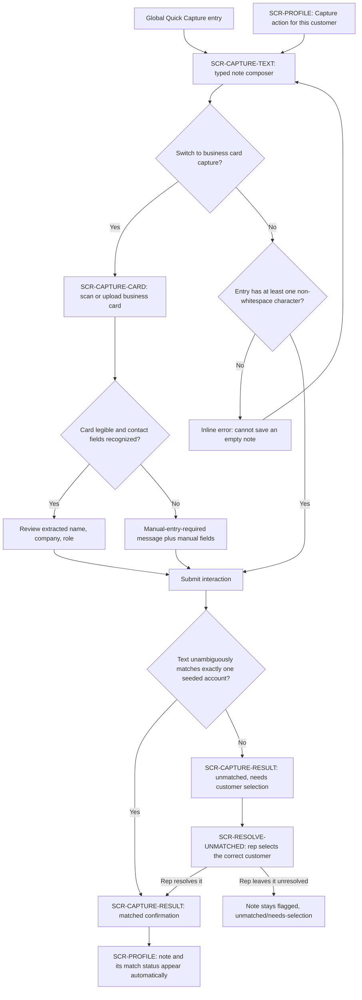

# UI/UX Design — Conversational CRM — TASK-CAPTURE-PROFILE

## 1. Identity

- **Project:** conversational-crm
- **Task:** TASK-CAPTURE-PROFILE — "Interaction capture (typed + business card, unmatched
  resolution) and customer profile history view"
- **Agent:** UI/UX (`ui-ux`)
- **Document reference:** `UI-UX-conversational-crm-TASK-CAPTURE-PROFILE-v1.0`
- **Version:** 1.0
- **Timestamp:** 2026-09-17
- **Status:** ✅ Approved — Gate `ui_ux_review` passed by DAI Team3 (sparc.team5@experionglobal.com) on 2026-09-17T14:19:26Z (validator: issues_found — 2 low findings, no security/traceability/scope-boundary defects; all 6 selected stories traced accurately against source).
- **Selected scope (human-approved, from `workflow.json` `inputs.task`):**
  - Feature IDs: F-1 (Conversational Interaction Capture), F-6 (Customer Profile /
    Conversational History View)
  - Story IDs: US-1, US-2, US-3, US-4, US-18, US-19
  - **Explicitly excluded from this run**, even though they belong to F-1: **US-5**
    (attendee-name extraction). Excluded entirely: F-2, F-3, F-4, F-5, F-7 and their
    stories — separate future UI/UX runs per `workflow.json`'s `ids_note`.
- **Source versions/hashes (computed directly from the files, not trusted from any
  quoted value):**

  | Document | Path (relative to workflow-1's output root) | Version | SHA-256 |
  |---|---|---|---|
  | PRD | `docs/requirements/PRD-conversational-crm-v1.5.md` | 1.5 | `e5da9f8da5765ecd96978b56fc6b610f77be9212f66f283ad9d73216fda0ecf5` |
  | User Stories | `docs/stories/USER-STORIES-conversational-crm-v1.0.md` | 1.0 | `43fc3c0690db8cc6a0d85a837286912072fbcfdbfa55d3d37cb74c6abe8de73b` |

  Both hashes were computed with `sha256sum` against the actual files at
  `/home/harikm/dev/hackathon/sparc-output/conversational-crm/workflow-1-discovery-to-stories/docs/{requirements,stories}/...`
  and match the values recorded in Workflow 1's `workflow.json`
  `gates.workflow_signoff.artifact_manifest` exactly. Workflow 1's `workflow.status`
  is `locked` (`locked_at: 2026-09-17T13:45:00Z`), confirmed by reading that state
  file directly.
- **Architecture status:** Workflow 2 (`workflow-2-solution-architecture`) is
  `not_started` as of this draft (read directly from its `workflow.json`: `phase:
  "solution"`, `workflow.status: "not_started"`). Per this workflow's
  DEVELOPMENT-CONTRACT §1, this stage may draft while architecture is pending because
  Workflow 1 is locked. No endpoint path, schema, or auth mechanism is invented
  anywhere in this document — every backend-dependent action is marked **unresolved
  for the architecture owner** in Section 7 (Engineering Handoff).

## 2. Scope and decisions

### What this design covers

One complete user flow, per WORKFLOW.md's "scope one complete user flow or a small
related story set per run":

1. A rep captures an interaction as a typed one-line note (US-1), including the
   system's automatic customer match.
2. Invalid or ambiguous capture is handled visibly: an empty note is rejected (US-2
   AC1) and a note that cannot be unambiguously matched is flagged rather than
   mis-filed (US-2 AC2).
3. A flagged/unmatched note can be manually resolved to the correct customer (US-3).
4. A rep can alternatively capture a contact by scanning a business card, with a
   legible/illegible branch (US-4).
5. The captured note appears on the correct customer's profile automatically and
   only there (US-18, US-19), including the profile's own empty state.

### What this design deliberately excludes

- **Attendee-name display/extraction (US-5)** is out of scope for this run even
  though it is part of F-1, because `inputs.task.story_ids` names US-1–US-4 only,
  not US-5. The Interactions data model note in PRD §13.1 already anticipates an
  `Interaction attendees` child entity, so the Customer Profile screen's interaction
  card (Section 4.5) reserves a labelled slot for attendee names, but that slot is
  explicitly marked **not populated by this task** — see Open Item OI-1.
- **Extracted discussion points / commitments (F-2, F-4, F-5)** are excluded
  entirely. F-6's own acceptance criteria (US-18 AC1, US-19 AC1) say a profile must
  show "captured notes and extracted items," but the stories that produce those
  extracted items (F-2's US-6/US-7/US-8) are not in this run's scope. The profile
  screen therefore displays the captured note itself (raw text, timestamp, match
  status) as the item that is definitely in scope, with the same reserved,
  visibly-labelled "not yet available" treatment for commitments as for attendees —
  see Open Item OI-2. This is a genuine tension between the wording of the selected
  ACs and the selected scope, not something this design resolves by inventing
  commitment data.
- **Sign-in / customer-account selection as a distinct screen** — the PRD's Section 5
  journey step 1 ("Rep signs in ... and selects a customer account") is not itself
  one of the selected stories. This design assumes an authenticated session already
  exists (per F-7's shared-login NFR, out of this run's scope) and starts at the
  point a rep initiates a capture.
- **Frontend/backend technology.** `stack.components` is still empty in
  `workflow.json` (`decision_source: null`). Every component/token spec below is
  framework-agnostic; nothing here assumes React, a specific CSS framework, or a
  specific mobile/web runtime.

### Design system status

No existing design tokens, components, or brand assets were found anywhere in this
run's output tree, in the workflow-1 artifacts, or in this workflow's `docs/`
(confirmed by listing the output directory before writing this document — it was
empty). Section 5 therefore **proposes** a small token set for human design review;
it is not presented as an existing brand requirement.

### Personas and vocabulary

Uses the PRD's single confirmed persona, Sales Rep (PRD §3), throughout. No second
persona is introduced — a second team member is the same persona using the same
shared login (PRD F-7, out of this run's scope but consistent with it). "Customer,"
"account," "interaction," "note," and "thread" are used exactly as PRD §13.1 and the
User Stories use them.

## 3. Flow map

### Entry points

Two entry points reach the same typed-capture screen, reflecting a real tension in
the PRD's own journey description: PRD §5's flowchart node B ("Select customer
account") precedes capture, while F-1 AC1's automatic-matching wording implies the
system determines the customer from the text itself, not from a prior selection.
Both are supported without inventing a new business rule:

- **Global Quick Capture** — no customer pre-selected; the system runs automatic
  text-matching (F-1 AC1) exactly as specified.
- **Contextual Capture** — launched from within a customer's own profile (Section
  4.5); the customer is already known from context. **Whether automatic
  text-matching still runs and could override this context is unresolved for the
  architecture owner** — see Open Item OI-3. This design does not assume either
  answer; both entry points land on the same composer screen and the same
  validation/matching states below apply identically.

### Flowchart

### Screens, mapped to feature/story IDs

| Screen ID | Purpose | Feature | Stories |
|---|---|---|---|
| SCR-CAPTURE-TEXT | Typed one-line interaction capture, with the mode switch to business-card capture | F-1 | US-1, US-2 |
| SCR-CAPTURE-CARD | Business-card scan/upload, extracted-field review, illegible-card fallback | F-1 | US-4 |
| SCR-CAPTURE-RESULT | Post-submit confirmation: matched, or unmatched-needs-selection | F-1 | US-1, US-2 |
| SCR-RESOLVE-UNMATCHED | Manual customer selection for a flagged note | F-1 | US-3 |
| SCR-PROFILE | Per-customer chronological history, including empty state and automatic new-note appearance | F-6 | US-18, US-19 |

## 4. Screens

Every screen below specifies purpose, content hierarchy, primary/secondary actions,
fields, validation, navigation result, and the interaction states that actually
apply to it. A state is explicitly marked "does not apply" rather than silently
omitted, per the Design procedure's step 2.

### 4.1 SCR-CAPTURE-TEXT — Typed interaction capture

**Purpose:** Let the rep log what happened in one typed entry, as effortlessly as
sending a text (PRD §2), and prevent an empty submission from creating a hollow
record (US-2 AC1).

**Content hierarchy:**
1. Screen title: "Capture an interaction"
2. Mode toggle: "Type it" (default, selected) / "Scan a business card" (→
   SCR-CAPTURE-CARD)
3. Free-text entry field (multi-line, auto-growing), placeholder text using a
   synthetic example: `e.g. "Met Priya and Arjun from Acme, discussed renewal
   pricing, they want a demo of module X by Friday"` — labelled illustrative, not a
   real captured note
4. Primary action: **Save interaction**
5. Secondary action: **Cancel** (returns to the entry point the rep came from,
   discarding the draft after a confirm-discard prompt if text was entered)

**Fields:**
- `entry_text` (required, free text, multi-line). Validation: must contain at least
  one non-whitespace character (US-1 AC2 / US-2 AC1).

**Validation messages:**
- Empty/whitespace-only submit → inline error directly under the field: **"Cannot
  save an empty note."** (US-2 AC1's exact required wording, quoted verbatim from
  the PRD/story text). No note record is created; focus returns to the field; the
  rep's cursor position and any already-typed characters (there are none, by
  definition of this error) are preserved.

**Navigation result:**
- Valid submit → SCR-CAPTURE-RESULT (matched or unmatched, decided by matching logic
  this screen does not perform itself — see Section 7).
- Mode toggle to "Scan a business card" → SCR-CAPTURE-CARD, carrying over nothing
  from the text field (the two capture paths are alternatives, not combined, per
  PRD F-1's "typed one-line summary" vs. "scanned business-card image" framing).

**States:**
- *Initial:* empty field, placeholder shown, **Save interaction** disabled until the
  field has at least one non-whitespace character (prevents the empty-submit error
  from being the first thing the rep sees on a screen they have not touched yet).
- *Loading:* while a submit is in flight, the field becomes read-only, **Save
  interaction** shows a spinner and is disabled (prevents duplicate submission —
  see Section 6, Recovery), **Cancel** is disabled.
- *Empty (of the field, not a separate screen state):* covered by Initial above; no
  separate empty-state screen exists for a composer.
- *Populated:* field has content, **Save interaction** enabled.
- *Success:* transient state before navigation — a brief inline confirmation
  ("Saved — checking for a customer match...") before routing to
  SCR-CAPTURE-RESULT; kept short so it reads as progress, not a dead end.
- *Error:* submit failed for a reason other than empty content (e.g., the save
  request itself failed — see Section 6, "slow/failed requests"). The typed text is
  preserved exactly as entered; an inline banner reads "Couldn't save this note.
  Try again." with a **Retry** action that resubmits the same text.
- *Disabled:* **Save interaction** is disabled whenever the field is empty or a
  submit is already in flight (also see Loading above).

### 4.2 SCR-CAPTURE-CARD — Business-card capture

**Purpose:** Let the rep capture a new contact's details by scanning a business
card instead of typing them (US-4), extracting name/company/role when the card is
legible, and asking for manual entry — without fabricating anything — when it is
not (US-4 AC1/AC2).

`[INFERRED — needs confirmation]` Whether business-card scanning is worth building
at all for this demo is still an open PRD question (PRD Open Question 5, User
Stories Open Item 1). This screen is designed because US-4 is in this run's
selected scope, but its inclusion in a build is itself still open.

**Content hierarchy:**
1. Screen title: "Scan a business card"
2. Capture surface: camera viewfinder or file-upload target (device-dependent;
   this design specifies the screen's states, not which device capability is used
   — that is an architecture/frontend-stack decision, see Section 7)
3. Once an image is provided: a preview thumbnail of the card
4. Extracted-fields review panel (see states below)
5. Primary action: **Save contact** (only enabled once fields are present, whether
   extracted or manually entered)
6. Secondary action: **Back to typed entry** (→ SCR-CAPTURE-TEXT)

**Fields (in the review panel, whether populated by extraction or typed
manually):**
- `contact_name` — required, free text
- `company` — optional, free text
- `role` — optional, free text

Field requirement/optionality here follows PRD §13.1's Interaction-attendees shape
directly: "an attendee name (required...) and, optionally/nullable, company and
role." This design reuses that already-stated shape rather than inventing a new
one for the business-card path.

**States:**
- *Initial:* empty capture surface, no image provided yet, **Save contact**
  disabled.
- *Loading:* an image has been provided and extraction is running; capture surface
  shows the provided image with a processing indicator; fields are not yet
  editable.
- *Populated / success (legible):* extraction succeeded — `contact_name`,
  `company`, `role` are pre-filled and editable (the rep can correct a
  misread field before saving; PRD does not forbid correction, and forbidding it
  would risk the rep saving a fabricated value they cannot fix). A small inline
  note reads "Extracted from the card — review before saving."
- *Error (illegible / no fields recognized):* per US-4 AC2, the screen states
  plainly **"We couldn't read this card. Enter the contact's details manually."**
  — never a fabricated guess. The same three fields appear, empty, for manual
  entry; `contact_name` remains required before **Save contact** enables.
- *Empty:* not applicable as a distinct screen state beyond Initial — there is no
  "no data" condition for a capture screen itself (that concept applies to
  SCR-PROFILE, Section 4.5, not here).
- *Disabled:* **Save contact** disabled until `contact_name` is non-empty (whether
  extracted or manually typed).

**Navigation result:** Save → SCR-CAPTURE-RESULT, following the same matched /
unmatched branch as the typed path (the underlying interaction-note creation and
matching behavior is shared between both capture paths per PRD F-1's Description).

### 4.3 SCR-CAPTURE-RESULT — Post-submit confirmation

**Purpose:** Tell the rep unambiguously what happened to the note they just
submitted — matched and filed, or flagged and needing their input — rather than
leaving them to guess (US-1 AC1, US-2 AC2).

**Content hierarchy (matched variant):**
1. Success indicator (icon + text, not color alone — see Section 6, Accessibility)
2. "Saved to **[Customer name]**'s thread." — customer name is a placeholder for
   the real matched account name; never rendered as a literal bracketed string in
   the actual UI
3. Primary action: **View profile** (→ SCR-PROFILE for that customer)
4. Secondary action: **Capture another**

**Content hierarchy (unmatched variant):**
1. Attention indicator (icon + text; a distinct icon and copy from an error state,
   since this is not a failure, it is a validation-shaped fork — see Section 6,
   non-color cues)
2. **"We couldn't match this note to one customer. Pick the right one to file it."**
3. Primary action: **Choose customer** (→ SCR-RESOLVE-UNMATCHED)
4. Secondary action: **Capture another** (leaves this note in the
   unmatched/needs-selection state, per US-3 AC2 — capturing something else must
   never silently drop the flagged note)

**States:**
- *Success:* the matched variant above.
- *Error (shaped as "unmatched," not a system failure):* the unmatched variant
  above — this is expected, specified system behavior (F-1 AC1's "flag... rather
  than attaching it to a default or incorrect account"), not a fault.
- *Loading:* not applicable — this screen only renders after the matching decision
  is already known; a submit-in-flight spinner belongs to SCR-CAPTURE-TEXT/CARD,
  not here.
- *Initial / Empty / Populated / Disabled:* not applicable — this is a single-purpose
  confirmation screen with exactly the two variants above, not a form with its own
  independent lifecycle.

### 4.4 SCR-RESOLVE-UNMATCHED — Manual customer resolution

**Purpose:** Let the rep manually attach a flagged note to the right customer
(US-3 AC1) without ever guessing on the system's behalf (US-3 AC2, F-1 AC4).

**Content hierarchy:**
1. Screen title: "Choose the right customer"
2. A read-only preview of the flagged note's captured text, so the rep can resolve
   it without re-reading it from memory
3. Customer picker: a searchable list of seeded customer accounts (search-as-you-type
   filter is a usability choice this design makes; it is not a PRD-confirmed
   requirement and does not change what F-1 AC4 requires)
4. Primary action: **Attach to this customer** (enabled once exactly one account is
   selected)
5. Secondary action: **Leave unresolved for now** — returns to wherever the rep
   came from without discarding the note; the note stays flagged (US-3 AC2)

**Fields:**
- `customer_selection` — required, single-select from the seeded account list.

**States:**
- *Initial:* no account selected, **Attach to this customer** disabled, full
  seeded-account list shown.
- *Loading (search):* filtering the list as the rep types; not a network state if
  the seeded list is already loaded client-side, or a brief loading state if the
  list is fetched — which one applies is an architecture/data-loading decision, not
  a UI/UX one; both are designed for (a skeleton-list loading state is specified
  below regardless).
- *Loading (attaching):* while the attach action is in flight, the button shows a
  spinner and disables; the picker becomes read-only.
- *Empty:* the search filter matches no seeded account — "No matching customer.
  Try a different name." with a clear-search action; never presented as if the
  whole account list is empty (a genuinely empty seeded dataset is a setup/test-data
  problem, not a state this screen's design needs to carry).
- *Success:* attach succeeds → SCR-CAPTURE-RESULT's matched variant (Section 4.3),
  now naming the just-selected customer.
- *Error:* the attach action itself fails (e.g., network) → inline banner "Couldn't
  attach this note. Try again." with **Retry**; the selected customer and the note
  both remain exactly as they were (US-3 AC2's "leave the note in the
  unmatched/needs-selection state ... rather than guessing" extends naturally to
  "never silently lose the flag on a failed attach").
- *Disabled:* **Attach to this customer** disabled until exactly one account is
  selected.

**Navigation result:** Attach → SCR-CAPTURE-RESULT (matched). Leave unresolved →
back to the entry point; the note remains discoverable later (where a rep would
find an unresolved note again — e.g., a list of flagged notes — is not specified by
any story in this run's scope and is recorded as Open Item OI-4, not invented
here).

### 4.5 SCR-PROFILE — Customer profile / conversational history

**Purpose:** Give the rep one place to see a customer's running history at a
glance (US-18), with a newly captured note appearing there automatically and only
there (US-19).

**Content hierarchy:**
1. Customer name and identity header
2. **Capture for this customer** action (the "Contextual Capture" entry point from
   Section 3) — routes to SCR-CAPTURE-TEXT with this customer already in context
3. Chronological timeline of interaction cards, most recent first (PRD §13.1: "one
   row per capture," ordered by capture timestamp)
4. Each interaction card shows:
   - Capture timestamp
   - Raw captured text, verbatim (PRD §13.1: "retained in full even when downstream
     extraction ... is incomplete or only partially succeeds")
   - Source-type badge: "Typed" or "Business card" (PRD §13.1's `source type` field)
   - Match-status badge: "Filed" (matched) — an unmatched note is never shown on any
     profile at all, by definition, until it is resolved (F-1 AC4); there is
     therefore no "unmatched" badge state on this screen, only on
     SCR-CAPTURE-RESULT/SCR-RESOLVE-UNMATCHED
   - **Attendees** slot — present in the card's layout (PRD §13.1's
     Interaction-attendees entity) but rendered as "Not captured in this view yet"
     for every card, since US-5 (the story that populates it) is out of this run's
     scope. See Open Item OI-1.
   - **Commitments / next steps** slot — present in the card's layout (US-18 AC1's
     own "extracted items" wording, PRD §13.1's Commitments entity) but rendered as
     "Not captured in this view yet" for every card, since F-2's stories are out of
     this run's scope. See Open Item OI-2.

**States:**
- *Initial / Loading:* skeleton timeline (placeholder card outlines) while the
  customer's interaction history is fetched.
- *Empty:* **"No history yet for [Customer name]."** with a **Capture the first
  interaction** action, per US-18 AC2's explicit empty-state requirement and PRD
  §5's "Empty state — no history yet" alternate flow. Never a bare blank list.
- *Populated:* the chronological timeline described above.
- *Success (new item arriving):* per US-19 AC1, a note captured against this
  customer appears here "automatically, without requiring the rep to take further
  action." The new card is visually distinguished briefly (a subtle highlight that
  respects reduced-motion preferences, Section 6) so the rep notices it arrived
  without needing to refresh. **How** the screen learns a new note exists (a push
  update or a poll) is unresolved for the architecture owner — see Open Item OI-3
  in Section 7 — this design specifies only the resulting visible behavior, not the
  transport.
- *Error:* the history fetch fails → "Couldn't load this customer's history. Try
  again." with **Retry**; never silently shown as an empty state (an empty state
  must mean "genuinely no notes," never "failed to load," per US-18 AC2's own
  distinction).
- *Disabled:* not applicable — nothing on this screen is conditionally disabled
  beyond the ordinary loading state above.

**Cross-customer isolation (US-19 AC2):** this design's only guarantee here is
architectural at the data layer, not a UI affordance — the profile screen renders
exactly what it is given for one customer ID and nothing else. There is no
UI-level filter to specify; the requirement is that the correct data is returned to
this screen at all, which belongs to Section 7's handoff, not to this screen's own
behavior.

## 5. Design tokens and components (proposed)

No existing tokens or components were found (Section 2). The following is a
proposed starting set for human design review, not an existing brand requirement.

### 5.1 Tokens

| Token | Value | Use |
|---|---|---|
| `color.bg.canvas` | `#F7F8FA` | Page background |
| `color.bg.surface` | `#FFFFFF` | Cards, panels |
| `color.text.primary` | `#1A1D23` | Body text |
| `color.text.secondary` | `#5B6270` | Timestamps, helper text |
| `color.border.default` | `#D8DCE3` | Card/input borders |
| `color.action.primary` | `#2454B8` | Primary buttons, links |
| `color.action.primary.hover` | `#1D4494` | Primary button hover |
| `color.status.success` | `#1B7A43` | "Filed" / matched confirmation |
| `color.status.attention` | `#8A5A00` on `#FFF3D6` | Unmatched flag (text-on-background pair chosen for contrast, not color alone — see Section 6) |
| `color.status.danger` | `#B3261E` | Error banners, illegible-card message |
| `color.focus.ring` | `#2454B8` at 2px, 2px offset | Keyboard focus indicator, every interactive element |
| `type.scale.xs` / `sm` / `base` / `lg` / `xl` | 12 / 14 / 16 / 20 / 24 px | Helper text / secondary / body / section titles / screen titles |
| `space.scale` | 4 / 8 / 12 / 16 / 24 / 32 / 48 px | Layout spacing, consistent step scale |
| `radius.control` | 4px | Inputs, buttons |
| `radius.card` | 8px | Interaction cards, panels |

Status colors are always paired with an icon and a text label (Section 6); no token
above is ever the sole carrier of meaning.

### 5.2 Components

| Component | Purpose | Variants | States | Reused on |
|---|---|---|---|---|
| `NoteComposer` | Multi-line free-text entry with save/cancel | — | initial, populated, loading, error, disabled | SCR-CAPTURE-TEXT |
| `CaptureModeToggle` | Switches between typed and business-card capture | typed (default), business-card | selected/unselected | SCR-CAPTURE-TEXT |
| `BusinessCardCapture` | Image capture/upload surface + preview | — | initial, loading, populated | SCR-CAPTURE-CARD |
| `ContactFieldsReview` | Editable name/company/role panel | extracted (pre-filled), manual (empty) | populated, error (illegible) | SCR-CAPTURE-CARD |
| `ResultBanner` | Post-submit outcome | success (matched), attention (unmatched) | — | SCR-CAPTURE-RESULT |
| `CustomerPicker` | Searchable single-select of seeded accounts | — | initial, loading, empty (no match), disabled | SCR-RESOLVE-UNMATCHED |
| `InteractionCard` | One captured note in a timeline | — | populated, "new" highlight | SCR-PROFILE |
| `EmptyState` | Explicit "nothing here yet" message + primary action | no-history, no-match | — | SCR-PROFILE, SCR-RESOLVE-UNMATCHED |
| `InlineErrorBanner` | Recoverable failure message + Retry | — | visible/hidden | SCR-CAPTURE-TEXT, SCR-CAPTURE-CARD, SCR-RESOLVE-UNMATCHED, SCR-PROFILE |

Every component above is a **new reusable implementation** in whichever frontend
framework `stack.components[]` eventually names (still undecided, Section 2) — none
is claimed as reused from an existing library, because no existing component
inventory was found.

## 6. Responsive and accessibility behavior

### Responsive

PRD §3 explicitly scopes this persona's context to "a laptop/desktop after an
interaction" — no mobile-phone usage is a confirmed requirement. This design is
therefore **desktop-first, with tablet as a reasonable degradation**; full
phone-width optimization is not confirmed and is recorded as Open Item OI-5, not
silently built or silently dropped.

- **Desktop (≥1024px):** SCR-PROFILE's timeline is a single column, max content
  width ~720px, centered, with generous side margins. SCR-RESOLVE-UNMATCHED's
  picker and the flagged-note preview sit side by side.
- **Tablet (768–1023px):** Same single-column timeline; SCR-RESOLVE-UNMATCHED's
  picker and note preview stack vertically instead of side by side.
- **Below 768px:** Layouts still render (no fixed-width element breaks), controls
  remain full-width and tap-target sized (44px minimum), but this width is not a
  confirmed target — see OI-5.
- **Long text / overflow:** `InteractionCard`'s raw-text field wraps naturally and
  has no truncation — PRD §13.1 requires the raw text be "retained in full," so
  nothing here may visually hide part of it. Long customer names in `ResultBanner`
  and `CustomerPicker` truncate with an accessible full-text tooltip/title rather
  than overflowing the layout.
- **Zoom:** layout uses relative units (`rem`) for type and spacing so 200%
  browser zoom reflows rather than clipping content, consistent with the token
  scale in Section 5.1.

### Accessibility

- **Semantic structure:** each screen has one `<h1>` (screen title), form fields use
  associated `<label>` elements (not placeholder-only labeling — the composer's
  example text in Section 4.1 is a `placeholder`, not a label substitute).
- **Errors:** every validation message (e.g., "Cannot save an empty note") is
  programmatically associated with its field (`aria-describedby`) and announced via
  an `aria-live="polite"` region, not conveyed by border color alone.
- **Non-color status cues:** the matched/unmatched/error states in `ResultBanner`
  and `InteractionCard` each pair an icon and a text label with their color, per
  Section 5.1 — never color alone, so the design remains usable for a rep with a
  color-vision deficiency.
- **Keyboard operation:** every action in Sections 4.1–4.5 is reachable and
  operable via keyboard alone (Tab/Shift+Tab, Enter/Space to activate, Escape to
  cancel a picker's search). `CaptureModeToggle` behaves as a standard tab-like
  control (arrow keys move selection).
- **Focus order and return:** navigating SCR-CAPTURE-RESULT → SCR-RESOLVE-UNMATCHED
  moves focus to that screen's title; returning via "Leave unresolved for now"
  returns focus to the control that opened the flow, not to the top of the page.
- **Dialog-equivalent behavior:** none of these screens is specified as a modal
  dialog (each is a full screen/route); if implementation instead builds
  SCR-RESOLVE-UNMATCHED as an in-page modal, standard modal focus-trap and
  Escape-to-close behavior applies — noted here so that choice does not silently
  skip accessibility behavior either way.
- **Reduced motion:** the "new item" highlight on `InteractionCard` (Section 4.5)
  and any loading-spinner animation must respect `prefers-reduced-motion` by
  falling back to a static, non-animated visual change (e.g., a persistent left
  border accent instead of a fade/pulse).
- **Accessibility target:** this design specifies behavior consistent with WCAG 2.1
  AA (label association, contrast intent via the token pairs in Section 5.1,
  keyboard operability, non-color cues). **No conformance is claimed** — no
  automated or manual accessibility audit has been run against any built
  implementation, because none exists yet at this design-only stage.

## 7. Engineering handoff

This stage produces a design, not an implementation. Every screen action below
needs a backend operation that does not yet exist in an approved architecture
(Workflow 2 is `not_started`, Section 1). Per DEVELOPMENT-CONTRACT §1 ("UI/UX may
draft while architecture is pending... do not invent endpoints or a database") and
this agent's own instructions, **no endpoint path, request/response schema, or auth
mechanism is invented below** — each row states only the operation's intent and
what data it needs to carry, and is explicitly marked unresolved.

| Screen action | Data carried | Operation intent | Status |
|---|---|---|---|
| Submit typed note (SCR-CAPTURE-TEXT) | `entry_text`, capture timestamp, source type = "typed" | Create an interaction note; run customer-matching against seeded accounts | **Unresolved for architecture owner** — endpoint, matching algorithm, and response shape (matched vs. unmatched) are not defined anywhere upstream |
| Submit business-card note (SCR-CAPTURE-CARD) | card image (or manually entered `contact_name`/`company`/`role`), source type = "business card" | Create an interaction note with contact fields; run the same customer-matching as above | **Unresolved** — additionally, the OCR/extraction mechanism itself is `[INFERRED — needs confirmation]` at the PRD level (Assumption 5) and not delegated to any component in Section 14.1a's adapter contracts, so it is not just unimplemented but genuinely undecided |
| Attach unmatched note to a customer (SCR-RESOLVE-UNMATCHED) | note ID, selected customer/account ID | Re-tag an existing interaction note from "unmatched" to a specific customer thread | **Unresolved** — no interface for this state transition is defined upstream |
| Load seeded customer list for the picker (SCR-RESOLVE-UNMATCHED) | none (read) | Fetch the seeded account directory | PRD §14.1a's proposed CRM adapter already names `fetchAccounts()` for this — but that adapter contract is itself a **delegated, not-yet-architecture-ratified** decision (PRD Assumption 11); this design references it, it does not treat it as final |
| Load a customer's interaction history (SCR-PROFILE) | customer/account ID | Fetch that customer's interactions in chronological order | **Unresolved** — no data-access interface for the structured store (PRD §13.1, SQLite) has been defined by an approved architecture yet |
| Detect a newly arrived note on an already-open profile (SCR-PROFILE, US-19) | customer/account ID | Learn that a new interaction now belongs to the currently viewed thread (push notification vs. client polling) | **Unresolved** — Open Item OI-3 |

### Permissions and expected errors

- No per-rep permission model exists (PRD's confirmed single-shared-login model,
  F-7, out of this run's scope) — every screen above assumes an already-
  authenticated shared session and specifies no permission-denied state, because
  none is defined anywhere upstream.
- Expected error surfaces are the generic "couldn't save / couldn't load / couldn't
  attach, try again" banners specified per screen in Section 4 — no
  service-specific error code or message is invented, since no service contract
  exists yet to define one.

## 8. Traceability

| Feature | Story | Acceptance criterion (quoted) | Screen(s) | Check |
|---|---|---|---|---|
| F-1 | US-1 | AC1: "must create a structured interaction note and associate it with the correct customer thread when the rep's typed entry unambiguously matches exactly one seeded customer account" | SCR-CAPTURE-TEXT, SCR-CAPTURE-RESULT (matched) | CHK-1 |
| F-1 | US-1 | AC2: "must save the entry as a new interaction note when the entry contains at least one non-whitespace character" | SCR-CAPTURE-TEXT (Populated/Success) | CHK-1 |
| F-1 | US-2 | AC1: "must reject the submission with an explicit \"cannot save an empty note\" message, and must not create any note record, when the rep submits an empty or whitespace-only entry" | SCR-CAPTURE-TEXT (Initial/Disabled, validation message) | CHK-2 |
| F-1 | US-2 | AC2: "must flag the note as \"unmatched — needs customer selection\" ... when no seeded customer account can be unambiguously identified" | SCR-CAPTURE-RESULT (unmatched variant) | CHK-2 |
| F-1 | US-3 | AC1: "must attach a previously flagged \"unmatched\" note to the customer thread the rep selects when the rep manually resolves the flag" | SCR-RESOLVE-UNMATCHED (Success) | CHK-3 |
| F-1 | US-3 | AC2: "must leave the note in the unmatched/needs-selection state ... when the rep has not yet resolved it" | SCR-RESOLVE-UNMATCHED ("Leave unresolved for now") | CHK-3 |
| F-1 | US-4 | AC1: "must extract the contact's name, company and role from a scanned business-card image ... when the image is legible and contains recognizable contact fields" `[INFERRED — needs confirmation]` | SCR-CAPTURE-CARD (Populated/success) | CHK-4 |
| F-1 | US-4 | AC2: "must inform the rep that manual entry is required — without fabricating contact details — when the image cannot be read or no contact fields are recognized" `[INFERRED — needs confirmation]` | SCR-CAPTURE-CARD (Error/illegible) | CHK-4 |
| F-6 | US-18 | AC1: "must display a customer's captured notes and extracted items in chronological order ... when at least one note exists" | SCR-PROFILE (Populated) | CHK-5 |
| F-6 | US-18 | AC2: "must display an explicit \"no history yet\" state when none exists" | SCR-PROFILE (Empty) | CHK-5 |
| F-6 | US-19 | AC1: "must display a newly captured note and its extracted items on the correct customer's profile view automatically, without requiring the rep to take further action" | SCR-PROFILE (Success / new-item highlight) | CHK-6 |
| F-6 | US-19 | AC2: "must not display that note or its items on any other customer's profile view when it is not tagged to that customer" | SCR-PROFILE (isolation note, Section 4.5) | CHK-6 |

US-5 is intentionally absent from this table — it is out of this run's selected
scope (Section 2).

## 9. Verification

### What was actually done

- Read Workflow 1's `workflow.json` directly and confirmed `workflow.status ==
  "locked"` before reading any artifact.
- Read the full PRD (`PRD-conversational-crm-v1.5.md`, 902 lines) and full User
  Stories (`USER-STORIES-conversational-crm-v1.0.md`, 266 lines) end to end — not a
  summary — with particular attention to F-1, F-6, and stories US-1 through US-4 and
  US-18/US-19, including every acceptance criterion's success and failure/empty
  branch.
- Computed both documents' SHA-256 hashes directly with `sha256sum` and confirmed
  they match the values already recorded in Workflow 1's locked
  `gates.workflow_signoff.artifact_manifest` — not trusted from any quoted value.
- Read Workflow 2's `workflow.json` directly and confirmed it is `not_started`
  (not waited on, not read further, per this task's explicit instruction).
- Walked through every selected acceptance criterion (Section 8) and traced it to a
  specific screen and interaction state (Section 4).
- Checked this run's output tree for any pre-existing design tokens, components, or
  a prior version of this report before writing — none existed (fresh `docs/design/`
  directory, confirmed via `ls`/`find` before this document was created).
- Wrote a local static HTML/CSS prototype (Section 10) covering SCR-CAPTURE-TEXT,
  the unmatched branch of SCR-CAPTURE-RESULT, SCR-RESOLVE-UNMATCHED, and both the
  empty and populated states of SCR-PROFILE, using synthetic data only.
- Manually reviewed the prototype's HTML source for structural correctness (heading
  hierarchy, label/`for` association, landmark elements) by reading the file back
  after writing it.

### What was NOT checked, explicitly

- **No browser was available or used.** This agent's declared tools are Read,
  Write, Edit, Glob, Grep, Bash only — no browser/DOM-driving tool. The prototype
  was never rendered, clicked through, or inspected visually. Every claim in
  Section 4/6 about layout, keyboard flow, and focus behavior is a **specification
  for implementation to build against**, not an observed result.
- **No automated HTML/accessibility validator was run.** `tidy` is not installed in
  this environment and no browser-based accessibility checker (axe, Lighthouse, or
  similar) is available to this agent. The prototype's structural review (above)
  was manual source reading only.
- **No usability study, and none is implied.** Nothing in Section 4 or 6 should be
  read as evidence that a rep has looked at or used this design.
- **No architecture-dependent behavior was validated** — Section 7's "unresolved"
  rows are exactly that: undecided, not merely undocumented.
- **No conformance to WCAG 2.1 AA (or any standard) is claimed** — Section 6 states
  the *target*, not a measured result.

### Checks

| ID | Kind | Command / method | Result | Evidence |
|---|---|---|---|---|
| CHK-HASH | hash-verification | `sha256sum` against both Workflow 1 artifacts, compared to the locked manifest | pass | Section 1 table; values match `workflow-1-discovery-to-stories/state/workflow.json` `gates.workflow_signoff.artifact_manifest` exactly |
| CHK-1 | manual-trace | Traced US-1 AC1/AC2 against SCR-CAPTURE-TEXT and SCR-CAPTURE-RESULT | pass | Sections 4.1, 4.3, 8 |
| CHK-2 | manual-trace | Traced US-2 AC1/AC2 against SCR-CAPTURE-TEXT validation and SCR-CAPTURE-RESULT unmatched variant | pass | Sections 4.1, 4.3, 8 |
| CHK-3 | manual-trace | Traced US-3 AC1/AC2 against SCR-RESOLVE-UNMATCHED's two exit paths | pass | Sections 4.4, 8 |
| CHK-4 | manual-trace | Traced US-4 AC1/AC2 against SCR-CAPTURE-CARD's legible/illegible branches | pass | Sections 4.2, 8 |
| CHK-5 | manual-trace | Traced US-18 AC1/AC2 against SCR-PROFILE's Populated/Empty states | pass | Sections 4.5, 8 |
| CHK-6 | manual-trace | Traced US-19 AC1/AC2 against SCR-PROFILE's new-item behavior and the cross-customer isolation note | pass | Sections 4.5, 8 |
| CHK-PROTO | manual-review | Read back the written prototype HTML/CSS files for structural correctness (semantic elements, label association, no invented backend calls) | pass | Section 10, `docs/design/prototype/` |
| CHK-BROWSER | browser-interaction | Not run — no browser tool is available to this agent | not_run | See "What was NOT checked" above |
| CHK-A11Y-AUTOMATED | accessibility-audit | Not run — no validator (`tidy`, axe, Lighthouse) available in this environment | not_run | See "What was NOT checked" above |

### Results

- `self_verification.result`: **PASS** — every selected story/criterion maps to a
  screen and a concrete state (Section 8), all relevant interaction states and
  error/recovery paths are specified (Section 4), no existing component/token
  inventory exists so nothing was skipped there, UI data needs are checked against
  the only architecture signal available (Workflow 2's `not_started` status) and
  every dependency on it is explicit rather than silently assumed (Section 7), and
  this report states its own source versions, open items, traceability and
  evidence in full, including what was not checked. This is a report-completeness
  judgment, not a claim that the design has been built, run, or reviewed by a
  human.
- `implementation_status`: **design_only** — no production code exists; the
  prototype (Section 10) is a static, synthetic-data local artifact, not an
  implementation.

## 10. Open items

| ID | Detail | Owner | Blocks |
|---|---|---|---|
| OI-1 | US-5 (attendee-name extraction/display) is out of this run's scope. SCR-PROFILE's interaction card reserves a labelled "Attendees" slot per PRD §13.1's data model, but it is never populated by this task. A future UI/UX run covering US-5 needs to design how that slot actually renders once populated (e.g., inline chips vs. a separate line). | UI/UX (future run) | Does not block this task's own scope; blocks a complete F-6 experience until a future run covers it. |
| OI-2 | F-2 (commitments/discussion-point extraction) is out of this run's scope, yet US-18 AC1/US-19 AC1's own wording says a profile must show "extracted items," not only the raw note. This design reserves a labelled "Commitments" slot that always reads "Not captured in this view yet" for now. | UI/UX (future run), Product owner | Does not block this task; the gap between the selected ACs' wording and the selected scope should be flagged at this stage's gate so a human can confirm the reserved-slot treatment is the right interim answer. |
| OI-3 | Whether SCR-PROFILE learns about a newly captured note via server push or client polling (US-19's "automatically, without requiring the rep to take further action") is undecided — Workflow 2 has not started. Also open: whether "Contextual Capture" from within a profile still runs F-1 AC1's automatic text-matching or bypasses it. | Architect (Workflow 2) | Blocks a real (non-prototype) implementation of SCR-PROFILE's live-update behavior and of Contextual Capture's matching behavior. |
| OI-4 | Where a rep would go to find a note they previously chose to leave unresolved (SCR-RESOLVE-UNMATCHED's "Leave unresolved for now") is not specified by any story in this run's scope — no "unresolved notes" list exists anywhere in F-1 through F-7. | Product owner | Does not block this task's five screens; blocks a rep's actual ability to come back to a deferred note later. |
| OI-5 | Full phone-width (< 768px) optimization is not a PRD-confirmed requirement (PRD §3 states laptop/desktop context only). This design renders correctly but is not tuned for that width. | Product owner / Designer (human gate) | Does not block this run; would need explicit confirmation before treating phone support as required. |
| OI-6 | `[INFERRED — needs confirmation, carried from PRD Assumption 5 / Open Question 5]` Whether business-card OCR capture (US-4, SCR-CAPTURE-CARD) is worth building for the demo at all, versus typed-only capture being sufficient, remains open at the PRD level. This design specifies the screen because US-4 is in scope, but does not resolve whether it should be built. | Product owner | Does not block this design; would block Frontend/Backend implementation of SCR-CAPTURE-CARD specifically until answered. |
| OI-7 | `[INFERRED — needs confirmation, carried from PRD Assumption 14 / Open Question 15]` The attendee name-recognition mechanism referenced by OI-1 above (once a future run addresses US-5) has no confirmed mechanism yet. Recorded here only as a forward pointer; not this run's decision to make. | Architect (future) | Does not block this task. |

## 11. Handoff

### Artifacts produced by this task

| Path (relative to `workflow_root`) | Change kind | Description |
|---|---|---|
| `docs/design/UI-UX-conversational-crm-TASK-CAPTURE-PROFILE-v1.0.md` | created | This report |
| `docs/design/prototype/index.html` | created | Static local prototype: SCR-CAPTURE-TEXT (with empty-input validation demonstrated), SCR-CAPTURE-RESULT (unmatched variant), SCR-RESOLVE-UNMATCHED, SCR-PROFILE (empty and populated states) |
| `docs/design/prototype/styles.css` | created | Proposed design tokens (Section 5.1) and component styling for the prototype |

### Local demo instructions

Open `docs/design/prototype/index.html` directly in any browser — it is fully
static, has no build step, no network calls, and no server dependency. Every
"action" in the prototype (Save, Attach, Retry) is a client-side simulation that
switches which pre-built panel is visible; none of it calls a real backend, per
this stage's `design_only` status and the shared contract's "no real login/payment
calls" rule.

### Configuration variables

None. The prototype has no configuration surface (no API base URL, no feature
flag) because it makes no real calls.

### Frontend/backend integration dependencies

Every dependency is listed in Section 7's table and Section 10's open items;
nothing here is additional to those two sections.

## 12. Cost

| Field | Value |
|---|---|
| `stage` | `ui_ux` |
| `agent` | `ui-ux` |
| `model` | `claude-sonnet-5` (this session's model, per the environment's own declaration) |
| `calls` | 1 (single agent turn; no sub-agents spawned) |
| `approx_tokens` | 55000 |
| `estimate` | true |
| `timestamp` | 2026-09-17T00:00:00Z (task run date; no wall-clock timestamp is available to this agent) |

`approx_tokens` is this agent's own rough estimate of the tokens consumed by this
turn (reading both upstream documents in full, the workflow's own governing
documents, and producing this report and the prototype) — it is a self-estimate,
not a measurement. Per CLAUDE.md's Cost section, only the runtime's own telemetry
(`monitor/`) constitutes a measurement; this value must never be presented as one.
