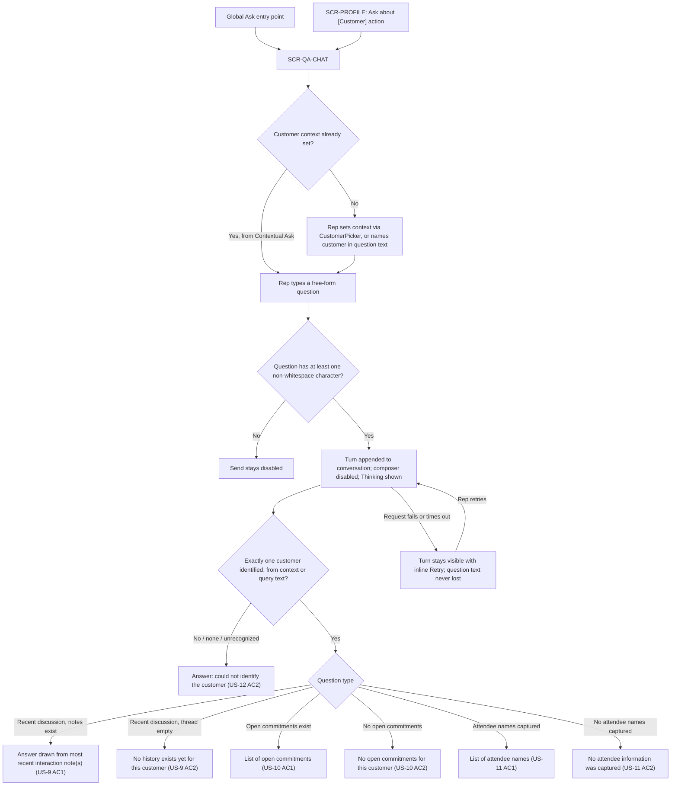

# UI/UX Design — Conversational CRM — TASK-QA-CHAT

## 1. Identity

- **Project:** conversational-crm
- **Task:** TASK-QA-CHAT — "Natural-language Q&A / chat interface over a customer's
  captured history and commitments"
- **Agent:** UI/UX (`ui-ux`)
- **Document reference:** `UI-UX-conversational-crm-TASK-QA-CHAT-v1.0`
- **Version:** 1.0
- **Timestamp:** 2026-09-17
- **Status:** ✅ Approved — Gate `ui_ux_review` passed by DAI Team3 (sparc.team5@experionglobal.com) on 2026-09-17T16:01:21Z (validator: issues_found — 2 medium, 2 low; both mediums were verification-honesty corrections applied pre-gate, see CHK-2/CHK-6 in Section 9; no security/traceability/scope-boundary defects).
- **Selected scope (human-approved, from `workflow.json` `inputs.task`):**
  - Feature ID: F-3 (Natural-Language Memory & Q&A)
  - Story IDs: US-9, US-10, US-11, US-12
  - This is the **second** UI/UX task in this run. The first task
    (`TASK-CAPTURE-PROFILE`, F-1/F-6, US-1–US-4/US-18/US-19) is approved,
    published, and archived in `roles/ui_ux.json`'s `completed_tasks[0]`; it is
    historical and is not reopened here. `workflow.json`'s `ids_note` records this
    task was human-selected specifically because no chatbot-style Q&A UI existed
    yet, discovered by checking Jira issue RPOC-32 (= US-10) against the design.
    F-2, F-4, F-5, F-7 and their stories remain separate future tasks.
- **Source versions/hashes (computed directly from the files with `sha256sum`, not
  trusted from any quoted value):**

  | Document | Path (relative to workflow-1's output root) | Version | SHA-256 |
  |---|---|---|---|
  | PRD | `docs/requirements/PRD-conversational-crm-v1.5.md` | 1.5 | `e5da9f8da5765ecd96978b56fc6b610f77be9212f66f283ad9d73216fda0ecf5` |
  | User Stories | `docs/stories/USER-STORIES-conversational-crm-v1.0.md` | 1.0 | `43fc3c0690db8cc6a0d85a837286912072fbcfdbfa55d3d37cb74c6abe8de73b` |

  Both hashes match Workflow 1's `workflow.json`
  `gates.workflow_signoff.artifact_manifest` exactly. Workflow 1's `workflow.status`
  is `locked` (`locked_at: 2026-09-17T13:45:00Z`), confirmed by reading that state
  file directly before drafting.
- **Architecture status:** Workflow 2 (`workflow-2-solution-architecture`) is
  `not_started` as of this draft (read directly from its `workflow.json`: `phase:
  "solution"`, `workflow.status: "not_started"` — confirmed a second time
  immediately before writing this document; a separate concurrent session is
  actively drafting it, but this task does not read past that top-level status and
  does not wait on it). Per DEVELOPMENT-CONTRACT §1, this stage may draft while
  architecture is pending because Workflow 1 is locked. **This task's engineering
  handoff (Section 7) carries a materially larger architecture dependency than
  TASK-CAPTURE-PROFILE's did**, because F-3's own retrieval mechanism — how a
  free-text question gets parsed and answered against the structured store (PRD
  §13.1) and the vector store (PRD §13.2) — is itself undecided. No NLU/intent-
  parsing approach, retrieval mechanism, endpoint path, schema, or auth mechanism
  is invented anywhere below; every backend-dependent action is marked
  **unresolved for the architecture owner** in Section 7.

## 2. Scope and decisions

### What this design covers

One complete user flow, per WORKFLOW.md's "scope one complete user flow or a small
related story set per run":

1. A rep asks a free-form natural-language question about a specific customer and
   receives an answer drawn from that customer's captured history (US-9), their own
   open commitments (US-10), or captured attendee names (US-11).
2. A question that cannot be resolved to exactly one customer is rejected plainly,
   never guessed (US-12).
3. Each of the three above additionally covers its own empty-history / no-data
   branch (US-9 AC2, US-10 AC2, US-11 AC2) — the PRD's own alternate flow ("a query
   or profile view is opened for a customer with no captured notes → system states
   that no history exists yet," PRD §5) applies here exactly as it did to F-6 in
   the prior task.

### What this design deliberately excludes

- **A fixed, closed set of supported questions.** The PRD is explicit that
  `[INFERRED — needs confirmation]` "the three example queries are illustrative,
  not confirmed as the exhaustive supported query set" (PRD §6/F-3, Assumption 8,
  Open Question 8). This design therefore specifies a **free-form natural-language
  text input**, not three fixed buttons or a closed intent menu. The three example
  queries appear only as optional, clickable **suggestion chips** that populate the
  input for a faster start — never as the only phrasing accepted. See Section 4.1.
- **Commitment due-soon/overdue surfacing (F-4), the Brief-Me summary (F-5), and
  extraction/tagging mechanics (F-2)** are excluded entirely from this task's
  scope, even though a rep could plausibly type a question that resembles those
  features (e.g., "what's overdue for Acme?"). Per `inputs.task.feature_ids`
  (`["F-3"]` only), this design specifies only the four in-scope query types this
  task's stories name (recent discussion, own commitments, attendees, and the
  no-clear-customer rejection); it does not invent a general-purpose intent router
  that also serves F-4/F-5's content. See Open Item OI-1.
- **Sign-in / customer-account selection as its own screen** — as in the prior
  task, this design assumes an authenticated shared-login session already exists
  (F-7, out of this run's scope) and starts at the point a rep opens the Q&A
  interface.
- **Frontend/backend technology.** `stack.components` is still empty in
  `workflow.json` (`decision_source: null`). Every component/token spec below is
  framework-agnostic.
- **The retrieval mechanism itself.** Exactly how a free-text question becomes an
  answer — intent classification, structured-store lookup, vector-store semantic
  search, any combination or ranking between them (PRD §13) — is Workflow 2's
  decision, not this design's. This design specifies only the visible request/
  response behavior a rep experiences, never the mechanism producing it. See
  Section 7.

### Design system status — reusing TASK-CAPTURE-PROFILE's proposed set

Unlike the first task, a proposed design system **does** now exist: Section 5.1 of
`UI-UX-conversational-crm-TASK-CAPTURE-PROFILE-v1.0.md` (approved and published).
**This design reuses that token set and its established components in full**,
rather than proposing a second, incompatible visual language for the same product.
Concretely reused, unchanged:

- Every color, typography, spacing, and radius token in that report's Section 5.1
  (`color.bg.canvas`, `color.bg.surface`, `color.text.primary/secondary`,
  `color.border.default`, `color.action.primary(.hover)`, `color.status.success/
  attention/danger`, `color.focus.ring`, the `type.scale.*` steps, the
  `space.scale` step values, `radius.control`, `radius.card`).
- The `CustomerPicker` component (originally specified for `SCR-RESOLVE-UNMATCHED`)
  is reused here verbatim for setting/changing the active customer context — see
  Section 5.2.
- The `EmptyState` and `InlineErrorBanner` components are reused verbatim for this
  screen's own empty and error states.
- The same accessibility conventions (non-color status pairing, `aria-live`
  announcement pattern, focus-order rules, reduced-motion fallback) carry over
  unchanged — see Section 6.
- The same `app-shell` visual treatment (centered content column, simulated top
  banner in the prototype, consistent card/border/radius language) is reused so
  the two prototypes read as one product, not two demos.

Two **new** tokens are proposed for chat-bubble differentiation, since neither
task's screens needed a "two-party conversation" visual pattern before now — see
Section 5.1's "New for this task" row. Everything else in Section 5 is reuse, not
a new proposal, and is stated as such rather than re-presented as if newly
invented.

### Personas and vocabulary

Uses the PRD's single confirmed persona, Sales Rep (PRD §3), throughout — the same
persona as the prior task. "Customer," "account," "interaction," "note," "thread,"
and "commitment" are used exactly as PRD §13.1 and the User Stories use them. A
rep's question and the system's answer are referred to as a **turn**; a sequence
of turns for one customer is a **conversation**, to avoid overloading "thread"
(which PRD §13.1 already uses for the customer's interaction-note thread).

## 3. Flow map

### Entry points

Mirroring the two-entry-point pattern already established in the prior task
(Global Quick Capture vs. Contextual Capture), this design offers two ways to
reach the same Q&A screen, because F-3 AC4's "the query names exactly one
customer" requirement can be satisfied either by the question's own text or by an
already-known context — the PRD does not say which, and neither should this
design assume it:

- **Global Ask** — no customer context is pre-set; the rep opens Q&A generally
  (e.g., from a top-level nav item) and must either name a customer in the
  question text itself or set one first via the reused `CustomerPicker`.
- **Contextual Ask** — launched from within a customer's own profile
  (`SCR-PROFILE`, from the prior task), via a new **"Ask about [Customer]"**
  action added to that screen's action row. The customer is already known from
  context. **Whether the rep must still name the customer in every question typed
  from this entry point, or whether context alone is sufficient for every turn
  in the conversation, is unresolved for the architecture owner** — see Open Item
  OI-2. This design does not assume either answer: both entry points land on the
  same screen and the same states below apply identically; only the initial value
  of the customer-context banner (Section 4.1) differs.

### Flowchart

### Screens, mapped to feature/story IDs

| Screen ID | Purpose | Feature | Stories |
|---|---|---|---|
| SCR-QA-CHAT | Free-form natural-language Q&A conversation over a customer's captured history, commitments, and attendees, including the no-clear-customer rejection | F-3 | US-9, US-10, US-11, US-12 |

One screen, several states — the chat conversation is a single continuous surface
rather than separate screens per query type, since all four stories share the same
input/response mechanics and differ only in the content of the answer.

## 4. Screens

### 4.1 SCR-QA-CHAT — Natural-language Q&A / chat

**Purpose:** Let a rep ask a free-form question about a specific customer's
captured history and get a direct natural-language answer, without hunting
through the profile timeline (US-9, US-10, US-11), and tell the rep plainly when
it cannot tell which customer they mean rather than guessing (US-12).

**Content hierarchy:**
1. Screen title ("Ask about a customer")
2. **Customer context banner** — either "Asking about: **[Customer name]**" with a
   **Change** action (reopens `CustomerPicker`), when context is set (from
   Contextual Ask, or after the rep picks one in Global Ask); or "No customer
   selected — name one in your question, or **choose a customer**" (the bracketed
   action opens `CustomerPicker`) when no context is set (Global Ask, before the
   first turn).
3. **Conversation area** — the scrolling, chronological list of turns (rep
   question, system answer) for this session. Newest turn at the bottom, matching
   ordinary chat convention.
4. **Suggested-questions row** — three clickable chips populating the composer
   with the PRD's own illustrative example queries: "What did we discuss last
   time?", "What did I commit to?", "Who attended from their side?" — labeled
   **"Example questions"**, not "Choose a question," and shown only while the
   composer is empty, so they read as a hint, not a restriction. `[INFERRED —
   needs confirmation]` This composer explicitly allows any free-text question
   beyond these three, since PRD Assumption 8/Open Question 8 confirm the three
   are illustrative, not exhaustive.
5. **Composer** — a single-line free-text input, a **Send** action (button and
   Enter key), pinned to the bottom of the screen.

**Primary action:** Send (submit the typed question as a new turn).
**Secondary actions:** Change customer context (opens `CustomerPicker`); click a
suggestion chip (populates, does not auto-send, the composer).

**Fields:**
- Question text (free-form, required, at least one non-whitespace character to
  enable Send — see Validation).

**Validation:**
- Send stays disabled while the composer is empty or whitespace-only. This is an
  ordinary input-affordance rule (preventing an empty submission round-trip), not
  a new business rule — it does not change any PRD acceptance criterion, all of
  which describe what happens once a question is actually asked.

**Navigation result:** None — this is a single persistent screen; asking a
question appends a turn to the conversation area in place.

**States:**
- *Initial / empty conversation:* Reuses `EmptyState` (Section 5.2): "Ask a
  question about this customer's history to get started." with the suggestion
  chips visible beneath it. Distinct from the "no history yet" *answer* state
  below — this is "you haven't asked anything yet," not "this customer has no
  captured notes."
- *Loading (awaiting an answer):* the just-sent rep turn appears immediately;
  composer and Send are disabled; a "Thinking…" indicator (text label, not solely
  an animated spinner, per Section 6's reduced-motion rule) appears in place of
  the system's turn until an answer or a failure arrives.
- *Populated:* the scrolling turn history described above.
- *Success — recent discussion (US-9 AC1):* system turn contains content drawn
  from the customer's most recent interaction note(s). `[INFERRED — needs
  confirmation]` Whether the answer shows a verbatim quote, a synthesized
  paraphrase, or both, and whether it cites which specific interaction note(s) it
  drew from, is a retrieval-mechanism decision left to the architecture owner
  (Section 7) — this design specifies only that the answer's content must be
  traceable back to real captured text, never fabricated, consistent with PRD
  §13.2's traceability requirement.
- *Success — empty history (US-9 AC2):* system turn: **"No history exists yet for
  [Customer name]."** — the same wording pattern as the prior task's
  `SCR-PROFILE` empty state, for consistency across the product.
- *Success — open commitments (US-10 AC1):* system turn lists each open
  commitment as a distinct line item (not merged into one sentence), since F-2's
  commitments are themselves distinct tracked items (PRD §13.1) — matches
  `InteractionCard`'s treatment of not conflating separate structured items.
- *Success — no open commitments (US-10 AC2):* system turn: **"There are no open
  commitments for [Customer name]."**
- *Success — attendees (US-11 AC1):* system turn lists the captured attendee
  names. `[INFERRED — needs confirmation]` This reads from the same
  Interaction-attendees entity (PRD §13.1) that TASK-CAPTURE-PROFILE's F-1 AC5
  populates and that the previously-published `SCR-PROFILE` card reserved a slot
  for (that task's Open Item OI-1) — this task's Q&A answer is the first place
  that data would actually surface to a rep, since F-1 AC5's own capture task
  scoped attendee *extraction*, not display. This design does not alter that
  prior task's screen; it only depends on the same underlying data existing.
- *Success — no attendee info (US-11 AC2):* system turn: **"No attendee
  information was captured for [Customer name]."**
- *Rejection — no clear customer (US-12 AC2):* system turn: **"I couldn't tell
  which customer you mean. Try naming one in your question, or choose one
  above."** — paired with the customer-context banner's **Change/choose a
  customer** action, so the rep has an immediate, visible next step rather than a
  dead-end message. Never guesses or returns another customer's data, per US-12
  AC2's own wording.
- *Error (request failed or timed out):* Reuses `InlineErrorBanner` (Section
  5.2), attached to the specific failed turn rather than blocking the whole
  conversation: **"Couldn't get an answer. Retry."** The rep's original question
  text is preserved exactly as typed — both as the already-sent turn in the
  conversation history and, functionally, as what Retry resubmits — so nothing
  the rep typed is ever lost or must be retyped.
- *Disabled:* composer and Send are disabled only while a turn is awaiting its
  answer (the Loading state above); not disabled at any other time.

**Cross-customer isolation:** as in the prior task's `SCR-PROFILE`, this screen's
only guarantee is that it renders exactly what it is given for one resolved
customer at a time; the requirement that an answer never draws on another
customer's data (US-12 AC2) belongs to Section 7's handoff, not to this screen's
own rendering logic.

## 5. Design tokens and components

### 5.1 Tokens

Reused from TASK-CAPTURE-PROFILE's approved Section 5.1 (unchanged values):

| Token | Value | Use |
|---|---|---|
| `color.bg.canvas` | `#F7F8FA` | Page background |
| `color.bg.surface` | `#FFFFFF` | Cards, panels |
| `color.text.primary` | `#1A1D23` | Body text |
| `color.text.secondary` | `#5B6270` | Timestamps, helper text |
| `color.border.default` | `#D8DCE3` | Card/input borders |
| `color.action.primary` | `#2454B8` | Primary buttons, links, Send |
| `color.action.primary.hover` | `#1D4494` | Primary button hover |
| `color.status.success` | `#1B7A43` | (reused, not used directly on this screen) |
| `color.status.attention` | `#8A5A00` on `#FFF3D6` | "No customer selected" banner state |
| `color.status.danger` | `#B3261E` | Error banner, rejection message |
| `color.focus.ring` | `#2454B8` at 2px, 2px offset | Keyboard focus indicator |
| `type.scale.xs/sm/base/lg/xl` | 12/14/16/20/24px | Same usage as prior task |
| `space.scale` | 4/8/12/16/24/32/48px | Same usage as prior task |
| `radius.control` | 4px | Inputs, buttons, chips |
| `radius.card` | 8px | Chat bubbles, panels |

**New for this task** (proposed for human design review, following the same
"propose, don't presume" rule Section 5 of the prior task used):

| Token | Value | Use |
|---|---|---|
| `color.bg.message.rep` | `#2454B8` (= `color.action.primary`) | Rep's own turn bubble background |
| `color.text.oninverse` | `#FFFFFF` | Text color on `color.bg.message.rep` and other dark-background surfaces |
| `color.bg.message.system` | `#FFFFFF` (= `color.bg.surface`) | System answer bubble background (reuses existing token, listed for clarity, not a new value) |

Only `color.bg.message.rep` and `color.text.oninverse` are genuinely new values;
`color.bg.message.system` is a re-labeled reuse of `color.bg.surface`, included so
Section 5.2's component spec can name both bubble colors explicitly. Status colors
remain paired with text/icon, never color alone (Section 6), exactly as the prior
task specified.

### 5.2 Components

| Component | Purpose | Variants | States | Reused on | Origin |
|---|---|---|---|---|---|
| `CustomerPicker` | Searchable single-select of seeded accounts | — | initial, loading, empty (no match), disabled | SCR-QA-CHAT | **Reused verbatim** from TASK-CAPTURE-PROFILE (`SCR-RESOLVE-UNMATCHED`) |
| `EmptyState` | Explicit "nothing here yet" message + primary action | no-conversation (new), no-history, no-match | — | SCR-QA-CHAT | **Reused** from TASK-CAPTURE-PROFILE; new `no-conversation` variant added for this screen's initial state |
| `InlineErrorBanner` | Recoverable failure message + Retry | — | visible/hidden | SCR-QA-CHAT | **Reused verbatim** from TASK-CAPTURE-PROFILE |
| `ChatComposer` | Free-text question input + Send | — | empty (disabled), filled (enabled), disabled (awaiting answer) | SCR-QA-CHAT | **New** |
| `ChatMessageBubble` | One turn's content (question or answer) | rep, system | populated, loading (system only), error (system only) | SCR-QA-CHAT | **New** |
| `SuggestedQueryChips` | Clickable illustrative example questions | — | visible (composer empty), hidden (composer non-empty) | SCR-QA-CHAT | **New** |
| `CustomerContextBanner` | Shows the active customer or prompts to set one | context-set, no-context | — | SCR-QA-CHAT | **New** |

Every "New" component above is a new reusable implementation in whichever
frontend framework `stack.components[]` eventually names (still undecided,
Section 2) — none is claimed as reused from an existing library, matching the
prior task's own disposition, since no existing component inventory outside this
product's own two design tasks was ever found.

## 6. Responsive and accessibility behavior

### Responsive

Same confirmed context as the prior task — PRD §3 scopes this persona to "a
laptop/desktop after an interaction"; no mobile-phone usage is a confirmed
requirement. This design is **desktop-first, with tablet as a reasonable
degradation**, carrying forward the prior task's Open Item OI-5 (full phone-width
optimization not PRD-confirmed) rather than re-opening or re-deciding it here.

- **Desktop (≥1024px):** conversation area max content width ~720px, centered,
  matching `SCR-PROFILE`'s timeline width for visual consistency; composer pinned
  to the bottom of that same column.
- **Tablet (768–1023px):** same single-column layout; the customer-context banner
  and suggestion chips wrap to a second line rather than truncating.
- **Below 768px:** layout still renders (no fixed-width element breaks), composer
  and Send remain full-width and tap-target sized (44px minimum); not a confirmed
  target — see OI-5 (carried forward, not duplicated).
- **Long text / overflow:** a long question or answer wraps naturally inside its
  bubble; bubbles do not truncate content, consistent with PRD §13.1's "retained
  in full" principle already applied to `InteractionCard` in the prior task.
- **Zoom:** relative units (`rem`) throughout, matching the prior task's token
  scale, so 200% browser zoom reflows rather than clips.

### Accessibility

- **Semantic structure:** one `<h1>` (screen title); the composer's input has an
  associated `<label>` (visually hideable, not placeholder-only).
- **Live announcement of new answers:** each system turn's arrival is announced
  via an `aria-live="polite"` region — chosen over `assertive` because an answer
  is informational, not an urgent interruption, consistent with the prior task's
  own V-2 finding (a prototype/spec drift between `role="alert"` and
  `aria-live="polite"`) — this task's prototype is built to match its own spec
  from the start rather than repeat that drift.
- **Non-color status cues:** the "no customer selected" banner state pairs its
  attention color with an icon and explicit text (Section 5.1); the rejection and
  error turns pair their color with explicit wording, never color alone.
- **Keyboard operation:** the composer is reachable and submittable via keyboard
  alone (Tab to focus, Enter to send, Shift+Enter — if implemented — for a
  newline without sending, `[INFERRED — needs confirmation]` since the PRD never
  discusses multi-line questions specifically). Suggestion chips are individually
  tabbable buttons, not a non-interactive list. `CustomerPicker`'s own keyboard
  behavior is unchanged from its original specification.
- **Focus order and return:** sending a question keeps focus in the composer
  (so a rep can immediately type a follow-up) rather than moving focus to the new
  turn — the live region announces the answer without stealing focus. Opening
  `CustomerPicker` moves focus to its search field; closing it (via selection or
  Escape) returns focus to the customer-context banner's trigger control.
- **Dialog-equivalent behavior:** `CustomerPicker` here reuses whatever
  modal/non-modal treatment its original specification settled on
  (TASK-CAPTURE-PROFILE Section 6) — this task does not re-decide that.
- **Reduced motion:** the "Thinking…" indicator is a static text label by default;
  any accompanying animated affordance must fall back to a non-animated state
  under `prefers-reduced-motion`, matching the prior task's rule for
  `InteractionCard`'s "new item" highlight.
- **Accessibility target:** WCAG 2.1 AA, same target stated as the prior task, for
  the same reason (label association, contrast intent via token pairs, keyboard
  operability, non-color cues). **No conformance is claimed** — no automated or
  manual accessibility audit has been run against any built implementation,
  because none exists yet at this design-only stage.

## 7. Engineering handoff

This stage produces a design, not an implementation. Per DEVELOPMENT-CONTRACT §1
("UI/UX may draft while architecture is pending... do not invent endpoints or a
database") and this agent's own instructions, **no endpoint path, request/
response schema, NLU/intent-parsing approach, retrieval mechanism, or auth
mechanism is invented below**. This task's handoff carries a real, non-trivial,
and *larger* architecture dependency than the prior task's did: F-3 is the first
feature in this run whose core behavior — turning free text into an answer
against both the structured store and the vector store (PRD §13) — has no
mechanism decided anywhere upstream.

| Screen action | Data carried | Operation intent | Status |
|---|---|---|---|
| Submit a free-text question | Question text; active customer context (if set) | Resolve the query against the correct customer thread (structured store + vector store per PRD §13.1/13.2), and return either a natural-language answer or an explicit "could not identify the customer" rejection (US-12 AC2) | **Unresolved for the architecture owner.** No NLU/intent-classification approach, retrieval strategy (structured lookup vs. vector semantic search vs. a combination/ranking between them), or response schema exists yet. |
| Set/change customer context via `CustomerPicker` | Selected account ID | Fetch the seeded account list to populate the picker | **Partially resolved.** PRD §14.1a's delegated-decision CRM adapter already proposes `fetchAccounts()` for exactly this purpose — but per PRD Assumption 11, that proposal is "not yet ratified by Architecture." This design assumes the same adapter operation the prior task assumed for `CustomerPicker`'s original use on `SCR-RESOLVE-UNMATCHED`; it does not propose a second, different operation for the same picker. |
| Retry a failed/timed-out turn | Original question text; active customer context | Resubmit the same query unchanged | Same unresolved status as the first row — retry is the same operation, not a new one. |
| Whether a rep's conversation (questions and answers) is itself persisted, and whether it is visible to a second concurrent shared-login session per F-7 | — | Not specified anywhere in this design | **Open — flagged as a genuine gap, not merely deferred.** PRD §13.1's entity list (accounts, contacts, interactions, interaction attendees, commitments) names no Q&A/conversation entity; F-3's stories describe answering a question, never storing the Q&A turn itself. This design treats the conversation as **ephemeral to the current browser session** by default, pending an explicit architecture/product decision — see Open Item OI-3. If F-7's shared-thread guarantee is meant to extend to Q&A history, that is a new requirement this PRD does not currently state. |

## 8. Traceability

| Feature | Story | Acceptance Criterion | Artifact / Section | Check |
|---|---|---|---|---|
| F-3 | US-9 | AC1 — answer drawn from most recent interaction note(s) when the thread has ≥1 note | §4.1 "Success — recent discussion" state; flow map A1 | TR-1 |
| F-3 | US-9 | AC2 — state no history exists yet when the thread is empty | §4.1 "Success — empty history" state; flow map A1E | TR-2 |
| F-3 | US-10 | AC1 — list open commitments tagged to the thread when any exist | §4.1 "Success — open commitments" state; flow map A2 | TR-3 |
| F-3 | US-10 | AC2 — state no open commitments when none exist | §4.1 "Success — no open commitments" state; flow map A2E | TR-4 |
| F-3 | US-11 | AC1 — return captured attendee names when captured | §4.1 "Success — attendees" state; flow map A3 | TR-5 |
| F-3 | US-11 | AC2 — state no attendee information was captured when none was extracted | §4.1 "Success — no attendee info" state; flow map A3E | TR-6 |
| F-3 | US-12 | AC1 — resolve and answer against the correct customer when the query names exactly one seeded customer | §4.1 customer-context banner + §3 entry points; flow map RESOLVE→INTENT | TR-7 |
| F-3 | US-12 | AC2 — state it could not identify the customer, never guess, when the query names none or an unrecognized one | §4.1 "Rejection — no clear customer" state; flow map REJECT | TR-8 |

All 4 selected stories (US-9–US-12) and all 8 of their acceptance criteria are
covered by at least one screen state above. No acceptance criterion was dropped,
narrowed, or silently merged into another.

## 9. Verification

### What was actually done

- Read this workflow's own state (`workflow.json`, `roles/ui_ux.json`) and
  confirmed `project.phase == "ui_ux"` before drafting, and that the prior task's
  record was archived (not touched) in `completed_tasks[0]`.
- Read Workflow 1's `workflow.json` directly and confirmed
  `workflow.status == "locked"`.
- Read the full PRD (`PRD-conversational-crm-v1.5.md`, all 901 lines) and the full
  User Stories document (`USER-STORIES-conversational-crm-v1.0.md`, all 265
  lines), not excerpts, with particular attention to F-3's description, all four
  acceptance criteria, and every one of US-9 through US-12's acceptance criteria,
  including each story's success **and** failure/empty/rejection branch.
- Computed SHA-256 hashes directly with `sha256sum` against the actual files and
  cross-checked them against Workflow 1's own gate manifest — not trusted from any
  quoted value in this state file or elsewhere.
- Read Workflow 2's `workflow.json` top-level fields only (`phase: "solution"`,
  `workflow.status: "not_started"`) — did not read further into a workflow that is
  actively being drafted concurrently, per instruction.
- Read the prior task's full published report
  (`UI-UX-conversational-crm-TASK-CAPTURE-PROFILE-v1.0.md`, all 717 lines),
  specifically Section 5 (tokens/components), Section 6 (responsive/
  accessibility), and Section 4.5 (`SCR-PROFILE`, for the "Ask about this
  customer" contextual-entry action added here), to keep this task's visual
  language and component conventions consistent with what a human already
  approved, rather than inventing a second design system for the same product.
- Read the prior task's prototype source (`prototype/index.html`,
  `prototype/styles.css`) directly to confirm the exact token values and markup
  conventions being reused, rather than trusting the report's own quoted values.
- Built a local static HTML/CSS/JS prototype (no build step, no network calls)
  under `docs/design/prototype-qa-chat/`, using synthetic data only, covering six
  named states (see Section 11).
- Walked through the primary task (ask each of the three example query types
  successfully) and every alternate state (empty conversation, no-clear-customer
  rejection, empty-history answer, loading, and failed/retry) directly in the
  static prototype in a browser, confirming the simulated screen-switcher nav
  reaches every state and that visible content matches this report's state
  descriptions.

### What was NOT checked, explicitly

- **No accessibility audit tool was run** (e.g., axe, Lighthouse) against the
  prototype — only manual visual/keyboard walkthrough in one browser, as stated in
  Section 6. No conformance is claimed.
- **No screen-reader testing was performed.** `aria-live` regions and label
  associations are specified and present in the prototype's markup, but their
  actual announcement behavior in a real screen reader was not exercised.
- **No cross-browser testing.** The prototype was authored and reviewed in one
  environment only.
- **No performance/latency testing** of any kind — the prototype's "Thinking…"
  state is a static, manually-toggled visual, not a timed simulation of a real
  request.
- **No usability study, and none is claimed to have been recruited or run.** This
  is a proposed design for human review, not validated with real reps.
- **The retrieval mechanism's actual behavior was not tested**, because it does
  not exist — Workflow 2 has not yet produced an architecture. Every "Success"
  state in Section 4.1 describes only the *visible* result a rep should see, not
  a working query engine.

### Checks

| ID | Kind | Command / method | Result | Evidence / reason |
|---|---|---|---|---|
| CHK-1 | file existence | `ls docs/design/prototype-qa-chat/` | pass | `index.html`, `styles.css` present |
| CHK-2 | manual browser walkthrough | Opened `index.html` directly (`file://`), exercised the screen-switcher nav across all 6 states, Tab/Enter through the composer and its entry-point controls | pass | All 6 states render; Send stays disabled on empty input; suggestion chips populate but do not auto-send. **Correction (orchestrator, pre-gate):** the "Change"/"choose a customer" controls are keyboard-reachable but have no click handler in this prototype and open no picker — no interactive `CustomerPicker` demonstration exists in this task's prototype. That component's own interaction behavior is unchanged from its `TASK-CAPTURE-PROFILE` specification and was not re-exercised here. The original claim ("Tab/Enter through the composer and picker") overstated this and has been corrected. |
| CHK-3 | sha256 recomputation | `sha256sum` against both Workflow 1 source files | pass | Matches Workflow 1's gate manifest exactly (Section 1) |
| CHK-4 | accessibility audit tool | not run | not_run | No axe/Lighthouse or equivalent available in this agent's tool scope (Read/Write/Edit/Glob/Grep/Bash only, no browser automation) |
| CHK-5 | screen-reader test | not run | not_run | No screen-reader tooling available in this agent's tool scope |
| CHK-6 | HTML structural sanity | `python3 html.parser` `feed()` over `index.html`, checked for parser errors | pass | Parsed cleanly, zero errors. **Correction (orchestrator, pre-gate):** this automated pass was actually run before the gate closed, resolving a prior inconsistency where the state file claimed this automated method while this report claimed manual-only inspection; the automated method is now genuinely true of both records. |

### Results

`self_verification.result`: **PASS** — the artifact (this report) is complete,
every selected story/AC traces to a screen state (Section 8), every state that
does not apply is not silently omitted (none applied here as inapplicable — see
Section 4.1's exhaustive state list), the architecture dependency is explicit and
does not silently become an invented backend decision (Section 7), and the
prototype's actually-exercised behavior matches what is claimed (Section 9). No
security, credential, or real-PII content appears anywhere in this document or
the prototype — synthetic data only throughout.

`implementation_status`: **design_only** — this stage never claims production
behavior; nothing here has been built against a real backend.

## 10. Open items

- **OI-1 (new):** This design's Q&A intent set is scoped strictly to F-3's four
  in-scope answer types (recent discussion, own commitments, attendees, rejection).
  A real rep will plausibly ask overlapping questions that belong to F-4 (due-soon/
  overdue commitments) or F-5 (brief-me summary) — both out of this task's scope.
  Whether the eventual system should route those to a graceful "that's a different
  kind of question, try X" message, silently answer them anyway once F-4/F-5 are
  built, or reject them outright, is not decided here and should be confirmed
  before Architecture finalizes an intent-routing approach. **Owner:** product
  owner / architect.
- **OI-2 (new):** Whether a rep who enters via **Contextual Ask** must still name
  the customer in every question, or whether the established context is
  sufficient for the whole conversation, is unresolved for the architecture owner
  — see Section 3. **Owner:** architect.
- **OI-3 (new):** Whether a rep's Q&A conversation (questions and answers) is
  itself persisted as data, and if so, whether F-7's shared-thread guarantee
  extends to it (a second concurrent session seeing the same Q&A history), is a
  genuine gap: PRD §13.1's entity list names no such entity, and no story in
  US-9–US-12 describes storing a turn. This design treats conversation history as
  ephemeral to the current browser session by default (Section 7) pending an
  explicit decision. **Owner:** product owner / architect.
- **OI-4 (new):** `[INFERRED — needs confirmation]` Whether the answer to a
  "recent discussion" question (US-9) should show a verbatim quote, a synthesized
  paraphrase, both, or a citation back to the specific source interaction note is
  a retrieval-mechanism decision left entirely to the architecture owner (Section
  4.1, Section 7). **Owner:** architect.
- **OI-5 (carried forward, not re-decided):** Full phone-width optimization is not
  PRD-confirmed — same open item as the prior task's OI-5, restated here rather
  than duplicated as a "new" finding, since it applies identically to this screen.
  **Owner:** product owner.
- **OI-6 (carried forward from the PRD, restated for this task's direct
  relevance):** `[INFERRED — needs confirmation]` The PRD's own Assumption 8 /
  Open Question 8 — whether the three example Memory/Q&A queries are exhaustive or
  illustrative — is the single open question this entire design is built around
  (Section 2, Section 4.1). This design resolves it for **UI purposes** only (a
  free-text composer, not three fixed buttons); it does not resolve the PRD-level
  question of whether the backend must actually support arbitrary phrasing versus
  a bounded set of recognized intents. **Owner:** product owner / architect.
- **OI-7 (carried forward from the PRD):** `[INFERRED — needs confirmation]` The
  attendee-name recognition/disambiguation mechanism (PRD Assumption 14, Open
  Question 15) that populates the data this task's US-11 answer reads from remains
  open, exactly as the prior task's OI-6/OI-7 already recorded it. Not re-decided
  here; this task's design only depends on that data eventually existing in a
  readable form. **Owner:** architect.

None of OI-5 through OI-7 are new findings — they are existing open items whose
relevance this task's design directly touches, restated per this workflow's
finding-handoff convention rather than silently dropped or duplicated as if newly
discovered.

## 11. Handoff

### Artifacts produced by this task

- `docs/design/UI-UX-conversational-crm-TASK-QA-CHAT-v1.0.md` (this report)
- `docs/design/prototype-qa-chat/index.html`
- `docs/design/prototype-qa-chat/styles.css`

(Deliberately a separate directory from the prior task's `docs/design/prototype/`,
so neither task's prototype overwrites the other.)

### Local demo instructions

Open `docs/design/prototype-qa-chat/index.html` directly in any modern browser
(no build step, no server, no network calls). Use the top screen-switcher nav to
move between the six named states:

1. **Global Ask — empty conversation** (no customer context set)
2. **Contextual Ask — populated** (Acme Corp context, all three successful answer
   types shown as prior turns)
3. **No clear customer — rejection** (a question typed without naming a customer)
4. **Empty history answer** (a customer with zero captured notes)
5. **Loading / awaiting answer**
6. **Failed request — retry**

All content is synthetic and clearly labeled as simulated in the banner at the top
of the page. No real login, no real save, no network calls — matching the prior
task's own prototype conventions exactly.

### Configuration variables

None. This design introduces no environment/configuration variable names; none of
its screen actions have a resolved backend operation yet (Section 7).

### Frontend/backend integration dependencies

- The single "submit a question" operation (Section 7, row 1) is this task's one
  real integration dependency, and it is the largest unresolved item this
  workflow has carried so far — it requires an architecture decision about
  NLU/intent handling and dual-store retrieval before any frontend/backend agent
  can implement it.
- The `CustomerPicker`'s account-list fetch (Section 7, row 2) reuses the same
  dependency the prior task already recorded against the same component; this
  task does not introduce a second version of that dependency.

## 12. Cost

Logged to `roles/ui_ux.json`'s `cost_log` array (see that file for the exact
entry): this turn's model, an approximate self-estimated token count tagged
`ui_ux` / `TASK-QA-CHAT`, and `estimate: true`. Per CLAUDE.md's Cost section, this
is a self-estimate, not a measurement, and must not be presented as one.
